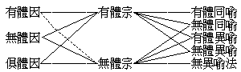

# 第四節　立破真似

## 目錄

- 一　立破真似概說
- 二　佛陀學之因明
- 三　佛陀因明學之實用
- 四　為他比量之三支
- 五　宗支之構成
- 六　因支之構成
- 七　喻支之構成
- 八　為他比量之第一分類
- 九　為他比量之第二分類
- 十　為他比量之構成
- 十　一似為他比量之過謬
- 十　二似能立與似能破
- 十　三真能立與真能破
- 十　四立破真似刊定


## 一　立破真似概說

立破真似，都指比量而言。有「為自求知」之比量，如前現比真似節中所說。有「為他令知」之比量，則當於此節中說之。詳此法者，曰因明學，廣有專書，茲但略陳綱要。立謂能立，以宗因喻為能立具，立自所知令他知故。破謂能破，以宗因喻為能破具，破他邪知令正知故。此能立破，皆以因喻成於宗義。若宗、若因、若喻，有諸過謬，則為似能立、似能破；善離過謬，則為真能立、真能破。此中要意，在於離諸謬似，真能立自所知、令他亦知，真能破他邪知、令成正知。蓋依第一節中真現比量，及比量中所用算數文語工具，於某事義之自共相，在自心中既成正知，觀他心中尚有未知，為曉喻他，乃有所立。或觀他心，於某事義所知錯謬，為改正他，乃有所破。若立若破，總為悟他。而悟他之工具雖非一事──若測算及圖表等事──，主重之端，乃在言語文字。言語文字，發端在名，綴名成句，積句成論，至論、乃成悟他究竟之用。然則建論悟他，將以顯真祛似，應有原於現知自然，而歸於比知必然之論法，以為共同遵循軌式，是非邪正，乃可判別。譬之弈棋，必依格子定數及其著法，乃有輸贏之結果可言也。明此立論法式，在西洋曰邏輯，在印度曰因明，而中國之名學，則交紐於現比真似與立破真似間，兩者皆未完成。蓋因明學雖以量論為據，而其所主，則在立論之法，故屬於論理學。至量論，則為哲學中之知識論，其大部分屬於五明中之內明。然陳那之量論，注重為因明之依據，故於內明之知識論猶未窮極，窮極內明之知識論，乃在於法相唯識學。前於現比真似節中已略言之，而此節則言佛陀學中之因明學也。

## 二　佛陀學之因明

佛陀學嘗總括諸學藝曰五明：內明，聲明，因明，工巧明，醫藥明是也。內明為體，聲明等四為用。明者、學藝之謂。初節為內明之一分，乃因明之依據，次即聲明一分，第三節為工巧明之一分，亦為因明所依。佛陀學中之因明學，完成在釋迦後千年之陳那等。考此學成立之因緣，其內因在佛說之內明知識論，即四答、十四不記、墮負等論法。阿含、楞伽、深密暨小乘諸阿毗達磨，已兆其端。龍樹師弟諸論，廣破外小，漸具軌式，曾專集為方便心論。次及無著、世親，復擯惡空，散見瑜珈、顯揚諸論。復有如實論之編纂。而在外緣，則有淵源於太古足目論師，而成立於釋迦後之正理論，為今印度哲學中之正理一派，說四宗、五分、九因、二十二墮負處等。聲論、數論等派，依其法皆有理論之發展，與佛陀學者相辯論。集此內因外緣，加以陳那在內明之深悟，遂刱為佛陀學之因明學。復得其弟子天主之闡揚，護法、清辯、德慧、戒賢諸論師，乃皆依為立論之標準。承此論法，分傳為支那及印度、西藏之兩流派。在支那，則為慈恩師資之推闡。在印度，則為法稱、天喜、寶稱、無憂、寶作、靜法上等之詳審。此佛陀因明學之大抵可言者，今則更有日本及西洋諸學者，取資演繹歸納之邏輯學，比較攻錯，以相發明。在有智者，當重詳其短長所在，以成為世界之論法。

## 三　佛陀因明學之實用

佛陀學中，既以「為自求知」之方法，屬於「現比真似」之量論──通內明、因明，或通五明之正不正知──，而以「立破真似」之因明學，專重在「為他令知」之方法。故其實用，不同邏輯之用。其格式不以自求知識，而在設言論以立真破似曉悟他人。故邏輯之歸納、演繹，大抵為依現量成比量、依比量成比量之量論──即知識論──；而於因明學為他令知之實用方法，多未完密。於此一端，近之學者皆未認清，故於邏輯與因明之比較研究，不能知其要領。因明學既專在建論以立真破似而令他正知，後法稱諸賢，於自悟量論則得，於悟他因明猶失也。故陳那以前之古因明學，若瑜伽、顯揚、集論等，就立論之實際立場，先加注重。蓋立論之實際立場，賓主對揚，盛興論議，將以判決是非，辨定勝負，宜有共循之軌：一者首應區別論之性質，曰論體性，大別有四：一、隨俗習之論，二、故詭諍之論，三、顯正理之論，四、為教導之論。若審知立場之論眾，其所欲立之論在前一種，則當隨俗和光，置而不言；在第二種，則為詭辯，故興諍謗，可謝絕曰：既唯詭諍，恕不參加。在第三種，則為立論對辯之真目的，乃應如法論辨。在第四種，乃為先知知後知、先覺覺後覺之事，著書立說，端在乎此。故在佛陀學之立論，唯取後之二種，所謂由大悲智顯揚正理與教導學徒而曉悟他也。二者、則應審察立論處所。凡立論處，除「立論者」，應更有「對辯者」與「證義者」及「旁聽眾」。證義者之裁決，旁聽眾之贊否，皆有重大關係。故凡論辯真理，應在能決是非者前，及在樂解法義眾前。其證義者，應更諳知下二輪軌，所批判者乃得其當。三者、論者應有「善成所立論」之功德：一、善知自他宗，二、音圓滿，三、無畏，四、辯才，五、敦肅，六、應真；善自他宗否為尤要。故天主於宗因二支諸過，多有依自他宗義之相對上施設者。法稱不知因明乃專重對他立論者，遂議廢棄。四者、論墮負相。論議結果，在立論者或對辯者，自知所論辯者有屈於理，重真理故，發言謝過，捨自所論，曰捨負相。此為光明磊落之易可知負相。設或情不甘服，聲請暫時思滯，容更考慮，亦為捨言負相，則須證義者為裁決其墮負也。如弈棋者，託言再弈，不認為輸，即為輸也。其或理言俱屈，矯設其他取巧言語以圖混亂於證聽者；或偽為靜默等形容以掩飾其窮相，曰屈負相；則如弈者託事置而不弈。甚或發諸不善言辭以強爭軋，所謂：雜亂語，粗獷語，含糊語，繁簡失當語，非義相應語，前後不次語，屢自立毀語，不規則語，不相續語等，曰過負相；如弈棋者之亂其子、翻其枰等，皆須由證義者為裁決其負也。捨、於論德為上，屈、猶不失中德，過斯下也。按瑜伽等說論處七：一、論體性，言論等六；二、論處所，王家等六；三、論所依，所成二、能成八；四、論莊嚴，善自他宗等五；五、論墮負，捨言、言屈、言過；六、論出離，觀察得失等言；七、論多所作法。第三論所依，通「現比真似及宗因喻支」之所說；餘之六處，合為今之四軌。非此四種共循論軌，則雖可以因三相自比求知，或閉門著書教導學徒，然未足登論壇以論辯也。

## 四　為他比量之三支

佛陀因明學之實用，在於為顯正理，及為教導之立論以悟他。此「為他令知」者，即宗因喻之三支比量也。其所立之主義，梵云皤囉提若，此譯為宗。在教導時之聽受眾，若能解信而無疑諍，則雖不更出因喻亦可矣。唯在論場辨揚正理，且其所辨揚之正理，又必非常識皆了之「聲是所聞」等義──此種立等不立，曰相符極成過，亦等闕宗支過──，則必有其疑而對辯之者。例曰「聲是無常」，立此宗時，其疑而對辯者，可詰之曰：汝說聲是無常，以何理由知聲是無常耶？若無理由，何以知聲不是常耶？我今亦可不須理由，說聲是常。我言既立，汝言則壞。由是立聲是無常者，繼此須說何故聲是無常之「因」，始能令信。乃曰「所作性故」，或「眾緣所生故」，或「勤勇無間所發故」。凡所舉為「因」者，必擇一為對辯者及聽眾所已知或易知之宗上「有法」所有法，乃能使對辯者悟，或不能不許。然雖已出其因，而對辯者疑猶未決，則辯亦未能已。如曰：我亦固知聲是所作性也，然何以知聲是所作性故，聲不是常而是無常？此若未決，則雖說所作性為因，聲是無常之宗仍未成立。故立論者，至此又必加引同喻──即同一律──，乃曰「如瓶等現見是所作而是無常」。然疑辯者猶可諍論，詰以瓶等所作性者雖是無常，汝未盡知諸所作者皆是無常，安知聲雖所作，而聲不是常耶？立論者至此，又必更加引異喻──即矛盾律──曰：「如虛空等是常者，現見非所作」。今說聲是所作性故無常，現有瓶等可證；汝說聲雖所作是常，無可為證。今說若常，則非所作，現有空等可證；汝說聲是常而所作，無可為證。我言有證，汝言無證；汝既無證，我可證為：凡所作者，皆是無常，聲既所作，定是無常。故應捨汝無證之虛言，信我誠證之正理。至此、則對辯者，於未能尋出是「常」而又是「所作」之證據時，則不能不捨諍皈服，或聲請再思矣──屬捨負相──。故「喻」梵云「烏陀訶羅諵」，直譯云「見邊」。曰見邊者，謂同異喻正反相成，極世間智見共喻之邊際，至此更不容異知見之存留也。由此應可令他疑斷信立，捨邪成正。縱使邪疑尚存，然於邪辯、不能不為之屈，故於正論可云已盡其能事也。然立論之活潑應用，不必皆有因喻，或但舉宗而置因喻，或但宗因而不舉喻，均無不可，要在令他信解所立之理而止。因明學以闕支為過，若闕宗支，虛言無所立義，則誠過也。若但舉宗義或宗因，他人已能信解，不待喻或因喻，則雖闕而非過。此其立論法之伸縮自由，可因對他所宜，為靈便之應用，實為因明學之特色。不同邏輯，以現量成比量之歸納法，以比量成比量之演繹法，但能用為比求自知，用之為他令知，實際則頗為呆滯也。然在立論遺世以悟無限之他，則固應以三支圓滿為善。三支有闕，必將遺人以起疑辯，故於闕支，皆可言過。因明學者，歷久研求，至約至精，乃成定式。在三支中，宗為立所信義，因為出義所由，喻為譬曉因義，因喻合為成立宗義之具。然對「顯自知中欲令他知之理」，則在立量、設量、救量，宗、因、喻言皆為能立；在破量亦宗因喻言皆為能破，似能立破，則又皆為所破。蓋真能破，即破似能力、似能破之論，以顯其為真能破也。

## 五　宗支之構成

宗者，所信所崇所立之主義也。古分四類：一遍所許，二先稟承，三傍準義，四不顧論。陳那以後，惟取後一：或發微言，不顧前三；或破他宗，故違舊立，隨自意樂，皆第四類。雖立宗非為與世間興諍及就自教詭辯，必不悖於世智共許，所稟自教，比知，現證，而後所宗乃得成立。然既遍許，不須重立；先稟遺教，猶應抉擇；傍比所準，非今正意；故惟依現所知正理，隨自信崇，不顧一切，或立或破，令他曉悟未知之義，建設「宗」言。使世共許及先稟教與旁所準之義而為正理，必能不違今此宗義。若其彼此相違，非彼前三有違正理，必此宗義有違正理。樂正理故，不留情故，捨彼捨此，都無容心。故非於「不顧他論」宗外，別有前三類宗也。宗有二分：一分是體，句中主語，正名「有法」，能有餘法以為義故──若以句中所敘述者，及所出因，皆為其所有法──；一分是義，句中敘述，正名「能別」，差別有法成別義故。二名互相影顯，有法亦名「所別」，能別亦得名「法」。此宗二分，為總宗之所依，謂之宗依，亦名別宗。合此二分，成為一句，謂之宗體，亦名總宗。依別宗之二名，成總宗之一句。在別宗之二名，必為遍所許之名理，故非立敵諍論所在──非遍所許，則須寄言簡別，否則成過──；而總宗之一句，必為立知餘未知之句理──否則立等不立，墮相符極成過──，乃生起敵論之諍辯。故「宗所依」之二別名，必須極成；正為「宗體」之一總句，必應有異共知，否則不生敵論，即不應有因喻。無能成因喻以相對，則亦無所成之宗可名也。以敘述辭差別主辭，例云「聲是無常」，以「無常義」軌範「聲」故，使「聲」離別於「常義」外。故無常義為能別，而聲為所別。雖屬二名合成一句，於一句中「聲」亦軌範於「無常義」，使「無常義」不出「聲」外。可云互為能別所別，以相差別。然在名句之序列上，本以敘述語解主語，不以主語解敘述語；立意亦在立「聲」屬「無常義」，不在立「無常義」屬「聲」，故以敘述為能差別，主語為所差別。依此能所差別序列上之不相離差別義，是為所構成之宗體，亦即立敵論諍之所在。表解如下：


```
　　　　　　　　　　　（所別）
　　　　聲…………………有法…………┐（宗所依）　（可據為立宗材料之所以）
　　　　　　　　　　　　（法）　　　├別　　依………必已極成非諍所在
　　　　無常………………能別…………┘
　　　　（或聲無常）　　　　　　　　　（宗正體）　（須更用因喻成立之所以）
　　　　聲是無常……………………………總　　體………必未極成為諍所在
```


## 六　因支之構成

對「宗」曰「因」，因此能成立於彼宗義故。三支之中，因是總樞。非因、則前之宗不成，非因、則後之喻不生；故三支學，獨曰因明。因有生因、了因之別：如種生芽，種為生因；如光顯色，光為了因。今以因言證了宗義，以宗義之證成為果，則唯了因。若以成他理智為果，總括三支曰因，因果重重，故亦得論言生智耳。今取對宗曰因，乃唯了因。因之成宗，其相有三：一、遍是宗法相：遍謂於宗之「有法」上遍有其法，例遍一切聲有所作性故。宗之有法，雖為宗上二分之一，二分別宗，亦得名宗。且宗上有法為主語，正是能有於他法者，故「此因」亦為「彼有法」之所有法。設此因法非遍是彼有法之所有法，則所出因與彼無關，而不足為因也。宗上所立有法之法，以自知而他有未知，故為敵論所諍。今別出一彼有法上共知之法，以此共知成未共知，故為能立彼宗之因。「因」無此相，則墮「不成」諸過。二、同品定有相：品指宗上所立之「能別義」──例無常──，於宗之「有法」──例聲──外，其餘事──例瓶等──上「同有此之能別義」處，謂之同品。此因法之所在，必須有彼「同品決定俱有」之相。就因法言，應改稱「定有同品相」，即若有因法處，定有彼能別義；例若有所作性處，定有彼無常義也。由此於因不了，更須證以後之同喻。蓋宗之有法上之有因法，本為共所知者；然有法上有此因法，何以決知有法上即必有「宗上所立之能別義」，猶有未知，若皆已知，則不須乎喻也。然此實為最要，邏輯之大前提，亦依此相而立。「因」無此相，則墮「相違」「不定」諸過。三、異品遍無相：品亦指宗上所立能別義；無「彼宗上所立能別義」處，謂之異品。彼異品中，必須遍無此之因法，若異品中亦可有此因法，則成「不定」之過。然對辯者若於此相未知，就前例言，將曰：聲雖有所作性，安知聲心無常不是常耶？是故引生後之異喻。要之，所舉「因」言，必須備此三相。無第一相，則此因非有法上決定有之法，不成與宗有關之因。無第二相，不能決成在總宗所立義之「是」。無第三相，不能盡遮與總宗相違義之「非」。成是遮非，俱在「因」言，而喻不過重揭因中所含隱之義耳。

## 七　喻支之構成

喻云見邊，以共同曉喻法，極顯因之後二相也。宗因喻三：宗出其義，因正能立，喻則助顯於因，故喻亦為「因分」。陳那後廢「合」「結」二支，但存宗因喻三支者，以正反相成之喻支既舉，已知因所在處定有「宗義同品」，復知因所在處遍無「宗義異品」，則疑難之問題已決，而知識之分別已周，故合、結可省矣。喻有同法喻、異法喻之二：顯因於同品定有相者，曰同法喻；顯因於異品遍無相者，曰異法喻。法指因言，因法定有於同義品，謂之同法；於異義品遍無因法，謂之異法。凡舉喻支，先合顯因義相，謂之喻體；次舉因義所依，謂之喻依。復次，在同法喻之喻體中，乃合因定有於同品，應先合能立因，後合所立義，以見「說因宗所隨」。例前聲是無常所作性故之比量，同喻體應言：「若是所作，見彼無常」。又異法喻之喻體中，乃離因於異品遍無，應先離所立義，後離能立因，以見「宗無因不有」。例云：「若非無常──或若是常──，見非所作。」極顯因之定有同品及異品遍無相，同合、異離，次第應爾；否則有倒合、倒離過。復次，此同法喻之喻依，例「猶如瓶等」，乃指現見因義所依之法為證；此異法喻之喻依，例「猶如空等」，亦指現見因義所依之法為證；即事證、物證等證據。證據既已指出，則「因有宗有」、「宗無因無」之喻體，確然不可搖動，故因於宗遂能成立。然喻體所依之事物，唯取其有因法必有宗法、無宗法必無因法之相同點以為證，非取其事物──例瓶等──中一切所有點以概同，故於喻依，但應分別是否有所作而無常，或是否常而非所作，不應分別宗因上所未說之聲不可見持、瓶可見持等義。譬於「佛面猶如淨滿月」言，但取光淨圓滿相似為比，不應責月有眉目等，責佛面有朔望晦等亦齊同也。若全責齊，殆無全同全異之物堪引為比。凡立喻依，應知此意！然此中之喻體，略似邏輯之大前提；細按之，則彼粗此精，不可等視。一、由因明一比量中有同異喻，在邏輯則分成正負之二，各自獨立。在正無負以為之限，既未盡知全宇宙中諸有所作性者，安知所作性者不或常耶？在負無正以為之限，既未盡知全宇宙中諸是常者，安知是常者不或有所作性耶？故於因可有不定過。二、由在邏輯言「凡所作性，皆是無常」，雖可除不定過，然既曰「凡」、曰「皆」，則「宗上有法及法」，亦已概括於「凡」「皆」之內，非以已知成立未知，但依已知戲論已知，故於宗可有「相符極成」過。在因明言若是所作，見彼無常，言「若」、言「見」，故無斯過。三、由邏輯之演繹法既多缺點，雖有歸納法為彌補，二者各立，未能連貫為一，故於演繹法有不經實證之弊，於歸納法亦有不便推論之短。在因明法，若是某某見彼某某如某某等之喻，則已連貫演繹、歸納為一；有「如某某等」為實證，復有「若是某某見彼某某」以為推論，二俱完足。既可推其已知以成未知，亦容廣驗未知以發新知。此三勝點，皆在因明之喻，故今附論及之。

## 八　為他比量之第一分類

為他令知之比量式，先從或立或破之用辭上，可分三類：一曰共比，是正立量；二曰他比，是正破量；三曰自比，是立量中之救量，或破量中之設量，介於立破之間。此三分類，由所用為「有法」、「能別」、「因」及「喻依」之四單辭，極成或不極成，有所簡而區別。極成、謂共許者，不極成、謂不共許者。此四單辭，本應共許，乃可用為構成不共許之總宗；復以共許因喻成立不共許總宗。為共許故以共比為正立量。然在破量所用某辭，若唯他許而非自許，可用「汝執」為簡別之。在救量或設量所用某辭，若非他許而唯自許，可用自許為簡別之。故於他比及自比中，亦可用不極成之單辭也。然在正立量中，若唯取一分超俗間之共許辭，可用「勝義」而簡別之。若唯取一分共許者為共許辭，可用「極成」而簡別之。然亦為立量中防難之救量也。由此故成多式。茲舉數例為證：

此為立量而兼救量之例。此中「色」是有法，「眼識」是法，「色不離眼識」是「總宗」。色上「真故」，明依勝義不依世俗。既有此簡，可防俗間之難，以此所言，非俗間所執離眼識而存在之色故。「極成」，明依大小乘所共許之一分色，不依小乘不許之他方佛色等。既有此簡，可防小乘之難，以此所言，非小乘所不許之他方佛色等故。因上「自許」，明依大乘自許初三，初三即眼界、色界、眼識界，於色界中，簡非依「小乘所許佛有漏色」等。然大乘自許色界中，除他方佛色等，仍有為小乘共許之一分「餘色」，屬初三攝眼所不攝為宗上有法之所有。既有此簡，可防小乘之難，遂於喻上亦以「自許」簡之。然因上亦可兼用「自許」與「極成」為簡，如有例云：

此中因上「自許」、「極成」之簡別言，亦為救小乘之妨難而設，故此皆為兼救量之立量。若純正之立量，如「聲是無常（宗），所作性故（因），若是所作、見彼無常，猶如瓶等（喻）」，所用單辭皆是極成，不須寄言為簡別也。凡在破量，必須以他之矛，攻他之盾，故皆以「汝執」言為簡，明非「自許」。然因喻或用共許者亦可，共許即含有一分他許故。唯究以取「但他許者」為要。而用辭上則「汝執」言，但寄宗上，即可連貫因喻，例云：

「汝執」一言，雖寄宗上，可貫因喻。因上亦可言「汝許常遍故」，喻依上亦可言「如汝所許之虛空等」。然亦有於因或喻上，複加「汝執」、「汝許」、「汝計」等言以簡別者，例云：

「許能詮故」，即於因上複加「汝許」為簡之例。「如汝所許色等諸德」，即於喻上複加「汝許」為簡之例。此皆純正破量。然或有加「我意」言簡──我意猶云自許──，「設量」以先定其執而後破之者，則為兼設量之破量。例云：

如彼含義，許是能詮，而未明言是能詮者，則可用「我意汝應許是能詮聲故」以規定其執，逼其承認為「所許因」，助成破量。又破數論量云：

又破勝論量云：

凡此兼設量之破量，皆因所須破除或用以為破者，不在其「言陳」而在其「意許」，故須用「我意」汝言之含義如何，揭出其「意許」而先定其執，然後破之；以從其「言陳」上，殆無瑕可疵也。由此立宗，可開四式:


```
　　　　　　┌立法體…………………………………………………有法自相
　　　　立宗┤　　　┌言陳…………………………………………法自相
　　　　　　└立法義┤　　┌立法上差別義………………………法差別
　　　　　　　　　　└意許┤
　　　　　　　　　　　　　└立有法上差別義……………………有法差別
```


雖此種應用極不多，亦必備此一式乃全其用。綜上所論，為他比量第一分類，分列如左：


```
　　　　（即能立）┌正立量…………辭皆極成，無須寄簡。
　　　　立　　　量┤
　　　　　　　　　└準正量…………於宗等上用「勝義」或「極成」簡之。
　　　　　　　　　　├─（兼救量之立量）
　　　　　　　　　┌救自量…………於宗等上用「自許」簡以助立量。
　　　　助　　　量┤
　　　　　　　　　└設他量…………於宗等上用「我意」簡以助破量。
　　　　（即能破）　　　　　　　　（兼設量之破量）
　　　　破　　　量……………………於宗等上用「汝執」、「汝許」、「汝計」等簡之。
```


## 九　為他比量之第二分類

就用辭上，遮表立遣，別所詮法體之有無，是為第二分類。大抵有體用於立量，無體用於破量。就宗有體、無體，可成四式：


```
　　　　一、聲是無常………………有法之聲有體，能別無常表立┐
　　　　　　　　　　　　　　　　　　　　　　　　　　　　　├有體宗
　　　　二、眼等識非異熟心………眼等識有體，非異熟心遮立─┘
　　　　　　（此但破量）
　　　　三、汝我有用應無常………外執之我無體，能別無常表立┐
　　　　　　　　　　　　　　　　　　　　　　　　　　　　　├無體宗
　　　　四、真性有為是空…………真性有為無體，能別之空表遣┘
```


因順成宗，表立遮遣，所詮法體，亦判有無。然於因法，廣百論釋，分為三類：一、有體因，如所作等；二、無體因，非所作等；三、俱有體無體因，如所知性等。由此乃成六式：

同喻、異喻之對於宗，合立、離遣，所詮法體有無亦須順成。故有體宗，同喻亦須有體，異喻可通有體無體有法無法；又無體宗，同喻亦須無體，異喻可通有體無體有法無法。其例如下：

聲是無常，所作性故，同喻如瓶，異喻如空。

同喻之瓶有體，順成於有體宗；異喻之空，實空論者有體，無空論者無體，然皆遣無常義，故有體無體皆得成離遣。

第一義中，彼內入等皆有自體；由起自他差別言說因故；譬如因長有短、長為短因。

此量般若燈論破云：第一義中短長無故，同喻不成。此出以無體同喻成有體宗過。

數論立「我是思」，不出同喻。

廣百論釋破云：「以其思相，唯在於我，不共餘相」，缺同喻法。此出同喻無法，成缺喻過。

汝執和合句義定非實有；如畢竟無。

同喻之畢竟無、無體，順成於無體宗。此在破他之量應爾。

真性有為空，緣生故，如幻。無異喻法。

掌珍論自解云：「為遮異品立異喻法，異品無故，遮義已成，是故不說」。故無異喻法，不成缺支過。綜上所論，為他比量第二分類。分列如左：




## 十　為他比量之構成

由上所言，可知為他比量之構成式。凡在論壇對揚及立論傳世等，皆必具足三支，及離三支諸過。缺支，又有缺支言、缺支體之過。言謂能詮之言，體謂所詮之法。支言、支體兩俱無缺，為他比量乃得構成。所構成者，於宗支又須具五條件如左枋，違則不成：

於因支亦須具下四條件，違則不成：

於喻支中，亦須具三條件，違則不成：

三支言體無缺，於宗因喻具此十二條件，或能預作方便，言簡離過，則「為他比量」乃完全構成，可真能立及真能破。

## 十　一似為他比量之過謬

除去缺支言過──缺支體過，即在宗等過中──，宗支違上五條件故，乃有九種過謬：

此中八、九，亦缺宗過。因支違上四條件故，有十四過，又分三類：一、不成過有四：

四不成過，皆從因法非遍是宗上有法之法而成過。犯因三相第一相者，皆同缺因支過。二、不定過有六：

六不定過，皆從因法非同品定有、異品遍無而成過，犯因三相第二第三相者。然第六相違決定過，則以能引生相違宗之因，而亦成過。若佛徒對聲生論立，則不成過，佛徒不許有所聞性之聲性故。三、相違過有四：

四相違過，總為同品不轉、異品遍轉分轉之過，亦犯因三相之第二第三相者。喻支違上三條件故，有十過謬。先出同喻五過：

正喻例云：「若所作性，見是無常，如瓶」。此皆不爾，結成五過。次出異喻五過：

正喻例云：「若是無常，見非所作，如空」。此皆不爾，結成五過。綜上宗因喻過，有三十三。並缺支過，在窺師之因明大疏，廣分「全分自他」，綺互複沓，演成多過，茲不詳述。

## 十　二似能立與似能破

於佛陀因明學能立能破之式，既經明晰，乃可觀察於似能立似能破量，以離似過，及為所破。能立之立量為悟他以正，能破之破量為破他之謬，皆為對他令知正謬而設。若所立非正，所破非謬，或對他而不善他宗及不當他機，其立量遂為似能立。自立不成，反被他破；其破量亦為似能破，破他不成，反被他破。或缺支言成過，缺一支之過有三種，於宗因喻隨缺一故。綺互缺二支過亦有三種，於宗因喻綺互隨缺二故。在缺支言，不成「缺三有一」之過，以三俱缺，同默然無說故；既默然無說，則無從出其過故。故俱缺宗因喻三之一過，但指「缺支體」言，支體之缺，即在宗等過中。且宗因喻三支體俱缺者，其例難舉。故缺支過，唯存六種。於六種中隨犯缺一支過，即為似能立破，反被他破。又能立量，違前宗因喻上十二條件，不善寄簡，犯前所言宗支九過，因支不成四過，因支不定六過，因支相違四過，喻支十過，墮似能立。其能破量，立量妄出他量缺支及宗過等六類之過，他實無過；及自犯於缺一支及宗過等六類之過，墮似能破。天主入論之後，似能立、似能破諸過，以皆攝入缺支等六過類，故唯以六過類顯其為似。然足目正理論說二十四種墮負處，方便心論略為二十，如實論又加為二十二種。陳那於因明正理門論中，據最極成，提其大綱，約為十四相似過類，皆顯出相似過實不成過，致反墮於似能破者。具如論說，須再尋研。然覈對之，仍未若缺支等六過類之完密。故質言之，無論立自破他之量，若犯缺支及宗過等六類過者，即為似能立及似能破也。

## 十　三真能立與真能破

若能立自知正理悟他之立量，於宗因喻支言無缺，完備宗等十二條件；於所對他善知他宗及機所宜，巧能寄言簡除諸過，於宗因等三十三過無一違犯，乃得成真能立。若奘師真唯識量云：

若能破他量謬執、悟他之破量，自於支言無缺，亦於宗等三十三過無一違犯，而善能出他所立量缺支、或宗過等，乃得成真能破。此真能破凡有六類：一、出缺支過能破有六種；二、出宗支過能破有九種；三、出因不成過能破有四種；四、出因不定過能破有六種；五、出因相違過能破有四種；六、出喻支過能破有十種。六類總有二十九種能破。然能破法，但破他義，因明不以破他為立，非破他義己義便成，故破他量異於立量。但能破他，即真能破，由此能破乃有多式：

由此因明之法，能立為艱，能破為易。若不居能立之地位，而專為能破之詰難，雖不易於失敗，亦易流於詭辯。故凡他義被破之後，他人例得反詰之曰：非破他義，己義便成；我義不然，汝義云何？於是能破之地位，不得不轉居能立，立其自義，任他攻破。故曰：他量自破，自量他破，共量共破，必無可破乃得成真能立。必真能立，然後所破皆真能破。

## 十　四立破真似刊定

因明學立破真似之法式，辨晰既了，則於古今傳布之說，或在於立自義，或在於破他義，皆可審其為真為似，刊定孰是孰非，言其方隅，次第有七：

依上七番審察，過無遁形。有過則似，無過則真，由是得以總判三支，孰真孰似，究竟楷定。然三支上寄言簡別，所關殊大，真能立破之量，往往因缺簡或簡言失當致墮似比量者。勝軍立諸大乘經皆佛說宗，兩俱極成非佛語所不攝故因，致為小乘一切有部出因不定之過。得玄奘法師改兩俱極成為自許極成，其過乃除。清辨宗中觀立真性有為空、緣生故、如幻一量，為瑜伽宗出其多過。然若於真性上更加自許言簡，則離諸過。故諸簡言，殊有深用，否則專精之義，殆無從立。

