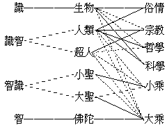
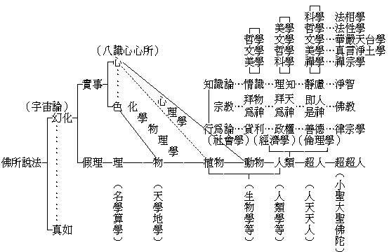
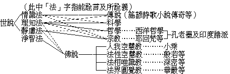

# 第五節　聞量與能知方法之評判

## 目錄

- 一　聞量概說
- 二　四依四不依之標準
- 三　歷史之考證
- 四　法印之楷定
- 五　佛陀學之內容
- 六　所聞言義之揀判
- 七　所聞言義之攝判
- 八　能知方法之評判
- 九　求學之目的
- 十　求學之方法


## 一　聞量概說

瑜伽八十一云：『一文、二義。文是所依，義是能依，如是二種，總名一切所知境界』。除依現實事理求知，更應依古今所傳文義以求知，故有聞量。量即比量、現量之量，指符事理之正知言。聞思古今學說言教所詮事理，得成正知，謂之聞量。如各宗教各有其至教量。陳那量論中雖廢至教量，以就「正知」之種類言，至教量之正知，亦不出現量、比量之二種，故將至教量分別攝入現量、比量中，不鼎足立至教量為三耳，非棄除至教量而不顧也。然今曰聞量，復與至教量廣狹有殊。至教量唯是各宗派指其自所尊崇之教典言，如佛教之指大藏經，基督教之指新舊約，回教之指可蘭經等，又科學家指科學者公認已經證實之公例等。今曰聞量，則遍指凡遺傳所聞學說言教，時無間於古今，人無間於此彼。據吾今可依現量比量所知現實事理而建立名言，有能令他人得起正知者，即可推比決知聞於古近他人所布名言，亦必有能令吾及餘人得起正知者。復據吾今所言，間有乖違現實事理而不符現比正知者，即可推比決知聞於古近他人所布名言，亦有乖違現實而不符現比正知者。故應據現量及為自為他比量，測以算學，考以聲明，觀察詳審，研覈判定，遣其偏妄，存其圓實，所存詮圓實事理之言說，乃可依以勤求自悟，亦可用之令他得悟。故既明前四節之能知方法後，次當評判聞量。

## 二　四依四不依之標準

大牟尼嘗以四依四不依之言留贈後人，以為審擇聞量標準，超越世間諸立說。編書者偏執自言為至教量，致生後人依人依語不依法義而諍門戶之見。其純依現實真相之公平態度，真足令人欽服無已！四依四不依者：一、依法不依人：法指能詮名言，或復兼指所詮事理，或復兼指能知智識，所知境相。「法」言通故，表於左枋：


```
　　　　　　　　　　┌能詮名言……………即語┐
　　　　　┌所知境相┤　　　　　　　　　　　├了不了義
　　　　法┤　　　　└所詮事理……………即義┘
　　　　　└能知智識……………即現比量及量非量之分別識
```


依法為總，依義、了義、及智為別。依法不依人者：謂當以法定人，不當以人定法。縱使其人行果淨善，然其所「言」無義、不了、不合正智，亦不當取。或使其人行果穢惡，然其所「言」有義、明了、驗合正知，亦當聽取。高至佛言，低至童話，不問何人所說，皆當持此標準以為衡量，乃能正知現實真相。云以法定人者，披擇片言之善，雖童話中亦時有堪選者。然使所言多分堪取，則可定其人為智人；遍觀所言，除隨別機方便而說，全分堪取，則可定其人為一切智人。一切智人所言，遂為至人之至教量。吾人崇佛陀為至人，崇佛陀言為至教量，乃由於此。異於聞為誰之言故即信不信，此其即信固為盲信，其不信亦為盲不信。以人定法，依人而不依法，正此所揀。然有情之智幼稚者，恆不免斯咎也。由此世人多盲信盲不信，堅執難喻。故求正知，應先去此盲執。又牟融理惑論謂：善言善行人之聖；不善言不善行者人之賊，善行不善言人之寶，善言不善行人之師。善言善行，人法俱至，固為最崇；善行不善言雖可寶──若二乘聖人不能說法者，亦為人天福田──，然其所言或無堪取；善言不善行雖未為至人，然其所言亦堪師法。依於後例，故羅什法師誡學徒云：吾如敝囊，然中有金，但應取金，莫觀囊敝。又龍猛師亦說喻云：如黑夜行，遇敝惡人，執燈同行，可依敝人取光前進，勿須違避。能知此依法不依人之例，遍觀所聞言義，可以無善法而不取，得大自在；亦可無誰人之能障，得大解脫。極如古錐呵佛罵祖，亦不過欲學徒依法不依人耳。二、依義不依語：「法」中分能詮之語，與所詮之義，凡語言多分隨俗間之流行語而敷施者，雖刱新語以詮新義，既成流布，即多應用，覈其所詮，時有歧異，故不應取單言片語，隨先所聞於何處者，封固堅執，謂於某名必為某義，封名取義。應觀「某名」在「某經論」中，前後諸多文句所關屬之義，其義應當若何，依義定名。例若「真如」一名，於法相唯識經論內，依名、相、分別、正智、真如之五法，但詮「所知現實真相」之義；於起信等論中，以未詳五法分別故，乃總指諸雜染法曰生滅，指諸清淨法曰真如，包括正智、真如，統名「真如」。真如一名，詮「諸清淨法」義。諸不了斯例者，遂生紛諍。故應依義而不依語。三、依了義教不依不了義教：合上能詮所詮，辨其了與不了。了義語謂顯義究竟明了之語，不了義語，義雖究竟無過，語有不明了過。語不明了，義隨含混，易令他人生迷謬解。義語俱不了者，更無論也。例起信論真如一名，詮諸清淨法義，語欠明了，遂多謬解。成唯識等於真如名，但詮無分別智所知法性，語義顯了，究竟決定。又如清辯等說真性一切皆空，雖是遮詞，但皆空語混同表詞，易生空執，不如護法等說真性非空不空。非空不空，顯然唯是遮詞，雙遮空不空執，語義顯了，究竟決定。是故自悟悟他，為求正知而防謬解，應依了義言而不依不了義言。四、依智不依識：現量或真現比量曰智，比量或似現比量曰識。復次，超俗真智曰智──即真現比量──，世間常識曰識──即現比量帶有迷謬之似現比量──。然此智之與識，重重隔別，茲表如左：




俗情科學，正為生物、人類。宗教正為人類、超人──天人──，旁及生物。哲學正為人類，旁及生物、超人。小乘正為小聖，旁及人類、超人、大聖。大乘正為大聖佛陀，旁及小聖、超人、人類、生物。以生物情識，為世間常識，人類理智，即為超俗真智，科學等皆有之，且唯科學為其特色。故吾人轉識成智之進化，以科學為基礎。然以宗教哲學上一分之超人靈智為超俗真智，則人類理智亦降為世間常識。而進以小聖偏智為超俗真智，則超人靈智亦降為世間常識。再進以大聖分智為超俗真智，則小聖偏智亦降為世間常識。進至以佛陀圓智為超俗真智，則大聖分智亦降為世間常識。生物純識；佛陀純智；大聖、小聖，智中帶識；超人、人類，識中帶智，此其大較之可言者。依智不依識者，即吾人須進求「顯現證知」與「推比決知」，以驗所聞言教之符現實事理否，乃為決定評判。未可憑其俗情常識以妄衡量。故終之以依智不依識也。雖然，據吾人遍觀所聞語義──法──而測定人法，如諺云：「世間好語佛說盡」。則佛陀為至人，佛陀所言為至教量，亦其大較可言者也。

## 三　歷史之考證

吾人整理所聞言義，就依法不依人言，本不須為歷史之考證。然為以法定人起見，既不能不考尋某法是否為某人之所說，某人之所說是否為某法，則不能不為歷史之考證。故當依記載之聞量，驗以現存發見古器制之現量，參以人種民族語言文字，及時代國土社會環境種種關係之比量，然後觀察其分位上應否能有此人，此人應否能有此言，此言之思想上來源何在，此言在當世及其後曾發生何種影響與功罪。更加古記載之詳稽博證，某種語言文字上，此言之所詮應為何義，某種風俗習尚上，此人之所言乃為何事。於是茫昧而不明了之傳說，乃略有眉目，可為論其世，察其言，而知其為人之基本。雖然，有因於自然界之環境關係者，如以氣候、地帶、物產而演成一區之民俗，各營其特共之生活；有因於人群制之環境關係者，如以種族、階級、信仰而演成一區之民習，各循其特共之軌轍；有因於時勢之轉機關係者，如以貧富、強弱、安患而改換勤惰憂樂之民情；有因於天才之非常關係者，如以聖哲英豪而變化仁暴、智愚、勇怯之民性。中人以下之言行，大抵以前三因而發生為歷史退滯之跡象；中人以上之言行，大抵以後一因而發生為歷史進展之跡象。故觀歷史之進展，必以後一關係為主因，而前三因則僅為其助緣。夫同一孔仲尼時代之中國，為孔仲尼者僅孔仲尼之一人；同一釋迦牟尼時代之印度，為釋迦牟尼者僅為釋迦牟尼之一人；同一亞里斯陀德時代，為亞里斯陀德者僅亞里斯陀德之一人。有孔子而有儒家之文化，有釋迦牟尼而有佛教之文化，有亞里斯陀德而有西洋哲學科學之文化。可知非常天才之關係，為文化進展之主因也。唯前三因，亦未嘗非輔成其人言行之助緣耳。如處於溫暖之地帶，居於有憑藉之階級，適變於當時之機勢，皆有關係。然若略去其非常天才之主因，必不能為充分之說明也。古人之好為歷史人物誇張者，固多迷謬，而近人之治史學者，但索某人某文化之因於前三者之助緣，昧其主因，亦成偏缺。由是今人之愚者，每不能逾於古之中人，而古之聖哲，亦不妨度越於今之智者也，以其為非常天才故。然解釋此非常天才之何以有，或原本宗族之遺傳，或推由教育之修習，或歸為環境之關係，而此亦為其助緣耳。然直抉其主因，既無上神真宰之特降，亦非無端突然而忽至，蓋由「無始恆轉之一切種識」，積久修因之所致，於此遂至歷史學之問題深處。若能以其果之閎偉，察其因之深廣，亦非甚難知者。後當廣論，今姑止此。由此小乘大乘之俱源於釋迦所說，可無疑也。結集之歷次增減，宜傳──譯釋闡發等──之遞時盛衰，復有前說四因之迭相更替而推演，或為退滯，或成進展，為歷史之考證者，勿執一曲以概其大全，詳細觀察，審求其故，庶能得其真相。為佛陀學之歷史考證應如此，為餘學之歷史考證亦應如此！

## 四　法印之楷定

言法印者，所求得某文化「能詮所詮之綱宗」也。握厥綱宗以觀某文化之言義，如絜繩而網目齊張，如振領而衣紋皆直；刪落其無關者，統括其有關者，內容則條分而縷析，外延則此明而彼辨，是非真似，舉無遁形。佛所說義，雖復無量，古師嘗概括為三乘共通之三法印，大乘別有一不共之法印，則「諸法唯識」也──或法界諸法唯心說──。三法印者：一、諸行無常印：有情、無情，一切因果生滅相續，依此而說；今廣其義曰：無始恆轉論，或無常真常觀。二、諸法無我印：有為、無為，一切緣顯幻事空理，依此而說；今廣其義曰：無性緣成論，或無我真我無性真性觀。三、涅槃寂靜印：有得、無得，一切究竟顯了真相，依此而說；今廣其義曰：無相真如論，或無相實相觀。大乘不共之諸法唯識印，則種現熏起之宏紐，染淨轉依之總根也。今廣其義曰：無元心樞論，或現識熏持法種觀。持此四法印，以觀佛陀之言義，則綸貫無遺矣。符此四法印之楷定，則是佛法，違此四法印之楷定，則非佛法，判然可分，無容假借。他若諸受皆苦、或有漏皆苦觀，身皆不淨、或有漏不淨觀，則由一分無常無我觀所派生，用之對治貪癡等煩惱者，非普遍之真理。名、相、分別、正智、真如五法，則名、相、分別，非佛法之所專有；遍計所執等之三性，則遍計所執非佛法，為佛法之所破；依他起、圓成實，雖即佛法俗真二諦，俗諦亦通世間之說，故皆非佛法之法印。唯佛法有此刊定是佛法非佛法之法印，故異生情愛之魔說──俗情科學等──，與外道神我之梵說──宗教哲學等──，皆不能亂而莫不能化也。其餘一一文化之所言義，若能尋得其「綱宗」之所在，規定其內容，楷別其外延，則皆可審知其底蘊。選擇取捨，分別收破，攝而化之，莫能踰也；析而揀之，莫能濫也。於是乃能評判一切所聞言義。

## 五　佛陀學之內容

瑜伽攝釋分中，以經體之文義，經釋之法要──十二分教等──、等起、義相、釋難、次第之五重，合為師說、眾聽三事；加略廣讚佛及顯學勝利，以開示佛陀學內容。攝異門分，則以白品之佛及弟子所說所行法，黑品之生死煩惱等，顯其內容。攝事分中，則攝之為三事：一、素呾纜事──經藏，二、毗奈耶事──律藏，三、摩呾理迦事──論藏。經藏又分為行、處、緣起、食、諦、界、菩提分法之七。列之如左：


```
　　　　　　　　　　┌─行事
　　　　素呾纜事──┤
　　　　　　　　　　├─處事
　　　　　　　　　　│
　　　　　　　　　　├─緣起事
　　　　　　　　　　│
　　　　毗奈耶事──┼─食事
　　　　　　　　　　│
　　　　　　　　　　├─諦事
　　　　　　　　　　│
　　　　　　　　　　├─界事
　　　　摩呾理迦事─┤
　　　　　　　　　　└─菩提分法事
```


三總、七別，共為十事。然依雜阿笈摩及攝事分，可總攝為三相、四分、十誦、九所知事。


```
　　　　　　　　　　　　　　　　　　　　　　　　　　　　　（十誦）
　　　　（三相）　　　（四分）　　　　　　（九所知事）　┌佛所說誦
　　　　能說相…………佛及弟子所說分………說者事…………┤
　　　　　　　　　　　　　　　　　　　　　　　　　　　　└弟子所說誦
　　　　　　　　　　　　　　　　　　　　　┌有情事……………五取蘊誦
　　　　　　　　　　　　　　　　　　　　　│受用事……………六處誦
　　　　　　　　　　　　　　　　　　　　　│生起事……………緣起誦
　　　　　　　　　　　┌五取蘊等相應分……┤安住事……………食誦
　　　　　所說相………┤　　　　　　　　　│染淨事……………諦誦
　　　　　　　　　　　│　　　　　　　　　└差別事……………界誦
　　　　　　　　　　　└菩提分法分……………所說事……………念住等誦
　　　　　為說相…………結集分…………………會眾事……………八眾誦
```


如是三相、四分、九所知事、十誦，總明佛陀學之內容，亦為總攝三寶。說者中之佛為佛寶，說者中之弟子及會眾中之八眾為僧寶，所說相中之七事、七誦為法寶。有情、受用、生起、安住之四為雜染事。染淨、差別之二為雜染清淨共通事。菩提分法為清淨事。佛所說法，不出於此三事。八眾則瑜伽說為苾芻眾，苾芻尼眾，鄔波索迦眾，鄔波索夷眾，剎帝利眾（各國之國民眾），婆羅門眾（各教之教徒眾），四天王眾天眾，忉利天等天眾（以忉利天等其以上諸天）。前二為僧，後六非僧。前四為已受佛戒之弟子，後四為未受佛戒之聽眾。前六為人，後二為天。前七總攝人非人等──四天王眾，亦攝神生、旁生、餘生等，擁護佛之八部眾，亦攝在此也──，後一純為天眾。佛及弟子為之說法而教化者，都攝在此八眾中故。如此佛法僧三寶，總為佛學之內容。

## 六　所聞言義之揀判

往者、智光論師──據西域記：智光乃戒賢之弟子──等，宗般若，為一切法有時，境空心有時，一切法空時之三時判。戒賢論師等，宗深密，為有時，空時，非空有時之三時及八宗判──小乘六宗大乘二宗。天台宗法華，為五時、四教判。賢首宗華嚴，為五教、十宗判。或判大小，或判半滿，或唱一音無所分判。要皆就佛說評判者。嘉祥三論玄義，為外內小大之分判。慧苑以四教、判「佛法外之說」為「迷真異執」。空海以十住心，判「世間共法」為「異生羝羊」、「愚童持齋」、「嬰兒無畏」三心。則皆就佛說世說而遍評判者。今此聞量評判，不限佛說，亦當就佛說世說而均判。但今所聞一切言義，量異昔時，故評判之標準亦應不同。今先列表，再分解之。




傳說為情識法，乃未經理知等訓練之直覺等，憑其官感情欲意識，有所知覺想像之言說也。其雜有科學等成分者，亦旁通於理智法。科學哲學，皆以理知法為主幹。然科學旁通於致富圖強等情識法，而哲學每推到宗教之最高點，故亦旁通於靜慮法。孔、老及勝論、數論等，則宗教而哲學、哲學而宗教者。耶、回、梵等宗教，雖淺深不一，而要皆以近於靜慮之靈感等為主者，故屬於靜慮法；然亦旁通理知以為說明。其低等者，且每流於情識。凡此皆為「世說」。昔嘗謂之「人間兩般文化」，甲種為宗教及人生哲學，乙種為科學及自然哲學，撮為二表如下：


```
　　　　　　　　　　　　┌理知上在離言契性
　　　　　　　　　　┌甲┤行為上在克己崇仁
　　　　　　　　　　│　└信向上在融跡同本
　　　　人間兩般文化┤
　　　　　　　　　　│　┌理知上在藉相求知
　　　　　　　　　　└乙┤行為上在縱我制物
　　　　　　　　　　　　└信向上在取形棄神
　　　　　　　　　　　　┌甲……實事……善體……存性
　　　　　　　　　　┌利┤
　　　　　　　　　　│　└乙……虛理……利用……厚生
　　　　人間兩般文化┤
　　　　　　　　　　│　┌甲……妖怪……苟惰……沉迷
　　　　　　　　　　└弊┤
　　　　　　　　　　　　└乙……封蔽……憤爭……失望
```


由其弊而揀之，判非佛法，無得而濫之者。佛陀之學，為淨智法。小乘為出離煩惱障之淨智法，餘大乘教皆為出離煩惱障所知障之淨智法。然其自度度他之聞思修方便，亦依據及施設理知靜慮之法。

佛法與世說別，嘗說四條：一、來源有聖心凡識之別；二、施設有應機隨執之別；三、法體有有漏無漏之別；四、法用有著言離言之別。或說無漏有漏，現證推度，究竟不究竟之三別。茲但言其大概，不遑詳也。

## 七　所聞言義之攝判

欲於佛法之統攝中，以判別世界各學說，昔者嘗製一表如下：




宇宙即「法界」也。幻化與真如，為法界之二面；幻化即真，真如即幻化也。然真如不可說，心言絕故。可說者，即為幻化之一面。可說之幻化中，分為「實事」與假理之二幹。假理乃貫通於實事上所附現之虛分位，大乘百法中謂之心不相應行分位假法，故即知識論、聲明、算學、因明等方法。實事指「有實力用」者，亦分二幹：「心」即八識心法及諸心所有法；色即五塵、五根及法處所攝色。細別之雖亦通假實，而大類則皆為實法。色、理集現，為研究之對象，則為天體、地質等物；說明之，即天體、天文、地質、地理學等。由「物」而研「物素」之「色」，色由心變，亦通心力，則為物理之力學，與物化之質學等。「物」之直接及「心力關係」而有生命現象者，為植物。「物」之由心、色、理集現者，為「動物」。「動物」與「心」之間，乃有「心理學」研究之對象。動物中較為優勝者，則為人類。合植物、動物、人類，為生物學研究之對象，包有植物學、動物學、及生理學、形態學等。專在人類，一方有人類學、人種學、歷史學等；一方則有社會學、宗教學、知識論等。在此一方，又可由人而達於「超人」、「超超人」。人類原為動物，亦可進於超人，故人類居於動物與超人之間。在「社會學」、「宗教」、「知識論」之三者，各有三種階級。中人以下，近於動物之人，其社會，則以「貨利」──或食色──為中心，乃為經濟學研究之對象；其宗教，則為「拜物為神」之多神宗教；其知識，則為隨感官情欲意識而知覺想像之直覺情識，亦能產生美學、文學、及相似之哲學，若今之共產主義是。中人正為人類之人，其社會，則以「政權」為中心，乃為法政學研究之對象；其宗教，則為「拜天為神」之一神宗教──耶回等教──；其知識，則為以算學、論理學等訓練意識察驗物象之理知，直接產生者為科學，間接亦能產生改進之哲學、文學、美學、宗教等。一神教之拜天為神，本出於「相似哲學」之理知對象──非官感覺知之情識對象──。然科學理知進步之結果，亦能推破於一神教，以漸知唯是「內心靜慮之經驗」──如詹姆士等之所說──，無別超宇宙外之一神故。猶「相似哲學」之進步，亦能推破「拜物為神」之多神而進拜於天神也。中人以上，近於超人之人，其社會，則以「善德」為中心，乃為倫理學研究之對象──若孔子所謂道之以德齊之以禮者──；其宗教，則為「即人是神」之汛神宗教，若儒家道家所說「聖人」、「神人」及人皆可以為堯舜等，即為崇拜之對象。且所謂賢希聖，聖希天，而「聖人」亦即是「天神」。人皆可為，人皆可由困學勉強而致，自信自成，不須別為崇拜一天神也。其知識，則為經「理知訓練」、「善德踐修」後，「心意和平統一」之靜慮；直接產生者，為禪學──禪那即靜慮，靜慮即「心意和平統一中之精思妙慮」──，亦即儒書「知止而后有定，定而后能靜，靜而后能安，安而后能慮，慮而后能得」之總名──。孔、孟、荀、莊等，皆說有靜慮之學。印度瑜伽、耆那各派，尤注重之。間接亦能產生及改進美學、文學、哲學、科學等。經「理知」、「善德」、「靜慮」之訓練，以加無漏淨教熏發無漏淨種而起現行，成超超人。其社會，則為清淨和合眾，即律宗學所研究之對象。其教即為佛教。其知識，則為離煩惱障或離二障之淨智。直接產生者，為大乘之禪宗學，為無漏之禪學。展轉增上為真言淨土學，乃無漏之美學。為華嚴天台學，乃無漏之文學。為法性空慧學，乃無漏之哲學。為法相唯識學，乃無漏之科學。由此可見佛陀所說之法，可以含攝人間一切言義，而於佛法中各予以相當位置，有條而不紊也。

宗教哲學之於知也，其依根覺印象及所傳聞，不異俗情，但稍能應用比量以判擇傳聞，及改進根覺等──靜慮學──，然亦為較進步之似現比量耳。近世依科學之哲學，漸有正比量智，科學極重依根覺親驗印象之現量，亦注重應用考證以判擇傳聞之說，尤極注重應用邏輯以構成於正比量之理知──如關係公式之知識──。且能憑所發明之公式等，創造望遠鏡、顯微鏡、析光鏡、透礙鏡、擴音器、及天文化學各儀器等，廓增根覺親驗之境，都入算學測量文語傳述之內，重重改正，重重進步。故論世間求知方法，科學比較優良。然於根覺本身──六根八識──尚無改進之道。復不知宗教哲學中之靜慮學，雖有迷謬猶待除擇，然「靜慮學」實為改進「根覺本身」之術。若能依正理智，親驗其事而去其迷謬者，即能改進根覺本身，引生淨智，擴充且明證現量之實境，達到能正知現實之目的。於此乃為佛學之事，亦為進步之廣義科學也。近人稱佛陀學為科學之哲學宗教，其言諒已，而要非虛心求學不為功。

## 八　能知方法之評判

上言現實之能知方法凡五種：一、為自求知之現比量，此於近世為哲學之知識論，與科學之邏輯學之一分。二、測量工具之算學。三、傳述工具之聲明，此於近世為語言文字學。四、為他令知之因明學，此於近世亦為邏輯學之一分。五、為以評判態度擇取於所聞言義，則凡師友講談，圖書閱覽，皆可為求知方法之一事。言厥途程，則在彼根覺親切印象經驗之現量，應用測量傳述之算術與語文，並據因明學之法式，評判聞見於師友圖書之學說，構成符事理之正比量智，重重改正幼稚之現量為進步現量。於是迷謬之情漸伏馴至於斷，發生真現量智，乃能洞見現實真相；施設正比量智，乃能說明現實真相。俗情之於知也，但依根覺印象及所傳聞，為胡亂構思想像之似現比量。

## 九　求學之目的

吾人求學，除開全由旁人強迫使學之外，總多少有所以要求學之意思，此意思之所在，即求學之目的。或謂人身須賴衣食住等生活，而此人身所需之衣食等，須藉知能以造作取得之。且現時造作取得人身生活所需之知能，乃從全球人類遺傳演進之所成就，今欲獲此知能，非從事求學不為功。故求學之目的，不外欲得人身所需以生活耳。以此為求學之目的，今固不得非之，蓋人生最切要之事，無過於謀生活。擴而極之，謂人生所需之衣食等，不患寡而患不均，社會主義遂以謀全人類得均取生活之所需，亦不外達此目的也。然使求學之目的僅如此，則現今享有遺產不須謀生之子弟，或實行社會主義後，人類豈遂無求學之目的而不復從事求學乎？如曰不然，必更有其他之目的。或謂人有榮譽之好，故富家子弟雖不求衣食，孜孜以求學文藝、美術等，以博官第；尚時髦者，其目的要在於華貴風雅等榮譽耳。極至於所謂揚名顯親之名教，及經營於歷史上留一不朽之名者，亦不外此。前為利，此為名，原人事上之所恆有，今固不得非之。然亦有甘凍餓聽戮辱而不倦求學者，又何所為乎？或謂人性好勝，且好特異，彼不求名利而求學者，欲持己意支配當世之人，並得天下後世之驚慕耳。此亦抗心高志、怪傑奇才者之所為，今固不得非之。然亦有捐棄名利和樂人情者，復何為求學乎？或謂人性樂群，尤樂人群之治，如孔子輩，篤志為學，莫非因時以求人群之治理耳。此更人倫善德之聖，近若克魯泡特金輩，張皇互助進化之義，亦不外此，今尤不得非之。但茲之四者，可總括謂求學之目的，在於得此人生之安樂耳。然所得之安樂，不在於此求學時，須在求學後施行事業之成就；若未成就或竟不能成就，其求學豈不遂成無意義無價值乎？或謂人心本是恆久不息，向內外上下以求知能者，故求學莫非以得知能為目的。學即求知能，求知能即學。求學即手段亦即目的，不必更要達到何項之目的，便已達到目的，故求學之自身，即有意義價值。且達到其餘種種之目的，要皆由求學所得種種知能以達到之耳。故求學在於得知能，更無疑義。近世真正之科學者，唯在於此。夫求學固以得知能為唯一之目的，然原之無根而徵之無驗，所謂知者，其固知乎？所謂能者，其固能乎？要未可必。故云為得知能，亦未足以明求學之目的究何在也。上來於各家所言求學之目的，討究略盡。然則求學之目的究何在？曰：求學之目的無他，為得如如相應於「現實」之知能而已。現實即大涅槃──真如──，現實之知能則大菩提也。故求學之目的，即佛學之目的。若明求學之目的而求學，則終將唯佛學之是求也。然在「現實」本離名相，今既方便立「現實」名，且更方便定「現實知能」義，則如何為現實之知能，可明矣。


```
　　　　　　　（第一義）　　　　　　　　　　　　　（知能）
```


既勘明求學之目的在得「符現實之正覺」，今更進問求學之方法當何從。

## 十　求學之方法

言求學之方法，換言之，即求「正知」之方法。於此當先認清兩事：一、求正知之困難，二、求正知之歷程。所言求正知之困難，以知覺之不易真耳。知覺之不易真，以其起原之蒙昧也。知識之起，不出三源：一曰現量，二曰比量，三曰聞量。根本起源，唯此現量。現量乃是心依內根，映帶前境，但有人生即由心惑，譬之夢事由睡眠起，內迷有根身之我人，外惑為質相之物境，雖不盡無，已非如實。況復曾未相應，旋興念度，顛倒執取，益滋迷謬，習非成是，宛成妄知。雖有比量可從糾正（科學），但比量仍依一一現量，展轉推校集聯而得成，縱能近真，亦不切實。況復本既不齊，末何能整？謬非在所必多。至於聞量，傳由他人，他人之現量相及比量名，其不免於過非，彼亦猶此。故一以正知真覺為求學之目的，求學即不免有如上之困難。解除此困難者，則應知求學之歷程。所言求學之歷程者，以非求得真實現量，則不了達現實。然在未得真實之現量時，所起無非錯謬。且於其中絲毫不能用力，將如何求之乎？曰：所賴者，一在人心有本能真實現量之潛力──無漏種──，二在已經得真現量之人曾有所垂教於吾人。已成真現量者為誰？曰為佛陀。吾人若依佛陀所垂示之至教，圓達其理，楷定其量，用以裁斷若聞他言若起自覺之種種知識等，掃空一切不正教理及謬誤之理想，由至教量轉成自心有力之真比量，再憑此勝解之真比量力，摧伏依附現量所生一切謬非情識，久之豁破幽迷，便得真現量智。由此依真現量智及正比量智，續銷虛妄，深證真實，至於究竟圓滿，無不洞然正覺之中，方為學滿，即成就如如相應於「現實之知能」也。故求得正知之歷程：一、揀擇於一切學者之學說，以求得至極圓滿之教詮定量；二、依所得至教量，破除一切若他傳若自起之迷謬執，自成殊勝之正比量；三、依所成正比量，決定印持平常見聞動靜之身心日用事，開發真覺；四、依真覺正思，以銷落餘妄，究竟顯現；五、依真現量之智境，施正比量之教義，令未覺者藉之以覺。合前求學之目的，與求正知之歷程，為現實主義能知之方法。

