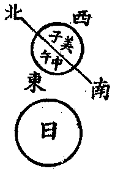
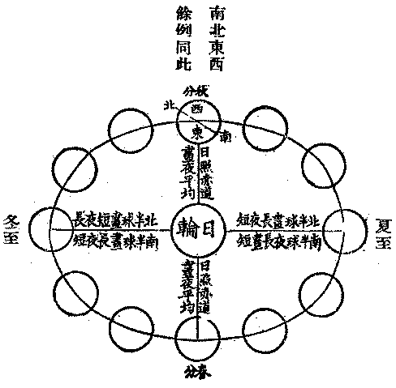
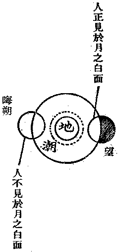
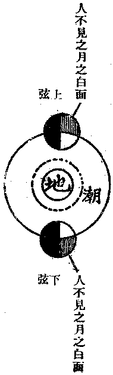
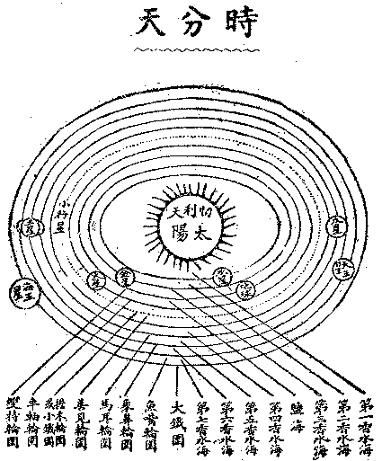
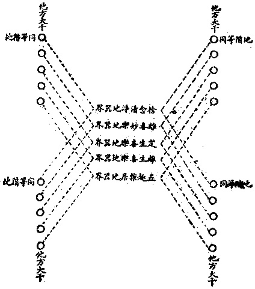

# 第二節　所知器界

## 目錄

- 一　所知器界概論
- 二　此一人間之器界
- 三　人地與天象之關係
- 四　此日系中之他處人生器界
- 五　日系中神生天生之器界
- 六　太陽系外之天生器界
- 七　一小世界之成住史
- 八　日系諸星之空間測量
- 九　地球等上之異生器界
- 十　此大千界與無量器界
- 十　一器界與有情之關係
- 十　二人生於器界之依資


## 一　所知器界概論

器界與根身、一切種，同為一切種識不可知相；彼深細故，此廣遠故。然諸識及根身、種子，皆屬有情世間；而本質器界塵，與五色根識托以變緣之現象五塵，及法處所攝色一分，則為器界。世間器之染淨，隨有情而染淨，故曰有情心淨，則國土淨。據實言之，有情各住一器世間，依各自之一切種識各變為本質塵，依各自之六根識及本質塵各現為六塵境界。各自見聞覺知，依持受用於各自之器世間內，譬如夢心之遊夢境，不出自心夢境之外。然覺夢境有一不同之事，則夢境唯是自心之所現，而覺境則有他有情心為增上——夢境間亦有之，然不若覺境之必有——；眾同分——同類之性——業果相似故，異熟根身、器識亦相似故。異時異處，且相資變；同處同時，更相資用。於是諸有情類誤認同類有情更相資變資用之器界，為離有情心而獨立存在之物。欲測知其物之生起變化及現存者究竟何若，遂有天體、天文、地質、地理諸學。然實剎那生滅，隨有情識恆時轉變，真現量實相中，超名言種類分別故，無可測量宣說。隨「俗情世間」、「學者世間」等，雖有可說，然由各時各處各有情類所知不同，其相無定，隨識遷變，如幻如化。唯在一期一域之內，依一有情類相似識中相似之器界，可為假設之言。故首應知古近天文等學，皆為假設之言，乃可擇其於事理較符合者以為說。雖詳言切近人間之所知器界，亦不執為唯此非餘，執諸器界決定如此。以有情類心識力殊異故，所變、所依、所知、所資用之器界亦成多樣多式：或隨有情身而有無——若四禪天，或先後有情而有無——三禪天以至人間等，或極寒中而有有情生活——若八寒之苦器，或極炎中而有有情生活——若八熱之苦器，或身器多隨心力而變化——若天生、神生之器界，或身器多隨物理而規定——若人生、旁生之器界。能相對以觀其會通，勿偏執而據以齊一，庶可試言真現實論者所知之器界，無自教相違、世間相違之過也。

## 二　此一人間之器界

此人間之器界，近人謂之地球，佛陀學中曰贍部洲。亦稱地輪，舉其形似，比之菴摩羅果，與今地球儀器相仿。雖亦諸旁生等所共依變資用，然可屬人以言，言者、聞者皆是人故；今此但為人生言故。傳贍部洲形狹長，有尖角；然此但據贍部大洲山河陸地以言，若統言贍部洲，包括兩中洲與五百小洲及大洋海，乃等於地球也。中洲，一曰、遮末羅洲，應即澳大利亞；一曰、筏羅遮末羅洲，應即南亞美利加洲。日本、英倫、婆羅洲等，屬於五百小洲。北美、北亞，在白林海峽，本可相連接，古代人種遷徙，亦有言由此交通者。故北美及歐、亞、非四洲，總合為贍部大洲。則地球者，一大洲、兩中洲、五百小洲、及大洋海之總稱也。中國分國內為九州，更言國外有大九州，亦略知其仿髴。至今尚有多處人蹤不到，為藥叉等之所居者。故傳大、中、小洲，各為某種人之居處；或傳遮末羅洲，是藥叉居處也。今所知之地球，陸居三分之一，海居三分之二，海之大於陸者加倍。亞之中、印，歐之希臘，非之埃及，北美之墨西哥，皆嘗有古文明民族；而南美與澳，則無有。故人文唯出於大洲。大洲上之人文地理，乃分人主、象主、寶主、馬主之四主焉。地文地理，近於大洲分為四洲：亞細亞洲最大，俄領西比利亞位其北部，南部則中國、印度、波斯、亞刺伯在焉。北亞美利加洲次之，美利堅聯邦及墨西哥與英領坎拿大等在焉。歐羅巴洲與阿非利加洲，面積之量略等。非洲有英領埃及與法領摩洛哥等。歐洲則意大利、法蘭西、德意志、俄羅斯等在焉。小洲則有英國、日本、台灣與美領之菲律賓等。中洲南亞美利加有智利等國，澳大利亞大抵為英領之屬地。至言天文地理，大洲位於地球之北，地球之南多為洋海。故大洲之北部，近北冰洋，苦寒少雨，不宜人之生活。南部正當赤道，頗為炎熱，然多雨而物產豐饒，為印度等民族居之。美利堅、中國、法蘭西等，皆處南北間之溫帶。而小洲之日本、英吉利等，亦在溫帶。涼燠以時，人事斯利。然中部亦多高山大嶺奧阻深藏者；有江河大湖之流域，乃為人所聚居。二中洲皆位地球之南面，為溫帶之稍近寒者。凡此皆可見天人之關係。

## 三　人地與天象之關係

人地與天象最大之關係，莫過日月。日之供給於地者，為光熱，月之影響於地者，為潮汐；而晝、夜、冬、夏、晦、朔、弦、望，亦以之分也。地之繞日而轉，有自轉、環轉之二別。由東西自轉分晝夜，轉向於日之面為晝，轉背於日之面為夜。例中國方面向日為晝時，即為美國方面背日為夜。南北極有終年皆不分晝夜者，故不宜人等生物也。茲作一地球對日自轉圖明之：




例南北線為一直桿，橫貫地球，懸在空中；自身從西至東，向日以一定速度而漸轉，中國正向日當午時，美國則為半夜子時，非洲為日出時，太平洋則為日沒時。餘可例推。南北極永遠無正向日時，亦鮮全背日時，故為非晝非夜。今猶為探險者所未能探得詳悉，僅知其為南北冰洋而已。南北極之標準若移動時，地球東西面變為南北極，地球南北極變為東西面，則南北洋之冰鎔化為水，當淹沒今之陸地為洋海，而南北洋又當出現適宜人等生物居處之洲陸等。然地球曾有此等滄桑之大變遷否，亦無確知。茲制地輪繞日環轉之四時成歲圖如右。




環轉一週，約為三百六十五日，分四時、十二月。春分、秋分，晝夜長度均等十二小時；夏至則北半球晝長夜短，冬至則北半球晝短夜長，南半球則反之。大洲、小洲文化民族皆處於北半球，故皆言冬則晝短而夜長，夏則晝長而夜短也。其實以地而異，不能概齊。月輪繞地環轉，約三十日或二十九日為一周。月球由地分出，離地非遠，故其相抵相吸中之吸力，影響地面上之流質——海水——，發生潮汐；復由日、地與月相對向之差度，而有朔望弦晦之異。茲亦以黑白成月圖表之：







據實、月輪向日之面常白，背日之面常黑。唯在地球上人觀之，則於日、月、地三成一直對線時，見月全黑、全白；日與月若成一斜對線時，見月半黑、半白。每夜有其移動差度，乃見自望至晦，自晦至望，漸黑與漸白之月相。而日月薄蝕之相，亦由日、月、地相對而現。月影晝遮日輪，地上之人不見於日，遂成日薄之象；地影夜遮日輪，地上之人不見於月，遂成月蝕之象。此其時度，皆可預算知者。至空中諸星，則大抵為他處之器界。除日、月外，天王星與此地球最有關係，而金星等有時亦可交通。至古人以日月星象言人事禍福之關係，不過依人事、天象而寓其勸誡之意。餘若風、雲、雨、露、霜、雪、雷、電，與地之崩動等，皆與人生、旁生有直接之關係。而植物等以之蕃殖衰落，田野變成沙漠，沙漠變成田野，使人不得不變更其生活方法，則為間接關係。此除日月與地之距離方向年齡等有關係外，大抵皆由地輪表裏之堅勁質，與流濕質，並煖熱力，與輕動力，積成潛勢，及時生變。深究厥源，亦由多有情類之一切種識變其常度也。

## 四　此日系中之他處人生器界

近人所言一日輪之系統，在佛陀學即一蘇迷盧系，一蘇迷盧唯有一日輪故。然一蘇迷盧系，據佛陀學有四人生器界，近人亦已有能窺見火星等有人故。今此地球，為四人生器界中之第三器界。以東西南北而表其次第，此曰南贍部洲，當居在第三故；第一曰東毗提訶洲，當今行星中之水星，距日輪為最近故；第二曰西瞿陀尼洲，當今行星中之金星，距日輪亦較地為近；第四北俱盧洲，當今行星中之火星，距日輪較地星尤為遠故。水、金、地之三星，大小略等；火星較大。北俱盧洲，傳為四洲中最寬廣之妙勝大洲故，以俱盧洲為人生完美之器界，足為吾人想慕之境。茲節錄起世因本經，略明其概：

北俱盧洲，有無量山，遍生香樹，香充其洲。地生香草，青翠柔軟。樹生種種雜色花果，諸鳥棲鳴，音聲雅妙。山有諸河，澄清徐流，寶舸容與，岸淺易涉。有諸樹林，花枝映覆。其地平正，純是金銀，無荊棘坑坎礓礫糞穢等。不寒不熱，時節調和。地常潤澤，植物蕃茂，人生日用，都由植物自然成就。有「安住」樹林，高六拘盧舍，密葉重布，能遮雨滴，為彼人等居住。香樹高低不一，彌布香氣。有波娑樹，在枝葉花果中出諸寶衣。有諸寶樹，出瓔珞、花鬘等種種嚴飾。有諸器樹，出種種人生日用之器具。有諸果樹，出色香味俱美之果，供人取食。有諸樂樹，出生樂器樂音，供人娛樂。其他又生秔米，自然鮮白，不藉耕舂。有「敦持」果，隨意生火，熟諸飲食，不假新炭。其洲有四無熱惱池，貫注周匝，其水清冷、輕軟、甘美、香潔。岸傍欄楯、鈴網、寶樹環繞。池有華藕，色香微妙，破汁食之，甘如乳蜜。池之四面，有四大河，水鳥、樹林、花果，香音圍遶河道，羅列周遍。恆於夜半池起密雲，雨灑地潤，旋復晴霽。風送清涼，觸人安樂。復有善現、普賢、善華、喜樂、善體眾多池苑河道，入中游泳，隨意去留。衣飾之具，隨心取舍。

此言北俱盧洲器界之美，即言火星之人間也。他日能有更進步之科學，固不難證實於火星；亦不妨以人生增上福業，改造此地球成之也。

## 五　日系中神生天生之器界

太陽系中八大行星，除上水、金、地、火四星，木星環日於火星外，應為東方天王之天眾及華手天器界。火星、木星間，有多小行星，應為星宿天之器界。土星環日於木星外，應為西方天王之天眾及持鬘天器界。天王星為管理南贍部洲南方天王眾之器界，名義更為顯然。海王星則為北方天王眾及常放逸天之器界。至於彗星，不由太陽統攝，然時隱時現於太陽系中，應為阿素洛或妙翅鳥之器界。而太陽則為忉利天之器界也。過此以往，為空居天，非日之光熱攝力所能及。故太陽系之範圍，即蘇迷盧之範圍也。茲製圖以解之。




八大行星，輪圍軌線，喻之曰山，實為輪圍之軌道也。太陽與八星輪軌間之空皆喻云海，實為「以太」及空氣也。地球濛氣與地上之海水，迭相凝變，故統說為鹽海。蘇迷盧指太陽全系統言。日及諸星，地球上人皆從仰望而見，在仰望中，似從下而至上，輪軌層積，喻之曰山。八星輪軌之空間諸衛星、小行星等，亦為四王所統空行、天行諸神生等器界。器界皆為有情所依資者，應無無有情之器界。不應以地球上人生、旁生及植物等之適宜生存否，斷餘處生物之或無或有；地球上生物之適宜生存條件，但能適用於地球故，或但能適用於吾人現見之生物故，然亦可有將成未成、將壞未壞而尚無有情者，時在變化之中，不應執為定無定有；此地球亦初無動物，後垂壞時，仍將無動物故。大鐵圍為太陽系之最大範圍，亦蘇迷盧之最大範圍也。

## 六　太陽系外之天生器界

太陽系即蘇迷盧系。據傳蘇迷盧頂——即太陽——曰忉利天，其上——或其外——倍高倍廣，有時分天器界如雲珍寶所成；其上倍高倍廣，有知足天器界；其上倍高倍廣，有化樂天器界；其上倍高倍廣，有他化自在天器界，是為欲界之頂。其上倍倍高廣，有梵眾、梵輔、大梵天器界，是為色界之初禪天。色界與欲界之間，別有魔羅天器界，是為天魔眾之居處。此諸天之器界，大致皆百寶成，有如雲氣，莊嚴勝妙。上上倍增，至大梵天遂為「一世界」之範圍。如此千個，曰小千界。其上更遠，有統千個「一世界」廣量之少光天器界；又其上有無量光天器界，極光淨天器界，是為色界之二禪天。其所統謂之小千界。如此千個，曰中千界。又其上有統千個「小千界」廣量之少淨天、無量淨天、遍淨天三重器界，是為色界之三禪天。其所統謂之中千界。如此千個，曰大千界。其上又有統千個「中千界」廣量之無雲天、福生天、廣果天、無煩天、無熱天、善現天、善見天、色究竟天八重器天，是為色界之四禪天。其所統謂之大千界。「一世界」以八十小劫為「成住壞空」旋復，壞由火災。統小千界之中世界——即二禪天——，以八大劫——以光淨天壽八大劫計——為一「成住壞空」旋復，壞由水災。統中千界之大世界——即三禪天——，以六十四大劫——以遍淨天壽六十四大劫計算——為一「成住壞空」旋復，壞由風災。至四禪天之八重器界，則彌覆千個中世界上，隨彼天身存沒，不為三災所壞。而無色界四天，以無身故，亦無器界，周遍大千界中，無別居處——唯我學者所宗，不出於此——。至通常所言之世界「成住壞空」，但依「小千界」中「一世界」言之以例其餘耳。此一大千界，名索訶世界，為色究竟天大自在天之領土，亦為一佛教化之域。統計應有百億太陽，即百億蘇迷盧系也。在華藏世界，僅為一世界種中之一世界，二十重中，居於第十三重。近人所說恆星圖中之恆星系，庶其近之。


```
　　　　　　　大千世界（此大千世界曰索訶世界）
　　　　　　────────────────────────────色究竟天
　　　　　　　──────────────────────────善見天
　　　　　　　　────────────────────────善現天
　　　　　　　　　──────────────────────無熱天
　　　　　　　　　　────────────────────無煩天
　　　　　　　　　　　────無想天
　　　　　　　　　────────────────────廣果天
　　　　　　　　　　──────────────────福生天
　　　　　　　　　　　────────────────無雲天
　　　　　　　　　　　　　　　如此千個之上
　　（大千界中一大世界）───────────────極光淨天（或光音天）
　　　　　　　　　　　　　─────────────無量淨天
　　　　　　　　　　　　　　───────────少淨天
　　　　　　　　　　　　　　　如此千個之上
　　　（中千界中一中世界）───────────光淨天
　　　　　　　　　　　　　　─────────無量光天
　　　　　　　　　　　　　　　────────少光天
　　　　　　　　　　　　　　　如此千個之上
　　　　（小千界中一小世界）────────梵天
　　　　　　　　　　　　　　　──────魔天
　　　　　　　　　　　　　　　　─────他化自在天
　　　　　　　　　　　　　　　　　────化樂天
　　　　　　　　　　　　　　　　　　───知足天
　　　　　　　　　　　　　　　　　　　──時分天
　　　　　　　　　　　　　　　　（蘇迷盧系）
　　　　　　　　　　　　　　　　　一太陽系
```


## 七　一小世界之成住史

蘇迷盧系至大梵天，為小千界中之一小世界。此小世界，由以前小世界「壞」而「空」後，由有情之共業力故，大梵天之福業力故——以此故，諸天神教執世界人物由彼天造——，漸由集起成新世界。初依無形無動——形言物質，動言物力，即無物之質力之謂——之有限量空輪以為軌持。空輪指有範圍之空間言。近人猶於數學天算學上，爭空間之有限無限，其實一世界之空間有限，諸世界之虛空則無限也。由當生此界之大梵及諸有情業種之力，規定此「世界」之形量壽量，依心識種及光熱等色種起現行故，最先化生大梵天身及成大梵天之器界——故大梵天亦為此一世界命根；儒言窮理盡性以至於命，至於命、即至於大梵天也。唯神學者所宗，不出於此——。大梵天界，於成劫初最先生成，於壞劫末最後死壞，故壽命有六十小劫，統成、住、壞三中劫故。由此歷數小劫，漸成梵輔、梵眾天界，完成清淨光潔之初禪天梵世，而尚無陰陽擾動之患也。次依空輪，有風輪——輕動大種——起，為諸有之軌持。由當生欲界有情業種心種及光熱等色種起現行故，先化生有陰陽性之魔天身器，實為陰陽擾動之原。擾動中有陰陽之性，即風輪之軌持——窮理盡性不出一陰一陽之道，唯生學者所宗，不出於此。至於命之陰陽不測之神，則為梵天。魔天以下，則皆為陰陽之所測。故梵天為外道解脫之宗，魔天為凡夫情欲之主也——。依風輪所軌持，歷數小劫，漸生成眾寶如雲之他化自在天、化樂天、知足天、時分天諸天身器，完成欲界空居之器界。由是依空輪、風輪更有水輪——潤溼大種——、金輪——堅勁大種——起以為軌持——唯物學者所宗，不出於此。由當生地居界——即太陽系，蘇迷盧系。地即太陽及太陽系中諸星體，由水輪、金輪軌持所成者，非單指地球也——，諸有情業種心種及光熱等色種起現行，先集成化生日球之忉利天身器等。據傳日之形體四方，外現光輪則圓。每方有八天眾天主，中央別有一能天主天眾，故謂三十三天。由是又歷於數小劫，乃次第完成，太陽系中之八大行星及衛星、小行星等天生、神生、人生、旁生、餓生、苦生之器界。從梵天以至太陽系諸星球之完成，共歷二十小劫，在地球等乃有人類生起。在初化生於地球上之有情類，猶是天生而未是人生也——耶、回等低級一神教所奉唯一天神，不過忉利天之能天主或天王星之南方天王而已。故神教之起源，以太陽或星宿為宗主也——。此太陽系之物理界，風、水、金輪以為軌持，光熱之火大種與諸所造色種，內蘊外發於軌持間。力之著者，不外輕動之風大種與光熱之火大種；質之顯者，不外潤溼之水大種與堅勁之地大種。風動之輪軌，分為陰陽性——先天陰陽——，吸抵拒攝，由之相激相成。水、金之輪軌，合為陰陽性——後天陰陽——，吸抵拒攝，由之相成相激。光熱之火大種——電子——，彌綸擊發於中。水輪即為無重量之「以太」，即諸香水海也；金輪則為有重量之「質點」——即諸原子原質——；風火則為激動變化之力。近人物理學之研究者，不外乎此矣。地球本從太陽分出，別有蘊火以為中心。風日由水而徹金火，火金由水而徹風日，拒攝調和而成海陸，宅生植動諸物，吸抵停勻而成運行，變呈天地諸象。今入住劫以來，已歷其半——第九小劫——，地球之年齡，猶在人之中年也。

## 八　日系諸星之空間測量

據俱舍論等之傳說：地球直徑，為六千五百踰繕那。水星、金星，或較為大。北俱盧洲為八千踰繕那。八水輪海——或說為以太海及空氣海——，中間寬度，鹽海約為三十二萬餘踰繕那，七香水海則從八萬、四萬、二萬以至二千五百踰繕那寬。大鐵圍之周圍，約為三百六十餘萬踰繕那。然說蘇迷盧之直長，僅為十六萬踰繕那。三百六十餘萬踰繕那之直徑，應不至此。又說地球與蘇迷盧頂——即太陽——之高下距離，為八萬踰繕那，亦不符說遠距離之量也。說蘇迷盧頂之直徑，為八萬踰繕那，似說日球較地球大十倍有餘。此諸測量，雖無定準，然在今天算學之假設上，尚無定量，亦不妨姑存其說也。

## 九　地球等上之異生器界

地球為人生、旁生之器界，然亦有地行藥叉及阿素洛等諸神生類，於中別成依住之處與人不相聞見。又諸餓生及苦生類，或與人間同處，業果異故，不相聞見。或云：地面五百踰繕那下有餓生界，由琰摩王管領而宅其中。又云：入地一千踰繕那之地心，有苦生之器界，常受諸苦。又有餘經說：八熱苦生界在於地下，此合地心是火之說。八寒苦生界在地之極邊，此合南北二極冰洋之說。故地心與南北極，皆有有情生活其中也。受苦業果，成苦根身器界，非吾人眼耳能聞見，亦非吾人生活所能衡斷；然若得天眼智，亦能了了明證之也。在此地球既然，在水星、金星亦如之。火星據說唯十善業成，故除人以外，但有珍禽等旁生耳。四王天統諸神生類，故木星、土星、天王星、海王星雖為天界，兼為神界。忉利天、據順正理論云：蘇迷盧頂，於四角各有高峰，有金剛手藥叉神等，於中止住守護。諸天中央大城，亦有青衣藥叉防守；且龍象及妙翅鳥等旁生而神生者，與緊那羅、健達縛等亦時執役其中。故此天界，亦兼神界。要之，神生之器界，乃兼通於人間天上者也。

## 十　此大千界與無量器界

一小世界之空輪有限量，一小千界、一中千界、一大千界、一世界種、一世界海之空輪亦有其限量，然無數空輪互持交徹之無輪虛空，則無邊際。無邊之虛空中，如此索訶之大千世界者，或大於此，或小於此，或優於此，或劣於此，或先於此，或久於此，或暫於此，各成統系，各為安立。此索訶界東方之世界無量數，南西北方四維上下亦復如是。或成，或住，或壞，或空，在無盡時無邊空中縮小觀之，殆如海上浮漚，此生彼滅，暫存忽歿。反之，則在一剎那、一微塵放大觀之，亦如大千華藏層積重疊，增長繁殖，展轉相攝各為其主，展轉相入互為其伴，異處異時，多樣多式，如寶珠網，影體相涉，主伴重重，不可窮詰，如佛華嚴華藏世界品等廣明。歐人邁格文，謂佛說世界，各方皆同一形式者，非也。

## 十　一器界與有情之關係

器界言有情身所依住之處，與所資用之器也。據三十唯識頌云：「不可知執受、處、了」。論解之云：所言處者，謂異熟識——一切種識——由共相種成熟力故，變似色等器世間相——即不執受外四大種之能造色，及不執受外器界塵之所造色是也——；雖諸有情所變各別，而「相」相似，處所無異——據在同一空輪內言——，如眾燈明，各遍似一。問曰：誰有情類之異熟識變起為此相耶？答曰：或云一切，所以者何？如契經說：「一切有情業增上力共所起故」。或云：若如此說，諸佛菩薩應實變為此雜穢土！諸異生等應實變為他方此界諸淨妙土！又阿那含等諸聖者，厭離有色生無色界，將來必不再下生於欲色二界，變為此大千界，復何所用？是故唯以現居此界及當生此界諸有情之異熟識，變為此界。契經但依少分有情而說一切之言，諸業同者皆共變故。或云：若如此說，則於器界之將壞時，既無現居及當生者，又以誰之異熟識、變為此將壞之器界耶？又諸異生厭離有色而生無色界者，後雖猶當下生，然於現近數萬大劫中，既無色身，亦無須器界，預變為今欲色二界之大千界，亦復何用？又欲界與色界諸有情類，雖有色身，各須依資器界，然與絕然不同地位之器界，麤細優劣，遠相懸隔，不能有互相依住資持之功用；此一地位之有情識，變為彼一一地位之有情器界，亦有何資益耶？然所變之器界，本為有情之「色根身」依持受用，故若於此有情身可有依持受用之器界，此有情識便應變為彼之器界。但為業果造受之階地所離隔，不因居處之此界他方而阻礙——頗同代表各種職業階級之國際團，但有階級之分，而無國界之別——。是故雖生他方器界——他界之空輪內——，然與此處有情居於業果階地相等之有情類，其異熟識，亦得變為此處階地相等之有情身所資器界，彼亦可生於此為依資故。彼一一界有情識變為此界階地相等之器界既然，此界有情識變為彼一一界階地相等之器界亦然。故此器界，於將壞及初成之時，雖無有情而亦現有此之器界；彼一一界階地相等之有情識，皆共變為此故。彼於此界既然，此於彼一一界亦然。可為圖解如下：




然於此說猶有須補充者，則異其階地之有情，其異熟識雖不一切皆變不同階地之有情身所依器界，然亦有以特殊關係而變之者，若上界離生喜樂地之大梵天，兼領欲界；捨念清淨地之大自在天，兼領五有色身器地——即上表列之五階地——；又有上地將下生於某階地者，此諸上地有情識，應變為有關係用之下地器界也。下地有情，亦有努力修戒定慧等行，將上生於某上級地、或某他方之淨土者，此諸下地有情識，應變為有關係用之上地器界也。故雖僅就業識所變之器界言——諸佛菩薩願定通力所變者，下另說——，應有四句分別：

有此四句，乃窮盡有情識共變器界，以為色身依住資用之理由也。此方、他方有情，或以同等階地而轉生於他方此方同等階地；此方、他方有情，或以不同階地而轉生於他方此方不同階地。要之，可有轉生色身依資用者，其有情識皆應互共變為可依資之器界。然此猶依一方一階地內諸有情器共受用者而言。然別受用，猶應注重各類各個有情業識各變之殊異也。各類變者，若共居於此方五趣雜居地者，例對於人生所見之江河，人生則為水之受用；諸餓生等則見猛火或糞穢等而受用煎迫；諸天生等又見為金、寶、琉璃、莊嚴而受用諸樂；在諸水族，又視同空氣而依為窟宅。縮小言之，同在地球之人，苦樂相差霄壤；同在中國，同在上海，亦復業果差別。各個人各變不同者，如忉利天，於同食具成美惡迥殊之食味；人亦隨其特殊身心，於同一境感覺色、香、味、觸不同，竟不知孰為正色、正聲、正味耶？故諸器界，雖由無數有情同業增上，變成相似之境，其實但有相似而無同一。各有情心身，各依資於各變之器界；各有情各為一宇宙。時無本剽，空無邊中，乃為盡理之談，符於現實。然諸有情同業、異業互為順違增上緣力，或總或別，相壞相成，以變為相似不相似之身器等，亦為現實之事。由前故說一切種識緣起，由後故說法界無盡緣起。

## 十　二人生於器界之依資

前於器界，既說明其原理，今再就資人生所依持受用者，切實言之。人生直接所依持者，固在於地球之陸地，然日月之供給光熱，海濛空氣之供給風雨等，亦有關於依持，否則，色身陸地亦不能依持也。至於受用日、月、光、氣、風、雨等，固多有直接間接關係；而尤以陸地及陸海所出產之礦植，供給於人生為衣、食、住、行、康、樂之器用者為要。大抵衣食取於陸海所產植物；住、行、康、樂之具，兼取陸海出產礦植以成。人生之生活，大都依賴於植物，故亦謂人為寄生植物者。人之受用於礦植等，較旁生等為特殊者，由手足分工而兩足能支持其全身直立。旁生亦曰橫生，人生亦曰豎生，亦由兩足能支持直立其身否而別。兩足能持身而直立，乃能運其兩手，別為造作及受用於礦植之間。其造作受用於礦植之又一特殊力，則在能用於火，此亦旁生等所不能為者。由能用火，於是能采用鋼、鐵、煤、炭、石油等，製成種種五金之器。馴至能利用蒸汽力、水力、電力，產生近代工藝製造諸增強五色根識感覺力之器——望遠鏡等——，於見知上擴闢向來不見知之境界；製造諸汽車、汽船、飛機等之交通器，鑿開向來不交通之阻隔。至於改造植物、動物之種類根身等，遂令死格式之自然界，亦呈以人力為主變因之日新月異活潑形勢。人生之手乎，器界之火乎，二者實為人生工作於器界種種異能之機括，亦為人生受用於器界種種特長之基本；而依此亦愈見器界由有情識變之真相也。蓋由人生有何等之意欲情識，即可運用手、火變生何等之器界以依持受用。故交通於水星、金星、火星之他器界，亦決非絕對不可能之事。人乎！人乎！勉哉！勉哉！善用其手與火，以工作於器界，固不難改刱變造之，以適於人生之依持受用，而不必以地球人滿為患等，效彼𣏌人憂天之墜也。然旁生、人生等色身，則同為須以器界為依持而受用於器世間者；雖可由互相感通情願而資助為用，然若強取其色身而寢皮食肉，用之如器界之礦植，則為非理。蓋旁生等特為吾人較愚蠢之幼弟，吾人當憫愛之，止其互為傷殘而導之以共存共榮，為友為侶，至多亦責其為僕役為拘囚耳。甚至人相殺食，以他人色身為工具、為器物，而用之同於器界，則其犯分悖理之罪，更為難恕。故人生當依持地界而受用於礦植之器；人生、旁生，則應相為教導，面共工作生活，庶其人生可衣、食、住、行、康、樂於天地。

