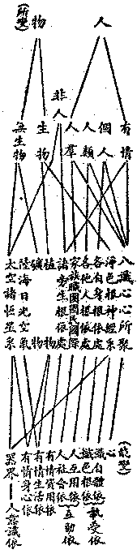

# 第三節　所知情器

## 目錄

- 一　所知情器概論
- 二　動植礦之關係與區別
- 三　人間情器與非人間情器
- 四　有情與器界之關係
- 五　人間之有情器界
- 六　人生世界之我與非我
- 七　現代之人生世界觀
- 八　太陽系之小三界
- 九　轉輪王界變遷史
- 十　大千界之大三界
- 十　一大千界之九地
- 十　二大千情器之所餘分類
- 十　三索訶界外之十方情器


## 一　所知情器概論

前者雖別論所知有情與所知器界，其實有情與器之世間相，密切關連，不能絕然分劃而說。雖於前二節中，亦曾說有情而及於器界，說器界而及於有情，猶有多分有情器界和合而現之事留待研述。且佛陀學中，雖分有情與無情之別，而草木諸生物，雖可合礦物統稱曰無情，然礦物無生而植為生物，其間亦不能不有皎然之區別。且近人進之亦有言植為有情同人者；退之亦有言人生亦無情同礦物者——若美國行為派取銷心理學者；或則宣言萬物皆為生物，有情無情不別——若德國赫克爾。此之三者，甲可擴充為心本論或唯心論；乙可擴充為物本論或唯物論；丙可擴充為生本論或唯生論。據其意，萬物祇有程度之高下，無性質之別異，則有情與器亦無可分別。然按驗之現實，礦物、植物、動物三者，固各有顯著之區別。動物能以音容表其苦樂之情，異於礦植，而特謂之有情；因謂植、礦曰無情物。植物能於死限前表其生態與表其死限後之死態，又與有情同能傳殖自類生種，異於礦物，與有情同謂之生物。礦物唯有與植、動共通之結散變化性，謂之無生死物。此固平允明顯，而無何隱祕難見者。依此分別，萬物應有四差別性：一、結散變化性，二、死限生殖性，三、永續統攝性，四、自覺進化性。僅有第一性者，則為礦質等無生物；有第一性、加有第二性者，則為植等生物；有第一第二性、加有第三性者，則為人生以下之旁生等有情；有第一第二第三性、加有第四性者，則為人生以上之人生等有情。雖至天生及大乘聖猶有不能一概論者，然就人界情器觀之，則秩然不可踰越也。有情之永續統攝性，與自覺進化性，皆以其各有之一切種識，及此識互依之意、意識等而言；以有此故，同為有情識者。人生之意識等較為發達，由意識而現人生之創造生活，故別說有一自覺進化性。旁生之意識等，較為昧劣，由異熟識受異熟之生活，故暫說無有自覺進化性；其實亦微有自覺進化之性也。由此有情與無情器之別，皎然應有。有情通於能變所變，無情唯是所變，如上言器由識變等。在無情物，植、礦之異，應更詳究。

## 二　動植礦之關係與區別

凡動植礦物，皆指其色聚以言。礦之色聚，指金、水等，別稱物質；植之色聚，指花、木等，別稱生物；動之色聚，指人、獸等，別稱「有色根身」。而其關係，統在能變現此諸色聚本質之一切種識——即異熟識——。器由異熟識共相種成熟力變，已如前說；有情有色根身，為頌中「執受」之一分——另一分即是一切種——。論亦釋云：『有根身者，謂異熟識不共相種成熟力故，變似色根——即眼、耳、鼻、舌、身中之神經系——、及根依處——即眼、耳、鼻、舌、身之血肉體——，即內——執受——大種及所造色』。又云：亦有以共相種成熟力故，於他身根、依處亦變似彼；否應無能受用他身。由此，人等雖死，所餘尸骸猶見相續。此說有情有色根身，有其二分：一分「五根細色神經」，唯以一切種識之不共相種變成造所造色，由我愛執藏識執為自體；一分皮臟骨血等根所依處，雖以一切種識之不共相種變成造所造色，由我愛執藏識執為自體，然亦由一切種識中自他有情共相種助，變成造所造色。故父母能生育子女，友侶之身亦能相為受用。且其死後，雖不執為自體，在他有情猶見尸骸續存——與他界同地有情共變器界故，於將壞時器界猶存理同——。由此有四分別：一、共共相種變，即前器界同處同地同受用者；二、共不共相種變，即前器界各類各個別受用者；三、不共共相種變，即此所言色根依處；四、不共不共相種變，即此所言五根神經。由此例之，在一切種識中，「相種」可分三類：一、共共相種曰共相種，礦物器界皆由此變；二、不共不共相種曰不共相種；三、別加一類共不共、不共共相種，植物應由此變。其有死限生殖同根依處，故不共共；然無我愛執藏識執以為自體，故共不共；合此二義，乃於一切種識中為植物闢一特殊位置。要之，色聚中有情無情之區別，由於我愛執藏識執受為自體與否——我愛執藏識，間接有末那關係。執受為自體，為有情色身；不執受為自體，為無情——礦、植、尸骸等。礦物、植物及根依處、淨色五根，其區別在一切種識中之「相種」不同：礦物，共相種變；植物及根依處，由共不共不共共相種變；五根淨色神經，由不共相種變。其遍通之關係，在於一切種識；其區別與連帶之關係，在能變之自種不同類、及藏識之有無執受。共不共不共共相種，亦持以各有情一切種識，隨共相種變成之處，此「種」亦變生植物耳。此礦、植、動三者之區別與關係，雖為人間之現實觀，亦此一空輪內五趣雜居地之現實觀也。不及或過，遂成物本論等。

## 三　人間情器與非人間情器

依人間情器之現實，於動、植、礦三者之區別與關係，應若前述。然在不及人生者之旁生以下，以「自覺進化性」極昧劣故，人類中嬰孩兒童亦近旁生故，多由異熟識受異熟之生活故，其所行動類機械故，於此習成其觀想力，遂謂人生及餘動植亦同礦物，悉為自然界因果力所支配之物故，立唯物論；而以礦物為本，初演化為植、動，進演為高等之動物，在演進為人生。然此祇見「結散變化」之礦、植、動共性，於生物「死限生殖」之特性，不無輕視；於動物及人「統攝永續」與「自覺進化」之特性，則更忽略不察。故於礦物為本之唯物論，於不及人生之生物立場，雖或可言，亦偏而不全矣。若在超過人生之天生等，所食、所用，皆可由身化生，不殊生物。至於四禪天，則所依器界亦隨身而存沒，殆猶人生之根依處，似可說依生物為本之唯生論；皆生物故，劣之則為動、植、礦物，勝之則為人天等故。然此可生三過：一、神生萬物論：執諸萬有皆神所生，成多神、一神等神教迷執。二、循環不息論：以生殖觀祖父子孫，形氣相續，在週期內循環變化，成循環論，所謂一陰一陽之道；恐形氣循環之有時斷滅，成不息論，所謂易不可見而乾坤毀。此為中國孔、老思想。三、輪迴解脫論：以死限觀前後今世身命相續，在異生類輪迴變化成輪迴論；厭身命輪迴而欲得超出，成解脫論。此為印度數論、耆那、小乘思想——數論、耆那，以存我故非真解脫；小乘以無我故得真解脫——。此三種論，亦皆有偏。至於登地菩薩，於後得智證阿賴耶，觀身器等皆心變現；後由得定自在，能隨心轉變身器等，固可以心為本說唯心論。然心但為所依能熏，由佛智觀，應為識中一切種之別別現行，現行互互增上，說一切種現之緣起。故唯心論，亦有未圓。且人間但知「獨散意識」之功用，以之而說唯心，或成自我唯心論，而但存自我；或成宇宙唯心論，而推本一神，歸之汎神，故亦有過。故依人間現實，於動、植、礦應分別說，乃是多元而非一元。極佛智境，以一切種起一切現，由一切現互互增上，亦為多元而非一元；種由現熏所生，復說無元。然則唯物、唯生、唯心論，皆不可成耶？而以別義，亦可成立。舉其總義，則「不離相攝」故，皆可隨宜以說「唯」言。謂「所知境」——客觀界——皆可名「物」，莫非所知境故，可名唯物，正名唯境論；從眾緣所生——有為法、所顯——無為法故，諸法莫非眾緣所生顯故，可名唯生——正名唯根論；一切所知不離於能知故，一切種依識熏持故，諸有為法皆所變故，諸無為法亦所現故，可名唯心——正名唯識論。然此所云物、生、心之三名，已非復前此礦物之物、植動之生、動人之心之義矣。故論人間情器，仍應用前礦、動、植三類之分別。

## 四　有情與器界之關係

有情與器界密切之關係，首為飲食。植物吸食於礦、光、氣而造成原生質。有情除飲水、光、氣等，更食植物所造之原生質，故有情之飲食，於植物為直接材料，而礦物亦為直接間接之材料。然此亦論欲界或太陽系或人間有情之飲食而已。佛言一切有情生命皆依飲食而得存在——一切有情皆依食住——，統三界有情言，分食為四：一者、段食：謂以有分量體段之食料，吸入有情身命流中，經過變化，消壞原狀，能為資益之事，謂之段食。所食質料，唯是繫屬欲界之香氣、滋味、及堅、溼、煖等觸塵；色之與聲，但為目睹、耳聞，不由變壞資益身命，故不屬段食攝。此唯欲界有情之食，若離此食，欲界有情即不能生存故。二者、觸食：此為「能觸」之觸心所接觸於境為相，三界有漏觸心所纔接觸於境，即能攝受可喜樂等境令根識怡適；資養根識勢力，故名為食。此觸心所雖與八識相應，然屬眼、耳、鼻、舌、身、意之六識觸心所，觸色、聲、香、味、觸、法六塵麤顯境，攝受喜樂及順益之捨受，資養根識之義勝故，由此說六觸身為食；所謂「人逢喜事精神爽」者是也。此食通於三界有情，然無想天無前六識，應無此食。三、意思食：此以心有希望為相，以思心所為體。謂三界有漏思心所與欲心所俱轉，於可愛境生希望故，能為資益身命之事；有希望則心身活動相續前進，無希望則心死而身亦死，故謂之食。然思心所雖遍八識莫不相應，唯第六意識能於未來境起勝希望，故祇說意識相應思為食，曰意思食；故無想天亦無此食。四者、識食：以能執持有情有色根身生命，令一期中相續存在為相。謂三界有情之有漏識，由前三食勢力增長，能為執持身命相續生存之事，故名為食。識言、雖通諸識，以前六識有時不相續故，而第七識有時亦轉其類性故，唯第八識是一類無覆無記性，隨所生界恆時相續，獨能執持有情身命於一期中令不壞斷。故此識食，專指阿陀那識為體。若無此食，住二無心定及無想天之有情身命，應即時死壞故。要之，「食」以資持有情身命令不斷壞為義，段、觸、思三，直接有關器界；識依前三增長勢力，間接亦有關於器界。

## 五　人間之有情器界

依上述區別與關係，關係中有區別，區別中有關係，情器重重，差別如表：




由人與物觀之，生物為溝通人與物之橋。自「根神經」至於植物，為生物者凡六；人占其四，故人亦屬於物而物亦屬於人。旁生又為溝通人與非人之橋，人生與旁生同為有情故。有情又為溝通「能變」「所變」之橋，有情通攝心與物故。旁生與人、正為有情；植、礦、日、星，正為器界；有情身心依故。自淨色根及根依處，為執受依，是個人自身故。他人之根依處及家國等、為人群互助依，人類社會所由成故。諸旁生根依處、為有情資用依，人與旁生互亦相資用故。植、礦、陸、海、光、氣，為人與諸旁生生活資具之所從出，故為有情之生活依。太空諸恆星系與人生活所資無何關係，然自淨色根以至太空諸星系，皆為人類意識之所知境，故為人意識依。觀此、可知人生世界為何狀矣。

## 六　人生世界之我與非我

常俗以自身謂之我，自身以外謂之非我。其實我與非我，但為人心之二概念，無固定之實體。猶如主觀、客觀二名，無一定之界域。主觀曰我，主觀有時而縮小或擴大；客觀非我，客觀有時亦擴大而縮小。其於現實雖同前此人生世界，而我與非我可有諸差別，今亦表之如下：


```
　　　　　　　　　　　　　　　　　　現知一剎那心───────我（主觀）
　　　　　　　　　　　　　　　　　　　　　　　　┌（數論等我）
　　　　非我────────────八識心心所聚┴我
　　　　　＼　　　　　　　　　　　　　　　　　　　＼
　　　　　非我───────────自淨色根依處──我（常俗所謂之我）
　　　　　　＼　　　　　　　　　　　　　　　　　　　＼
　　　　　　非我──────────家　　　　族───我
　　　　　　　＼　　　　　　　　　　　　　　　　　　　＼
　　　　　　　非我─────────職　　　　團────我
　　　　　　　　＼　　　　　　　　　　　　　　　　　　　＼
　　　　　　　　非我────────國　　　　民─────我
　　　　　　　　　＼　　　　　　　　　　　　　　　　　　　＼
　　　　　　　　　非我───────人　　　　類──────我
　　　　　　　　　　＼　　　　　　　　　　　　　　　　　　　＼
　　　　　　　　　　非我──────有　情　類────────我
　　　　　　　　　　　＼　　　　　　　　　　　　　　　　　　　＼
　　　　　　　　　　　非我─────生　物　類─────────我
　　　　　　　　　　　　＼　　　　　　　　　　　　　　　　　　　＼
　　　　　　　　　　　　非我────地　球　系──────────我
　　　　　　　　　　　　　＼　　　　　　　　　　　　　　　　　　　＼
　　　　　　　　　　　　　非我───日　球　系───────────我
　　　　　　　　　　　　　　　　　　　　　　　　│
　　　　（客觀）非我────────太陽諸恆星系┘
```


就人生世界為範圍，對觀我與非我：但為我者，唯是現知一剎那心，於現剎那唯能知故，此為我之最縮小者。但為非我，亦唯太空諸恆星系，但為能知之所知境，於人生活無資用故，此為非我最縮小者。餘十皆可通於我與非我。諸識心心所聚，在現剎那能知心上亦為所觀境故；自此至於太空，同為非我，此為非我最擴大者。現知一剎那心、亦屬八識心心所聚，故唯各人自識心聚為我；如數論等、主張眼、耳等根為神我用，同臥具等為色身用。人亦常言身是軀殼，為靈魂我主人所居舍宅，魂來宅造，乃有身生；魂去舍空，身歸死壞。故自身至太空，同為非我。至常俗之自身以內為我，自身以外為非我，則更俗情之常矣。有凡所為皆依家族而起，家族以內為我，外為我非，此亦俗情常有。有凡所為皆依職團而起，職團以內為我，外為非我，若工團主義者之國際工團等。有凡所為皆依國民而起，國民以內為我，外為非我，若主張「非我族類其心必異」之國家民族主義者。有凡所為皆依人類而起，人類以內為我，外為非我，諸人道主義者近之。有凡所為皆依地球上有情類而起，有情類內為我，外為非我。有凡所為皆依生物類或地球系或日球系而起者，生物類或地球系或日球系以內者為我，外為非我；此為我之最擴大者。今此人類雖似未能有此心境，然由人類以進超人，要非不能有之。若儒書所云盡人之性、盡物之性，以進於高明、博厚、悠久、廣大，與天地參其化育者，雖謂統日球系而為一大我，亦無不可也。明我與非我、但為概念上之一區別，唯是假名而無實體，則我非我之執情空，庶可進窺法界緣起無礙之現實矣。

## 七　現代之人生世界觀

依現代人類學者世間之心境，取其心境中之所有，以構成人生世界觀：物質精神化，發源於自然，自下而上昇，高至於國際歷史、迷信、魔術，為物質精神之混合；上達而歸極於佛陀。精神物質化，發源於佛陀，自上而下，降至低於魔術、迷信、歷史、國際，為精神物質之混合，下達而歸極於自然。世界而人生歟？人生而世界歟？以全世界之眾緣而集成人生，分析人生之眾緣而為全世界，此在有現代學者常識之人士，苟能平心靜氣以審察之，則此人生世界觀，固皆現實而無何詭奇也！

## 八　太陽系之小三界

佛陀學中所說三界，乃一大千界之三界，過於高廣，不能由人生界一躍即至於彼。故今準依經論所傳，別於一蘇迷盧系內，說小三界。此小三界，依統治者立名：一云、能天主界——即天神界——，三十三天之能天主，正統太陽系中天生、神生，兼統人生、旁生及餓生、苦生故。二云、琰摩王界——即地祇界——，正統餓生、苦生，兼統人生及旁生故。三云、轉輪王界——即人畜界——，正統地星、水星、金星、火星人類，兼統象、馬等旁生故。故能統治者之勝劣，故其次第如此。若依正被統治者言，由劣而勝：一、餓生、苦生界，居於水星、金星、地星之心或面，琰摩王建都於地星之腹而為統治。二、人生、旁生界，居於水星、金星、地星、火星之陸或海，轉輪王建都於地星，御飛輪巡行於水星、金星、火星等處而為統治。三、天生、神生界，居於日球、海王星、天王星、土星、木星、衛星、小行星等，能天主建都於日球，以四天王等處而為統治。

統餓生、苦生之琰摩王界，茲據眾傳繹其意云：餓生住處，一正，二邊。正、居此地球下五百踰繕那處，有城周匝數千踰繕那量，琰摩王統餓生居住其中；邊、居不定，山谷、空中、海邊皆有。有威福者，有妙宮殿——若人間諸神廟——，無威福者，或依糞穢、草木、塚墓、屏廁而住。據言大威德者，火星亦有，然此是神生類，乃空行、天行藥叉等，非餓生類。或說地球西有五百島城，半居有威福者，半居無威福者。傳有轉輪王儞彌者，嘗飛行遊觀之。梵名曰閉戾多——薜荔多——最初琰摩王名粃多，粃多界中所有曰閉戾多，形或似人，或亦似諸旁生，類皆飢虛畏怯，性極貪求飲食，故名餓生。苦生住處有三：一熱，二寒，三邊。熱苦器在地球中心，有八大獄，最苦者為第八阿鼻旨獄。此八、每一有十六小獄為眷屬，合有一百三十六所。寒苦器在地之邊際——即南北極——，或亦通水、金二星邊際，大者亦有八所。邊苦器無定處，或在山間，或在水間，或在曠野，此應通於水、金、地星三處。其受諸苦，或有主治，或無主治。大抵熱邊諸獄，輕者由琰摩王之所治罰，重者與諸寒獄業招其處，受自然苦。梵名曰那落迦，意譯苦器，唯受諸苦，故名苦生。兼管人、旁生者，蕭梁元嘉十年皇族文宣王家，設有亡母靈床，一日居一身長色赤而似人者，舉家駭傳，人競往觀；沙門僧含與之問答甚多，久之形隱，唯聞語聲。據云：此間有一女子，應在收捕，奉戒精勤，致稽時日。此床虛設，故權寄居。既為時眾目觀耳聞，應為事實。收捕於人，可知兼管人間事也。

統天生、神生之能天主界：四天王以千手天、持鬘天、常放逸天、星宿天為眷屬，統諸藥叉、龍等，朝能天主於忉利天善法堂中，各依方位面向能天主坐。能天主所都善見城，縱廣一萬踰繕那量，天主與眷屬居，諸寶嚴飾。城外更有歡喜、麤惡、雜車、雜亂諸游戲之園林池苑，諸天神等受樂其中。諸妙翅鳥、龍等神生，傳有寶宮殿園池等。鳥常食龍，然但能食由胎、卵、溼生者，而化生龍威德勝鳥。寶宮殿中奉佛經像，自在快樂，皆等天生。兼統人生等者，毗曇論云：是四天王，於善法堂，以人間等善惡奏聞能天主等。四天王等，每月分界巡行人世間等，次第觀察人等持戒、布施、修福德等，若多若少。善行者多，能天主等天眾歡樂；惡行若多，能天主等天眾憂惱。琰摩王等，亦受能天主之管轄。諸薜荔多有威德者，則服勞於四天王等。故能天主直接間接統治全太陽系諸有情器。世之神教，乃奉為人生世界之唯一真神、真父、真主，按之亦其福德較優人中轉輪聖王耳。

## 九　轉輪王界變遷史

據傳：統人生旁生之轉輪王界，由來已久。唯此地球變遷最繁，水、金二星亦有變遷，火星最為安定有常。而轉輪王雖統治四星、或三、二、一星不等，要皆宅生於此地球。此地球上，於減劫中人壽八萬歲時，各轉輪王御金輪寶飛行空中，統治地星、水星、金星、火星——人及旁生；四星皆可交通往來，持十善法，自行教他。六萬歲時，各轉輪王御銀輪寶，統治地、水、金星，交通往來。四萬歲時，各轉輪王御銅輪寶，統治地、水二星，交通往來。二萬歲時，各轉輪王御鐵輪寶，統治地星，交通全球。皆以十善，自行教他。人壽減至不及千歲，無復具大福德轉輪王出。雖有餘善流布人間，惡增苦滋，交通阻絕，分為各國，各治其族，猶如粟散，時有離合。傳轉輪王皆備七寶：一曰、輪寶，乃天然物。二曰、象寶，三曰、馬寶，此二屬於旁生。四、將軍寶，則為軍事部長；五、主藏寶，則為財政部長；六、典御寶，則為交通部長；七、善女寶，則為母儀后範；此四屬於人生。有此七寶，故能統攝人間之礦、植、動為資用也。現代人造飛機，亦鐵輪寶之流亞歟！然人類之善行不見增長，凡所作為，多由忿殺貪爭而為出發，戰鬥傷殘壓迫之苦，呼號奔走，無可寧息。證知近代工藝等雖大有增進，譬之落日回光，觀若絢爛，而益近於黯暗。故今猶在第九減劫之末，大多數人之惡趨勢，殆非少數善人之可挽回。然有心人亦不以此灰其志願，留此善種傳持不斷，自能上生天界，往生淨土。既可為此人間減盡轉增之遠勝緣，亦可為現時略略減惡增善之近勝緣也。故應益加奮勵，以諸善行，自修教他，化導人生。蓋此人間壽量，由減極而增之增劫已經八度，由增極而減之減劫今為九度之末；除初一度及最後度唯是由極長壽而減之外，中間須經十八度之減增。增減每經一度為一小劫，加初及後之二減劫，合為二十小劫，為此地球人生等類相續生存時量。今在第九減劫之末，譬之一人年未及半，正當盛壯之歲，雖暫病於衰弱，必能徐復康健，前途幸福猶無限量。擴此胸襟，云何不勉！他日海陸寬廓，河山平正，人壽物豐，金輪寶現，水、金、火星與地交通，慈氏龍華三會度人無量，吾今胡可不勤修勝行哉！火星交通之後，吾人亦得分享其樂。如云：俱盧洲人，入善體等河中沐浴遊戲，脫衣置岸，著時隨取，無有自他分別；乘諸寶船，優游快樂；諸樹出生衣服、瓔珞、甘果、瓊漿，隨意衣食；出諸樂器，歌舞彈唱，唯情所欲。全人間為一大公園，諸有情者聞之，當起歆慕！

## 十　大千界之大三界

統大千界即索訶世界以言之，佛陀學中最普通者，分說三界。前二界有形器，無色界無形器。無形器者即如虛空，遍於前二界中，故索訶界統稱三界。而此三界，亦為異生、外道種種有情器界最繁複者。他方諸有情器界之心境，或勝於此，則減少此中之惡趣；或劣於此，則減少此中之善趣；無有更增加於此索訶界之情境者，有之則唯超情之佛剎耳。故此三界，可代表一切有情器界之種種心境。三界向稱欲界、色界、及無色界，今為精密其分別之意義，兼用色、欲二字以為界別：一、有色有欲界，包括天趣及人趣等六趣異生；二、有色無欲界，包括四禪諸天；三、無欲無色界，包括無業果色諸天。色者、指諸物質以言，有色即有物質之身器者，無色即無物質之身器者。欲者、指塵欲言，於自身外所有之物，謂之曰塵，於塵有所貪欲——貪等相應之欲，不與貪等相應之善欲等，非此所云——，謂之塵欲；此塵欲，簡言之即為食色之欲——「欲界有情」乃以食色為性命，故云食色天性。要之、為風輪所軌持之魔羅天以下，即有陰陽之性，有陰陽之性即有食色之天性，有食色之天性即有貪著受用於自身外之五塵欲——色、聲、香、味、觸五塵。故有欲者，即是有此五塵貪欲，專就人事顯著者言，亦曰有於財、色、名、食、睡之五欲。既有物質之身器，復有五塵之貪欲，故曰有色有欲界也。初禪以上，雖有身器，然由業果化生，無有男女陰陽性別，而以禪悅滋養身心，亦不貪求身外色、香、味、觸之物為食；男女飲食之欲完全解脫，無此五塵貪欲，故謂之有色無欲界。無色界天，不但無五塵欲，亦無業果所生物質身器——色有二種：一、業果色，由異熟生；二、定果色，由禪定生，此有後者而無前者——，故謂之無欲無色界。凡佛陀學，初步、在離神、旁、餓、苦四生之雜惡業，成人天之善業，重在律學；次步、在離塵欲之業，成清淨之梵行，兼重律、禪二學；三步、在擇滅雜染之惑業，成淨善之聖行，修律、禪、慧三學，由此乃能度越三界，圓成出世間之聖果。三界為諸異生外道各別貪著之所，既為佛陀學者所對治之病患，亦為佛陀學者修歷中之過程，故應先了察之。否則、將舉步荊棘而無從措手；甚或隨情貪著，誤認異生外道之境而為聖證，終陷三界深坑，末由超出。此為佛陀學之重要關頭，習者當審擇焉！

## 十　一大千界之九地

前於所知有情節中，分六種生類之情器，詳於欲界而略於色無色二界，以此二界諸天合為天生類故。三界之分，上下等略。今分九地，則詳色無色界而略欲界，以欲界六趣并為一雜居地故。茲先列表再解釋之。


```
　　　　　　　　　捨　　　　　離　　　定　　　離　　　　　　　五
　　　　空無邊處地……………………………………………………………
　　　　　　　　　念　　　　　喜　　　生　　　生　　　　　　　趣
　　　　識無邊處地……………………………………………………………
　　　　　　　　　清　　　　　妙　　　喜　　　喜　　　　　　　雜
　　　　無所有處地……………………………………………………………
　　　　　　　　　淨　　　　　樂　　　樂　　　樂　　　　　　　居
　　　　非非想處地……………………………………………………………
　　　　　　　　　地　　　　　地　　　地　　　地　　　　　　　地
　　　　　　　　　︵　　　　　︵　　　︵　　　︵　　　　┌──┴───┐
　　　　　　　　　四　　　　　三　　　二　　　初　　　　│　　　　　　蘇
　　　　　　　　　禪　　　　　禪　　　禪　　　禪　　　　空　　　　　　迷
　　　　　　　　　系　　　　　系　　　系　　　系　　　　居　　　　　　盧
　　　　　　　　　︶　　　　　︶　　　︶　　　︶　　　　系　　　　　　系
　　　　┌────┴──┐　┌┴┐　┌┴┐　┌┴┐　　┌┴─┐　┌──┴──┐
　　　　色善善無無︵廣福無　無遍少　光無少　大梵梵　︵他化知時　忉四諸四諸諸諸
　　　　究現見熱煩無果生雲　量淨淨　淨量光　梵輔眾　魔化樂足分　利王神州旁餓苦
　　　　竟天天天天想天天天　淨天天　天光天　天天天　羅自天天天　天天生人生生生
　　　　天　　　│天　　　　天　　　　天　　　　　　天在　　　　　┌─┴─┐
　　　　└─┬─┘︶　　　　　　　　　　　　　　　　︶天　　　　（阿素洛彗星）
　　　　五聖居天
```


無色四地，以虛線表其遍於諸有色界中。上之八地，皆以禪定淺深而為分別。故加三乘聖者之滅盡定，謂「九次第定地」。此於佛陀學中有特須注意者：一、為違反初步佛陀學之彗星中阿素洛，二、為違反次步佛陀學之寄居他化自在天之魔羅天眾，三、為違反三步佛陀學之大梵天與寄居廣果天之無想天及無色四天。然有分別：一、違反不大而無抵抗行動者，二、違反較大而兼有歸順行動者，三、違反極大而無抵抗行動者，四、違反極大而兼有抵抗行動者。前之一類，即四無色界天，深耽空定而障聖慧，甚或迷為涅槃聖證，故有違反；然違反不大而絕無抵抗，故諸聖者修習禪定，亦遊寄之。次之一類，則為彗星之阿素洛與初禪之大梵天王，阿素洛好爭殺，率諸惡神、惡人、惡餓生等與日系諸天戰，違反佛之戒律；大梵天王自認及為他說是世界主及眾生父——能天主雖亦被低等神教奉為世界之主、眾生之父，然此為奉之者之過，非其自身之過；以其自認及為他說，唯視為以十善行果，為太陽系中諸有情類服務之一公僕耳，故與大梵天王不同——，違反佛陀眾緣所生法之慧學，生起以一不平等因為萬有本之一神教迷執，故有違反。然其違反亦不甚大，以阿素洛等雖有時違反太陽系中之公善律，有時亦能履行不違，非一切時違反。大梵自心亦不堅認為世界主及眾生父，但有時以憍心自勝，誑諸愚者令歸順已；如遇佛陀學之智者，亦時悔過稱謝。且阿素洛遇佛興世，既為擁護於佛之八部眾，大梵王亦與能天主同為請佛說法之歸信者，故三乘聖者皆攝化或寄生之。第三一類，乃無想天。此天存物質而滅心——其實物質不離心有，彼但伏滅前六識現行耳——，滅前六識，認此為究竟涅槃而修定，復由此定所得業果，執為究竟涅槃；此為絕滅虛無外道，迷執極深，極違佛之三乘聖慧。然以身若枯木而無反抗行動，故諸聖者唯叮嚀棄而遠之耳。第四一類，則魔羅天是也。此雖不定違反欲界有情之公善律，然定違反佛及梵等禪學。專以男女、飲食等五塵誘他人貪欲，繫有情於欲界，令不超出於此貪欲。隨生瞋等，亦多違反欲界公善，使淪墜旁生等，故於佛陀學之違反極大。且憑其力，時為擾害修超出三界之行者——但超欲界，彼意將來仍可退墮於欲界中，故猶不深擾害，唯以修佛陀學超三界者，遂為彼之大忌，觀比丘一曰怖魔可知也——。且於修聖行者證勝果時，以或誘或迫諸抵抗行動肆其妨阻。故諸聖者，每須示威降伏，乃能不為搖奪；故此獨為佛陀學之怨對，斥之曰「魔羅」——即怨害義——。吾人發願超出大千而遊歷大千者，不可不知此諸多國俗民情矣。

## 十　二大千情器之所餘分類

有情及器界之分別，前二節中言之已備。尚餘五種，茲且略陳：

甲、以識住識不住分別者：識者、認識，亦曰取著。住者、生已相續存在。有情生於此身器時，能起其認著識相續存在，則曰識住。此有七處，曰七識住：一、身異想亦異識住處：此包括欲界之人生、神生、天生及不在劫初之初禪三天，身則形狀勝劣以類而異，識想亦各認信有異。二、身異想一識住處：此包括劫初之初禪三天——大梵、梵輔、梵眾，身勝劣異，然在劫初同想認是大梵所生。三、身一想異識住處：此指二禪三天，各居自天不相往來，自天色身形量均一，然認識之思想不無差異。四、身一想一識住處：此指三禪三天，事一如前，更加認識之思想亦齊一。五、空無邊處識住處：捨有量色，取著無邊空。六、識無邊處識住處：捨所現空，取能現識。七、無所有處識住處：捨能現識，取無所有。餘若欲界旁生等三惡趣，識昧劣故不成識住；第四禪天及非非想處天，禪定深故，不起識住。此依認識論分別者。

乙、以有情樂居有情不樂居分別者：樂者、愛樂，居者、居住，生此身器愛居住者，則曰有情樂居。有九有情樂居，前七同前七識住處，皆是有情所樂居故；第八非想非非想處，第九無想天處，各有一類有情，迷為究竟涅槃安穩處故，旁生等三惡趣非所樂居，以多苦故；四禪九天亦非樂居，既捨樂受，又無迷為涅槃處故。此依情愛論分別者。

丙、以色想有無分別者：欲色二界有色，餘是無色。無想定天無想，非非想處天非有想無想，餘為有想。

丁、以尋伺有無分別者：尋者、發話之麤思慧，伺者、發語之細思慧。在語言時必有尋伺；不發語言，在定心時，定淺或有細發語伺，定深并無細發語伺。瑜伽論云：『此中欲界及色界初靜慮，除靜慮中若定若生，名有尋有伺地；即初靜慮中間若定若生，名無尋有伺地；從第二靜慮至餘有色界及無色界，名無尋無伺地』。此依常在禪定或不常在禪定以分別者。

戊、以諸有色之處，撮略分判，如瑜伽論，計五十四處。


```
　　　　　　　　　　┌八寒八處┐
　　　　那落迦十六處┤　　　　├孤獨等獄寄人間等不別立處
　　　　　　　　　　└八熱八處┘
　　　　閉戾多一處……即琰摩王處
　　　　　　　　┌四大洲四處
　　　　人十二處┤
　　　　　　　　└八小洲八處
　　　　阿素洛一處餘神生等及諸旁生人天同處不別立處
　　　　欲界天六處……即欲界六天為六處魔天寄他化天不別立處
　　　　色界天十八處……無想天寄廣果天不別立處
```


雖此五種之分別法，佛陀學中不甚通用，然亦不無特長之點，故今及之。

## 十　三索訶界外之十方情器

方無定位，且索訶界內萬億小世界，有萬億空、風、水、金輪及其所持情器；百萬中世界，亦有百萬空、風、水、金輪及其所持情器；千大世界，亦有千空、風、水、金輪及其所持情器。合成一大千界，有一空、風、水、金輪以持其所持。此空輪等持所持者，無一剎那不在旋轉！昔觀為東，今或為南西北四維上下；乃至今觀為下，後或為東南西北四維上；何有定向可言！然就人類常識，姑以日、地關係，假定方向：見日現處曰東，見日沒處曰西，面東背西，左曰南方，右曰北方；東南之間曰東南方，西南之間曰西南方，西北之間曰西北方，東北之間曰東北方，頂之所向曰上方，足之所向曰下方。由是推至索訶大千大空輪外，曰索訶東有某某等世界，乃至曰索訶下有某某等世界。其為器界，或眾寶成，或雜穢成，或光雲成；或但有雜惡趣有情，或但有人、天趣有情，或有陰陽性之男女，或由花或氣質化生，或兼有之略如此土，或為此土所難比知。佛陀所說大乘素怛纜中，其所列者難可詳舉；且多涉及超情佛剎，在情器中姑置存而不論，以論之亦無關所知之現實故。然各有情一切種識，隨其異熟——業報——成熟力故，變共相種作器世界，遍索訶界同等階地；各各器界，乃至索訶以外十方各各同等階地器界，皆識心現，不離心外。此依「現行」限在同等階地。若依種子，則下至苦生界，上至佛無漏界，一切種子識中皆備。瑜伽師地論云：『復次、此一切種子識，若般涅槃法者，一切種子皆悉具足，不般涅槃法者，便闕三種菩提種子。隨所生處自體之中，餘體種子皆悉隨逐。是故欲界自體中，亦有色界無色界種子；如是色界自體中，亦有欲界無色界種子；無色界自體中，亦有欲界色界一切種子』。種子者，識中潛在能力也。識中具備一切潛在能力，謂之一切種識。一一有情，各各有一一切種識，即各各具備能現起種種界地情器之潛在能力。依此一切種識以言，故一有情完具十方一切界地情器，橫盡十方，豎窮十界，皆不離於此識。若一有情如此，其餘一一有情莫不如此。潛具既然，現行亦然。能變之識既然，所變之相亦然。一攝一切，一入一切，一切入一，一切攝一，乃適符所知情器之現實。

