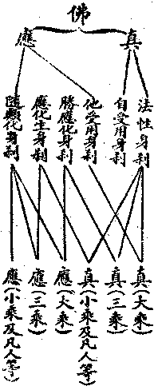
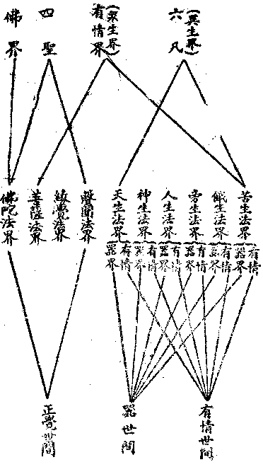

# 第四節　超情佛剎

## 目錄

- 一　超情佛剎概論
- 二　佛剎之分類
- 三　此大千界之應生佛史
- 四　地球之應化聖地
- 五　此小世界之勝應聖剎
- 六　大千界之勝應聖剎
- 七　索訶界外著名佛剎
- 八　索訶界外無數佛剎
- 九　情器及佛剎之十法界

## 一　超情佛剎概論

有情之情字，有三義：一者、愛情，隨所生體——異熟識及根身器界——繫愛曰情；此則阿羅漢、辟支佛、初地以上菩薩——取初地同阿羅漢義——及佛陀之四聖，皆曰超情，皆已超捨「我愛執藏」之能執所執故。二者、有「異熟識」謂之有情，阿羅漢至十地等覺猶未捨於異熟識故，皆曰有情；則超情者唯有佛陀。三者、諸有「識」者皆名有情，佛陀亦有四智相應之庵摩羅——無垢——等八識故，亦名有情，畢竟無超情者。瑜伽說六十二有情，佛陀亦在有情數故。故此所言超情，但依前二義言。超我愛執情曰超情，故此超情佛剎亦兼攝諸聖剎；超異熟識情曰超情，故此超情佛剎正指佛陀真應身剎。梵名剎多羅，譯土或世界，與前有情器界之器，字義相當。不過彼為譯名，此存梵音，以區示染淨之別耳。佛剎有真有應：真皆淨剎，唯聖智相應，淨識變緣故；應通淨穢，隨有情類淨染識所變，身器應現故。如釋迦牟尼索訶佛剎為穢剎，阿閦不動佛剎與阿彌陀安樂佛剎為淨剎等。此隨有情識邊以言，隨佛智則淨穢無定。例淨名經，舍利弗疑釋迦佛陀為菩薩時意豈不淨，而此佛剎乃不淨耶？佛告之言：「盲者不見日月，豈日月不明耶」？時大梵王語舍利弗：「我見此地球如自在天宮，勿謂不淨」。舍利弗言：「我今見此丘陵坑坎荊棘沙礫土石諸山，穢惡充滿」。梵言：「仁者心有高下，不依佛平等清淨心，故雖如自在天嚴淨，見此地球不淨；若依佛智，乃見此地亦淨」。時佛足指按地，此索訶界三千大千世界豁然通朗，百千萬億珍寶嚴飾，譬如寶莊嚴佛無量功德寶莊嚴剎。又法華於此剎，聯合餘剎，三次變為一大清淨剎等。至佛華嚴之華藏世界品，言此索訶界雖為普照十方熾然寶光明世界種中之一佛剎，然有十三佛剎微塵數世界所圍繞，且與十方無數佛剎互相聯絡，周遍無限虛空法界。釋迦牟尼雖為此地球史實上之人，然亦同時即為此索訶界百萬億太陽系中一行星上之歷史人生，且亦同時現身於百萬億忉利天及大梵天等處而說法。別名摩訶毗盧遮那——此譯遍一切處種種光明，或譯遍照，或譯大日，即釋迦牟尼名遍照，即索訶世界名華藏，則即此有情器界為超情之佛剎矣。淨穢鎔融，超絕情謂！

## 二　佛剎之分類

佛剎雖別真應，未能顯其幽致，通核諸大乘，可分三幹：法身、報身、化身。一、法性身剎或常寂光淨土。此又為三：一者、平等法性身剎：法者、一切現實事理義相，性者、常遍如是真相。瑜伽論云：云何法性？是諸緣起無始時來理成就性，是名法性。云何法住？如成就性以無顛倒文句安立，是名法住。由此法住以彼法性為因，是故說彼名為法界。故於平等法性身剎，又名平等法界身剎。此平等法性遍一切情器，皆名平等法性身剎。有情無情，是佛非佛，一切平等，無少差別；不生不滅，不一不異，不垢不淨，不增不減。依此故言：有情無情本來成佛。二者、分顯法性身剎：此有偏分、等分。小乘得生空智，所顯生空法性——小乘涅槃——，謂之偏分所顯法性；大乘初地以上菩薩得二空智，地地增進，分顯平等真如法性，謂之等分所顯法性。三者、圓顯法性身剎：佛正遍知，圓照一切，全顯平等法性。於上平等、分顯、圓顯法性雖無身剎之別，而得假說為法性身剎者，以一切法事相，依法真勝義性，即此諸法相性，假說為法性身剎故。二、受用身剎或實報莊嚴土：前法性身剎皆本來成就，由顯不顯或顯差別，說有三種。此受用身剎，則由因生起；因圓果滿，受用於果，謂之受用身剎。茲別為二：一者、唯自受用身剎：此唯佛陀之自受用，雖諸佛陀之自受用身剎皆周法界，非一非異；然此佛陀之自受用身剎，唯此佛陀變緣而自受用。彼彼佛陀亦復如是，各不雜亂。剎周法界，雖亦無有身剎之可區別，然庵摩羅識攝持為自體則得身名，身所依住則得剎名，故曰唯自受用身剎。二者、自他受用身剎：此有十重差別，即法雲地不可說不可說世界受用身剎，以至極喜地百大千世界受用身剎是也。此於十地菩薩，皆為地地自受用之勝果。然在佛陀，則為出其少分功德，隨他分量令他共為受用之身剎也，故曰自他受用身剎。三、應化身剎或凡聖同居土變化身剎。此為佛陀及大菩薩——地上菩薩亦能應化佛身相故——全隱自果受用功德，唯隨下地有情機感，應機化生身或剎等。此分三類：一者、勝應化身剎：應諸迴趣大乘之小乘聖、及大乘內凡位菩薩與諸天等，高大妙嚴，勝於人故。二者、應化生身剎：此如生贍部洲史實上之釋迦牟尼。三者、隨類化身剎：阿素洛見為阿素洛同類，龍見為龍同類，旁生見為旁生同類，餓生見為餓生同類；身剎受用類各相似。又一類中，隨其罪福深厚差別，感觀不同。此三總為應化身剎。真應重重，表之如上：

依佛而辨：法性身剎及唯佛自受用身剎為真身剎，畢竟無自無他、無說無聞；凡成法會及聞說法，皆應身剎。若依地上大乘菩薩而辨：他受用亦為真身剎；餘應身剎。若依地前三乘賢聖及諸天等而辨：勝應化亦為真身剎；餘應身剎。若依不發大乘心之小乘及凡人等而辨：應化生亦為真身剎；唯隨類化為應身剎。向來諸佛學者，不明此義，定執華嚴、大日等經所說毗盧遮那以為法身。中國佛徒，又以梵網戒經所說盧舍那佛，謂是報身。按此、則知華嚴、大日等之毗盧遮那，通於他受用及勝應化之身剎，乃大乘聖者與三乘賢聖及諸天等之所見者。依普賢——即金剛薩埵——等，則為十地之他受用。盧舍那即毗盧遮那，不過譯音稍為差異，謬執彼為法身，此為報身，尤極愚妄！按此戒經，據千華臺之盧舍那，即為以千佛剎為境之離垢地菩薩所見之他受用身剎，此為大乘之戒地故。千華上之千釋迦為勝應化佛身剎，一華為一大千界故。每華有百萬億釋迦，即為劣應化佛身剎，各以一贍部洲為所依故。知盧舍那為他受用，應知毗盧遮那亦為他受用佛，但諸天之所見，則當為勝應化身耳。若言報、化不離法身，則雖隨類化亦法身；無非法身，何得別指毗盧遮那以為法身？若言平等法性身剎，則雖牛溲馬勃亦為法身，何足據以為勝？妄談真言等經為法身說，是實不知法身一名之為何義者也。知此分判，千載疑雲應可披豁？

## 三　此大千界之應生佛史

據諸傳以會釋其義：此大千界——今曰索訶，然過、未、應別有名也——以五十五之火災劫，七水災劫，一風災劫，合為一風災劫——即一大千界一度之成住壞空——。過去一風災劫曰莊嚴劫，現在一風災劫則曰賢劫；未來一風災劫曰星宿劫。每一風災劫有千佛應生其中。莊嚴劫中千佛，華光佛為首，而毗婆尸佛、尸棄佛、毗舍浮佛為末。毗婆尸佛距今已九十一火災劫，尸棄佛與毗舍浮佛距今已有三十一火災劫。毗婆尸佛至尸棄佛之間，有六十火災劫無佛應世；而毗婆尸佛前之十餘火災劫，則有九百九十四佛應世。此賢劫中千佛，拘留孫佛為首，第二名拘那含牟尼佛，第三名迦葉佛，第四即釋迦牟尼佛，第五即未來彌勒佛，皆出興於此一火災劫中；最後名樓至佛。由毗舍浮佛至拘留孫佛，於莊嚴劫賢劫過渡之間，亦有三十火災劫中無佛應世。此一火災劫中，於住劫之二十小劫前八小劫，於某小劫此地球中人壽五萬歲時，應生拘留孫佛；於某小劫此地球中人壽四萬歲時，應生拘那含牟尼佛；於某小劫人壽二萬歲時，有迦葉佛應生；今第九小劫，人壽百歲時乃應生釋迦牟尼佛。毗婆尸佛至釋迦佛，佛傳上最有名之七佛也。後第十小劫人壽八萬歲，乃應生彌勒佛。於彌勒後十小劫中，尚有何佛應生，則無確傳。總之，於此賢劫風災劫中，猶有九百九十五佛應生。後一風災劫曰星宿劫者，千佛以日光佛為首，末曰須彌相佛。雖一風災劫中各有千佛，於每一風災劫之四十九火災劫中，若干劫中或無佛出，或某劫中有多佛出，亦無定准。前諸佛陀學者，未能確知若莊嚴劫等是名一風災劫量者，故於諸佛興世相距劫量，是火災劫之一大劫，或住劫中之一小劫，不能會通決諸疑滯。知大千界應依一風災劫而說，則所謂過去莊嚴劫千佛，現為賢劫千佛，未來星宿劫千佛者，為此一大千界之三千應生佛史，斯可知矣。

## 四　地球之應化聖地

今言聖地，以超我愛執藏之情，通諸三乘聖者之地而說。據傳釋迦牟尼趺坐成佛之菩提場，為大千之中心。故此大千界中過現未諸佛，皆於此成佛，則印度之菩提場，應為此一住劫中諸佛共同聖地。法華經言：我此靈鷲，聖眾充滿，劫火燒然，亦常安穩。則靈鷲山應為釋迦聖地。華嚴經言：東方有仙人山，有金剛勝菩薩與三百眾住中說法；南方有勝峰山，有法慧菩薩與五百菩薩住中說法；西方金剛燄山，有精進無畏行菩薩與三百眾住中說法；北方有香積山，有香象菩薩與三千菩薩住中說法；東北方有清涼山，曼殊室利菩薩與萬菩薩俱住中說法——中國傳即五台山也——；海中有金剛山，法起菩薩與千二百菩薩住中說法；東南方有支提山，天冠菩薩與千眾俱住中說法——傳即天台山——；西北方光明山，有賢勝菩薩與三千眾俱住中說法；西北方香風山，有香光菩薩與五千眾俱住中說法。大海中莊嚴窟，有諸菩薩住中；毗舍離南善住根處，俱珍那城有法座處，清淨彼岸城目真鄰陀窟，摩蘭陀國有無礙龍王建立處，甘菩遮國出生慈處，震旦國有那羅延窟——傳即勞山——，疏勒國牛頭山，迦葉彌羅國次第處，增長歡喜城尊處窟，菴浮梨摩國億藏光明處，乾陀羅國苫婆羅窟，各各有諸菩薩住中說法。又相傳南海邊有普陀洛伽山，是觀自在菩薩之應居處——中國傳即舟山群島中普陀島——。又傳雞足山為大迦葉尊者入定俟彌勒佛處——中國傳即雲南之雞足山——。又傳天台方廣為五百阿羅漢住處。中國俗傳，又以安徽之九華山為地藏菩薩處，四川之峨眉山為普賢菩薩處，與清涼山及普陀山為四聖地。他若玄奘西域記等所傳諸國，佛之聖地難以枚舉。西藏佛徒傳有「香拔喇」者，人至其處，現身成聖，或即喜馬拉耶山頂無熱惱池。於一微塵現寶王剎，此皆地球上之超情佛剎，與聖感通則睹聖境，否則人情但知人境，雖歷其處而不睹也。

## 五　此小世界之勝應聖剎

彌勒上生經說：彌勒先於波羅奈國、劫波利村、波婆利大婆羅門家中生，卻後十二年二月十五日，還本生處人間命終——按彌勒與曼殊室利，同為釋迦牟尼時之歷史人物，諸大乘經多由結集——。時知足天七寶臺內——按即內院——師子座上忽然化生，身長十六踰繕那量，具足三十二相、八十種好，寶冠嚴首、眉間放光，無量化佛、化菩薩眾以為侍者——故為勝應身相——。常說不退轉地法輪之行，令諸生其處者皆不退轉無上菩提。過地球歲數五十六億年，乃來應生於贍部洲成佛。又言：知足天之內院聖剎，乃由其天五百萬億修施度之天眾，為供養一生補處菩薩故，以天福力變化而成。牢度跋提造善法堂，種種莊嚴妙飾，勝過欲界諸天之所居處。天女圍繞，華香散布。攝人生等上生內院。此地球中釋迦佛法之信崇者，持戒習禪，持大乘法，雖未得成聖果，若能稱彌勒名，念其形像，命終即得上品上生。其次、諸佛徒眾，聞彌勒名恭敬禮拜，歡喜讚歎，恆無間歇，命終亦得中品上生。其次、大地人眾，雖或無知造諸罪業，後聞彌勒佛名禮拜懺悔，供養稱念，命終亦得下品上生。故釋迦云：彌勒於將來世，當為此人間有情作大歸依處；若歸依彌勒者，即於無上菩提得不退轉，昔嘗序此經云：

夫知有無上菩提，又知有已得垂得此無上菩提者，復知自他有情皆有能得此無上菩提之因性，且嘗自期於必得之者！顧人命在呼吸間，一旦無常，即成隔世也。若於生死猶未自在，非藉佛菩薩攝持之力，則於所志之事，諸趣流轉，昧忘可虞，故須急「欣淨剎」、「親上聖」之務。否則上無以圓大覺，下無以濟含識，近無以淨一心，遠無以事諸佛，不亦唐功寡效乎！然十方佛剎雖有緣者皆得生，而凡在蒙蔽，罔知擇趨。惟慈氏——即彌勒——為一生補處菩薩，法爾須成熟當界有情，故於釋尊遺教中曾持十善、受三皈、稱一名者，如次皆於彌勒佛三會聞法。而在吾人既聞釋尊遺教，即為已與慈氏尊有緣，可求上生內院，以親近之矣。況慈氏應居知足內院，與吾人同界——欲界——，同剎——索訶世界——，而三品之生因，行之匪艱，寧不較往生他佛剎為易乎！一經上生，皆即聞法，不退大菩提，與往生他剎猶滯相凡小者，殊勝敻然矣！故斯經實為吾人一生成就不退佛果之祕要，曾發無上菩提心者，不可不奉持以蘄向焉！

此小世界之勝應佛剎，實為由人間入佛剎之一捷徑。然非彌勒菩薩之所攝持，則雖知足天眾亦同處而不得相見。傳玄奘大師等皆生其處，吾人當知所歆往也！

## 六　大千界之勝應聖剎

華嚴經等，說初地至十地菩薩為成熟諸人天等故，應生為人間轉輪王，及忉利天、時分天、知足天、化樂天、他化天，與大梵天、光淨天、無量淨天、色究竟天天王。雖復示同人天，而其出世間之勝福莊嚴身剎，亦唯能修大乘行者乃相得知。又第四禪無煩天、無熱天、善見天、善現天、色究竟天，唯證阿那含等聖果——阿羅漢迴心、大乘報身亦居其處——之聖眾等所居，名五淨居。雖同在四禪之廣果天等，聖凡界異，亦但欽聞而不得相親近。又瑜伽說：復有超過五淨宮地，有大自在住處，十地菩薩由極熏修第十地故，得生其中。此對天眾為勝應化身剎，菩薩自住亦通受用身剎。如說：菩薩入十地時，淨居天頂忽然出生大寶蓮華，量等百萬大千世界，超過一切世間妙莊嚴，出世善根之所生起，眾寶為藏，寶網彌覆，無數蓮花以為眷屬；菩薩身相稱此華座，為十方來九地以下菩薩說法。放諸光雲遍十方界，出供養具供養諸佛，諸佛亦放智光灌此菩薩之頂。十方諸同十地菩薩，互放光照，增長定慧。其後十地行圓滿時，亦即於此成等正覺。然未成佛之前，身剎雖廣，猶有限量；至成佛時超諸限量，乃成等法界、虛空界之自受用身剎。故經論說真身佛乃於淨居天界示現成佛，未成佛前其異熟識所變身器，未有不屬三界攝者。除佛、若說於三界外別有有情界者，是仁王般若等遮為外道說故——依異熟識屬三界攝；若依妙觀察智、平等性智相應心品，超過三界——。故十地菩薩之聖剎，亦為四禪淨居天攝，外現色究竟天天王勝應化身，內即為十地菩薩故。內聖外王：王隨俗故，王一大千；聖應真故，住百萬億阿僧祇剎。

## 七　索訶界外著名佛剎

依佛說阿彌陀經云：從是西方過十萬億佛剎，有世界曰極樂，有佛號阿彌陀，今現在彼說法。其剎無有眾苦，但受諸樂，故名極樂。七寶欄楯、羅網、行樹圍繞，七寶池八功德水中，青黃赤白光色蓮花，大如車輪。黃金為地。常作天樂，雨眾天華，微妙香潔。遊十方剎，供養諸佛。由佛化生種種奇妙雜色之鳥，與風動、水流、樹林、羅網等演說菩提分法。阿彌陀者，即無量光及無量壽，常以光明照十方剎；成佛以來已經十劫，將來壽命猶無量故。復次、人天大眾及佛弟子，諸阿羅漢與菩薩等，亦無量故。其剎無三惡趣，無惡趣名。諸上善人俱會一處，皆是不退轉地，多有一生補處菩薩。故此處有情，聞者應發願往生彼剎。然非少善根福德因緣可往生彼剎。若能稱念彼佛名號一日以至七日，一心不亂，命終即得往生。又依觀無量壽經及佛說無量壽經，往生分為九品，皆是蓮花化生。然花開見佛、聞法、得果有遲早：最下品生，須經十劫，花中悔罪，乃得花開見佛；最上品生，於彈指頃即得見佛聞法。

此阿彌陀淨剎，於華嚴、法華、楞伽等摩訶衍乘，廣為讚揚，諸國佛徒亦廣奉行，龍猛諸師於諸論中亦皆稱述。然專說者，則在三經一論。經已前引，論即世親造往生淨土論。由此淨剎，信求往生者多起諸分別：或言必至初地菩薩乃可往生，或言五逆十惡十念成就、皆可往生；或言此為受用身剎，或言此為應化身剎；或云佛大悲願、方便攝受十方有情不可思議身剎。今取往生論意，略為決擇：凡言淨剎，有純淨者，即真佛剎，唯在佛果，為佛法性身剎及自受用身剎。次淨增者，八地以上；次半淨者，初地以上；為佛菩薩自他受用身剎。次少淨者，大乘賢位及二乘聖，為勝應化身剎；次微淨者，為應化生身剎。此阿彌陀淨剎通攝五種，而往生者所生在後三種。上三品生，見佛聞法即登初地，為初地以上半淨剎；中三品生，為三乘賢聖少淨剎，亦有諸聲聞弟子故；下三品生，為人天外凡微淨剎，亦有人天等故。且依鼓音王經：其城縱廣十千由旬，於中充滿剎帝利種。阿彌陀佛父名月上轉輪聖王，其母名曰殊勝妙顏，子名月明，奉事弟子名無垢稱，智慧弟子名曰賢光，神足精勤弟子名曰大化，魔王名曰無勝；所言不異應生佛故。由上品生，故言初地乃可往生，此應為受用身佛剎，如十六觀中所說報身相。中下品生，故十念成皆得往生，為應化身佛剎，如鼓音王經說。佛隨多級有情所宜而現，故應說為佛大悲願方便攝受十方有情不可思議身剎。下至五無間逆有情，上至十地之覺有情，皆以佛果大悲願力，現為隨分所宜淨土而攝受之。依佛果現，故皆純淨；依有情現，故隨分淨，由此經論說有多異。然以華嚴經意，則以阿彌陀剎為隨初地菩薩所現受用身剎，故較量諸佛剎時劫，說索訶界一劫為極樂界一日，極樂一劫又僅等於金剛佛剎一日——二地淨剎——，可比知其為初地淨剎矣。故願往生真極樂剎，亦須精進，廣集地前多福德善根為因緣，不能以懈怠心即希冀也！

又藥師琉璃光如來本願功德經云：東方去此過十殑伽沙等佛剎，有藥師琉璃光佛淨琉璃剎。昔行菩薩行時，發十二願修佛淨剎，攝化有情；今現成就佛之淨剎，功德莊嚴，說不能盡，如極樂剎無有差異。無有女人，無三惡趣及苦音聲。有日光遍照、月光遍照二菩薩，為無量無數菩薩眾之上首。此方有情，皆可發願往生彼剎。雖慳貪不施、暴惡不善、嫉妒毀他、妄言害眾之有情，聞彼佛剎名號能信奉者，亦能轉惡為善，捨於罪報而得人天福報，往生於彼。又雖持戒修善願生極樂，未決定前，臨欲命終，若聞彼佛名號亦得往生其剎；或生人天增長福善，決不更受三惡趣身及女人身。又其佛依本行願力，若齋潔身心供養奉持者，能使各人現身得遂種種所求，尤能延壽、免脫災橫。諸國民族有眾災難，人生亦有九種橫死，三業恭敬於彼佛者，皆得救脫，增加種種現身幸福，於當來世生於彼剎或生人天，受諸快樂。此藥師淨剎與阿彌陀剎嚴淨無異，其特殊處，在令信崇者於現身生長福善，脫離罪惡苦難，故又可謂為能增上現生安樂之淨剎也。

## 八　索訶界外無數佛剎

前已舉索訶界外阿彌陀剎及藥師琉璃光剎，此為佛教最名稱普聞之二剎。他若顯密諸經所說，東方阿閦佛剎，南方寶勝佛剎，北方成就佛剎，上方香積佛剎等無數剎；與法華等所說過去未來無數佛剎，今概不論，而依華嚴示其大略。華藏世界品說：最中央有無邊妙華光香水海，其「世界種」名普照十方熾然寶光明；分二十重，第十三重最中央即毗盧遮那索訶世界，有十三佛剎微塵數世界圍繞；其下為超釋梵佛光明照耀剎，有十二佛剎微塵數世界圍繞；又其下為無量功德法佛之恆出現帝青寶光明剎，又其下為一切法海最勝王佛金剛幢剎，又其下為清淨月光明相無能摧伏佛出妙音聲剎，又其下為廣大名稱智海藏佛出生威力地剎，又其下為歡喜海功德名稱自在光佛眾華焰莊嚴剎，又其下為普光自在幢佛之淨妙光明剎，又其下為香光喜力海佛普放妙華光剎，又其下為金剛光明無量精進力善出現佛種種光明華莊嚴剎，又其下為淨光智勝幢佛一切寶莊嚴普照光剎，又其下為師子光勝照佛種種香蓮華妙莊嚴剎，其最下為淨眼離垢燈佛最勝光遍照剎；如次有十一佛剎、至一佛剎微塵數世界圍繞。索訶世界上為遍法界勝音佛寂靜離塵光剎，又其上為不可摧伏力普照幢佛之眾妙光明燈剎，又其上為清淨日功德眼佛之清淨光遍照剎，又其上為無礙智光明遍照十方佛之寶莊嚴藏剎，又其上為無量方便最勝幢佛之離塵剎，又其上為普照法界虛空光佛清淨光普照剎，其最上為福德相光明佛妙寶焰剎；如次以十四佛剎、至二十佛剎微塵世界圍繞。此雖僅二十剎，然每剎十方面有微塵數世界圍繞，則其剎數已無可量。

加以無邊妙華光香海水之東，又有離垢焰藏香水海遍照剎旋世界種，亦有二十重主剎，與一佛剎至二十佛剎微塵數世界之圍繞。其南又有無盡光明輪香水海之佛幢莊嚴世界種，其右旋有金剛寶焰光香水海、佛光莊嚴藏世界種，其右旋有帝青寶莊嚴香水海之光照十方世界種，其右旋有蓮華因陀羅網香水海之普現十方影世界種，其右旋有金剛輪莊嚴底香水海之妙寶間錯因陀羅網世界種，其右旋有積集寶香藏香水海之一切威德莊嚴世界種，其右旋有寶莊嚴香水海、普無垢世界種，其右旋有金剛寶聚香水海之法界行世界種，其右旋有天城寶堞香水海、燈焰光明世界種。離垢焰藏香水海外方面，又有變化微妙身香水海善布差別方世界種等若干香水海與世界種；無盡光明輪香水海外方面，又有具足妙光香水海之遍無垢世界種等；金剛寶焰光香水海外方面，又有一切莊嚴具瑩飾幢香水海、清淨行莊嚴世界種等；帝青寶莊嚴香水海外方面，又有阿修羅宮殿香水海、香水光所持世界種等；金剛輪莊嚴底香水海外方面，又有化現蓮花處香水海與國土平正世界種等；蓮華因陀羅網香水海外方面，又有銀蓮花妙莊嚴香水海、普遍行世界種等；積集寶香藏香水海外方面，又有一切寶光明遍照香水海、無垢稱莊嚴世界種等；寶莊嚴香水海外方面，又有持須彌光明藏香水海、出生廣大雲世界種等；金剛寶聚香水海外方面，又有崇飾寶埤堄香水海、秀出寶幢世界種等；天寶堞城香水海外方面，又有焰輪赫弈光香水海、不可說種種莊嚴世界種等。此各各香水海中世界種，所有主剎及圍繞剎，略與無邊妙華光香水海中世界種相等。故如「毗盧遮那佛索訶剎」者之佛剎，其數之多殆難計算。其中情器之形狀、體性、方位、時量等種種差別，亦難稱量。非初地以上之大乘智，不能通達也。

## 九　情器及佛剎之十法界

超情佛剎中之應化身剎，依有情器界而現應化故，通六類之情器故；由此乃合超情之四聖身剎、及六凡情器，曰十法界。十法界者，十類身心器界之總稱也。從緣所生身心器界及彼由起之緣，統謂之法；十類界別，別謂之界。從緣所生身心器界，茲表於下：

普通為六凡、四聖之分別；天台家有時為眾生界、佛界之分別；賢首家有時為有情世間、器世間、正覺世間之三種分別。又諸經論祇說世間為有情世間及器世間之二種，則有時或專從異生界說，有時亦通有情界說，以依異熟識皆三界攝故；有時亦通佛陀界說，佛亦六十二有情類攝故。身心器界由起之緣，即五蘊唯識諸法等。故天台家依此分別，說緣所生身心、曰眾生一千——眾生指有情言——，說緣所生器界、曰國土——國土即器界——一千，說彼由起之緣法、曰五蘊一千。謂十法界一起九伏，一主九伴，故每一界攝餘九界。十十成百，百中一一各備法華所說「如是相、性、體、力、作、因、緣、果、報、本末究竟等」十如是，故各為一千也。三千在種——彼云在性——皆名理具，三千現行——彼云從緣——皆名事造，故又說為理具、事造兩重三千，總攝之則唯十法界而已。故十法界為有情器界、超情佛剎之總攝，亦為真現實論者所知成事之總攝。

