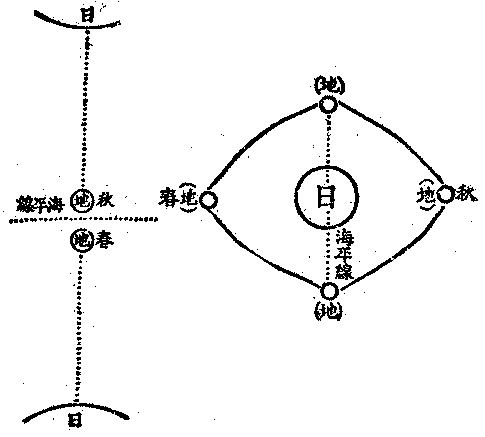

# 第五節　所知成事評判

## 目錄

- 一　所知成事評判緒言
- 二　有情托胎識問題
- 三　有情中有身問題
- 四　有情之心理問題
- 五　器界之蘇迷盧等問題
- 六　情器之生命由來問題
- 七　超情佛剎之餘義


## 一　所知成事評判緒言

前之四節，對于所知現實成事，已略說竟。然所陳者，不惟語超常俗，亦時有違學者世間之所思議，故於此所知之現實成事，頗多伏疑，猶待推決。蓋依比量而談，雖若可通，而按之實驗之現量，間難徵信；則比量言，亦成虛設。若云佛陀之至教量，皆從真現量所出之真比量教為所依準，然按所言，與向來流傳之佛說，時亦不無牴牾之處。由此違學者所知故，違常俗學者之現量或比量故，亦違真現實論者所依佛陀之至教量故；則前四節中陳說之所知現實成事，其大部分雖可憑信，猶有其餘生問題處，須更恣為研擇，詳求解決。於此若非加以評判，則前汎引之說，不等於天啟之神話，亦應類獨斷之玄談，此非真現實論者之所應為也。是故於所知之現實成事，隨有疑難之處，再通釋之。

## 二　有情托胎識問題

前說人之得生有托胎識，於是生理學者生問題曰：依佛陀學，人身之生雖賴父母精卵成胎，尤仗有投托於胎之業識，乃能生長；然近世生物學者實驗之所知，則人身者、實由父精中之精蟲，有一或二之強力者先佔入母之卵珠中，由此一精蟲為主體？藉卵珠為營養而得成胎者也。此佛陀學與科學實驗所知者之相違處，其將何理以通，夫托胎識不明，則有情以身生始有，身滅即無，則無前身，亦無後身，三世流轉之業果義，何自安立？於此問題，若無一正當之解決，不惟不足以通生物學者之難，而佛陀學將根本搖動矣。故必明托胎識，乃明業識與父精、母卵同為構成胎之三要素。故業識不從父精、母卵有，不從胎有。業識雖剎那生滅，而無始相續恆有，新新不停，如急水流，有之無始，故亦無終。而此識暫托胎生人類身，應有前身，亦有後身。世間一切有情色身，得生所從，約為胎、卵、溼、化四種形式，已如上述；而各有識托中，以為主力。此四生中，人以胎生為主，生理學亦多就人身研究，故今當就人類托胎識以明之。先取生物學家胎生學中可懷疑點，試從詰之：男精中有精蟲，女精中有卵珠，此誠易為試驗之事，按佛陀學尤有左證。如治禪病祕要經云：

子藏者，在生藏下，熟藏之上，九十九重膜如死猪胞。四百四脈從於子藏，猶如樹柢散布諸根，如盛屎囊。一千九百節如芭蕉葉，八萬戶蟲圍繞周匝。四百四脈及以子藏，猶如馬腸，直至產門，如臂釧形團圓大小，上圓下尖，狀如貝齒。九十九重，一一重間有四百四蟲，一一蟲有十二頭、十二口。人飲水時，水精入脈，布散諸蟲，入毗盧蟲頂，直至產門；半月半月出不淨水，諸蟲各吐，猶如敗膿；入九十蟲口中，從十二蟲六竅中出，如敗絳汁。復有諸蟲細於秋毫，遊戲其中。諸男子等宿惡業故，四百四脈，從眼根散四肢，流注諸膓，至生藏下、熟藏之上。肺、脾、腎脈，於其兩邊，各有六十四蟲，各十二頭，亦十二口，宛綣相著，狀如指環；盛青色膿，如野猪精，臭惡巨甚。至藏陰處，分為三支，二支在上如芭蕉葉，有一千二百脈，一一脈中生於風蟲，細若秋毫，似毗蘭陀鳥觜。諸蟲中有生筋色蟲，此蟲形體如筋，連持子藏，能動諸脈，吸精出入；男蟲青白，女蟲黃赤，七萬八千共相纏裹，狀如累環，似瞿師鳥眼。九十八脈上衝於心，乃至頂髻——腦——。諸男子等眼觸於色，風動心根，四百四脈為風所使，動轉不停——腦筋——。八萬戶蟲一時張口，眼出諸膿，流注諸脈，乃至蟲頂；諸蟲崩動，狂無所知，觸前女根。男精青白，是諸蟲淚；女精黃赤，是諸蟲膿。

又如正法念處經云：

十種蟲，有行於髓中——腦筋蟲——，有行精中——生殖蟲——。何等為十？一名毛蟲，二名黑蟲，三名無力蟲，四名大痛蟲，五名煩悶蟲，六名火蟲，七名滑蟲，八名下流蟲，九名起身根蟲，十名憶念歡喜蟲。

按所謂筋色蟲，在男青白者即精蟲，在女黃赤者即卵珠。復云：有行於精中者，第九曰起身根蟲。起身根蟲者，或言男根由此蟲故起，或言所生胎中色根由此生起。此起身根蟲指精蟲言，事尤明確。故胎生學所言人胎由男精蟲及女卵珠以成，及精蟲卵珠之有諸情態，可為佛陀學之明證，而初無所違也。然吾於胎生學中「由一精蟲佔一卵珠以成胎」之說，彼固從何徵驗以得其實，則極懷疑者也！夫適當男女和合以成胎之際，男女二人之自身既無從察驗，此男女二人外之他人亦無從察驗。若於後時取其既成胎者為驗，則但得既成之胎狀，至當時如何構成此胎之情狀，終不明了。若但依男精用顯微鏡所顯之蟲相，即推定但由一蟲佔入卵珠以成胎，斯則惟是臆決之談，非徵驗之實也。由諸蟲凝聚成男精，何以知不由諸蟲凝聚之精和合女卵以成胎身，乃必由精蟲聚中之一蟲獨佔卵珠以成胎乎？又何以知置空氣或溫水中之男精所現蟲之情狀，非入空氣及溫水後轉變而起之游離狀？既非在男身中時之本狀，亦非和合女卵轉變成胎時之狀乎？故科學徵驗之所知，乃只知精中之有蟲而已，過此限度以外，則虛謬之推想，不得冒充為實驗科學也。但胎生學者所以計由一精蟲獨成胎者，殆由見精中有蟲，又見精中諸蟲互相聚散殺活之情狀，復計多蟲生命不應合為一人胎生命，遂推想由精蟲聚中一強有力之蟲，將餘蟲排殺後，獨佔胚珠以化成人胎耶？信然者，則人之身命，實由父精中之一蟲繼續長養而成，人者不過一精蟲之擴充，絕非一新生之生命；固不容有托胎識，亦非父母精血和合所成，乃適為怪談矣！意彼謬想，必由計一身命由一身命進展而來，故計人由精中一蟲變化。此由執著「個體」為實——薩迦耶見——，不知細至一蟲，粗至一人，皆和合之聚耳。夫人身乃一蟲聚也，男精、女精亦蟲聚也，何因不許人胎亦為一蟲聚，而定由一蟲以成哉？

瑜伽師地論云：

又於餘鬼、傍生、人等，及欲、色界天眾同分中將受生處，見己同類可意有情，由此與彼起其欣欲，即往生處，便被拘礙。死生道理，如前應知。

彼即於中有處，自見與己同類有情為嬉戲等，於所生處起希趣欲，彼於爾時，見其父母共行邪行所出精血而起貪愛，若當欲為女、彼即於父起貪，若當欲為男、彼即於母起貪亦爾；乃往逼趣，若女於母欲其遠去，若男於父心亦復爾。生此欲已，或唯見父，或唯見母，如是漸近彼之處所。如是如是，漸漸不見父母餘分，唯見男女根門，即於此處便被拘礙。死生道理，如是應知。若薄福者當生下賤家，彼於死時及入胎時，便聞種種紛亂之聲，及妄見入於叢林竹葦蘆荻等中；若多福者當生尊貴家，彼於爾時聞有寂靜美妙可意音聲，及自妄見昇宮殿等可意相現。爾時父母貪愛俱極，最後決定各出一滴濃厚精血，二滴和合，住母胎中，合為一段，猶如熟乳凝結之時；當於此處，一切種子異熟所攝執受所依阿賴耶識和合依托。云何和合依托？謂此所出濃厚精血，合成一段，與顛倒緣中有俱滅，與滅同時即由一切種子識功能力故，有餘微細根及大種和合而生，及餘有根同分精血和合搏生。於此時中，說識已住結生相續，即此名為羯羅藍位。此羯羅藍中有諸根大種，唯與身根及根所依處大種俱生；即由此身根俱生諸根大種力故，眼等諸根次第當生。又由此身根俱生根所依處大種力故，諸根依處次第當生。由彼諸根及所依處具足生故，名得圓滿依止成就。又此羯羅藍色，與心心所——業識——安危共同，故名依托。由心心所依托力故色不爛壞，色損益故彼亦損益——胎生科學依此點言——，是故說彼安危共同。又此羯羅藍識最初托處，即名肉心。如是識於此處最初托，即從此處最後捨。

既知胎成由識、有托胎識；復知此識無始恆轉若流，未有斷絕；則今生之前非無前生，今生之後非無後生。而所為或善不善之業，皆熏持於此識中，將牽之以受種種身，死生流轉，則其有三世業果相續也明矣！

## 三　有情中有身問題

前者言健達縛或中有身，乃生此一問題。康有為嘗問曰：佛陀五趣生死、三世業果之說，大有裨於人群道德，但其所依以施設有情流轉相續者，乃在乎中有身；若中有身之事實不明，則五趣流轉三世相續之義，無從安立。今按佛陀說法，應機淺深，對人天機說續有情，以除異生斷執——今此唯物科學皆為斷執——；對三乘機說人無我，以離外道常執；對大乘機說唯有識，以空餘乘法執。通人無我，達唯有識，則不須立此中有身，自明諸趣流轉之業果相。而康氏宗在人群道德，則人天機也，應說續有情以除異生之斷執，故當一解中有身義。中有身、古譯中陰身。有謂諸有，陰謂五蘊。有即五蘊，非五蘊外之有；蘊即諸有、非諸有外之蘊；表蘊是有曰有，表有是蘊曰蘊，故蘊與有同實而異其義。伽耶、譯身，是「一聚」義。有諸蘊法集為一聚，是為有身，亦曰蘊身。云中有身、中蘊身者，謂於一期死生分為四有：一、生有，當初受生位。二、本有，當已生未死之位。三、死有，當正死之位。四、中有，當乍死未生之位，謂「業識」於現報身已捨、後報身未得之中間所有之一蘊聚，名曰中有身也。然本有身死而中有身生，中有身實一新生起之五蘊聚，非從本有身或死有身所離出之一分，故不同俗說所指潛軀殼內之靈魂神我。蓋俗計之魂神，是一實常個體，活時栖軀殼內為軀殼主，死時離軀殼而獨存，再取他種軀殼栖住，此中有身乃是死初別成一幽隱微細五蘊聚，即指此幽微五蘊聚曰中有身而已。故中有身備具形狀、根識、壽量，實為別一過渡之業報身。經論言之參差，難具徵引，茲錄瑜伽論資依據：

又諸眾生將命終時，乃至未到惛昧想位，長時所習我愛現行，由此力故謂我當無，便愛自身，由此建立中有身報。若預流果及一來果，爾時我愛亦復現行，然此預流及一來果，於此我愛由智慧力數數推求，制而不著；猶壯丈夫與羸劣者共相角力能制伏之，當知此中道理亦爾。若不還果——無我愛者——，爾時我愛不復現行——，中有不生。

云何——中有身——生？由我愛無間已生故，無始樂著戲論因已熏習故——我法執——，淨不淨業因已熏習故。彼所依體——一切種識——，由此二因增上力故，從自種子，即於是處中有異熟無間得生。死生同時，如秤兩頭，低昂時等。而此中有必具諸根。造惡業者，所得中有如黑羺光，或陰闇夜；作善業者，所得中有如白衣光，或晴明夜。又此中有是極清淨天眼所行——所見——，彼於爾時，先我愛心不復現行，識已住故。然於境界起戲論愛，隨所當生，即彼形類中有而生。又中有眼猶如天眼，無有障礙，唯至生處，所趣無礙，如得神通亦唯至生處。又由此眼見己同類中有有情，及見自身當所生處。又造惡業者，眼視下淨伏面而行，往天趣者上，往人趣者傍。又此中有若未得生緣，極七日住；有得生緣即不決定。若極七日未得生緣，死而復生，極七日住；如是展轉，未得生緣乃至七七日住。自此以後，決得生緣。又此中有七日死已或即於此類生，若由餘業可轉；中有種子轉者，便於餘類中生。又此中有有種種名：或名中有，在死生二有中間生故；或名健達縛，尋香行故，香所資故；或名意行，以意為依往生處故，此說身往，非心緣往；或名趣生，對生有起故。當知中有除無色界，遍於一切生處。又造惡業者，謂屠羊雞豬等隨其一類，由住不律儀眾同分，故作感那落迦惡不善業，及增長已；彼於爾時，猶如夢中，自於彼業所得生處，還見如是種類有情及屠羊等事，由先所習，熹樂馳趣，即於生處境色所礙，中有遂滅，生有續起。彼將沒時，如先死時見紛亂色，如是乃至生滅道理，如前應知。又彼生時，唯是化生，六處——官體——具足。復起是心而往趣之，謂我與彼嬉戲受樂，習諸技藝；彼於爾時顛倒謂造種種事業及觸冷熱。若離妄見，如是相貌尚無趣欲，何況往彼！若不往彼，便不應生。…………又於旁生、人等眾同分中將受生時，於當生處見已同類可意有情，由此於彼起其欣欲，即往生處，便被拘礙。死生道理，如前應知。

於是有疑問焉，諸業報身不出五趣——即六生類——，此中有身既為一業報身，於五趣中屬何趣乎？若已屬於五趣之一，如何乃非後有而是中有？若非屬於五趣，如何乃有「趣所不攝」之業報身？今解之曰：中有身雖亦業報身，但以此身專為前身已捨、後身未得、中間稍有停泊而受，故或言至久唯七日，或言可七七日，或言雖不限長短七日必一死生。古師喻為調任候用之官，前任乍卸，後任未定，於其中間暫為旅驛舟車之客。即茲旅驛舟車之客，喻中有身。在官固有專職，在客亦有定分，故亦業報。然以為遷轉經過上暫寓而受，故為五趣不攝之中有身。然悟無我唯識，何以不須安立中有身耶？曰：明十二有支緣起之流轉，故悟無我。未悟唯識者，以過去二支惑、業，現在七支苦、惑，未來三支業、苦，明諸趣死生相續。達唯識者，明現在十支、未來二支之生死流轉。皆已明非常非斷之業果流者，三世業果義成，故不須更立中有身；而同時亦明中有身唯五蘊及唯識，了中有身之實相也。

## 四　有情之心理問題

西洋傳統心理學，淺狹未盡心理內容之深廣。其始為基督教所謂靈魂之學；繼在文藝復興時代，演化為研究唯心論所謂「內心精神」之學；繼為研究意識之學。故其所云心理學者，始終立在與肉體或外物或客觀相對之一方面，為研究所謂靈魂或內心或意識之學也。而所謂傳統心理學，亦至演為意識心理學乃成立。此意識心理學，若探究其源于上古之希臘哲學者，所謂意識，僅側重「知識」之研究；繼由盧梭等特注重感情；又由康德等特注重意志；乃並列知識、感情、意志為構成意識之三成分。知、情、意三分法之心理學，遂為百年來傳統之定例。然所研究之意識，大抵指成人醒時、顯然之心理現象言；繼研究到成人睡時及兒童、動物等本能反射作用，有非顯然之意識所能包括者，遂有「潛意識」、「閾下意識」之說明以濟其窮。

然傳統心理學，其研究之對象為成人意識，其研究之方法以內省為主。繼因內省之經驗各人不同，不能成為科學之公列，漸多注重觀察方法，不足則加以人工之試驗。以成人意識之不易觀察也，而務以群眾或兒童或動物心理為察驗之對象，於是漸變其研究之方法，以觀察試驗為主而取銷內省；專主觀察試驗，以求合於研究物理之科學方法，成立等於物理之一般公例，乃有「行為派心理學」興起。行為派心理學，刱於美國之瓦特生。此派以基於物理「反射作用」及「交替反應」，說明一切心理現象，皆目之曰行為。以唯是行為故，主張取銷意識。有藉思想以證有意識者，則目思想為「隱微言語」而取銷思想；有藉動機以證有意識者，則目動機為遲延反應而取銷動機。然思想、意識等，本為非物理的「心理名義」，故研究意識等學可名心理學；今行為派既一切解說為基於物理所起行為而取銷一切心理名義矣，顧猶襲用心理學之一名，殊為不合；然非有「行為學」即可取銷「心理學」也。就有情、無情之色法以研究說明者。為物理學、生理學等；就有情之心法以研究說明者，為心理學；就有情無情之心色法各行動事為以研究說明者，為行為學；就人之行為以究明其規範者，為倫理學。然對行為學既可別有物理學、生理學、倫理學，何獨不可對行為學而別有心理學？若以心理不能離行為而存在，故但以行為學包括心理學而不能別有心理學者，然行為即動作，凡有皆動，絕無可離行為動作而存在者，則亦應以物理等不能離行為故別無物理等學。反之，行為派既許對行為學別有生理學等，豈不應許別有心理學耶？行為派難之曰：行為不離物理、生理，而物彼理、生理，非無特有之德，故應別有物理、生理諸學。而心理則正是行為，別無特有之德；換言之、心理學與行為學名異實同，故今既正其名曰行為學，不應別有心理學也。答曰：心理非無特有之德，證據正復不遠。行為派云：『我們也可以說物質界可有時間或空間超越性，不過物質沒有自覺罷了』。行為派既赫然承認有此自覺，又承認是物質所無，則此自覺非心理之特德，是何？無自覺的行為是物理的行為，有自覺的行為是心理的行為，雖皆不離行為，對行為學即不妨別有物理學，亦何妨別有心理學！蓋凡自覺即是心理，心理雖復非一，若無自覺即非心理。有情眾生所有之「情」，換言之，即是有自覺而已。既自覺矣，即被知矣——如自證分之知見分——，何嘗不在「可知範圍」中耶？若唯以但可為客觀之色法為可知，而不知可兼為主客觀之心理亦可知，且撥之為無有；則如光中昭顯諸象，謂唯有諸象而無光，不睹光光自昭互顯，非狂愚耶！雖然、行為學有裨益於心理學之研究，亦猶物理學、生理學之能有裨益於心理學之研究也。

除行為派之外，近有另標為聯念派、完形派、生機派者。生機派以杜里舒為代表，假定有一「隱德來希」——生機——，為區別生物與非生物之要素，以之說明一切心理。此隱德來希者，乃靈魂論之理論化，雖近於藏識之變起根身及由種子發生諸識，然未有精審之觀察，頗涉含混。而完形派以惠墨塞苛勒老夫卡為代表，頗能說明心理由眾緣互成之一點；但從知覺據為起點，祇可以說明第六意識之心理現象，未能究及前五識及後二識之心理。聯念論從心理分析至感覺為原點，然後聯合以解說知覺、記憶等種種心理作用，為相承培根、洛克以來之機械論心理學，祇及由前五識關係以說到第六識；即於前五識色根性境刺激反應與諸心心所皆眾緣互成義，亦有缺漏。此諸各派與行為派皆不無一長，而各有偏執，取其眾長，去其偏執，更進而為佛陀心理學之研究，庶其有漸明心理真相之可能！

## 五　器界之蘇迷盧等問題

蘇迷盧雖說為太陽系之總稱，然按之向來流傳之佛說，有諸多不符。一曰、形量不符：向來說蘇迷盧立體高十六萬踰繕那量，底面縱橫直徑八萬踰繕那量；腰身瘦小，雖無定說，至小當有直徑二萬踰繕那量，此如何可云是太陽系耶？二曰、日月不符：向來說日輪五十一踰繕那量，月輪小一踰繕那量，繞蘇迷盧，於四洲互見為晝夜。別有日天子、月天子率眷各居日月輪內。日月之蝕，由阿素洛執持，如何可云日球是忉利天，且會通月球繞地、地球繞日之說耶？三曰、諸星不符：向來說星形量，最小只三拘盧舍量，最大不過十八拘盧舍量，水、火、木、金、土與羅睺、計都——慧星——皆在其內。且說二十七或二十八宿管諸地方，十二宮本命星管人生命，與中國之俗傳相似。此如何可會通近代天文學上所說行星等耶？答曰：此諸所疑，誠如來難。形量稍可通釋：地球繞日，每日移動，然每一日各有日之反面，為地球上之所不見，海平線上隱說所見之面，海平線下隱說不見反面，底面則各為所見之日輪正面，亦圖甲乙示之：




甲圖是地球繞日成歲圖；乙圖則剖春秋所見日輪之各一面，即成蘇迷盧形所言之量。隨俗假設，不能為準，前已言之。且印度俗言八萬或八萬四千，意云「極多數量」，猶言日球形量極大，地球距離日輪之量極遠，量數極多，寄言八萬而已。前此曾言佛陀之說，或不違世間之俗情，應機而談，則隨昔時印度常俗或學者間之說；先既申明，今當隨現時之學者世間而說，則於日月星宿諸不符者，雖應刊落不取，亦無違於佛陀學之原則。

## 六　情器之生命由來問題

前言有情及植物之生命，不從神造而有，不從物質化合而成，亦不定從他世界所傳來；而各從一切種識及其中之潛在自種生。諸各有一切種識之生命——有情——，不以生而遽有，故未生以前有前世；不以死而斷滅，故既死以後有後世；既生未死之間則為今世，故成三世。前世之前有前世，後世之後有後世，前前無始，後後無終，故前後今成無世量。生命流行三世無量世而不斷滅故，造於昔、今，責於今後；業報相尋，早遲莫逃。於是人與人或人與有情相偶之道德，乃有利他則兩利、害他則兩害之自然律；人與人或人與有情相學之教育，乃有悟他則兩悟、迷他則兩迷之自然律；由道德與教育之有此自然律，於是道德相感，教育相引，可由人而進化超人，由超人而進化至超超人。違此道德教育之自然律，則由人淪墜三惡趣，或流轉於異生類中，不能進化至超超人。進化也，教育也，道德也，皆基於無始生命之不斷。

然現代之生物學者，觀諸有生命者，或分裂生，或產卵、孕胎生，或單性生，或兩性生，其類雖殊，要皆子體從母體生。至尋地球上生命之起源，有言隕星墜空，從他世界載生命種子以傳來；有言由半流質之炭素化合物，偶經酵素作用而成，故蛋白質等有機物，今皆可由無機物以造成；有言地球之質點中本有生命，得適當之機緣，遂出現而生生不已。起源如此，則可知各個生命之終於死而斷滅，將來地球破壞，或氣候變更至不宜生物，則全地生命之亡滅亦可推知；烏有不斷之生命哉？答曰：若云生命皆從他生，地球上生命由他世界以傳來，然他世界生命仍從他生，並非最初生命，故對於生命之起源，說如未說。若云最初生命從無機物化合而出，如無機物造成蛋白質等，然所造之蛋白質等仍無生命。生人有生命也，死屍無生命也，所造蛋白質等死屍，不能證成生命由無機物化合而出。俗傳腐草化螢，溼地生蟲，今照以顯微鏡，知亦由螢與蟲之微卵生，不從腐草等之無機物生。蓋生命之必有精神，無精神之物質必無生命，此有機物與無機物之所以分也。如以刀及手同插入於水，而手生寒涼之感覺，刀則無感覺焉；一刀以至聚無量刀，以多種之形式而變易其聚合，亦不能令生感覺焉。故生命中感觀等精神，乃各從其「自種」生，猶物質之各從其「自種」生，決不從物質之聚合變化生也。若云地球等質點中本有生命，得緣而遂出現，此誠稍可通矣；然生命之潛在，為生命之種子非即生命，值緣出現乃為生命。一切種識及精神物質諸種子，周遍無始，潛轉不斷；值緣乃出。現為地球以至為諸生物，各從其自種生，不得謂從地球生也。蓋量之分合與體質之變化有異，合十升水為一斗水，分一斗水為十升水，此量之分合無關於體之變化，體固無異，量亦仍等。一分水、以化學藥品化為「氫」二分、「氧」一分，此體之變化亦關於量之變化，量既不等，體亦大異。凡非分合而是變化，必非但由現事分合所成，乃別由其自種為主，加入諸現事中或攝或拒，乃成為水、為氫、為氧。故水與氫、氧，雖互為現起之緣，而其現起實各有其自種。由此可知地球體為生命出現之緣，而生命之現起亦各有其自種。有情以一切種識為自種，各精神物質以一切種識中之各種子為自種，得緣則興，失緣則潛。故有情之生命，無始流轉，興潛不斷。彼生物學者之臆說，皆違事實。於是今說乃為現實真相，生命之不斷明，則前所言道德、教育之自然律皆可為決定之真理，而人生亦有互助與進化之可期矣。

## 七　超情佛剎之餘義

問曰：若應化身剎亦超情佛剎中攝，應別無有有情器界，已皆攝在三類應化佛剎中故？答曰：據現行言，上上能攝下下，下下不攝上上。若非超情佛剎有此應化身剎，則有情無上達之緣，佛聖亦無下被之化。上下隔絕，何由教導有情令亦成佛？故依異生——凡夫——，既言有情器界，復依聖者而言應化身剎，此於一事立二名義，以此一事關係能化聖者、所化異生之二方故，亦由二方關係和合成故。天台家名曰凡聖同居剎，謂六凡、四聖之所同也。然應可作三句分別：一、純穢剎：謂有一類有情器界，經一度乃至多度之成住壞空都無佛陀應化其中，但名有情器界，不名應化佛剎。然佛聖雖不現成佛之相，亦應有同事潛化其中者，故亦名凡聖同居剎。其後由壞空而又成住時，若既轉變，不在此例。二、穢增剎，或微淨剎：雖有佛聖應化其中，然有佛時少而無佛時多，如此索訶界是。在有佛化期中亦名應化佛剎，在無佛化期中應但可名有情器界。聖者常所同居，故當名凡聖同居剎。然上二類，皆由三界所繫諸有情類之所變成，正名有情器界。於第二類，亦旁屬超情佛剎耳。三、穢減剎，或少淨剎：此由佛於菩薩位中本願行力，攝化有情所共變成，若阿彌陀剎、藥師琉璃光剎等，常時有佛應化其中，當名應化佛剎，且通他受用佛剎也。然其中所化有情，亦有未登聖位者，故亦名凡聖同居剎。則凡聖同居剎名義，較應化佛剎之名義為寬廣也。茲表如下：


```
　　　　　　　　　┌純穢剎┐
　　　　　　　　　│　　　├但名有情器界
　　　　凡聖同居剎┤穢增剎┤
　　　　　　　　　│　　　├亦名應化佛剎
　　　　　　　　　└穢減剎┘
```


問曰：凡聖同居剎既包括應化佛身剎，諸經論中唯說法性、受用、應化三種超情佛剎，此勝應化佛之淨剎又鄰接於他受用佛身剎；照天台家又於凡聖同居剎與實報莊嚴剎——受用佛剎——之間加設一方便有餘剎，以為佛陀應化阿羅漢、辟支佛所居之剎，又將位置於何處耶？答曰：此亦為天台家所特殊之一點，似無至教明文可據。約義而會通之，則有二義：阿羅漢、辟支佛之迴心修大乘行者，仍居大乘地前之資糧位，故彼云方便有餘剎，當即指勝應化佛剎之一分而言。阿羅漢、辟支佛之不發大乘心而滅身者，則彼云方便有餘剎，當即指法性身剎中一分「生空法性」而言。佛菩薩亦同證此生空法性，故得寄言佛亦應化其中。故雖約義加設此方便有餘剎，仍不出法性、受用、應化三種佛剎也。

