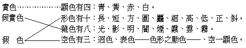

# 第二節　五位百法

## 目錄

- 一　五位百法概論
- 二　識自性位
- 三　識相應位概論
- 四　五遍行心所
- 五　五別境與四不定心所
- 六　十一善心所
- 七　二十六煩惱心所
- 八　二所變位
- 九　三分位位
- 十　四實性位
- 十　一百法之分系表


## 一　五位百法概論

百法散見於瑜伽、顯揚、集論及五蘊論等，名數亦非整百。五蘊論不攝無為法，則唯九十四法；顯揚說真如為善、惡、無記三種，別加四大，則為百零六法；而採集百法為五位之組織者，則為剖解「一切法無我」句之大乘百法明門論。此論成一切法無我，同時亦即成一切法唯識。五位之分，雖似俱舍之說，其實為世親轉立成唯識論之基礎。以諸法補特伽羅無我束小乘諸部，以法無我通攝大乘諸部，以法唯識條貫大乘法相，造端宏大，莫逾於此。識自性位說八識法；識相應位說五十一心所有法；前二位所變位，說十一類色法；前三位分位位，說二十四心不相應行法；前四位實性位，說六種無為法。實性由前四位之所顯示，曰四所顯示故。分位依前三位差別，曰三所差別故。所變是前二位現起之影，曰二所現影故。相應是識之隨從者，曰與此相應故。識自性是能變現法，曰一切最勝故。故纔舉識言而百法齊彰，系統秩然，有條不紊，如提網之綱、振衣之領也。先列簡表於此：


```
　　　　　　　　　　　┌前六識──┐
　　　　　　┌識自性位┤末那識　　├共八法───────┐
　　　　　　│　　　　└阿賴耶識─┘　　　　　　　　　　│
　　　　　　│　　　　┌五遍行心所──┐　　　　　　　　│
　　　　　　│　　　　│五別境心所　　│　　　　　　　　│
　　　　　　│識相應位┤十一善心所　　├共五十一法　　　│
　　　　　　│　　　　│二十六煩惱心所│　　　　　　　　│
　　　　　　│　　　　└四不定心所──┘　　　　　　　　│
　　　　五位┤　　　　┌五根───┐　　　　　　　　　　│
　　　　　　│二所變位┤五塵　　　├共十一法　　　　　　│
　　　　　　│　　　　└法處所攝色┘　　　　　　　　　　│
　　　　　　│　　　　┌識分位一────┐　　　　　　　│
　　　　　　│　　　　│心所分位一　　　│　　　　　　　│
　　　　　　│三分位位┤識心所分位三　　├共二十四法　　│
　　　　　　│　　　　│色分位三　　　　│　　　　　　　│
　　　　　　│　　　　└識心所色分位十六┘　　　　　　　│
　　　　　　│　　　　┌差別無為五┐　　　　　　　　　　│
　　　　　　└四實性位┤　　　　　├共六法───────┘
　　　　　　　　　　　└平等無為一┘
```


## 二　識自性位

此雖未說大乘唯識勝義，成立諸法唯識，然八識既為現實之蘊素，前各節中已涉論及。今應出其名義，從顯到幽，次第而說。第一眼識以至第六意識，已如前述，唯第七識與第八識茲當建說。並先略辨心意識名：心字義最寬泛，或指肉團心臟，乃身依處及身根之一分。然世間古人說心臟為精神作用之物質基礎，與近人說腦髓無異；而極端十二處教之小乘上座部或大乘密宗——大佛頂經亦含此義——，亦隱然說肉心以為「意根」，然違反大小乘共通正義，此應揀除。或持一元唯心論者，義說真如曰堅實心；此雖以真如是心心所等真實性故得名曰心，就能顯名所顯，雖不相離亦不相即心等之性非即是心，且易近於一元論故，今亦揀除。除此尚餘二義：一、慮知義曰心：此為一切精神作用通名，等於近人與物質對立之精神一名，亦即同於心靈一名。佛學中曰心王——即八識——、心使——即五十一心所——，或如龍猛攝一切法為色、心之二法。心之一名，皆通名一切有能知用之事者，此為心之通義。二、集起義曰心：小乘有部及大乘法相中，皆說心、集起義，意、思量義，識、了別義。又皆說心、意、識三，但名義差別，事體同一。唯指識之自身曰心，故此中亦直以八識曰心，諸識相應則名心所有法。心之所有，非即心也。此為心之專義，在八識教，於專義中更為區別，令心、意、識義於八識之中，隨勝各佔一相當之位置。則第八識名心，集諸法種而起現行，此最勝故。以第七識名意，恆審思量此最勝故。以前六識或第六識名識，了別別境此最勝故。此為心之特義。由此乃可以心、義之特義，以論後之二識。第六識特名識，則前五識可特名了。了者、覺義，二十唯識頌說：心、意、識、了，名之差別，併舉了為四故。又前五識但各了自境故，第六識乃了知別別諸境，且為前五之分別依，具隨念等三種分別，別義最勝、故應名識。此識為動身發語之冢宰，約為三類：一曰、明意識，與前五識同一剎那明證五塵境故；二曰、亂意識，前五根病及酒醉被術等迫令意識昏迷錯亂，於現前非現前境上虛謬分別；三曰、獨意識，脫離前五識塵，獨了別法塵故。此又分三：曰散位識，非定非夢之意識是；曰定位識，住定境時之意識是；曰夢位識，眠心相應之意識是。第七末那亦譯為意，雖與第六同名意識，然義不同。第六正名依意根識，比如依眼根識名為眼識，識非眼根；依意根識名為意識，識非意根。依他立名，屬依主釋。意以思量為義，思慮審量於事理之作用，是謂思量。雖復諸識通有，然第七識「恆時審決思量」我無我性，作用特勝；異於前五識之不恆不審，第六識之審而不恆，第八識之恆而不審，故依自識勝用名為意識，屬持業釋。又此末那為第六識所依之真意根，必此有故彼有，同時有故，近為依故。云八識無間滅為意根者，隨順未立八識而說前滅六識為意根之餘教，假說為意根耳。就吾人心理作用切言之，即名「最幽密之恆無間斷自我覺」為末那，亦即為恆求自我永存之意志，非此則無我非我別，亦無恆求自我生存意志。然佛陀等恆審無我，而隨所化緣生，亦此意識；或名此識為染污意，非通義也。第八識集起義勝故名心，然有多名：一、阿賴耶，此譯為藏，能攝藏一切種子故，為諸業果所隱藏故，是末那所執藏為自我故。二、毗播迦，此譯異熟，由昔時異性——善不善性——之業成熟，為此時異性——無記性——之果體故。三、阿陀那，此譯為「持」，持諸種不失故，持一期身器不壞故，持有情身為自體捨身取身流轉相續故。四、所知依，諸所知事皆以此為依故。五、一切種，本有新熏一切種子潛在識中無別體故。六、菴摩羅，此譯無垢，乃佛陀清淨第八之專名，或稱此為第九識者非是。就吾人心思作用切言之，即為末那自我覺所覺之「自我」，然此識亦是剎那生滅相續而從緣變易者；認為常住唯一實在之主宰我，誠為大謬。識自性位之八識，略如此。

## 三　識相應位概論

相應義有通別：通義、則諸法之相契皆名相應，若瑜伽師四相應位，大涅槃經七十二相應位，持咒者說三密相應，語誠者說心口相應。別義、專就心與心所有法而言，有四義故名為相應。瑜伽論云：一、剎那之同一：心與相應諸心所，必起於同一剎那，一聚心心所法起必同時，決無前後，以此一剎那之心所，決不能與前一剎那之心相應故。二、所依之同一：心心所法近依有二：一、俱有依，即根；二、開導依，即等無間。一聚心心所法之起，必同依一根及一等無間，非然即不相應。三、所知之相等：作心心所之所知緣，雖為心與各心所各變之「相分」，然心若以青為所緣，各心所亦必以青為所緣；雖總別異而必相似等，然非同一，故曰相等。四、事體之相等：心及心所各各之自身名事體，等謂其數相等。一識祇有一受及一思等在同剎那同聚俱起，決無二識共一受或思等，二受或二思等俱一識等；數等而非體一，故曰相等；俱舍論等說五同一，第一、第二無甚區別。第四事體同一，此改事體相等；第五行相同一，此改所知相等，以小乘行相即大乘之所知故。第三所緣同一，以小乘之所緣是心外之極微、極微集或餘實物故，此棄不取。故心與心所以四義說名相應。餘法非能知故，無有所知不能有所知之相等，故非心心所之相應。與心相應諸心所法，有五十一，當再分五類以說之。分類有四標準：一、遍八識否？二、遍善、不善、無記三性否？三、遍九地否？四、遍一切時否？依此分別，四俱遍者唯五，曰五遍行心所；遍二有五，曰五別境心所，以不遍八識及一切時故；遍九地有十一，曰十一善心所；四俱不遍有二十六煩惱心所；於三性遍而餘三不定者有四，曰四不定。今以四不定歸入五別境說之。

## 四　五遍行心所

此五遍行心所，無論何識起時必定俱起。行有因義，是識起時「俱有因」故。雖是次第生起，實於一剎那中俱有，無時間上之可分劃。作意與觸，尤難定其次第前後，故雖或以作意居觸之前，亦多以觸居作意之前者。今依百法論列其次第之名義如左：

此中性者體也，業者用也。明其以何為體，以何為用，以立其名。有言根、塵、識三和合為觸；作意者、發趣也，三和合中引心及餘心所令趣自境，此則觸應居作意前。今以作意為警起心種者，乃為一種不可知之本能衝動，即基礎之意志，觸為令心及餘心所接觸於境，故居作意之後。然為受、想、思等所依，故決應在受等之前。換言之、觸者，即感覺感情之感。昔人言易以感為體，亦猶云以觸為體也。非觸則根、塵、識各住而不和合，無有變易亦無知識，謂之寂然不動；觸則識發於根而接於塵，領受為境，情想、思欲等知覺行為起，謂之感而遂通天下之故。故觸為萬化之奧樞。受於順境為樂、喜受，違境為苦、憂受，俱非境為捨受；受為基礎感情，愛、憎、怒、哀等則其枝流也。由受所起欲合順境、欲離違境等欲，則為意志。想為感覺知覺之覺，換言之、即基礎知識；勝解、念、定、慧等皆依此起，故有施設名數之用。思是行動，能令心及餘心所等造作，乃基礎之行為，是身語意業之自體。要之、識為一聚精神作用元首——若眼識聚、或意識聚——，此五遍行如五部長：觸為心心所作能變化之基本——此是能變識等所變——，作意為意志之基本，受為感情基本，想為理知基本，思為行為基本，此非近代心理學所能詳也。

## 五　五別境與四不定心所

四不定心所，諸論皆列於最後，今以與五別境關係相近，且不同善心所等是以善性染性分別者，故於此聯合討論之。別境者、謂於特別之境界乃能得起此五心所。茲先列其名義：

欲為意志於境上之表現，必於有所希望之境，欲心乃生。餘四皆屬於知識者：勝解與疑相反，故猶豫境勝解不生。念即記憶，非曾習境無從得生記憶；然於曾習之境，數數憶持明記令不忘失，則能令心及餘心所專注，故有為定所依之用。梵云三摩地，直譯等持，簡譯曰「定」。真正之定心為欲界所無，今以「暫令心等專注不散」即名為定，故遍九地。定能靜心安慮，故能有為「決擇智慧」所依之用。慧能揀別善惡染淨，抉擇是非虛實，故斷除猶豫之疑也。四不定者：

睡眠似乎是肉身之生理作用，然此所云睡眠乃眠夢心。眠故身不自在，夢故昧略為性。昧、簡定中之獨意識，以夢心不同定心之明證境故；略、簡醒時意識，以夢心獨意識不同醒時俱五識故。云障觀為業者：觀者、梵云毗缽舍那，定慧皆觀，清醒定明乃能觀照；眠夢非醒非定，故障於觀，障觀即障定慧。惡作謂憎惡曾作或不曾作之事業，即是追念往事而生懊悔。然悔雖為反惡向善之機，留滯心內，則能令心及餘心所不能停止。止、梵云奢摩它，定慧皆止，知止而有定安靜慮等故；障止亦障定慧。睡眠心所可改稱夢心所，惡作心所可改稱悔心所，名義較為明顯。尋求是於事理之麤略觀察；伺察是於事理之精細觀察。意言境乃限於意識帶名言之境上，乃能有此麤細觀察之用。此觀察用，是由思、慧合作所成；思徐、故令身心分位安住；慧急、令身心分位不安住。夢、悔、尋、伺四心，可云皆唯意識相應，亦可云皆是別境之心所。雖不遍於九地，然亦可遍三性，故今合為一類，意云不須別開此四為不定也。

## 六　十一善心所

善與煩惱心所，以善、不善、無記三性而區別者。善惟善性，煩惱染性通不善及有覆無記。今先出十一善心所：

俗間所云之信可通三性，故有迷信、邪信。此已將迷信等入不正見、見戒取等，故此信唯淨智善信之信。深忍是深勝解之智，樂欲為樂善之情志，信心自性清淨，能令心及餘心所等清淨，故能抵抗制伏——對治——於善等之不信而樂善等。於實、謂於諸法真實事理，即信於真；於德、謂於三寶淨善功德，即信美善；於能、謂於自可得成能力，即自信力。勤通三性，精進則唯善性，悍故精純，勇故勝進，精純之勝進曰精進。無貪、乃無染意志之正志，即是喜捨，能作布施等善行者。無瞋、乃無染感情之正情，即是慈悲，能作忍辱等善行者。無癡、乃無染知識之正知，能作智慧等善行者。輕安、行捨，能成禪定等之善行。不放逸、則能持律儀而攝善法；不害、則能饒益有情。此二能成持戒之善行。善心所雖甚多，皆此十一以為本幹。

## 七　二十六煩惱心所

諸論分根本煩惱六、及隨煩惱二十，今合論之，以皆煩惱心故。煩惱義為擾害，精神界之擾亂賊害分子。由直接擾害精神界，間接至於一切無不被其擾害，擾害行為成非福等，擾害身器成罪苦等，遂賦煩惱之名。先根本六：

貪、是凡人意志。於有、謂於三界所有身器；於有因、謂於能造成三界身器之行為等。前言末那有最深密求生意志，亦屬此貪。貪亦名愛。貪愛染著作不善、有覆業能生苦果。嗔、是凡人感情，荀況謂人性惡，爭鬥侵奪，主張治以禮讓，即此感情。凡人感情用事，必致發生不安穩之惡行，以犯罪為除苦，反增罪苦。無明、是凡人之知識，亦曰愚癡，迷闇事理，發生種種不純良之心行。西洋心理學討論之知識、感情、意志，其實即此貪嗔癡耳。慢、為貪嗔內副，好勝故貪、故嗔，亦凡人之情志。疑、不正見，為癡外副，癡故猶豫，癡故迷信，亦凡人之知也。此六、據云：嗔唯不善，但欲界有；餘通不善、有覆無記，通餘界有。次二十隨煩惱：

此十別稱小隨煩惱，於自類中唯各別起，不一時俱現故，或唯是不善故。忿、恨、惱、害、嫉是嗔之分位，憍、慳是貪分位或貪、慢所合成，覆、誑、諂是貪、癡合成。

此二別稱中隨煩惱，性雖不善，自類能俱起故；別有其體，非他法之分位。

此八別云大隨煩惱，通於不善、有覆無記，且為任何煩惱心中之所俱有，故量為大。放逸為懈怠、貪、嗔、癡合成，失念、癡、念合成，不正知、癡與慧合成。餘別有體。隨者、或隨貪等分位之上假立，即小隨十及放逸、失念、不正知；或隨貪等從屬生起，即中隨二、及不信、懈怠、惛沉、掉舉、散亂也。

## 八　二所變位

心及心所二為能變，色為所變，故色法曰二所變位。此略為十一種：

以上名五色根。身根十法所成，眼身等十一法所成。各根自種現行為主，餘共增上，已如前述。就各根之「自種現」言，此五應可為單一元行矣。




```
　　　　執受大種聲（有情聲）──────────┐
　　　　不執受大種聲（非有情聲）　　　　　　　　├此三從發聲者分別
　　　　執不執受大種聲（情無情聲）───────┘
　　　　可意聲─────────────────┐此三是前三種聲在聞者識上
　　　　不可意聲　　　　　　　　　　　　　　　　├之分位差別，假聲，或依中
　　　　可不可意聲───────────────┘國分宮、商、角、徵、羽五聲。
　　　　世所共成聲───────────────┐此三是執受大種聲上之分位
　　　　成所引聲　　　　　　　　　　　　　　　　├差別，假聲，或分喉、舌、
　　　　遍計所執聲───────────────┘唇、齒、顎聲。
```


```
　　　　好香……香───────────────┐
　　　　惡香……臭　　　　　　　　　　　　　　　├此三從能嗅者分別
　　　　平等香─────────────────┘
　　　　俱生香─────────────────┐
　　　　和合香　　　　　　　　　　　　　　　　　├此三從發香聚分別
　　　　變異香─────────────────┘
```


```
　　　　苦、酢、甘、辛、鹹、淡──────────此六實味。
　　　　可意味─────────────────┐
　　　　不可意味　　　　　　　　　　　　　　　　├此三從能嘗者分別
　　　　可不可意味───────────────┘
　　　　俱生味─────────────────┐
　　　　和合味　　　　　　　　　　　　　　　　　├此三從發味聚分別
　　　　變異味─────────────────┘
```


此五色塵，乃為每一聚而非一單行。然聲與香但有分位差別，應說由聲或香各一種子所起現行。四大觸種別立，則四顯色與六實味，亦可別立。又觸處若不攝四大，則應十一色處不能攝諸色法。觸處為各種各現諸觸聚，色處、味處亦不妨為各種各現之諸色與諸味聚也。


```
　　　　　　　┌──一極略色────分析至極微細之極微或原子等。
　　　　┌─假┼──二極迴色────推想至極杳遠之天空或天體等。
　　　　│　　└──三受所引色───無表色。依思心所種子上假立。
　　　　│　實──┌四定所引色───定果色。以定心自在力變現之色。
　　　　└────┴五遍計所執色──妄執造物主色相或妄執各實我法。
```


定所引色或實或假，大定通力變現有實用者，由定增上引藏識中色種起色現行，則是實色；餘無實用，但現為境，則為假色。極略、極迥，亦假想色。無表色、實為心所種，假說是色。遍計所執，亦假想色，或和合相續假上之假色。此皆第六意識所了之色。第六所了曰法，故名法處所攝色也。

## 九　三分位位

三分位者，心及心所與色法三之分位也。亦名心不相應行法，除受及想餘心所，及此分位法，在五蘊中皆行蘊攝，故名行法。然行有二；一者、心相應行，即前作意等心所是；二、心不相應行，即此分位法是。此分位法，略如西洋哲學所立原型、觀念，為第六意識推理分別——計度分別——之繩格。略有二十四種，或前三中之單分位，或二合之分位，或三合之分位，皆無實體。單分位者：

此三是能詮之聲或色等分位。或字母云字身，名句所依成篇章之經書則曰文身，或不分別統曰文身。亦有兼所詮義，言是三合之分位者。次二合之分位：

無想定者，得無有前六心心所之定。無想事者，由此定得無想天報，此皆依前六心心所不起現行之分位上假立。滅盡定者，得無有前七心心所之定，此亦依前七心心所不起現行之分位上假立。次三合之分位：

此二十四皆非實事而是名理。後十六法，可皆為貫通於色、心、心所虛位。然方或云「色處分齊人法所依」，亦可但色分位。近人亦說佔空間者唯是物質。然向來皆說為三合之分位也。

## 十　四實性位

前四位之實性，曰四實性。實性謂常遍如此之真相。前四皆不遍無常之有為諸行，但相對之存在，非絕待之存在。此常遍故，曰無為法，共有六種：

此五是隨喻——虛空——隨事——隨擇力、隨闕緣、隨不動、隨想受滅——差別而假立。真實無為，唯後一種：

真如一名，小乘有名無義，或並不知此名，然在大乘乃為唯一法印。龍猛書中譯為實相，曰小乘三法印，大乘唯一實相印是。今真現實論中謂之現量實相。

## 十　一百法之分系表

此之百法，前以識最勝故而為次第，列為五位而說。若不宗主唯識，專就法系分列，則其次序乃適與之相反。應如下表：


```
　　　　　　　　　　　　　　　　　　　　┌識法………………八法
　　　　　　　　　　　　　　　　　┌心法┤
　　　　　　　　　　　　　　┌實法┤　　└心所有法…………五十一法
　　　　　（存在法）┌有為法┤　　└色法………………十一法
　　　　　┌有　　法┤　　　└假法…………二十四法
　　　　法┤　　　　└無為法…………六法
　　　　　└無　　法
　　　　　（不存在法）
```


先無為法，以此六法無生滅行為故；餘九十四法皆有為之行法也。二十四心不相應行，皆色等之分位虛理，故曰假法；餘七十法曰實法。雖其中亦含有假法，大類是實，故曰實法。實法內有十一種是色法，有質礙用而無慮知用故；餘五十九種皆心法，皆有慮知用故。心法內五十一種是心所有法，隨從八聚集起心法而現行故，屬彼八聚集起心法所有——集起心雖第八識特勝，而義通八識，然各心所不得此名——；所餘八法則名心法，正是集起心故。對彼心所有法，此名心王，彼名心使。然此百法皆存在法。有為諸行和合相續，現實有情器界，故此為現實之蘊素。

