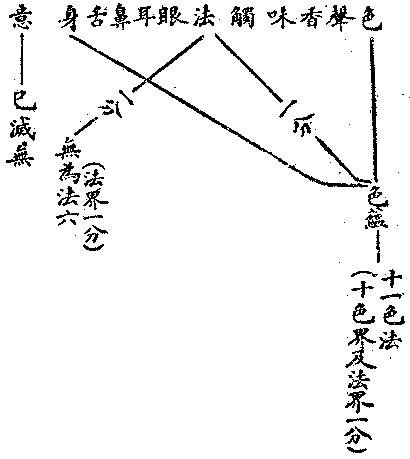
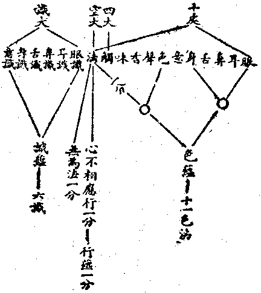

# 第三節　諸法相攝

## 目錄

- 一　諸法開合概論
- 二　六大與諸法比觀
- 三　五蘊與諸法比觀
- 四　十二處與諸法比觀
- 五　十八界與諸法比觀
- 六　百法與大蘊處界比觀
- 七　百法與俱舍七十五法
- 八　百法與錫蘭八十三法
- 九　心所有法之論定
- 十　心不相應行之論定


## 一　諸法開合概論

前二節說六大、十二處、十八界、百法諸分列表，內中有已分析到為最單純材素者，若六大中之地、水、火、風四觸分，五蘊中之受、想二心所分，十二處中之五色根，十八界中之六識界，百法中之心所及命根等。此諸材素，雖遍涉有情器界與超情佛剎，有諸界——欲、色、無色、無漏四界、諸地——世間九地、出世十一地、諸住——世間七識住、出世十三住、及各各有情聚之區別；然堅、觸等法之各為自類種子現行，雖非一個而為一類，例無數堅觸種起為無數堅觸現行，種現雖皆無數，其為堅觸則同；乃至雖無數之命根，其為命根則同，則彰彰明甚也。至於六大中之識大，五蘊中色蘊等，十二處中之觸處等，十八中之法界等，百法中之法處所攝色等，皆為多類法之一聚，非一類之種子現行，由此故有開合之異。或合多法以為一聚，例五蘊中合十色處為一色蘊；或開一界而為多法，例百法中開一法界為諸心所、諸心不相應行與無為法。且其開合相攝，六大、五蘊及十二處與十八界，直接皆不能攝盡，於百法間接相攝，又當詳細觀察，善為分別，故於此節論之。

## 二　六大與諸法比觀

六大為最近乎唯物者。原始之分四大，乃從先執有「整個物」而為簡單之分別者，故觀色法為皆四大為本，不啻觀色、香等皆依一頑質地大或四大合成者為體也。色聚分齊之所無處，說為空大；最後以了知色、空之知識說為識大，不啻唯物論之說心識等為物質之作用而已。然在知識之所知境上析觀之，其直接含攝者：


```
　　　　地───┐
　　　　水　　　├──所觸一分
　　　　火　　　│
　　　　風───┘
　　　　空……………方………………心不相應行之一
　　　　識……………意識或前六識……………識一分
```


茲六大不能攝盡現實蘊素。然間接相攝開列之，則以諸色法皆依持四大種故，四大種為能造而餘為所造故，色諸分位不離於色，亦攝名句文等。四度之空攝時，三度之空攝數，除心心所分位，餘分位理皆空所攝。識之意識或前六識，必俱末那及阿賴耶；既有心王必有心使所屬，亦攝諸心所法及心所分位。既攝諸能顯示，則所顯示之無為法亦不相離。故於六大亦能攝盡諸法。為表於左：


```
　　　　　　　　（能造色）　　┌─五根　　　　　　　　　（色分位）
　　　　四大……實觸……所造色┼─四塵───────┬名句文及餘法處色
　　　　　　　　　　　　　　　├─餘觸　　　　　　　│
　　　　　　　　　　　　　　　└─法處所攝色一分──┘
　　　　空大………方……時……數……餘眾同分等分位法
　　　　　　　　　　　　　　　　　　　　　　　　　　　‧‥‥心分位命根
　　　　識大……意識……五識……意根藏識……諸心所‥‥‧‥‥心所分位異生性
　　　　　（如上諸位所顯示之實法、即無為法）　　　　　‧‥‥心心所分位無想心定等
```


## 三　五蘊與諸法比觀

五蘊之一蘊字，已含有一聚而非一類之意義。然受與想亦為單類。五蘊為佛法從知識之所知境上簡單分別，已抽去整個物及整個我之妄執者，故為純正佛法而較六大勝進多矣。五蘊與六大之相攝如左：


```
　　　　　　色──一分………全分──地水火風
　　　　┌────少分………多分──虛空
　　　　│　受─┐
　　　　│　想─┤
　　　　└─行─┤
　　　　　　識─┴一分………全分──識
```


五蘊與十二處之相攝如下：


```
　　　　色────十色處及法處一分
　　　　受──┐
　　　　想──┼─法處一分
　　　　行──┘　（前滅識）（現行八識或六識）
　　　　識────意一分………意全分
```


五蘊與十八界之相攝如下：


```
　　　　色────五根五塵及法界一分
　　　　受──┐
　　　　想──┼─法界一分
　　　　行──┘
　　　　識────六識界………意界
```


五蘊與百法相攝者：


```
　　　　色────十一色法
　　　　受───┐
　　　　想───┼五十一心所法
　　　　行───┴二十四心不相應行
　　　　識────八識
```


依此五蘊直接相攝，皆不攝無為法。由此不攝十二處法處之一分，十八界法界之一分，百法中之無為法六；但攝有為法之全分。然所示顯之無為法，不離能顯示之諸法，故亦間接攝無為法。

## 四　十二處與諸法比觀

十二處乃從能知所知之知識基緣，為無有情我之機械觀者。直接不攝六識、八識，雖意根即為前滅之六識、八識，然仍不攝現剎那識。蓋此意根，但注重說明得起意識之根基，若以肉心或腦為得起意識之根基，如小乘中之上座部，則可全唯色法。即其說六識等前剎那滅為意根者，俱舍論云：『六中無間謝，說識名意根。釋曰：六識中隨一無間滅，此識說名意處。譬如一人先為子後為父，又如先為果後為種，識亦如是。先為六識，後成意處』。蓋以識剎那滅，然意識有記憶推理之用，此依何而得成？乃觀前剎那識有遺為後剎那識之傾向關係——等無間緣——；剎那剎那識之前滅後生，相續能為引導，為得起意識作用之根基，謂之意根。此之意根，既非大乘之末那識，但是前剎那六識經驗流而已。要言之、則意識以前剎那六識為根基也。但由根基塵緣刺激反應，擊發六識，剎那即滅，識非相續存在，故為機械之人生觀，亦為徹底之無我觀。然頗不易說有情之相續流轉及還滅流轉也。其直接相攝者如左：




缺六大之識大，缺五蘊之識受想及行蘊一分，缺十八界六識，缺百法之八識及心相應諸心所法；然間接亦能全攝也。謂由意處即前剎那識故，攝六識或八識；攝八識故，亦攝相應諸心所法；故識大與識受蘊等，皆無不攝。

## 五　十八界與諸法比觀

十八界之法界所攝雖多，然既未說諸心所法，則應不攝心所，諸心不相應行雖必相攝，如俱舍論纔說十四，亦應不攝全分，且意界同意處僅說六識，亦應不攝第七八識，由此其直接相攝者：




十八界較六大及十二處寬，較五蘊缺受，想及行一分，增無為法，較百法則為未全也，然間接攝。或說意界是末那識及阿賴耶，既有八識必有相應諸心所法；故亦攝五蘊及百法全部。

## 六　百法與大蘊處界比觀

百法之特殊處，一、在說第七第八識，二、在說諸心所，三、在說法處所攝色，四、在說諸心不相應行法，五、在說真如為真無為法。大、蘊、處、界，除去其間接之相攝；五蘊較廣，九十四法；次十八界，四十七法——除第七八識及心所法，準法界攝無為法、不相應行全——；次十二處，四十一法——除六識——；次六大，則僅及三法。為表如左：


```
　　　　　　　　　　　　　　　　　　　　　　　　　　　（前剎那六識）
　　　　　　┌───眼識、耳識、鼻識　─┬　─┐　意處───────意界
　　　　識蘊┼───舌識、身識───　─┤　─┼　─────────六識界
　　　　　　└───意識──────　─┘　─┘─────────────識大
　　　　　　　　　　末那識、藏識
　　　　受蘊────受
　　　　想蘊────想
　　　　　　┌───作意、觸思
　　　　　　│　　　欲、勝解、念、定、慧
　　　　　　│　　　夢、悔、尋、伺
　　　　　　│　　　信、精進、慚愧、無貪
　　　　　　│　　　無瞋、無癡、輕安
　　　　　　│　　　不放逸、行捨、不害
　　　　　　│　　　貪、瞋、癡、慢、疑、不正見
　　　　　　│　　　忿、恨、惱、嫉、害
　　　　　　│　　　覆、誑、諂、憍、慳
　　　　　　│　　　無慚、無愧
　　　　行蘊┤　　　懈怠、放逸、惛沉
　　　　　　│　　　掉舉、不信、失念
　　　　　　│　　　散亂、不正知
　　　　　　│　　　得、命根、眾同分─────┐
　　　　　　│　　　異生性、無想定、無想報　　│
　　　　　　│　　　名身、句身、文身　　　　　├法處──法界
　　　　　　│　　　生、住、變、滅　　　　　　│
　　　　　　│　　　流轉、定異、相應　　　　　│
　　　　　　│　　　勢速、次第、時　　　　　　│（虛空無為亦間接顯）
　　　　　　│　　　方────────────┼────空大
　　　　　　└───數、和合、不和合　　　　　│
　　　　　　　　　　虛空、擇滅、非擇滅　　　　│
　　　　　　　　　　不動滅、想受滅、真如───┘
　　　　　　┌───眼、耳、鼻、舌、身────┐
　　　　色蘊┤　　　色、聲、香、味　　　　　　├十色處─十色界
　　　　　　│　　　觸────────────┴───────四大
　　　　　　│　　　　　　　　　　　　　　　　　（一分）
　　　　　　└───法處色───────法處一分────法界一分
```


## 七　百法與俱舍七十五法

有近於五位百法之分類，而不如百法完全者，則有小乘二部：一、薩婆多部之所說，茲采俱舍論者：


```
　　　　無為（３）────────────────虛空、擇滅、非擇滅
　　　　　　　　　　　　　　　　　　　　　　┌──眼、耳、鼻、舌、身
　　　　色（１１）─────────────┤　　色、聲、香、味、觸
　　　　　　　　　　　　　　　　　　　　　　└──無表色
　　　　　　　　　　　　　　　　　　　　　　┌──眼識、耳識、鼻識
　　　　心（１）──────────────┤
　　　　　　　　　　　　　　　　　　　　　　└──舌識、身識、意識
　　　　　　　　　　　　　　　　　　　　　　┌──受、想、思、觸、欲、慧
　　　　　　　　　　┌───遍大地（１０）─┤
　　　　　　　　　　│　　　　　　　　　　　└──念、作意、勝解、定
　　　　　　　　　　│　　　　　　　　　　　┌──信、不放逸、輕安、捨
　　　　　　　　　　│　　　大善地（１０）─┤　　慚、愧、無貪、無瞋、
　　　　　　　　　　│　　　　　　　　　　　└──不害、勤
　　　　　　　　　　│　　　　　　　　　　　┌──無明、放逸、懈怠
　　　　心所（４６）┤　　　大煩惱地（６）─┤
　　　　　　　　　　│　　　　　　　　　　　└──不信、惛沉、掉舉
　　　　　　　　　　│　　　大不善地（２）────無慚、無愧
　　　　　　　　　　│　　　　　　　　　　　┌──忿、覆、慳、嫉、惱
　　　　　　　　　　│　　　小煩惱地（１１）┤
　　　　　　　　　　│　　　　　　　　　　　└──害、恨、諂、誑、憍
　　　　　　　　　　│　　　　　　　　　　　┌──惡作、睡眠、尋、伺
　　　　　　　　　　└───不定地（８）──┤
　　　　　　　　　　　　　　　　　　　　　　└──貪、瞋、慢、疑
　　　　　　　　　　　　　　　　　　　　　　┌──得、非得、同分
　　　　　　　　　　　　　　　　　　　　　　│　　無想果、無想定、滅盡定
　　　　心不相應行（１４）─────────┤　　命根、生、住、異、滅
　　　　　　　　　　　　　　　　　　　　　　└──名身、句身、文身
```


無為缺不動滅想受滅真如之三種；心法缺第七第八識，且合六識為一心法；心所善中缺一無癡，煩惱中缺不正見、不正知、失念、散亂之四；心不相應行缺異生性、流轉、定異、相應、勢速、次第、時、方、數、和合、不和合之十一，而加非得，實缺二十；六識合一，故缺二十五數，存七十五。且無表色僅法處所攝之受所引色，缺餘四種：然極微色彼攝在十色處中也。其特別之處：一、在將六識合為一心法，似心理學說一意識分為視覺及聽覺等；亦如後人一猿應六窗喻。然有違其十八界為十八種族之言。然彼無末那為第六識根，六識生滅須展轉相引為意根，則以六識界及意界為一心法，亦推論之所應至也。二、在善中廢除無癡心所，則頗有理。三、在以貪、嗔、慢、疑，列為不定心所。四、在以放逸等五，列為大煩惱地。五、在不分別遍行與別境及無次序。後之三種，則為較百法之短處。

## 八　百法與錫蘭八十三法

錫蘭巴利文所傳小乘上座部阿毗達磨，分四位、說九十三法，不開心不相應行位。以諸心不相應行法，分攝在色法或心所法中。茲表如下：


```
　　　　無為（１）──────────────涅槃
　　　　　　　　　　　　　　　　　　　　　┌─眼、耳、鼻、舌、身
　　　　　　　　　　　　　　　　　　　　　│　色、聲、香、味、觸
　　　　色（２４）────────────┤　女根、男根、食、命根
　　　　　　　　　　　　　　　　　　　　　│　空、威儀、言語、輕安
　　　　　　　　　　　　　　　　　　　　　│　能伸縮、能適應、
　　　　　　　　　　　　　　　　　　　　　└─能集生、住、異、滅
　　　　　　　　　　　　　　　　　　　　　┌─眼識、耳識、鼻識
　　　　心（６）─────────────┤
　　　　　　　　　　　　　　　　　　　　　└─舌識、身識、意識
　　　　　　　　　　　　　　　　　　　　　┌─觸、受、想、思
　　　　　　　　　　　　┌──遍行（７）─┤
　　　　　　　　　　　　│　　　　　　　　└─定、作意、命根
　　　　　　　　　　　　│　　　　　　　　┌─尋、伺、勝解、
　　　　　　　　　　　　│　　別境（６）─┤
　　　　　　　　　　　　│　　　　　　　　└─勤、悅、欲
　　　　　　　　　　　　│　　　　　　　　┌─般若、悲、喜
　　　　　　　　　　　　│　　　　　　　　│　正言、正行、正命
　　　　心所（５２）──┤　　　　　　　　│　信、念、慚、愧
　　　　　　　　　　　　│　　善（２１）─┤　無貪、無瞋、平靜
　　　　　　　　　　　　│　　　　　　　　│　心輕安、身輕安　（註：缺四）
　　　　　　　　　　　　│　　　　　　　　│　心輕、身輕
　　　　　　　　　　　　│　　　　　　　　│　心柔軟、身柔軟
　　　　　　　　　　　　│　　　　　　　　└─心誠敬、身誠敬
　　　　　　　　　　　　│　　　　　　　　┌─癡、無慚、無愧
　　　　　　　　　　　　│　　　　　　　　│　掉舉、貪、不正見
　　　　　　　　　　　　└──不善（１４）┤　慢、瞋、嫉、慳
　　　　　　　　　　　　　　　　　　　　　└─惡作、惛沉、睡眠、疑
```


此部分法之大缺點，即在未開心不相應位，將命根列入心所中，生滅等列入色法中。然則心所應能持續身命，心等應無生滅，此其顯然不合於事理者。他若以正言及身堪任等列之為善心所，蓋由注重戒定之故。然以勤及尋伺列入別境心所，善中列悲心所，亦不無特長處。由此於諸心所，當別論定。

## 九　心所有法之論定

心所有法，唯錫蘭所傳上座部及薩婆多部與大乘法相，始詳論之。其先或主不立心所，或主唯列受想行三心所，或主列受、想及貪、嗔、癡三心所。即此三部所言，亦互參差，無嚴格之標準，故有重新為審擇之必要。

瑜伽等最善者，在立五種遍行心所，秩然不可紊亂增減，今整齊其名字，列之如左：


```
　　　　　　一作意─┐
　　　　　　二感觸　├──其義皆如百法中述
　　　　┌─三感受　│
　　　　│　四感想　│┌─新奇者驚喜樂者慰憂苦者怖
　　　　│　五思慮─┘│
　　　　└──────┘
```


至於別境不定心所，尋伺既為思、慧分位，例止、觀為定、慧分位，可以不立。夢為在色身睡眠分位之心心所聚，亦可不立。睡眠、勤勉，應入心不相應行內。悔改應入別境之中，更加忍耐、忠信，安立為八：

欲至悟解，同百法之五別境。由慧審擇乃能於決定境印持無疑，故置慧後。忠信心通三性，若身見、邊見等迷信邪信，即不善、無記信。除悔改不通於佛地，餘皆可通三性諸地，思之可見。

百法中之信心，即善性之忠信——或曰信仰——，善性之忠信心即樂善好德心，故於實德能深忍樂欲而心淨為性。然例善欲、善慧等，不須別開也。精進、行捨及不放逸，是善心等起之勤勉、正直、嚴肅分位，輕安是定心等所起身心分位，皆入心不相應行內。無癡是善慧、善悟解，不害是無嗔——今云慈恕——之分位，故不別立。審之、應唯三種：

善定即禪那度，善慧及般若度，善悟解、善欲等即方便、力、智度。故正善心唯此無慢、無嗔、無貪三種，而慈恕為主要。

次不善有覆心，應有其六：

其餘惡見即不善無記信，忿等是嗔分位，慳等是貪分位，覆等貪癡分位，皆不須立。不正知即不善無記慧悟。懈怠、放逸、惛沉、掉舉，身心分位入心不相應行。失念、散亂，是忽忘心，不須別立。故總為四類二十二心所。

## 十　心不相應行之論定

心不相應行，唯薩婆多部與大乘法相中說之。今亦重為開合增減，列之於左：

略陳五十五心不相應行，內中命根、異生、同類、各異、生、存、變、滅、時、方、度、數、文語、盟誓、勤勇、懈怯、恆轉、次第、和合、乖離之二十法，最為根本；餘則枝條而已。合八識、二十二心所、十一色法、四無為法，仍為百法。然心所有法及心不相應行法與無為法，其出入開合者多矣，可名之新百法。

