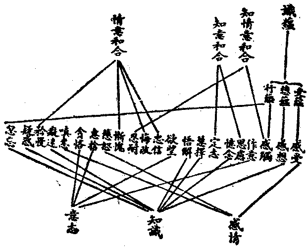

# 第五節　所知蘊素差別

## 目錄

- 一　所知蘊素總評
- 二　五蘊與心理學
- 三　心識與根身之關係
- 四　心法體數之決擇
- 五　命根之研究
- 六　性之研究
- 七　新百法之決擇


## 一　所知蘊素總評

此章所言現實蘊素，莫精審於百法。茲復論定為新百法，然亦略言比較單純之要素耳。近人藉Ｘ光於物體上反射之波長，推定宇宙物體之原質數為九十二，雖猶有二三種未能發見，而在光波長度上排列之順序，則顯然可觀也。然此化學上之元質，與今在現實中所擇立比較單純之要素，以施用之方法不同，故所求得之要素亦不同。彼從佔空間之物體從事分析，故所求得者，等於法處所攝色之極微色，或仍為可見可觸之物體。此所言比較單純之要素，則略如近人名理原子論所云名理元子——羅素所謂事情——，非心非物，亦心亦物，即能知所知及其成立之要件。故此所云簡單之法，彼或視為猶可分析而非原質元子；彼所云之原質元子，此亦視為可見可觸之複雜合成事，而非簡單材素。以現行之一心聚、一色聚，皆眾緣合成事。然六大說蓋猶存化學分析之方式，堅、溼、熱、動四觸，所以視為諸色聚之遍依本者，以其為佔據空間之基本性也。佔據空間，則此一色聚與彼一色聚體質相礙，由是有質及量之可分析。由質分析，則為四大或九十二原質，由量分析，則為極微極微集或原子。此於所知之材素上，其本為觸覺之觸塵，視之所覺則為色塵，推析所極而無可見、觸，則為法處極微色。故原質、原子，僅為四大極微之分析，與今能知所知上之百法，迥然不同。不佔空間無質礙性，則謂之空；能了知性，復謂之識。唯以四觸、九十二原質或極微原子為搆成萬有之元素，則成立唯物論。以空、識為四大極微之本元，則立唯心論、唯我論、唯神論等。諸哲學派之本體論，皆不越六大之方式。小乘執四大極微為色聚之實元體，空之與識亦為實體，則為物、心、理性之多元論。但空常住——此指虛空無為，若空隙及空一顯色亦生滅法——，而四大與識大皆生滅法，則亦為現實論而非有元論矣。大乘以四大為所觸，自種為因，由識頓變現為色聚，隨量大小，不由極微集合而成；識亦自種為因，眾緣所生，空是色心分位或所顯無礙理，則全轉為現實論矣。蘊、處、界等，皆是能知所知中分出之要素，更為了然。故不應以此中現實蘊素濫同於化學素，亦不應以化學素而難此現實蘊素，彼為在時空方式中之究元論，此為時空方式所依之現實故。

## 二　五蘊與心理學

西洋之正統心理學，亦謂之意識心理學，以意識為研究之對象故。亦謂之三分心理學，分意識為知識、感情、意志三榦以說明故。前已說受、想、行三蘊，略如感情、知識、意志之三分類；細為分析，則色蘊乃心理與物理生理刺激反應之關係，而識蘊為其研究對象之意識。今就受、想、行蘊所含之心所法及識蘊之識，與分三榦之意識心理學，表列其關係式於左：




感受之受蘊、為感情之本：發展為善感情，即為慈恕，乃為公之仁情；發展為惡感情，即是嗔恚，乃為私之暴情。感想之想蘊、為知識之本：與前六識相應即為感覺，即為「自性分別」；憶念、與意識相應為「隨念分別」；慧擇、悟解、與意識相應為理智，即為「計度分別」或如理如量智。癡迷、疑惑、忽忘，乃擾亂知識使不能如理如量之惡劣知識也。行蘊中之作意、為普遍之意志，欲望、為差別之意志，二為根本：發展為善意志，即是惠捨，乃為公之美志；發展為惡意志，即是貪吝，乃為私之鄙志。感觸、為感情知識意志所由起，忍耐、為感情、知識、意志之護持，故和合知情意。思慮、是意志之知識，志定、是知識之意志，故為知志和合。忠信、悔改，為或善不善之情志和合；慚愧、為善情志和合；矜慢、為不善情志之和合。此其大較可言者也。故感情、知識、意志，雖可為分別，而不能劃然離析也。

## 三　心識與根身之關係

心識與根身之關係，即心理學與生理學之關係也。近人多以物理學為基本，而設立生理學，生理學為基本，而設立心理學。佛陀學則依現實——近羅素所云中立之一元——，而說明官感機關及官感對象所起之心識，謂之六識；及心識所依官感機關之根身，謂之六根；心識與官感之對象，謂之六塵；說十八界或十二處。近人或言佛學之五色根，但為眼根元子之布於眼根所依處——眼球——乃至身根元子之布於身根所依處——全身——，而各元子乃為無組織之散布。又言五色根之官感機關各立，而無聯絡之總機，不能明總領受之意識與肉身之關係——見邁格文佛家哲學通論——。此皆誤謬推論。今為解而正之：一者、五根為有組織之五色根，即神經系；淨色身根，即遍全身能為觸覺所依之身感官神經，由內四大及五塵與身根自體之十法所組成。乃至淨色眼根，即眼球中能為視覺所依之眼感官神經，由內四大及五塵與身根并眼根自體之十一法所組成。各有微細形狀，為淨天眼之所能見。換言之、亦即為顯微鏡所能見，但非常人肉眼所能見耳。其為有組織之機關可知。各人互見之肉身雖為根依處而非真為感官之五色根，然身感官神經既遍布於全身，則活人之根依處，亦無一處不為身感覺——身識——所依，亦灼然可知矣。二者、眼、耳、鼻、舌四根，除各根自體及四大、五塵之外，更須有身根為必須基素。可知身根：一方為與眼、身等對立之別根，一方為眼根等聯絡之總機關。諸生物或無眼、耳、鼻、舌根，然必有身根也。若無身根則非生物。且身根組織繁密否，亦即為高等低等生物之分判。腦髓、心臟，皆為身根之根依處。身根絡布其間，即神經系；布達眼球者別有視神經，即為眼根；乃至布達肉舌者別有味神經，即為舌根。身根布列各根依處，又各成其特殊生理與心理之關係。心、肝司血液循環，為水、火二大運行樞，生命——第八識——之關係為特重；腦髓司經絡傳達，為風、火二大之運行樞，知識之關係為特重。由是重靈魂者，說心理作用唯在於心、肝；重意識者，說心理作用唯在於腦髓。執心、肝故，想思過度每心痛而失血；執腦髓故，想思過度每腦昏而病絡。其實皆偏執之所致。火大之煖，為命、識必俱之關係，命存識存，必煖亦存，煖亡必命與識亦亡。心臟以火煖而運水，腦髓以風動而運火，心臟、腦髓與煖之關係較深密，即為與生命及意識之關係較深密，此誠不容掩之事實。又腎之於水液，而肺之於風氣，脾、胃之於營養，腸竅之於收洩，亦皆有特殊之功用。中國醫學於心、肝、脾、肺、腎等，分說為關係心理作用之感官。近行為派心理學，亦說心理作用為全身各部內分泌腺受刺激之反應，不以心理作用為專在於腦，或專在於心。

然此皆眼等四根與身根根依處之組織，為識所持，則與第八識有直接關係。能發識，則與前五識有直接關係。至於意識別依意根——心之官感機關——，則由意識每與前五識俱轉故，與五色根及根依處有間接之關係。意識、意根，必依止於第八識故，亦與五色根及根依處有間接關係。以五色根、根依處，為第八識攝受為自體，共安危故。然意識之總攝受六塵，而能憶念推度者，在於親密之意根，及直接關係之前五識與第八識，不在間接關係之五色根及根依處。與前五識俱轉，故能總攝前五塵境。以意根及第八識為俱有依故，能憶念推度法塵境。所依意根，正為第七之末那識，旁為八識聚前剎那滅之等無間依。皆為心法而非色法，絕非五色根聯絡機關之身根某部。小乘或以肉心以為意根，近人多以腦為官感印象之儲藏所——大乘則說攝藏藏識——、及意識依起處——大乘則說末那意根——；乃物理、生理為基本之唯物論派心理學，非真現實論之心理學也。五根直接影響前五識及藏識，間接亦能影響意識、意根，此誠為應有之關係，然不及藏識能影響五色根之力大，於有修養者，尤不及意識能影響五根之力大，故不應偏執也。

## 四　心法體數之決擇

俱舍論依十二處教，立一「心法」；上座部依十八界教，立六心法，亦有增立為九種、十種心法者，究竟以何教為決定？換言之、即每一有情究有若干之心法體？依麤顯境及各別所依根，從六識身立六心法；依深細境及恆俱轉，加「意」及「藏」，立八心法；此於事理較為如實。何者？若言心法之體為一，有眼識時，不必有耳、鼻、舌、身識；乃至有身識時，不必有眼、耳、鼻、舌識；有意識時，不必有眼等前五識；有第七、八識時，不必有前六識；第七識無漏時，第八識或仍為有漏；不必俱故，性非一故。其體是一者，應不能有此殊別。然亦可以同是了知性故，俱現起時互關聯故，假說為一。故說為一心法，不如說為六心法之合宜，尤不如說為八心法之究竟也。或加立清淨第八識之菴摩羅識為第九識，然染淨雖轉而識體無二，不應加立。此若別立，前七清淨分識，亦應別立。八染、八淨，豈不有十六識？故不應立菴摩羅識為九，但應以菴摩羅為第八識清淨分之別名而已。或加淨識相應正智所證真如，立第十堅實心。識之實性雖不離識，然所了知非能了知，本以能了知性立心識名，真如既非能了知性，不應立心識名。是故心法體數，於八為定，不增不減，如理如量。

問曰：前六心識較為易知，亦為佛學之所公認，第七、八識大乘法相始施設之，既非佛學公認，世亦難知，則殊無建立之必要。答曰：成唯識論證有第八識體，引大小乘教證有八，推論事理，更證理證有十。證有第七識體，教證有二，理證有六。須者檢尋，茲不繁敘。舉要言之：眾生生命，若說從他生命所生，則他生命復從誰生？展轉上推，假說一神所生。然彼一神是否生命？若非生命，則既非他生命，應不能生生命。若亦生命，復應從他生命而生，展轉上推，仍無究竟。若雖生命，獨可不從他生命生，則諸生命皆應不從他生命生。若說原始生命不從他生命生，從無生命偶然產生生命，則既違現知之事實，不能從非生命之水素等造成生命，且無生命之因，突有生命之果，無因有果，亦違背科學等公認之因果律。故說眾生生命從他生命而生，從無生命而有，皆不無違礙。是故應說：各生命皆無始而恆轉，值相當之機會，集多能力現為生物。盡一期之勢限，捨餘粗跡——死屍——，潛為生力。潛，現相續，永無終斷。即此無始無終流行變化潛現相續之生命流，曰第八識，集諸種子——潛力——起現行故曰心，有極深微了知性故名識。緊依此生命流，恆有一自衛本能之生存意志，與之潛現俱轉，曰第七識。色根及根依處時取捨故，非潛現恆轉之生命及恆俱之意志，眼等五識時有無故，非潛現恆轉之生命及恆俱之意志；第六識於深眠悶絕——初生及死——深定諸位亦不存故，非潛現恆轉之生命及恆俱之意志。諸眾生各有潛現恆轉之生命，故必有第八識；與潛現恆轉之生命有恆俱之意志，故必有第七識。是故為說明生命之真相，心法體數，應如瑜伽等立為八。

## 五　命根之研究

命根一法，世人認為諸生物類性之本源。謂死生窮達皆定於天命，死生有定期為壽命，窮達有定數為福祿之命。凡生物之一生，皆決定於得生時之命限。操施此命限之權者，或謂出於天神，故云天命；或謂出於自我，故云命者；或謂出於萬有類與不類展轉關係之自然力，故云命運；或謂出於前身與祖宗之先業，故云夙命。皆觀同命定之機械，故雖人生亦無自由。夫展轉之關係與前生之行業則誠有，然而亦非必然也。小乘有部，視為心不相應行之實法，而上座部視為心法，大乘說為心不相應行之假法。於百法論，窺基依成唯識論等，解為依業所引第八種上連持色心不斷功能之所假立，唯是第八心種連持功能之心分位。普光依雜集論，解為先業所感，隨壽長短，住時決定，謂之命根。乃阿賴耶持眾同分四大諸根不壞，欲色二界通心、心所、色之分位，無色界唯心、心所之分位。二家出分位所依法，亦不相同。今按基解為是。普光說心、心所、色住持分位為命根，合能持所持說，然建立能持勢限曰命根，不應兼所持說。一期色、心、心所聚能連持勢力，依引業所引第八心種而限定：一、引業種，二、第八識識種。識種被引業種所引成異熟識種，值緣集現行為一期異熟識，乃連持一期之色心，聚而不斷，依此能連持之勢限說為命根。詳厥本識，端在引生異熟識之業種功能分位，體即引生異熟識之業種，此業種之勢限終盡，一期色心即不連持，謂之命終。命始於業種之引生異熟識——初託胎受生位——，命終於異熟識業種之勢盡——死位——，由始至終，中間令色、心連持不斷之功能分位，施設命根，由此可見命根為何義矣。異熟識之根身、器界，與前六識心境之從異熟生者，誠為機械之或然性；然任運流行而可隨他力轉移，自無堅決之力，故為無覆無記。而別有非異熟之第七識，及一分非異熟之前六識，則自為有力之現行，而不為先業所規定，故不無自由之心力。尤以第六識為有特殊力，能創造或善或不善之業，熏第八識以為能引第八識之業種。換言之、即能為新生命種子之創造。特此所創造之新生命種子，不能即時現為新生命，須待灌溉成熟，值遇機緣，乃出現為新生命耳。生物受命先業而亦能刱新命，能刱新命故有自升自墜之自由也。自墜之極，可淪苦生，自升之極，至於成佛，於第六識較為發達之人生，實有其自決之權能也。於各生物，各各色心集團，能連持力之命根既如此；於各民族或各國民，各各精神物質共同生活集團，能連持之命根，亦可推比而知。由強勇知識分子集團，善或不善之主義——思想、信仰、力量之結晶——，重在民族或國民之全體，則能攝植民心，成新生命潛力，增長成熟，結為黨國，若遇時機，則能發現為一民族或一國民良或不良之新生命。前說第八識為生命，喻一民族一國民全體生活之無始流行變遷不斷，此言命根，喻於每一革命成立一朝代勢力連持之分位。合此二義，可以觀生命之生死，亦可觀生死之相續，而善知於命矣。

## 六　性之研究

異生性或改稱「個性」然個性一名，殊不足以盡其義。集論謂依「不得無漏聖法之位」假立，則應對聖性名凡性，異生、聖者對稱，故今但名異生。此異生之特性，今細考其含義有二：一、自他生命之別異，可云個性；二、趣類流轉之別異，可云類性。類性為「眾同分」，個性為「各有情假者」。在能令類性、個性有別異之功能分位上，乃施設為異生之性。能令自他別異之功能，在分別我執——及俱生我執之一分；能斷除此，即預聖流，得聖者同生性，證無我故無自他別。故依一分我執種之功能分位立異生性。能令趣類別異之功能，在有漏引業——第六識者——，能斷除此，即預聖流，得聖者無漏性，成無漏故無趣類異。故依一分有漏思業種之功能分位立異生性。所謂『異生性唯心所分位，依二障種上令別異之功能假立故』。亦為總略之定義也。「個性」依五蘊合續之有情假者而立；身器自他成各別隔異之障者，植根於二我執之種現力，各從其我執而集現特殊之身心相，由此各有情有各有情個性之同異。「眾同分」依同類之有情眾而立；其廣義亦通諸法之同類，同類即是平等，各別即是差別——例平等是色則為色同類，平等是心則為心同類等——。身心器界成趣別地異之障者，植根於雜染業之種現力，各從其染業而引生類似之身心相，由此眾有情有眾有情類性之同異——男性、女性亦同類性可知——。儒書所云天命之性，從類性中人同類性而說。性相近之性。與人性以三品異之性，於人同類性中亦兼個性而說。人同類性之超旁生性者，有較能行善之才性，故說「性善」；人為「異生」之一，人同類性即異生同類性，有本能行惡之才性，故說「性惡」。然我執集現之特殊身心相，與染業引生之類似身心相，皆異熟性——猶云天然性、自然性——之無覆無記法，可隨有力現行意識遷變，故說無善無不善而又可善可不善。百法中異生及同類二法，有關中國民族對於性之研究，故專提出討論。又就人言：與同類對立之「各別」為個人性——各別廣義亦通諸法，一一法各別性，亦此分別——；與各別對立之「同類」為人類性；中間之社會性、國民性、民族性，階級性——即所謂民族意識、階級意識等——，則兼類別之二性。表之如左：


```
　　　　各別性─────┬─個人性
　　　　　　　　　　　　├─社會性─┐
　　　　　　　　　　　　├─國民性─┤
　　　　　　　　　　　　├─階級性─┤
　　　　　　　　　　　　└─民族性─┤
　　　　同類性─────┐　人類性─┤
　　　　　　　　　　　　└─────┘
```


類與不類，相與為類：異生為類，包括人、旁生等；人亦為別。有情為類，包括三乘聖者，異生亦別。生命為類，包括植物；有情亦別。諸法為類，無所不包；生命亦別。平等性遍於差別性，差別性遍於平等性，要為法界之同異總別相而已。「命」之研究，達於藏識；性之研究，達於「法界」，此非世間言性命者之所知也。

## 七　新百法之決擇

問曰：無表色、為俱舍十一色法之一，大乘百法為法處所攝色之一，今列入心不相應行「盟誓」；有何所以？答曰：成實論亦列無表法於「非色非心」中；大乘本說無表業以「思種防發功能」而立，徒以其受持時有身語表色威儀之印象，由之有潛力能防發身語表色，隨順俱舍，亦假說為受所引色。然受成此潛力，尤關意業，此潛力之防發亦通意業，非但有關身語表色，故不應攝於色法，而應攝於「心心所色之分位」。至於今云盟誓，為義較寬：結盟約，立咒誓，舉神聖嚴重之儀式，有履行遵守之義務。佛徒之受皈戒，基督徒之受洗，及人對於神或二人以上之各種盟誓等，固出誠心，則其心中必有一種深切印入之潛勢力，能履行遵守，則潛力滋長，久之養成為本能，而自然防止違反，發舒遵守盟誓之行。其防發之潛力，在自心亦不覺不知，故謂之「無表」也。然所立盟誓或善或不善，佛學名其善者但云「律儀」或「善律儀」，名其不善者則云不律儀或惡律儀。凡律儀性無論善惡，皆有檢束之力，非律儀性則云「遊戲」，故今與盟誓對舉遊戲。

問曰：精進或勤，上座部列不定心所，俱舍、大乘列善心所；輕安皆列於善心所，莫不觀為心所有法，今列入心不相應行，有何所以？答曰：識論以勇悍釋精進，勇列於所觸之分位，勤勇精進時作一名，在勤勇原語上亦可有身勤勇、心勤勇之分別，可知「勤勇」為心、心所、色之分位。由善心出發即為善精進，由不善心出發亦可為不善之勤奮，兼亦可有無記性之勤勇，故列在分位中為合宜。勤勇如此，與勤勇相反之懈怯，近勤勇之嚴肅，近懈怯之放肆，亦可知其為身心分位矣。「輕安」可與「壓迫」相對，輕安是身心輕快安穩之分位，雖由定心及善心之所致，而輕安則是心、心所、色之分位，非心所也；身心上解除壓迫而獲自由之分位，即是輕安，故今列心不相應行。

問曰：想受滅無為與不動滅無為，何以與無想定等，合為心不相應行之深定？答曰：不動滅與想受滅，皆不過定心或報心之分位，不同空無礙性常遍，不同擇滅永不生滅，不同非擇滅闕緣後永不生滅，不應列入無為。反之，則想受滅分位中所顯不生滅可名無為，則無想定心報心分位中所顯不生滅亦應名無為。無想定等深定所致身器心識分位，既入於心不相應行，則想受滅等所致心境之分位，亦應入心不相應行可知。或廢此二不立亦可，以定所引分位，猶不止於此也。他若睡眠、醒寤，為身（生理）所引心身分位，列於心法，尤不合理。哭泣、哂笑、嘆喟、慷慨、煩勞、暢逸等之身心分位，亦不亞於輕安等之分位，故亦隨宜建立。驚、慰、怖亦為重要之情況，當位置於感受之中，亦猶尋觀、伺察可位置於思慧中也。境至於心曰志，境至於心即是「心一境性」，故今稱定曰「志定也」。志即心之專壹，心之專壹即定，不紛其志亦即不搖其定心也。

此為新百法審檢名實之大略，餘不一一。

