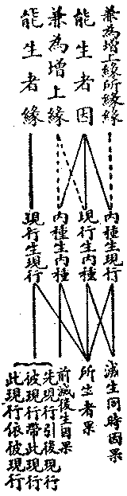
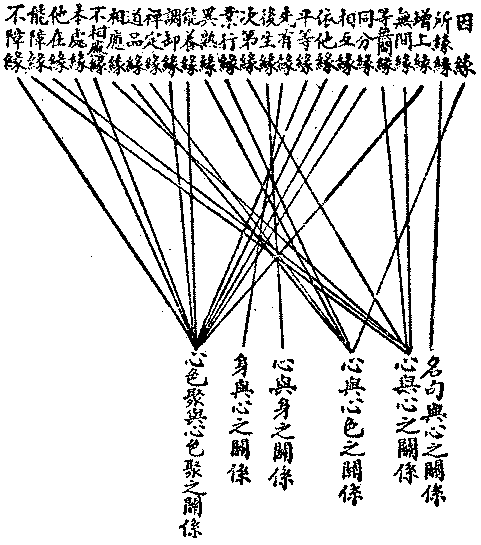
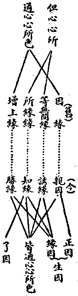
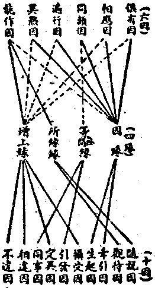
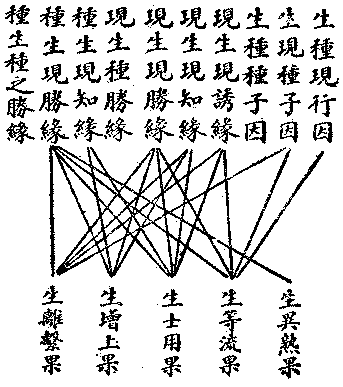

# 第一節　因緣生果

## 目錄

- 一　因緣生果概論
- 二　因緣生果與業力
- 三　因與緣之定義
- 四　因之分折
- 五　緣之分析
- 六　果之分析
- 七　因與緣及果之關係


## 一　因緣生果概論

因緣生果，為佛說之普通定量，無一經論不談及之。然有三義必先認清：

甲、有情造因受果之自由性。增一阿含經云：世有三種邪見，信之者雖德行無虧，然必至於對自己之行為不負責任。一、謂人生所有苦樂或非苦樂純粹由於前定——即宿命說——；二、謂是由神意規定——真神造作主宰萬有之說——；三、謂由於機運——遺傳、環境等科學說——。既由夙命、神意、機運。則殺人、盜財、姦淫等皆可推歸夙命、神意、機運——馬克思唯物史觀即將人之過惡等歸以機運，逃避自身之責任者——；則分辨行為之善惡，既屬無謂，而有過者之改惡為善，亦成不可能之事。此經所說明者，一事之果必有其因。然有情者自受其果，亦由自造其因；有其因則有其果，雖為當然之數運，然造因固在現前活潑潑地一念心之自由決擇也。因可自由決擇而造，則為善為惡之權責歸己，而受福受罪皆自致，亦無所用其怨禱矣。

乙、因果律之無始終性。佛學中因果通三世之說，言因果之相生，如環無端，無起始亦無終止也。由此乃否定除佛以外諸家所立之種種原極因或第一因，茲錄俱舍論文，略明其義：

一切世間，唯從諸因諸緣所起，非自在天——同耶、回教之神——、我、勝性等——等於太極、自然、以太、電子之類——一因所起。此有何因？若一切成許由因者，豈不便捨！一切世間由自在等一因生者，則應一切俱時而生，非次第起；現見諸法次第而生，故知定非一因所起。若執自在隨欲故，然謂彼欲令此法今起，此法今滅，此于後時，是則應成非一因起，亦由樂欲差別生故。或差別欲應一時生，所因自在無差別故。若欲差別，更待餘因不俱起者，則非一切唯用自在一法為因。或所待因，亦應更待餘因差別，分次第生，則所待因應無邊際。若更不待餘差別因，此因應無次第生義，則差別欲非次第生。若許諸因展轉差別，無有邊際，信無始故，徒執自在為諸法因，不越釋門因緣正理。若言自在欲雖頓生，而諸世間不俱起者，由隨自在欲所生故，理亦不然！彼自在欲前位與後無差別故。又彼自在作大功力，生諸世間得何義利？若為法喜生諸世間，此雖離餘方便不發，是則自在于法喜中，既必待餘，應非自在。於喜既爾，餘亦應然，差別因緣不可得故。或若自在生地獄等，無量苦具逼害有情，為見如斯發生自喜。咄哉！何用此自在為？依彼頌言誠為善說：『由險利然燒，可畏恆逼害，樂食血肉髓，故名魯達羅』。又若信受一切世間唯自在天一因所起，則為非撥現見世間所餘因緣人功等事。若言自在待餘因緣助發功能方成因者，但是朋敬自在天言，離所餘因緣不見別用故。或彼自在要餘因緣助方能生，應非自在。若執初起自在為因，餘後續生待餘因者，則初所起不待餘因，應無始成。猶如自在，我、勝性等，隨其所應，如自在天應廣徵遣。故無有法唯一因生。奇哉！世間不修勝慧，如愚禽獸，良足可悲！彼彼生中別別造業，自受異熟及士用果，而妄計有自在等因。

此論破除二執：一、唯一大因執，二、自在實體執——實質論——。莫非眾因緣起故，無唯一大因，亦無自在實體。除佛以外，諸家之因果說，皆建設於唯一大因與自在實體之上者。佛學全破除此，故逈然不同也。

丙、因果律之無超越性。無為法雖可說非因果性，然無為法即諸法之真相，非諸法外別有其體。故諸法無論為心法、心所有法，以至色法、心不相應行法，從此索訶剎以至十方無量剎，從六生雜居地——即五趣雜居地——以至佛界，莫非因果律之所範持者；雖佛亦不能超越及改變於因果律。若了知於因果律，則能刱造善因，和集善緣，生於善果。因不值緣，終不生果，故因亦非必能生果。或遠其助緣，或別造強因，皆可使此因之果暫不生起，或終不生起。故此無超越性，與前之自由性相應無違。除佛以外之諸家，雖亦說或種因果關係，然必認有大神或真我或元質、元力等，超越於因果律之外。佛法全異乎是，雖諸聖者以神通力可令現實發生變化，此神通力亦是因緣所生之果，復能為生果之因及緣者。譬如科學知識增進，能用原料造望遠鏡——例天眼通——、飛行機等，變更自然形物，說為奇蹟，同是奇蹟：說為不超越因果律，同為不超越因果律，以皆因緣所生之果，復為生果之因緣故。先知此三種之特義，乃可進論佛說之因緣生果義。

## 二　因緣生果與業力

佛法以因果律應用為有情行為責任——即倫理學——之根據。故於說因果時，亦時說業。謂由某業為因生於某果，因果隨業力為轉移。某業既成，某果必致，故有時亦說其果為業果。然此業之一名，考其初義，乃指有情或人生行為曰業。就行為之所依，分身、語、意三業；就其性質，分善業、不善業、無記業；就其所招果報，分福業、非福業、不動業；就其可能招感心身、器界之果，分為別業，共業之二；復由招果力之強弱，分為引業、滿業之二。此諸行業，成熟有力能招果時，亦曰業力。然在狹義，唯說能招「異熟果」之行為曰業，由此所招異熟果名「業果」。「業」之招「果」，必在異時，至招果時，其業已為先業。若由現時行為及他人等關係所致之果，則非業果——非異熟果。那先比丘告彌蘭陀王云；『如一塊土被人擲空，復落於地，此由現因，非大地先業之所招。由此應知佛陀之足，曾為石擊，亦非佛陀先惡業行所招之果。復如人死，有因先業力盡而死，亦有由現所行能毀先業非時而死，或及時而不死』。此中所云之業，唯前六識相應思之一分，能招感異熟之果者，且必由第六識相應思主導而成也。若其廣義，則無漏行得離繫果，亦可謂為清淨業之所致。由現所行得士用果，亦可謂為現業所成之果。至於凡動皆業，有為諸行無時不動，則若因若果無非是業。若循其本，則應以能招異熟果之「有情行為」名業耳。此業亦為因緣之一，或以為情器身剎皆唯業之所產生；或以為業但與有情相關，而與器界絕無關係。應知兩俱誤解。其實色、心諸法，各由一切種識中之自類種生；然和續成各地各趣之有情器，又皆由業種為增上緣力，故身器之變遷成壞，與業深有關係。變有情身業曰別業，別別造業自受異熟果故；變器世間業曰共業。大小乘經各公認器世間能壞已復成者，由過去時一切有情共同業力而集起故。共業即社會業，社會非個人之集合，必須於諸個人間有共同關係之行為與生活，乃曰社會，故社會即共業。一家庭、一學校、一職團、一民族、一國群、一人間有其共同關係行為，即有共業；由此共業，即能轉變家與國等或良不良。擴充為一大千界有情之共業，即能為一大千界壞已復成之共業。此維摩詰經廣導諸有情共同行善，以為修淨土之旨也。近人大抵注重於階級、民族、國家之共業，為階級民族等意識或行為之研究，要為共業之研究耳。別業荒淪，故鮮安樂之人，共業拘治，間成富強之國。必提高各人之別業，擴充為人間之共業，則人間世庶能進化為優良也。

## 三　因與緣之定義

因與緣之二名，雖見於各素呾纜中，每值一事，輒曰以此因以此緣生起，而因為何義？緣為何義？則未刊定也。錫蘭巴利文論藏，則專指貪、瞋、癡為「有因」，而以貪、瞋、癡所引起之某種心作用，則謂之「因」；其餘各種之因果關係，則概謂之「緣」，列為二十四緣。然對於因與緣猶未定也。薩婆多部始刊定二名之意義：因謂正因，專指親能生者，緣謂助緣，泛指相依扶者。例如播種於地，藉水土日光肥料工作等，長成一樹，種子是因，地等則皆是緣。何等事物，須何等因及何等緣，因非一因，緣非一緣，不能指定某事為因或為緣也。然對因與緣之定義，猶未精確。大乘法相始論定之：親從彼體辦生此體，此體之外別無彼體，故言彼體為此體因，而此體為彼體之果。此唯一切種識中種子生現行、現行生種子、種子生種子，有此因果關係。除此以外，皆不能有，故唯此是因而其餘皆非因也。此體雖仗彼彼引依扶助而獲生成，然此非彼而彼非此，先後內外相排列者，則皆是緣而非是因。換言之、即現行與現行之關係，皆是緣而非是因也。茲更表列於左：




由此可知現行之事，皆以內種為因；然亦依託眾多現行為緣而獲生起。無因固不能生，無緣亦不能起，故曰因緣生果。果為現行之事，現行之實事皆因緣所生，其義如是。彼因與緣雖各有其定義，然各經論立說多歧，應再分析言之。

## 四　因之分折

梵文大小乘論，多說六因，然說明之義不同也。茲依俱舍所說列之：


```
　　　　┌─────┬────────────────────────────┐
　　　　│　同時因果┘┌──一、俱有因…………指一果事俱有諸因法是──────┤
　　　　│　　　　　　│　　二、相應因…………特指一心王或一心使相應之心心所─┘
　　　　│┌───因─┘　┌三、同類因…………指一果事之同三性同五位同九地諸能生法
　　　　││異時因果───┼四、遍行因…………指遍為一切染法生起之因諸隨眠即煩惱
　　　　│└───────┴五、異熟因…………指能生將來世苦果樂果之善惡因
　　　　│　　　　緣───┬六、能作因…………泛指此事彼事能互作順違之關係者
　　　　└────────┘
```


依前所說因與緣之定義，此之六因，非但因也，亦兼說緣，但將因緣概括以分為六而已。在俱舍論則以前五屬因，後一為緣。細別於因，概略諸緣附為一因，故總謂之六因。以大乘之因緣定義審之，能作因固是緣，即前五因亦多是緣，真正之因猶未能說明也。瑜伽論等以十五依處說十因，亦是統因與緣而說為十因者。茲列於左：


```
　　　　　　　（十五依處）　　　　（十因）
　　　　┌……語　　　依處………隨說因……………………┐
　　　　├……領受　　依處………觀待因……………………┤
　　　　├……習氣　　依處………牽引因……………………┤
　　　　├……有潤種子依處………生起因……………………┼─能生因
　　　　│　　無間滅　依處…┐　　　　┌…………………│…┘
　　　　│　　境界　　依處…│　　　　：　　　　　　　│
　　　　│　　根　　　依處…│　　　　：　　　　　　　│
　　　　│　　作用　　依處…├…攝受因┤　　　　　　　│
　　　　│　　士用　　依處…│　　　　：　　　　　　　│
　　　　│　　真實見　依處…┘　　　　└…………………│…┐
　　　　├──隨順　　依處………引發因────────┤┌方便緣
　　　　├──差別功能依處………定異因────────┤│
　　　　├──和合　　依處………同事因────────┤│
　　　　├……障礙　　依處………相違因……………………┤│
　　　　├──不障礙　依處………不相違因───────┘│
　　　　└───────────────────────┘
```


能生因上長虛線之牽引因及生起因明正是因；單線之引發因、定異因、同事因、不相違因，表亦通因；虛線之隨說因、觀待因、攝受因、相違因，表雖是緣而亦兼作因。方便緣上長虛線之隨說、觀待、攝受、相違之四因，表正是緣；單線之引發、定異、同事、不相違四因，表亦通緣；虛線之牽引、生起二因，表雖是因而亦兼作緣。故準因與緣之定義，此十因亦每一因皆通因之與緣者。特牽引因指未成熟之種子，生起因指已成熟之種子，對於現行之事，故是親能生之正因。然內種生現行，除自種外，餘種亦通緣也。餘之八因，多分是方便緣。然在現行生自種，則無不是因，故又皆兼通於因也。此明概略，猶待另詳。

## 五　緣之分析

四緣本於長阿含經，為佛學中大小各派最公認之因緣分類。巴利文之二十四緣，亦冠以此四緣。茲且表列其名：




以心與名句等六種關係，說為二十四緣。然無間、等無間、次第，祗一等無間緣。所餘則皆從增上緣分立。其隸屬於六種關係，如名句與心固有所緣緣關係，然作所緣緣者不僅名句。故開列此二十四緣分屬六種關係，不應道理。今唯取公認之四緣以為準據，錄成唯識論最了義之說於此：

一、因緣：謂有為法親辦自果。此體有二：一、種子，二、現行。種子者，謂本識中善染無記諸界地等功能差別，能引次後自類功能，及起同時自類現果；此唯望彼是因緣性。現行者：謂七轉識及彼相應所變相見性界地等；除佛果善、極劣無記，餘熏本識生自類種，此唯望彼是因緣性。第八心品無所熏故，非簡所依獨能熏故，極微圓故，不熏成種。現行同類展轉相望，皆非因緣，自種生故。一切異類展轉相望，亦非因緣，不親生故。有說異類同類現行展轉相望為因緣者，應知假說，或隨轉門。有唯說種是因緣性，彼依顯勝，非盡理說；聖說轉識與阿賴耶展轉相望為因緣故。

二、等無間緣：謂八現識及彼心所，前聚於後，自類無間，等而開導，令彼定生。多同類種俱時轉故，如不相應，非此緣攝。心所與心雖恆俱轉而相應故，和合似一，不可施設離別殊異，故得互作等無間緣。入無餘心，最極微劣，無開導生，又無當起等無間法，故非此緣。云何知然？論有誠說：若此識等無間，彼識等決定生。即說此是彼等無間緣故。

三、所緣緣；謂若有法是帶已相，心或相應所慮、所託。此體有二：一親，二疏。若與能緣體不相離，是見分等內所慮託，應知彼是親所緣緣。若與能緣體雖相離，為質能起內所慮託，應知彼是疏所緣緣。親所緣緣能緣皆有，離內所慮託必不生故。疏所緣緣，能緣或無或有，離外所慮託亦得生故。

四、增上緣：謂若有法有勝勢用，能於餘法或順或違。雖前三緣亦是增上，而今第四除彼取餘。為顯諸緣差別相故，此順違用於四處轉，生、住、成、得四事別故。然增上用，隨事雖多，而勝顯者唯二十二，應知即是二十二根。

此之四緣，第一因緣是因，後之三緣是緣。以因附說於緣，故總謂之四緣。但於名義猶待論定，欲正其名而順其義，第一因緣應改「親因」，是親能生因故。等無間緣改稱「誘緣」，無論開避或為引導，皆可誘起次後之類聚故，舊論限於心心所聚，今亦通於色聚，以同佔一處之色聚，前不開避後亦不能生故。所緣緣今改稱「知緣」，能緣所緣今稱能知所知，故所緣緣即能知緣。然所緣緣僅顯能知必以所知為緣，未顯所知必以能知為緣，故唯心心所法乃有此緣。今曰知緣，則亦通於心色，以色雖非能知，然必是所知故。增上緣今改稱勝緣，除上誘緣、知緣之外，所餘之緣展轉無盡，不能遍舉，故祇可選其於順違有勝勢用之事，標立為勝緣耳。此於「親因」「勝緣」，但正其名，不渝其義，誘緣、知緣，通色心法，則為義亦殊矣。茲再對列於下：




## 六　果之分析

因與緣之分析既明，當更分析因與緣所合生之果。所知現實成事與諸蘊素．皆是所生之果，且於一果必為因與緣合生故。對因論果，果之為義亦非一類，茲出諸論通說之五果焉。俱舍論等分別繁細，今引成唯識論略明其相：

此之五果，今就人事以示其義：


```
　　　　　┌對招感為人先業勝緣……………………………………曰異熟果
　　　　　│向習善今性善，向修福今享福…………………………曰等流果
　　　　人┤由人以諸工具，造衣食住及國家等……………………曰士用果
　　　　　│國政良窳，令人民苦樂等………………………………曰增上果
　　　　　└能修佛法斷煩惱障，證人空等…………………………曰離繫果
```


除離繫果為特殊之果外，其餘四果皆可通於情器、色心諸法。無論何種果相，皆可歸納於此。有論別立四種之果：一、安立果：如水輪是風輪之果，乃至草木是大地之果等。二、和合果：如造色是四大之果，眼識是眼根之果等。三、修習果：如修靜慮能變化心身等。四、加行果：如修四尋思觀，能引如實智等。然此亦為增上果或士用果之流類，隨事分別可無量種，故不須別立之。所說境行果之果，即是離繫果，亦可通於等流、士用、增上之果，但非是異熟果而已。何者？異熟之果不離於三界繫，離繫則非異熟果故。

## 七　因與緣及果之關係

前說六因、十因、四緣、五果，今再互柤觀其關係：




十因與四緣之關係，隨勝示其如此。據實，十因皆通因緣及增上緣、等無間緣或所緣緣，隨應不定。然今說因與緣，當以改正四緣所立之一因三緣為準則。故論因緣生果關係，亦持此為據焉。一、親生因、隨其親生之果不同，亦可分為三類：

合此三類，統為一親生因。現行生現行，則但緣非因也，種現相生，對於誘緣、知緣、勝緣，表其關係如下：

誘緣唯現行生現行有之，現行生現行是親因所無，此為其大較之分別。以此三因七緣，以觀所生五果，其例如下：




自類現行為生自類種因，自類種子為生自類種因，他類現為生自類種勝緣，他類種為生自類種勝緣，除無為法皆可有之。今談五現行果故不列之。異熟果、是由善惡業種所生無記果，故唯他類種所生現行果，不通自類種生自類現行。又唯先業所引，故非現生現之三緣。屬現行果故非種生現之知緣。若論生異熟種，則亦為現生種勝緣；論異熟種為藏識之所知境，亦為種生現之知緣。等流果、正為自類種所生之自類現，亦通現生現自類前後相續之誘緣；由先不殺今長壽等，亦通種生現、現生現勝緣。士用果、通現生現三緣，及種生現二緣之所生。現生現、種生現諸勝緣，正生增上果，然能知所知緣，亦能生增上果。若無漏道為離繫果，則通無漏種因及現生現三緣，與種生現勝緣所生；若無為法為離繫果，則非所生，但由無漏道為能知緣之所開顯耳。此之所談，雖無教證，推理則應然也。

