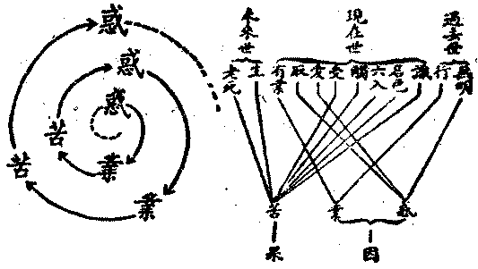
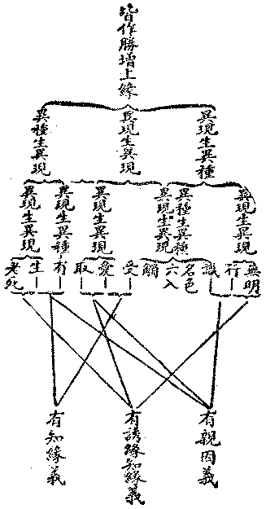
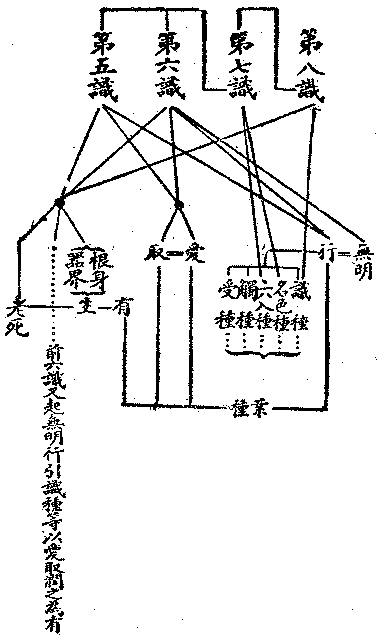

# 第二節　因緣情器

## 目錄

- 一　因緣情器概論
- 二　情器之十二緣起
- 三　巴利文之業感緣起說
- 四　俱舍論之業感緣起說
- 五　三世緣起之惑業苦環
- 六　通大乘之無明緣起說
- 七　法相大乘之二世緣起說
- 八　二世緣起之因緣果辨
- 九　二世緣起之業力說


## 一　因緣情器概論

因緣所生之果法非一事，今先說因緣之生起有情、器界，人等有情及其所依資之器界，此為已生成之事實，現前共見共知，而欲索其以何因緣而得生成者也。世論於此，有三種之說明：一者、神本之退化論：謂未有情器之前本唯一大神，神初造作器界，有情亦在神前享受安樂，嗣因所造有情不循教令，違背神意，乃罰之於人世以償其罪。若能虔遵神教，求神赦罪，尚可還之神處。否則更降重罰，使入地獄。故人等有情器世間，以神為本，背神退化而致。若能返本還元，則依然是唯一之大神也。二者、物本之進化論：謂諸器有情未生成之際，但為極微之電氣——略同太極、陰陽——、或原子——略同四大極微——，由相吸相拒之質力，漸成太陽諸星以至地球。地球凝流諸質與太陽光熱之變化，漸生單簡之植物與動物。生生不已，展轉進化，遂產生高等之植動諸物，以至有人類之出生。人類或將更進化以為超人類。然至地球衰老不能有生物時，人類與諸生物盡歸消滅，地球與太陽諸星亦消毀，則還為極微之原質。故人世以物質為本，進化而成，然一達其期限，不能永保其進化也。三者、物我為本之幻合論：謂諸有情，本各為一無形之神我，而諸物質亦本共為一無形之體——數論謂之自性、冥性、勝性，略同太極。偶因各神我不安其本位，向外邊要求其受用，由是無形物體亦失其平衡相，生諸物質原料，供給為神我所受用之肉身及器界諸物；由神我與物體幻合為人等諸情器，流轉不能脫離。如覺悟其幻合之苦，由神我不復要求外邊任何之受用，則神我與物體可脫離各歸無形之本位，是謂解脫。神本退化論出於俗情世間之推想，物本進化論出於科學世間之推想，物我幻合論出於禪定世間之推想，在佛學中皆破斥為外道邪見；於是乃示以因緣所生之正義。

## 二　情器之十二緣起

正因生果，固須明識種生現行、與現行生識種之等流因果相。然今此所言之有情身器，乃和合連續之假者——多法和合連續之假者，即各個之個體物，俗情所認為一人一犬一蟲一草一石一星之動植物礦物是——，猶未能注意到各識種各生現行之因果。且先應究明以何勝緣而得成為各個和合連續之假者。此勝緣所生果，謂之異熟緣果，謂由異熟之勝緣故，範成三界、九地、六生諸類有情身器之差別果，及每類中各個身心資財之差別果。以其差別之故，所成情器，或可愛樂，或可憎厭，個個不同，間以相似而有同類；類類不同，更以相似而又有大同類。不共業為勝緣所招感，有各類各個之有情身差別；共業為勝緣所招感，有各國各報境、各星球各界地之器世間。累而積之，總為三界有情身器之差別果。而佛法則說明為十二種勝緣之所生起，謂之十二緣起。其名相已列前諸法施設節中。十二緣起，本於佛說諸素呾纜，其辭渾圓，可以之說一有情之流轉，亦可以之說有情身器之流轉。厥後諸論師隨其智量之不同，解說之有淺深狹廣之異。業感緣起，無明緣起，空智緣起，真如緣起，此諸緣起說皆出於此十二緣起義。過去現在因果經云：

爾時、菩薩至第三夜，觀眾生性——眾生但指有情，或亦通指無情器物——，以何因緣而有「老死」？即知老死以生為本，若離於生則無老死。又復此「生」，不從天生——即不從唯一大神生——，不從自生——即不從神我生——，非無緣生——即不從無生命之物質生——；從因緣生，因於欲有、色有、無色有之業生。又觀彼「三有業」從何而生？即知三有之業從四「取」生——欲取、見取、戒取、我語取——。又觀四取從何而生？即知四取從「愛」而生。又觀愛從何生？即知愛從「受」生。又觀受從何生？即知受從「觸」生。又觀觸從何生？即知觸從「六入」而生。又觀六入從何而生？即知六入從「名色」生。又觀名色從何而生？即知名色從「識」而生。又觀識從何生？即知識從「行」生。又觀行從何生？即知行從「無明」而生。若滅無明則行滅，行滅則識滅，識滅則名色滅，名色滅則六入滅，六入滅則觸滅，觸滅則受滅，受滅則愛滅，愛滅則取滅，取滅則三有業滅，三有業滅則生滅，生滅則老死憂悲諸苦滅。

三有業感生三有情器——三有即三界——之果報，本通有情器界而為言也。然小乘志在有情各自之解脫，乃專從各有情三世業感之生死說明之，茲先出其說焉。

## 三　巴利文之業感緣起說

南方上座部巴利文論藏，曾言比丘之欲除老死諸苦者，當進究心身——即名色——發生之因緣，猶智巧之醫欲治病而先診其病源。乃尋求此心與身非無因而有，此色身之生起以無明、愛、取、行四者為因，由此四者而生色身。生已以食為資養緣，合為「色身」生存之因與緣。更進求「心」識生起之因緣，以眼為所依，以色為對象，則眼識生；乃至以意為所依，以法為對象，則意識生。既知身之與心之緣起理，則知心身性唯緣起。現在身心如是，過去未來心身亦復如是。即心識之生以色根為緣——即觸受以六入為緣——，根身之生以無明、愛、取、業行為緣。無明、愛、取，由心不覺緣起無我理生，依之生起業行，為生身心之間接緣。而心身身心——即識、名色、六入、觸、受、生支——之「生」起，尤以行業為直接緣。由有漏善惡業行之差別，乃感生諸類諸個身心之差別。故生起身心最重要之因緣，確在乎行業。對于能感生身心之業力，遂不可不為深切之研究。乃將業之生果效力，從時間、功用、性質之三種標準，各分為四，共成十二單位。茲列於此：


```
　　　　　　　　　┌急　效　業………即果報不出今生之業，今生不報，即失其
　　　　　　　　　│　　　　　　　　效。
　　　　　　　　　│緩　效　業………即來生始受果報之業，如被他奪，來生不
　　　　依時間所分┤　　　　　　　　報，即失其效。
　　　　　　　　　│無定期效業………將來任何一生皆可受報，除非未受報已證
　　　　　　　　　│　　　　　　　　擇滅，乃無效。
　　　　　　　　　└已失效力業………前三類中，本身力薄，或被他強業抵銷
　　　　　　　　　　　　　　　　　　者。
　　　　　　　　　┌能　生　業………此業起為「有支」即隱失，或被他業所奪
　　　　　　　　　│　　　　　　　　即不能再活動。
　　　　　　　　　│能　持　業………此業能扶持前一業，使完成所生之身心。
　　　　依功用所分┤能　消　業………此業能使前兩種業無效，善業惡業均可取
　　　　　　　　　│　　　　　　　　銷。
　　　　　　　　　└能　毀　業………此業更強，能將正在活動及待發之業連根
　　　　　　　　　　　　　　　　　　拔除者。
　　　　　　　　　┌極　強　業………此為或善或惡之極強業，有力能作前四功
　　　　　　　　　│　　　　　　　　業，例惡業能銷毀善業。
　　　　　　　　　│近　死　業………此為決定來生受何果報之業，即死時現起
　　　　依性質所分┤　　　　　　　　受生之強業。
　　　　　　　　　│習　慣　業………此為一生言行思之慣習，若死時無別強業
　　　　　　　　　│　　　　　　　　，此亦能為近死業。
　　　　　　　　　└累　積　業………無始所積善不善無記業，若無強業，此亦
　　　　　　　　　　　　　　　　　　為近死業，繁奧難了。
```


由可失效及可消毀，故非命定而有自由迴轉餘地。由無始積累之業力繁廣，深奧難分，非佛陀之全智不能洞達，故人生等，亦不能操自由之全權也。由此一般為漸令不受三有之生者，主隨緣消舊業，唯不更造感生三有果之新業，則自得解脫耳。

## 四　俱舍論之業感緣起說

俱舍論以苦品、業品、煩惱品說有漏因果，即是明三界有情身器，如何由有煩惱之業為因緣而生起也。嘗以人之一生，關於前生及來生者說明十二緣起支之順序：


```
　　　　　　┌無明………此是前生不明緣起無我之理，起諸煩惱。
　　　　前生┤
　　　　　　└行…………此是前生由無明煩惱所造之善不善業。
　　　　　　┌識…………此是由前生業力，引託母胎最初之心識。
　　　　　　│名色………此是由識託胎後在初四星期中之胎兒心身狀態。
　　　　　　│六入………此是胎在四星期後至出母胎所歷身根生成狀熊。
　　　　　　│觸…………此是嬰兒初生二三年中與器界接觸之心境。
　　　　現在┤受…………此是四五歲後知苦樂之感受心境。
　　　　　　│愛…………此是十五六歲後，知男女戀愛及其他欲愛之心行。
　　　　　　│取…………此是二十歲後，欲愛更強盛之心行。
　　　　　　└有…………此是由愛取驅使作種種行業，為來生感三有果之業。
　　　　　　┌生…………此指今生老死後，由能感三有之業更感引心識投胎，生
　　　　來生┤　　　　　來生身心。
　　　　　　└老死………此指所生來生身心，仍有老病死等諸苦。
```


要之、直接感生今生與來生之有情果者，唯在能感三有果之行業。故於業亦為深細之研析，列之於下；

此中所說之業，與前有不同之特點，在於共受業與環境業之設立。此種即為自他互相關係之社會業。由此業乃不唯感生個別之身心，亦感成共同之器界也。

## 五　三世緣起之惑業苦環

以十二緣起支，配為三世因果，併合為惑、業、苦，三事連結如環，輪轉相續而不可解。此大抵為小乘或除法相大乘之共通說。亦立為表以明之；




如此惑、業、苦、惑連結輪轉之環，其來無始，其往無終，故成為一條生死相續無始無終之生命旋流；連環不可解而可解，解之則在斷惑而消業也。依此三世果因因果，曾有人立一補充表如下；


```
　　　　　　　　┌果…………生老死或與相等之識名色六入觸受
　　　　　　過去┤
　　　　　　　　├因…………無明行或與相等之愛取有
　　　　過去現在┤
　　　　　　　　├果…………識名色六入觸受或與相等之生老死
　　　　　　現在┤
　　　　　　　　├因…………愛取有或與相等之無明行
　　　　現在未來┤
　　　　　　　　├果…………生老死或與相等之識名色六入觸受
　　　　　　未來┤
　　　　　　　　└因…………無明行或與相等之愛取有
```


除此三世緣起，更有剎那緣起，無量世緣起說，其義可以推准，茲不繁述。

## 六　通大乘之無明緣起說

觀三界有情身器之緣起法性而洞達其本空無我，此佛陀之妙悟境也。以人等有情莫脫於老死諸苦，乃在於莫知其所從出之有情身器而生。然究此情器之所生，則由先世之煩惱業，拘使心識，託生一生心色之聚；漸次身心發育，復起煩惱與業，蓄在心識；此生之後拘使再生，為別個或別類之一生心色聚。如此成為生滅滅生相續不已之生命流。然此生命流之本依，則心識也。欲滅老病死等苦，必不容身心等之再生，欲此身心不生，必不起煩惱而造業，推至其本依，必滅心識而後可。然心識本有，而無始剎那剎那相續，非可斷滅之法，惟推求所以致心識有諸類差別，及拘限於一生一生之死環者，則專欲避苦趣樂之身語意業「行」也。心識無始，此業行亦與之無始。然此業行，乃緣不知緣起無我，執身等為實我法之「無明」而起，執內實我，執外實物，遂於順違俱非之感受，起作避苦趨樂種種善惡之行業；由此心識為所拘牽而生身心老死諸苦。故究探苦源，乃在無明也。無明滅則煩惱之業行滅，心識不受拘牽而受生死，一切諸苦遂皆擇滅。以此觀三界有情身器，皆是無明為勝緣而起，謂之「無明緣起」。然擇滅無明者，則由於洞達身等緣生無我之生空或法空慧，由證二無我之空慧為勝緣故，明了及擇滅無明等煩惱業苦，起諸清淨行果，故此謂之「空慧緣起」。然此空慧，又緣了知緣起諸法本空無我之真如性而起。不了真如性即「無明」，了知真如性即「空慧」。由迷或悟真如性故即無明緣起諸染法、及空慧緣起諸淨法，故亦謂之「真如緣起」——或云法性緣起。天台教觀，每說無明、法性互依而起諸法，是合空慧、真如謂之法性，知不相應法性即謂之無明也。故佛陀妙悟境之緣起性，甚深甚深，難可窮了。

## 七　法相大乘之二世緣起說

瑜伽等大乘法相論，對前三世緣起說為二世緣起。茲先錄成唯識論文為據：

然十二支略攝為四：一、能引支：謂無明、行，能引識等五果種故。此中無明，唯取能發正感後世善惡業者。即彼所發，乃名為行，由此一切順現受業，別當受業，皆非行支。

二、所引支：謂本識內親生當來異熟果攝識等五種，是前二支所引發故。此中識種，謂本識因。除後三因，餘因皆是名色種攝。後之三因，如名次第即後三種。或名色種總攝五因，於中隨勝立餘四種。六處與識，總別亦然。集論說識亦是能引，識中業種名識支故，異熟識種名色攝故。經說識支通能所引，業種、識種俱名識故，識是名色依非名色攝故。識等五種由業熏發，雖實同時，而依主伴、總別、勝劣、因果相異，故諸聖教假說前後；或依當來現起分位有次第故，說有前後。由斯識等亦說現行，因時定無現行義故。復由此說生引同時，潤未潤時必不俱故。

三、能生支：謂愛、取、有，近生當來生老死故。謂緣迷內異熟果愚，發正能招後有諸業為緣，引發親生當來生老死位五果種已；復依迷外增上果愚，緣境界受發起貪愛，緣愛復生欲等四取，愛取合潤能引業種及所引因轉名為有，俱能近有後有果故。有處唯說業種名有。此能正感異熟果故。復有唯說五種名有，親生當來識等種故。

四、所生支：謂生、老、死，是愛取有近所生故。謂從中有至本有中，未衰變來皆生支攝。諸衰變位總名為老，身壞命終，乃名為死。

老非定有，附死立支，病何非支？不遍定故。老雖不定，遍故立支。諸界趣生除中夭者，將終皆有衰朽行故。名色不遍，何故立支？定故立支。胎、卵、濕生者，六處未滿定有名色故。又名色支亦是遍有，有色化身初受生位，雖具五根而未有用，爾時未名六處支故。初生無色雖定有意根，而不明了未名意處故。由斯論說十二有支，一切一分上二界有。愛非遍有，寧別立支，生惡趣者不有彼故；定故別立。不求無有生善趣者，定有愛故；不還潤生愛雖不起，然如彼取定有種故。又愛亦遍。生惡趣者於現我境亦有愛故。依無希求惡趣身愛，經說非有，非彼全無。

何緣所生立生老死，所引別立識等五支？因位難知差別相故，依當果位別立五支。謂續生時因識相顯，次根未滿名色相增，次根滿時六處明盛，依斯發觸，因觸起受，爾時乃名受果究竟；依此果位立因為五。果位易了，差別相故，總立二支以顯三苦。然所生果若在未來，為生厭故說生老死；若至現在為令了知分位相生，說識等五。何緣發業總立無明，潤業位中別立愛、取？雖諸煩惱皆能發潤，而發業位無明力增，以具十一殊勝事故。謂所緣等，廣如緣起經說。——一、所緣殊勝，遍緣染淨故；二、行相殊勝，隱真顯妄故；三、因緣殊勝，惑業生本故；四、等起殊勝，等能發起能引能生所生緣起法故；五、轉異殊勝，隨隨眠、纏縛、相應、不共四轉異故；六、邪行殊勝，依苦集諦起增益損減行故；七、相狀殊勝，微細自相遍愛非愛共相轉故；八、作業殊勝，作流轉所依事、作寂止能障事故；九、障礙殊勝，障礙勝法故；十、隨轉殊勝，乃至有頂猶有轉故；十一、對治殊勝，二種妙治所對治故——。於潤業位愛力偏增，說愛如水，能沃潤故，要數灌溉方生有芽。且依初後分愛、取二，無重發義立一無明。雖取支中攝諸煩惱，而愛潤勝，說是愛增。

諸緣起支皆依自地，然有所行依他無明，如下無明發上地行？不爾，初伏下地染者，所起上定應非行支，彼地無明猶未起故。從上下地生下上者，彼緣何受而起愛支？彼愛亦緣當生地受若現若種，於理無違。

此十二支，十因二果，定不同世；因中前七與愛、取有，或異或同；若二、三、七，各定同世。如是十二一重因果，足顯輪轉及離斷常，施設兩重，實為無用！或應過此，便致無窮！

此云十因二果，定不同世，即為二世之義。所云二世，過去世與現在世可，或現在世與未來世亦可。如此二世二世連續不斷，即成非斷非常之流轉義。故不須如前述之以十二緣起，分配三世為二重因果也。茲者表示於下；


```
　　　　　　　　　┌無明┐
　　　　　　　　　│　　├能引支┐
　　　　　　　　　│行─┘　　　│
　　　　　　　　　│識─┐　　　│
　　　　　　　　　│名色│　　　│
　　　　　　　　　│六入├所引支├─十因
　　　　過去或現在┤觸─┤　　　│
　　　　　　　　　│受─┘　　　│
　　　　　　　　　│愛─┐　　　│
　　　　　　　　　│取─┼能生支┘
　　　　　　　　　└有─┘
　　　　　　　　　┌生─┐
　　　　現在或未來┤　　├所生支──二果
　　　　　　　　　└老死┘
```


然佛陀之施設十二緣起，乃依現前之老死諸苦為解脫，故逆次觀之立此十二支，則當於生死支屬現在世，其餘十支屬過去世。知現在二果支，起於過去之十因支，則現在如不起無明、愛、取，發業潤生，則未來即無生死矣。

## 八　二世緣起之因緣果辨

前此諸緣起說，嘗未辨定是因或緣所生果義。然說此十二緣起支，在明諸類有情身器以何為勝緣而生成死壞，雖不離自種生現、自現生種之等流因果，而旨在異現生種異種生現之異熟因果。此義唯大乘之二世緣起辨之，故成唯識論云：

諸支相望，增上——勝緣——定有，餘之三緣有無不定。緣起經依唯定有者，說唯有增上緣——今取此說——。愛望於取，有望於生，有因緣義。若說識支是業種者，行望於識亦作因緣，餘支相望無因緣義。而集論說：無明望行有因緣者，依無明時業習氣說，無明俱故，假說無明，實是行種。瑜伽論說：諸支相望無因緣者，依現行愛、取及唯業為有支說。無明望行，愛望於取，生望老死，有等無間及所緣緣。有望於生，受望於愛，無等無間，有所緣緣。餘支相望，二俱非有。此中且依鄰近順次不相雜亂實緣起說。異此相望，為緣不定，諸聰慧者如理應思。

依此論文，分辨因緣之所生果，當如下圖所示：




按今遵瑜伽義，當依現行愛支，為現行取支之勝緣。又唯以識種為識支，唯以已潤之業種為有之，故應說諸支之相望無因緣義。雖間有誘緣、知緣義，此但兼帶而非要緣。故可如緣起經所說，十二支相望但有增上勝緣也。生死二支之果，亦唯是異熟勝緣所生之真異熟、及異熟生果。

## 九　二世緣起之業力說

業通有漏、無漏，此明生有情器界果之緣，故但說有漏業。業為直接能引種——行支——、生現——有支——之近緣，無明、愛、取等煩惱為間接能引種——無明發業——，生現——愛取潤生——之遠緣，故餘處亦假說業之近緣為因，無明等遠緣為緣也。其實乃近緣、遠緣之分耳。所謂生死相續，由惑、業、苦——發業潤生煩惱名惑，能感後有諸業名業，業所引生眾苦名苦——是也。近緣之業，隨其力之強弱，判引業與滿業。所謂福、非福、不動，諸有漏善、不善業及其眷屬，同招引、滿異熟果故，亦立業名。前說行支，唯取無明所發正感後世善惡之業，即是引業；揀除順現受業——非異熟業、別當受業——感別報之漏業……皆非行支，則唯取引業以為行支也。不唯行支，即有支亦唯愛、取所潤之能引業種。巴利文論藏為「發」與「緣」之區別，其所謂發，亦專指能發引業之惑及引業以言。引業即能引生後世有情身器之總果者，生起後世有情身器之總果體，此為最先必須獨一之強勝緣。各因緣種唯在其範型中各生現行，餘業——滿業等——亦但隨之以生餘異熟果。故行、有支之業，獨取引業，且特名為發也。諸業纔起無間即滅，能招當異熟果，以熏本識起自功能，成為業種，展轉相續，至成熟時招異熟果。然此引業亦通別之與共。別業、能引識種、名色等種，及能生真異熟識與根身；共業、能引共相種及能生器界。而滿業中之別共業，則助生身器別別諸分以成滿之耳。諸惑皆能發業——業即身語意等善惡行業——，然無明最能發引業之現行；諸惑皆能潤業，然愛取最能潤引業之種子；故依能發、能潤引業之現種以立無明、愛、取之三支。若非無明發引業之現行，則無引業種及引業現行所攝植之識、名色、六入、觸、受種；若非愛、取潤引業之種子，則不能滋長有力以拘牽識等五種生起某類某有情之身器。論云：有漏善業種，能招可愛果；諸不善業種，能招非愛果。隨二有支業種，令異熟果成善惡別。故前十支合為能生後二支之因緣也。能發及能潤引業現種之無明、愛、取，唯是前六識相應之煩惱，行業亦以前六識相應之思慮為體；且皆奉意識為霸主，故意識實操刱造未來生命之權力，所謂「動身發語此為最，引滿能招業力牽」是也。茲再製為一表，以明十二支之關係：




十二支中第七識之關係最少，除名色種或六入種中可有其種子，唯內隨第八識所生所繫，外為前六識染依耳。前六識皆重要，然發行之迷理無明，專屬於第六識；且前五識皆以第六識為主動，故唯第六識為最要。其次則為第八識之受熏持種，及為業種牽其種子親生異熟果之總體，變諸色種以為根身、器界，皆第八識之事。要之、作業唯第六識為最，發業、潤業及行業體皆屬此故；受果唯第八識為最，生果總體及生根身、器界皆屬此故。觀此，可瞭然於因緣所生之情器果矣。

