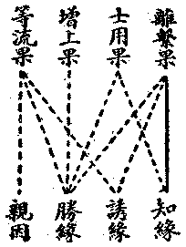

# 第三節　因緣佛剎

## 目錄

- 一　因緣佛剎概論
- 二　四諦與修三增上學
- 三　七賢與四向四果
- 四　境行果與三祇五位
- 五　三慧與三智
- 六　三因佛性與緣真二修
- 七　起信論之真如緣起說
- 八　維摩詰等之刱造淨土行
- 九　託於有漏之無漏因果
- 十　佛剎之因與緣分折


## 一　因緣佛剎概論

現實成事，一、為有情身器，二、為超情佛剎。前已說因緣所生之有情身器，今當說因緣所生之超情佛剎。按俱舍論嘗以賢聖品、慧品、定品之三品明之。有情身器之生起也，業為近緣，惑為遠緣，而所生之果為苦果。超情佛剎，慧為近緣，近能斷惑證真發諸清淨行故；禪定及施、戒、忍等為遠緣，遠能伏惑資發清淨慧故。所生之果，為常恆清淨自在之樂果，所謂涅槃寂靜樂，菩提覺法樂，及法身圓滿樂是也；亦即為五果中之離繫果。異熟果唯在於有情身器，離繫果唯在於超情佛剎。而等流、士用、增上之三果，則與親因及三助緣相望，可通於有情身器與超情佛剎。不證離繫之果則無常覺之樂，必斷異熟之果乃除生死之苦。斷果為真解脫，證果為大菩提；此之勝果，曰二轉依。證有證之因緣，斷有斷之因緣，非無端突然之所致。然此重在說明以何為緣而致離繫之果，雖不離自種生自現、自現生自種之等流因果，亦尚非此節之所專論也。

## 二　四諦與修三增上學

知苦、斷苦之集，證苦滅、修證滅之道。證苦滅為得離繫果，餘為得離繫果勝緣。知苦、即是知異熟果皆有老死諸苦，斷集、即斷除集起異熟果之業與惑，證滅、即為證離繫果，能知能斷能證之勝緣皆在於修道，道即菩提——正覺。所修之菩提分，可攝為戒、定、慧三增上學，其基礎在確持正見而立正信；換言之、即在知異熟之苦而確信之，分說為四念住：

此四皆增上之慧學。心心明記安住此淨慧中，止滅其違損淨慧之惡行，生長於順益淨慧之善行，則屬於尸羅——正譯清涼，意譯戒或律儀——，增上學之為四正勤：

四如意足、五根、五力、七菩提分，皆定與慧之增上學。定根、定力、及輕安、定捨，皆定學之增上相。增上者，殊勝也。由正見正信而修習之戒、定、慧，不同世間之倫理學——戒、及靜坐法——定、與理智學——慧，故云增上。而增上定學亦謂之增上心學，即心識之和平統一，謂之曰定。定心成就，能顯精神偉大之力，轉移心理；以至心理、物理使皆隨之發生變化，足以證明萬有唯心變現之理——定所引色——成為事實。故世人往往以得定心為得道，亦以定心為不可思議神祕事。然在佛學之系統中，定心亦為伏惑資發淨慧之勝緣耳。由前之慧、戒、定三增上學，至七菩提分發生無漏慧斷惑而證真如，是謂見道。進修三增上學平均之八正行，更斷餘惑，窮證真理，謂之修道。由是斷證漸臻究竟，至無學位，即成涅槃、菩提之離繫果，此通三乘以為言之。有經合三乘行果而說通十地，即乾慧地、性地、八忍地、見地、薄地、離欲地、已辦地、辟支佛地、菩薩地、佛地是也。

## 三　七賢與四向四果

其正信見能持戒律，將造修於增上定、慧，由七賢位向於四果——辟支佛乘傍此而立，無別開建，先五停心，終以世第一位之預流向。五停心者，收散放之心，暫停止於一境也。梵語毗缽舍那、此云觀；梵語奢摩他、此云止。止能觀心於所觀之一境，隨病制方，其法凡五：

隨自所宜，慣習其心，使停住所觀之一境。既能靜止乃依止而習觀：

由此增進有四加行——倍加功力之修行：

世第一即為預流向，入真見道——即見四諦——斷分別我執所起煩惱障，遂預聖流，成預流果——須陀洹，為斷證之初步。然至此則有進而無退矣，唯在人天，不復墮四惡趣。由是進修為一來向，證一來果——斯陀含，則於欲界人天唯一來而不再生矣。進修為不還向——阿那含，證不還果，則生色界無煩等天不還來欲界人天矣。進修為無生向，證無生果——阿羅漢，則再不於三界受生死矣。此小乘得涅槃離繫果之行也。

## 四　境行果與三祇五位

佛學通說境行果三，為得離繫果之次第。境、即能詮之教與所詮理，研教明理，照達現實事理；此即為所觀境，亦為聞、思慧悟解之境也。於境能正解而正信，要先歷修十信心位——十信心者：信心、念心、精進心、慧心、定心、不退心、回向心、護法心、戒心、願心是也——養成習所成之種性。於是正信成立，刱發求無上菩提之堅固大心，乃入三祇、五位。初阿僧祇劫有三位：一、資糧位，分十住、十行、十回向之三十位。


```
　　　　　　┌發心住…………此住由前十信心成。
　　　　　　│治地住　　　　　　　┌歡喜行　　　　　　　┌救護一切眾生回向
　　　　　　│修行住　　　　　　　│饒益行　　　　　　　│不壞回向
　　　　　　│生貴住　　　　　　　│無違逆行　　　　　　│等一切佛回向
　　　　　　│具足住　　　　　　　│無屈撓行　　　　　　│至一切處回向
　　　　十住┤正心住　　　　　十行┤無癡亂行　　　　十回┤無盡功德回向
　　　　　　│不退住　　　　　　　│善現行　　　　　　　│入一切平等回向
　　　　　　│童真住　　　　　　　│無著行　　　　　　　│隨順眾生回向
　　　　　　│法王子住　　　　　　│無得行　　　　　　　│真如相回向
　　　　　　└灌頂住　　　　　　　│善法行　　　　　　　│無縛無著回向
　　　　　　　　　　　　　　　　　└真實行　　　　　　　└法界無量回向
```


此三十位中，以修積隨順解脫之福慧等——即布施等六度——資糧為事，故名曰資糧位。二、加行位：此同小乘煖、頂、忍、世第一之四，然所修之觀智不同，定慧亦因之而大異。由四尋思觀引四如實智，甚深決擇諸法，證法空性，故此亦曰順決擇分。從發心住至此，猶是賢位。三、通達位，曰見道分：有真見道及相見道。從世第一引生出世無分別智，刱證遍行真如，曰真見道；於次剎那仿真見道而觀四諦諸法，曰相見道，總為此通達位，入通達位，始證大乘聖果。滿初阿僧祇劫，登極喜地，進於第二阿僧祇劫。四、修習位，即是十地：


```
　　　　通　達　　位┌一、極喜地……亦曰歡喜地
　　　　　　　　　　│二、離垢地
　　　　　　　　　　│三、發光地
　　　　　　　　　　│四、燄慧地
　　　　第二阿僧祗劫┤五、難勝地
　　　　　　　　　　│六、現前地
　　　　　　　　　　│七、遠行地
　　　　　　　　　　├八、不動地
　　　　　　　　　　│九、善慧地
　　　　第三阿憎祇劫┤十、法雲地
　　　　　　　　　　│　　　　……等覺地
　　　　　　　　　　└佛　　　地
```


極喜地至不動地為第二阿僧祇劫；不動地至十地圓滿而入佛地，即為第三阿僧祇劫。法雲地與佛地間，亦有別立等覺地者。然等覺地即法雲地入住出之出相，故合於法雲地，不須別立。解深密經等連佛地說十一地是也。五、究竟位，此即佛地：為最究竟之離繫果，亦為最究竟之超情佛剎，亦為真解脫、大菩提之二轉依。

## 五　三慧與三智

慧之與智，名異實同。然亦可假行支、有支，於未潤位之業曰行，於已潤位之業名有；於未強智名慧，於增盛慧名智，亦復如是。業通善、染，或漏，無漏，慧亦通於善、染，及漏、無漏。然異熟果業感之力為勝，果亦是業，故於業須為精細之分別。今離繫果則以智慧為能得之勝緣，果亦是智，故亦須於智慧為精細之分別。云三慧者：即聞所成慧、思所成慧、修所成慧是。簡稱聞慧、思慧、修慧。聞持遺傳教法所成之慧，謂之聞慧，功在記持文義。依所聞持文義，諦觀現實事理，亦依現實事理，審察聞持文義；數數思維，發生推比決知，謂之思慧。依聞、思慧矯正身語意等行業，檀那、尸羅、羼提、毗離耶、及修習禪那，使聞、思慧轉加增盛明淨，謂之修慧。此三慧能養成三乘之習所成種性。例瑜伽論，於聲聞等地之前說聞所成等三地。今專就大乘言，則攝大乘論等，謂聞法界等流法已，聞所成等數熏習故，漸能發深固心，趨求悟入；即說由此三慧，能成就十信心，入初發心住也。從是增進，歷十住、十行、十回向，集諸福智資糧，亦為修慧之事。經此長劫灌溉滋潤，於慧種中智芽怒萌，遂由三慧進論三智。云三智者：一、加行智，二、根本智，三、後得智。此三統云無分別智，以出過世間分別故——即超情義——。加行智在四加行位，雖尚為世間智，然加行智前前通於資糧諸位，後後通於修習諸地。近見道時，加行相顯，別立四加行位，非加行智但在地前。四加行智亦通地上，名無分別。又諸位中修加行智，莫不無間深觀二空無分別性，努力趣證，故皆得名無分別智。由四加行位之加行智，無間引生根本無分別智已，後於諸地起加行智，皆是無間引生根本智者，故名無分別智。親證根本之智曰根本智，為一切法根本者即真如，正證真如名根本智。真如是無分別，故證真如之根本智，正名無分別智。而後得智由根本智所引生故，出世間故，亦名無分別智。三慧及加行智是因後之二智，亦因亦果。因從刱聞正法，通至法雲地滿；果從初極喜地至佛地而圓滿。佛地謂之一切智智，亦謂之無上遍正覺。故智慧為離繫果之因緣，亦為離繫果之果也。

## 六　三因佛性與緣真二修

大涅槃經等說三因佛性：一曰、正因佛性，二曰、了因佛性，三曰、緣因佛性。佛性、言成佛之因性。據言：正因佛性，即前十二緣起支之法性。今抉擇之：法性非因非果，遍為因果之真實性；而正因佛性，當為一切種識中親能生起超情佛剎諸清淨色心法之無漏種。在異生位，寄在異生異熟識中，離十二緣起法無別依處，故言十二緣起法是正因佛性。了因佛性、即聞慧加行智等之智慧，能了知十二緣起及生空法空性故，能熏長引生諸無漏正因起現行故；因慧亦即無漏正因所起之現行故——果智。緣因佛性、則除本無漏種及智慧外，所餘順解脫之善緣善行——例見佛、遇僧、助施、持戒等——，能助熏資引諸無漏正因起現行故，於果地之清淨施等，亦即無漏正因所起之現行故。而攝大乘等論，又分緣、真二修：從初聞熏思修以至四加行位，皆名緣修；未親證真如故，唯依正教所解正理為行軌故，修行所依理軌，皆仗諸佛諸聖者之他緣所開示故；且無始本無漏種曾未現行故，所知正教性雖無漏，能知之慧及慧導生之行性雖是善猶有漏故——此由第七識四惑之所致，未是真無漏種之現行故，但為熏長資引真無漏種之助緣故；由此諸義，故地前之修行名緣修也。初地以至菩薩地滿——即法雲地——皆名真修：已親證真如故，從親證真如根本智以起修故，修施等行皆已離我執故，皆是無漏無相行故，行行皆契真如理故，諸地所行皆進證上地勝真如性故；由此諸義，故地上之修行名真修也。

## 七　起信論之真如緣起說

前節曾略說真如緣起及空智緣起，然此二緣起乃說淨法之起緣，非說染法之起緣也。其說法性無明互依以緣起者，亦依起信論文而說。今明此乃地上菩薩心境，以有漏現行無間而無漏現行，無漏現行亦無間而有漏現行；迷真如故有漏現行，悟真如故無漏現行，迷悟皆以真如為所依故，故真如法名迷悟依。今錄論文釋之：

復次、有四種法熏習義故，染法淨法起不斷絕。云何為四？一者、淨法，名為真如；二者、一切染因，名為無明；三者、妄心，名為業識；四者、妄境界，謂六塵。

熏習者：如世間衣服，實無於香，若人以香而熏習故，則有香氣。此亦如是，真如淨法實無於染，但以無明而熏習故則有染相；無明染法實無淨業，但以真如而熏習故則有淨用。

要明此中所云之熏習生起義，應先知此中真如一名之含義。茲分析之如下；


```
　　　　　　┌─一、真如……迷悟依……所緣緣及增上緣……作境界性
　　　　　　│　二、一切無漏種……備有不思議業正因熏習
　　　　　　│　三、空現行智……空智……般若……根本智
　　　　真如┤　四、後得智及一切無漏現行
　　　　　　│　五、諸佛法性自受用身剎……平等緣
　　　　　　└─六、諸佛聖者應化身剎及教法……差別緣
```


於淨法熏起中，別加妄心熏習，即地前有漏善性之聞、思、修慧加行智等。無漏種增長曰內熏，妄心依正教等善熏力增長曰外熏。外熏增長內種，內熏增勝外行，至無漏智種起現行，即為證二空智現前——根本智——；依此為緣，更起後得智及無漏諸行，以至圓成佛果諸清淨法。故論又云：

云何熏起淨法不斷？所謂以有真如法故能熏習無明，以熏習因緣力故——即無漏種內熏增勝外行……，則令妄心厭生死苦，樂求涅槃。以此妄心為厭求因緣故，熏習真如，自信己性——自信己有成佛之可能性，即習所成種性，亦即外熏增長內種——；知心妄動無前境界，修遠離法——順解脫分——，以如實知無前境故——由加行位入通達位，內無漏智種外徹起現行證二空智——，種種方便，起隨順行，不取不念——十地真修——；乃至久遠熏習力故，無明滅盡，心境相空，名得涅槃，成自然業——佛果。

其說真如緣起染法，則但以迷悟依真如為迷依耳。語不精詳，無煩引述。然此淨法緣起，扼要言之，說為真如緣起，不如說為「二空慧智」緣起：初於妄心知心境空，即為二空觀慧；次如實知無前境界，即為二空證智。由二空慧引無漏種，由無漏種起二空智，由二空慧智為勝緣，滿無漏行，成無漏果。故云般若為佛法之母也。

## 八　維摩詰等之刱造淨土行

通說淨法緣起，亦含二乘自了生死之離繫果——即擇滅涅槃——；而刱造淨土行——非往生淨土行，往生淨土亦多劣根，為自了故——，則為自他有共同關係之社會淨行。個人不能成社會業，多個自顧自之個人，雖聚處亦不能成社會業；凡社會果，必須化成共同心理、共同生活、共同行動、而有大眾相和合之關係，乃能成社會業以刱建清淨之國土。大乘發心與諸眾生同甘共苦，悲救世間眾生之苦，而慈濟以究竟安樂，故無不以刱造莊嚴淨妙佛國為修行之目標。然以維摩詰經說最明了，茲錄其文：

寶積白佛：「我等今已發菩提心，願聞菩薩得佛國土清淨之行」！佛言：「寶積！眾生之類是菩薩佛土。所以者何？菩薩隨所化眾生而取佛土，隨所調伏眾生而取佛土，隨諸眾生應以何國入佛智慧而取佛土，隨諸眾生應以何國起菩薩根而取佛土。所言者何？菩薩取於淨國，皆為饒益諸眾生故。譬如有人，欲於空地造立宮室，隨意無礙；若於虛空，終不能成。菩薩如是，為成就眾生故，願取佛國。願取佛國者，非於空也。

此明菩薩為眾生故刱造淨土，若二乘但繫心涅槃以求自了，不能修取淨土行也。眾生之類，即眾同分，依此起行，即眾和合之社會業，故能建成種種不同諸淨佛國，分類攝化諸眾生也。

寶積當知：直心是菩薩淨土，菩薩成佛時，不諂眾生來生其國；深心是菩薩淨土，菩薩成佛時，具足功德眾生來生其國；……隨其心淨則佛土淨。

此正明於諸清淨行，自修化他。故成淨國時，有共行關係諸眾生皆來生其國中也。

有維摩詰菩薩，欲度人故，以善方便居毗離耶。資財無量，攝諸貧民——勞資可以不爭——；持律清淨，攝諸毀禁——刑罰可以不施——；以忍調行，攝諸恚怒——戰鬥可以不作——；以大精進，攝諸懈怠——百工各勤其業——；一心禪寂，攝諸亂意——萬民各安其分——；以決定慧，攝諸無智——諸學皆正其理——；雖為白衣，奉持沙門清淨律行；……長者維摩詰，以如是等無量方便，饒益眾生。

此舉維摩詰所行為實例，以證明菩薩隨眾生之類以修諸淨佛國行也。既修淨佛國行，即當得淨佛國之果。證以釋迦按足之堪忍界，淨名手取之阿閦國，夫亦可以知矣。他若阿彌陀因地——法藏比丘等種種發心，修取淨土以攝受眾生，皆大乘之不共行也。

## 九　託於有漏之無漏因果

諸佛應化身剎所應化處，雖屬有漏情器，然能應化乃是無漏。而在三乘聖者，別有變易生死之果，『感由有漏先業，資以無漏行願』，則此中不可不論也。按成唯識論云：

復次、生死相續，由內因緣，不待外緣，故唯有識。因謂有漏、無漏二業，正感生死，故說為因；緣謂煩惱、所知二障，助感生死，故說為緣。所以者何？生死有二：一、分段生死。謂諸有漏善不善業，由煩惱障緣助勢力，所感三界麤異熟果；身命短長，隨因緣力有定齊限，故名分段。二、不思議變易生死。謂諸無漏有分別業，由所知障緣助勢力，所感殊勝細異熟果——勝應身、他受用所化三乘聖身剎——；由忍願力，改轉身命無定齊限，故名變易。無漏定願正所資感，妙用難測，名不思議。或名意成身，隨意願成故。如契經說：如取為緣，有漏業因，續後有者而生三有，如是無明習地為緣——所知障——，無漏業因，有阿羅漢、獨覺、已得自在菩薩生三種意生身。亦名變化身，無漏定力轉令異本，如變化故。如有論說：聲聞無學永盡後有，云何能證無上菩提？依變化身證無上覺，非業報身，故不違理。

若所知障助無漏業能感生死，二乘定性應不永入無餘涅槃，如諸異生拘煩惱故！如何道諦實能感苦？誰言實感！不爾、如何？無漏定願資有漏業，令所得果相續長時展轉增勝，假說名感。如是感時，由所知障為緣助力，非獨能感。然所知障不障解脫，無能發業潤生用故。何用資感生死苦為？自證菩提，利樂他故。謂不定性獨覺、聲聞及得自在大願菩薩——初地或八地以上——，已永斷伏煩惱障故，無容復受當分段身，恐廢長時修菩薩行，遂以無漏勝定願力，如延壽法資現身因，令彼長時與果不絕，數數如是定願資助，乃至證得無上菩提。彼復何須所知障助？既未圓證無相大悲，不執菩提、有情實有，無由發起猛利悲願。又所知障障大菩提，為永斷除，留身久住。又所知障為有漏依，此障若無，彼定非有，故於身住有大助力。若所留身有漏定願所資助者，分段身攝，二乘異生所知境故；無漏定願所資助者，變易身攝，非彼境故。由是應知變易生死，性是有漏異熟果攝；於無漏業，是增上果。有聖教中說為無漏出三界者，隨助因說。

天台好言界內、界外，界內指分段身器，界外指變易身剎。隨助資緣說為界外據主感緣皆三界攝，故雖十地菩薩猶繫三界。然無漏業之增上果，則固出過三者也，故解深密經等亦言出過三界之妙淨土。

## 十　佛剎之因與緣分折

一切因緣所生果，皆不離親能生因，親所生果。論云：

謂無始來，依附本識，有無漏種，由轉識等數數熏發，漸漸增勝。乃至究竟得成佛時，轉捨本來雜染識種，轉得始起清淨種識任持一切功德種子。由本願力，盡未來際，起諸妙用，相續無窮。

由此一文，可知佛剎之果，通於離繫及等流、士用、增上之四果，而能生之因緣，亦通於親因——無漏種起現行——及餘三緣也。然此於果熏離繫果，於緣乃熏知緣，能斷能證唯在於智力故。前剎那滅，鄰近引導之緣——誘緣——亦頗重要。十信心成，乃能入於初發心住。必煖引頂，頂引下忍，下引中忍，中引上忍，上引世第一心，世第一心引根本智；根本智引後得智心，引諸淨行，或復引生餘有漏心。無前剎那心為引誘緣者，必不能有後剎那心，例非世第一心，必不能引生根本智，前滅後生不同時故。又非增上勝緣，其次乃為勝增上緣，即施、戒、定、願等諸善諸淨行也。境、行生果，境是能知之所知境。必先聞比證知於所知境，乃能起行；行中復以智為主導，方致於果。由此可知於三緣尤重知緣也。分析如下：




致離繫果重在知緣，招異熟果唯在勝緣。由異熟果乃無明之亂動所招，不明於境故不重知，唯以亂動感生苦果，而彼無明但為發亂動之增上緣耳。致離繫果在明事理，由明事理之智制止亂動，率循事理而行，故重知緣，亦重誘緣，勝緣與親因乃在其次也。聞淨法界等流正教，如理思修，故為能起超情佛剎之妙緣歟！

