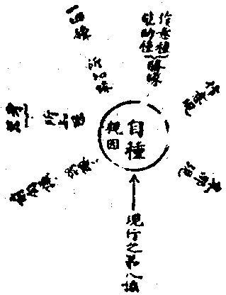

# 第四節　因緣法界

## 目錄

- 一　因緣法界概論
- 二　因緣所生心法
- 三　因緣所生心所有法
- 四　因緣所生色法
- 五　現生種之種義
- 六　現生種之熏習義
- 七　現生種之因緣
- 八　種生現之因緣
- 九　種生種之因緣
- 十　現生現之緣義
- 十　一現行法作諸緣義


## 一　因緣法界概論

法界之廣義亦包括現實成事，法界之狹義又唯十八界中之一界。今非此二，取不狹不廣法界義，專就諸現實蘊素言。於現實蘊素中，諸無為法雖亦是離繫果，有作所知緣等，非親因生果性，此所不取。諸分位假及和續假——情器佛剎——雖亦能作勝緣、知緣及為所生之異熟果、增上果等，然均不作種生現、現生種之因果性，亦所不取。以此因緣法界，雖亦帶明勝緣所生增上果等，正明親因所生之等流果，故唯取諸心法、諸心所有法、諸色法以觀其因緣所生果也。此心法等，各有自種子親生自現行，亦從自現行熏生自種子；在持識中，自類種子復各前滅後生，引生相續。此種因生現果，種因生種果，現因生種果，乃為諸法正因果性。明此正因果義，唯一切種識緣起說與法界緣起說。雖亦兼詮知緣、勝緣，然正明者在於親因生果。因緣情器，說勝緣等生異熟果，因緣佛剎，說知緣等生離繫果。今此因緣法界，則正明親因之生等流果，亦兼明諸緣之生諸果者。情器是有漏之因果，佛剎是無漏之因果，此則為遍通有漏、無漏之有為因果，遍為情器佛剎之蘊素者，猶舍材與舍宅之關係也。故前諸緣果，皆依此因果而立。

## 二　因緣所生心法

心法有八，雖諸有情不皆具備，或缺眼、耳識等，或無前五識等——無色界——，或無前六識等——無想異生——；然具備者無過於八。此八心法之親生因，各唯自種。然增上緣舉其根者，不無增減。列示如左：


```
　　　　　　　　　知緣─┬─空───┬─────八緣……增上果
　　　　　　　　　　　　│　明　　　│
　　　　境界依─────┴─色　　　│
　　　　同境依─────┬─眼　　　│
　　　　　　　　　　　　├─作意　　│
　　　　分別依─────┼─意識　　│
　　　　　　　　　勝緣→│　　　　　│
　　　　染淨依─────┼─末那　　│┌─九緣─┬──生眼識現行
　　　　　　　　　　　　│　　　　　││　　　　│
　　　　根本依─────┴─藏識──┤│　　　　│
　　　　　　　　　　　　　　　　　　││　　　　│
　　　　開導依──誘緣───等無間………………．│
　　　　　　　　　　　　　　　　　　　　　　　↓│
　　　　種子依───────自種────一因──┴──等流果
　　　　　　┌空─┐
　　　　知緣┤　　│
　　　　　　└聲　│
　　　　　　　　　│　　　　（依義果義例前）
　　　　　　┌耳　│
　　　　　　│作意│
　　　　勝緣┤意識├八緣┐
　　　　　　│末那│　　│
　　　　　　└藏識│　　├生耳識現行
　　　　誘緣─無間┘　　│
　　　　　　　自種─一因┘
```


鼻、舌、身識，根塵密合，而取識者不藉空緣，除眼識外，不藉明緣；故眼識九緣，耳識八緣，鼻、舌、身識七緣也。除更換鼻、舌、身之根緣外，餘者例同，故不一一。


```
　　　　知緣─法處┐
　　　　　　┌作意│
　　　　勝緣┤末那├五緣┐
　　　　　　└藏識│　　├生意識現行
　　　　誘緣─無間┘　　│
　　　　　　　自種─一因┘
```


意識雖不藉疏所知緣，然必有親所知緣，故列法處。作意警引自種，故亦必有，餘者例前可知。意識雖亦時依前五識起，然非必依，雖亦藉色聲等之實境以生識，然非必藉，故茲俱不列之。


```
　　　　勝緣┬────作意┐
　　　　　　└─所依┐　　│
　　　　　　　　　　├藏識├緣┐
　　　　知緣──所知┘　　│　│
　　　　誘緣─────無間┘　├生末那識現行
　　　　　　　　　　　自種─因┘
　　　　知緣─境界┐
　　　　　　┌作意│
　　　　勝緣┤　　├緣┐
　　　　　　└末那│　│
　　　　誘緣─無間┘　├生藏識現行
　　　　　　　自種─因┘
```


藏識為末那識作俱有依及根本依，屬於勝緣；而又以其「見分」為末那識作疏所知緣，故亦為知緣。異生位之末那識，除取藏識見分為「自我」，無別所知境故，雖亦與前六識俱轉，然非必俱，故茲不說。藏識以一切種及自變之根身器為所知境界，即知緣也。復以末那為俱有依，以七八識互為根故；前六識不必具，同上。此依異生之心法生起因緣說。若諸佛聖者，則根境互融而起緣不同矣。然從自種因生，則生佛亦無異。

## 三　因緣所生心所有法

心所有法，今此審定，唯二十三。而在佛果，除六煩惱及改悔心，唯十五心所耳。諸心所有法生起之因緣，乃隨相應之心法而不同。五遍行心所法，心必俱故，除作意外，餘同各相應之心法，但各加一相應心緣。例眼識相應受：


```
　　　　明──────────┐
　　　　空　　　　　　　　　　│
　　　　色　　　　　　　　　　│
　　　　眼　　　　　　　　　　│
　　　　作意　　　　　　　　　├─十緣──┐
　　　　眼識………相應心法──┼─────┼─士用果
　　　　意識　　　　　　　　　│　　　　　│
　　　　末那　　　　　　　　　│　　　　　├─生眼識相應受
　　　　藏識　　　　　　　　　│　　　　　│
　　　　無間─────────┘　　　　　│
　　　　自種───────────一因──┘
```


眼識相應感受，十緣、一因所生。餘識相應五遍行心，可例推之。此中相應心法之生心所，為勝知緣所生之士用果。而八別境心所，應更加一此心所法之特別境。例意識相應念：


```
　　　　法處─┐
　　　　曾習─┼─特別境
　　　　作意　│
　　　　末那　├──────七緣┐
　　　　藏識　│　　　　　　　　│
　　　　意識─┼─相應心法　　　├生意相識應念
　　　　無間─┘　　　　　　　　│
　　　　自種────────一因┘
```


別境心所，必依特別境生，故別加一特別境緣。餘識相應八別境心，可例推之。善心及煩惱心，雖可同遍行心，然善有三界、九地及有漏、無漏之別，既定非無記、染不善，應加善性緣；嗔唯欲界，應加一欲界緣；餘煩惱心唯有漏，應加一有漏緣；於有漏中復有界地之別，性或唯惡，或染不善，此於緣義，皆有可加；但因唯自種，則無不同也。又前心心所法，皆可各加一能知緣，以自身雖即是能知，亦是他能知之所知法故。此能知緣，今所特立。

## 四　因緣所生色法

按俱舍論，嘗分四層討論因緣所生色法：一、諸大種相互之生果功能，於俱舍論所立之六因內，謂即俱有因與同類因所生之果色。俱有因、指四大種在同一色聚內——一人身內或一樹一石內——同一剎那之彼此關係；同類因、指四大種各能生以後之自類四大種，例水大種能生以後之水大種。二、諸大種於所造色之生果功能，前曾說四大種與色香等有生、依、立、持、養五層關係，然此亦僅為能作因所生之增上果。三、所造色於所造色之相互關係：此涵有同類、俱有、異熟、能作之四因。俱有因指身語表色，色隨心轉，故為餘色之俱有因。若單純之色法，無此功能。同類因是前剎那所造色聚，於後剎那所造色聚之影響。異熟因指所造色聚，作造善或不善業力——表色——，能招來生之眼根等無記性異熟果。四、所造色對諸大種之勢力：亦由所造業能作異熟因，引起來世新大種聚。

今按俱舍此所言者，雖顯緣所成果，猶未明因所生果也。俱有因、能作因，是勝緣所生增上果或士用果，同類因是誘緣所生之等流果，異熟因是勝緣所生之異熟果；一者、未明必有「能知緣」之關係——不離識故——，二者、未明一切種識中之色種為「親能生因」之關係。今且舉一聲塵為例；


```
　　　　　　　　　　┌四大種┐
　　　　　　　　　　│　　　│
　　　　　　┌俱有依┤四造色│
　　　　　　│　　　│　　　│
　　　　　　│　　　├耳　根│
　　　　　　│　　　│　　　│
　　　　勝緣┤　　　├耳　識├七緣┐
　　　　　　│能知緣┤　　　│　　│
　　　　　　│　　　│意　識│　　│
　　　　　　│　　　│　　　│　　│
　　　　　　└持種依┴藏　識│　　├生聲
　　　　　　　誘　緣─等無間┘　　│
　　　　　　　　　　　　　　　　　│
　　　　　　　　　　　自　種─一因┘
```


一聲之現，必依四大種，及色、香、味、觸四造色，與淨色耳根作俱有之勝緣。耳根、耳識同對聲境，且必有同時之意識、藏識，了「耳意識疏所知緣」之本質聲，故同為能知緣。藏識又作持聲種之勝緣，聲之自種乃可藉前諸緣而起現行之聲。誘緣或無亦可。然四大佔空間同一剎那，在同一處亦不容有後大種聲發生，必佔此處之大種前滅或移佔他處，此處方可發生後大種聲；由此亦可准說等無間緣，例俱舍所說之同類因所生果。知緣、誘緣，亦今新立。茲再就四大種以舉其例：


```
　　　　　　　　　　┌濕煖動┐
　　　　　　┌俱有依┤塵或根│
　　　　　　│　　　├身　根│
　　　　勝緣┤　　　│身　識├七緣┐
　　　　　　│能知緣┤　　　│　　│
　　　　　　│　　　│意　識│　　│
　　　　　　└持種依┴藏　識│　　├生地大種「堅性」
　　　　　　　誘　緣─等無間┘　　│
　　　　　　　　　　　自　種─一因┘
```


若依俱舍，異熟因例於藏識，後更可各加一「業力緣」，餘可例推知之。

## 五　現生種之種義

前此皆說種生現之因緣。雖諸心不相應行法亦是因緣所生，然以即是心心所色之分位故，即於心心所色和合相續上之假施設故，無別自種子為因故；現行所熏生者，亦即為心心所色種子故，不須別說因緣。然今欲進論現行生種之因緣，當先明種子義。成唯識等論云，種子義略有六：

一、剎那滅：謂體纔生無間必滅，有勝功力，方成種子。此遮常法，常無轉變，不可說有能生用故。二、果俱有：謂與所生現行果法俱現和合，方成種子。此遮前後及定相離。現種異類互不相違，一身俱時有能生用，非如種子自類相生前後相違必不俱有。雖因與果有俱不俱，而現在時可有因用，未生、已滅無自體故。依生現果立種子名，不依引生自類名種，故但應說與果俱有。三、恆隨轉：謂要長時一類相續至究竟位，方成種子。此遮轉識——前七識——，轉易間斷，與種子法不相應故；此顯種子自類相生。四、性決定：謂隨因力生善惡等，功能決定，方成種子。此遮餘部執異性因生異性果有因緣義。五、待眾緣：謂此要待自眾緣合，功能殊勝，方成種子。此遮外道執自然因，不待眾緣，恆頓生果；或遮餘部緣恆非無，顯所待緣非恆有性，故種於果非恆頓生。六、引自果：謂於別別色心等果各各引生，方成種子。此遮外道執唯一因生一切果；或遮餘部執色心等，互為因緣。

唯本識中功能差別，具斯六義成種，非餘。外穀麥等，識所變故，假立種名，非實種子，此種勢力，生近正果名曰生因；引遠殘果令不頓絕，則名引因——引因故可有枯木屍骸存在——。

本識——對轉識言，即非轉識——中含藏一切生現行果功能差別，故名一切種識。即此所藏一切生現行果差別功能，名一切種。識名種識，能持種故，種名種識，非穀麥等種故。以第六引自果義故，各色各心等皆各親從自種子生。

## 六　現生種之熏習義

夫一切種識中之一切種，既有生滅，復恆隨轉，以何生起？以何轉變？斯必有其由致，故言熏習。然此所言熏習，取由熏習能生長種子義，與起信論所言熏習義殊。彼言熏習，但指諸法彼此互相之影響故。今准瑜伽、成唯識等，出熏習義如下：

內——識——種必由熏習生長，親能生果，是因緣性；外——穀麥等——種熏習或有或無。為增上——勝——緣辦所生果，必以內種為彼——親——因緣，是共相種所生果故。依何等義立熏習名？所熏、能熏各具四義，令種生長，故名熏習。

何等名為所熏四義？一、堅住性：若法始終一類相續，能持習氣，乃是所熏。此遮轉識及聲風等，性不堅住，故非所熏。二、無記性：若法平等無所違逆，能容習氣，乃是所熏。此遮善染勢力強盛，無所容納，故非所熏。由此如來第八淨識，唯帶舊種，非新受熏。三、可熏性：若法自在，性非堅密，能受習氣，乃是所熏。此遮心所及無為法，依他、堅密，故非所熏。四、與能熏共和合性：若與能熏同時同處，不即不離，乃是所熏。此遮他身、剎那前後，無和合義，故非所熏。唯異熟識具此四義，可是所熏，非心所等。

何等名為能熏四義？一、有生滅：若法非常，能有作用生長習氣，乃是能熏。此遮無為前後不變，無生長用，故非能熏。二、有勝用：若有生滅勢力增盛，能引習氣，乃是能熏。此遮異熟心心所等，勢力羸劣，故非能熏。三、有增減：若有勝用可增可減，攝植習氣，乃是能熏。此遮佛果圓滿善法，無增無減，故非能熏。彼若能熏，便非圓滿，前後佛果應有勝劣。四、與所熏和合而轉：若與所熏同時、同處，不即不離，乃是能熏。此遮他身、剎那前後，無和合義，故非能熏。唯七轉識及彼心所有勝勢用而增減者，具此四義，可是能熏。

如是能熏與所熏識，俱生俱滅，熏習義成；令所熏中種子生長，如熏苣蕂、，故名熏習。

前七心及心所現行四分，熏第八識心自證分，生起及長養能生心、心所、色諸種子，是謂現行生種。

## 七　現生種之因緣

現行之熏生種子雖是親因性，然亦可有緣性。成唯識云：

現行於種，能作幾緣，種必不由中二緣起，得心心所立彼二故——按今擴充為知緣、誘緣，已兼通色法——。現與親種具作二緣，與非親種但為增上。

此云親種，指此現行之自類種。云非親種，指此現行與他類種。然今擴充所知緣為知緣，通能知緣故，亦得論「知緣」。茲舉有漏善意業現生種為例：


```
　　　　　　（思）　　┌親　因┐
　　　　有漏善意業現行┤　　　├─有漏善意業種
　　　　　　　　　　　└勝　緣┤┐
　　　　　　　　　　　　　　　││
　　　　有漏現行藏識　　能知緣┘┴有漏藏識等種
```


依此現行藏識，對一切種遍作知緣。各自類現，對自類種作因緣，亦作勝緣；對他類種但作勝緣。於行支之能引識等五支種義，亦可明矣。唯不作誘緣，以此唯自類前現行對後現行故。復次、成唯識云：

能熏識等，從種生時即能為因，復熏成種；三法展轉，因果同時，如炷生焰，焰生焦炷。亦如蘆束更互相依。因果俱時，理不傾動。能熏生種，種起現行，如俱有因得士用果。

此於現行之生種子，兼帶種子之生現行以互明者。如俱有因得士用果，此借俱舍等說六因五果為設譬者。其為親因勝緣所生諸果，當如上說。三法展轉因果同時之義，茲舉如下：


```
　　　　炷…種子──因┐
　　　　║　　║　　　├同一剎那
　　　　生　　生　　　│
　　　　║　　║　┌果┘
　　　　焰…現行─┤
　　　　║　　║　└因┐
　　　　焦　　生　　　├又一剎那
　　　　║　　║　　　│
　　　　炷…種子……果┘
```


兩重同時因果，非一重也。種現同時，而種與種則不同時，種與種不同時，猶不焦炷與已焦炷不同時也。

## 八　種生現之因緣

前說心心所色從因緣生，於種子生現行，但明自種作親因之所生果義。但諸種子之於現行，不但作親因也。成唯識云：

本識中種，容作三緣，生現分別——即生現行——，除等無間。謂各親種是彼因緣——親因——；為所知緣於能知者——若種子為第八識所知緣——；若種於彼有能助力，或不障礙，是增上緣。生淨現行，應知亦爾。

茲舉現行之第八識，以明其例：




此中能助種，即能引能潤諸行業種等。有能助力或不障礙即為勝緣，則為緣者多矣，難以枚舉。觀此可推見諸種子之於現行，除自種之作親因外，餘種亦能作勝緣等。亦可觀自種與果俱有義，及自現行前後相引，與餘現行緣俱有義。故即此所生之果，亦義通諸果。引業種等所引生故，即異熟果；誘緣所引及自種親生故，即等流果；餘勝緣所知緣增上起故，即增上果；由餘勝緣所成辦故，亦士用果；若由無漏智等種現勝緣，引生為現行之淨無垢識，亦離繫果。種等之生八識現行如此，餘可例推。

## 九　種生種之因緣

種子之生種子，雖作親因，然亦能作勝增上緣。非現行故，不作知緣以及誘緣：種雖所知，是現行所知故；種雖前後自類相續，是相親生非相引故不作誘緣。其作親因、勝緣，亦如論云：『種子前後自類相生，如同類因引等流果』。『種望親種亦具二緣，於非親種亦但增上』。此中所云，如同類因引等流果，亦借俱舍等六因五果說，以為譬喻。其實此乃親因所生之等流果。彼同類因引等流果，多指誘緣所引等流果言，故有不同。前種子生後種子相，茲舉無漏慧種為例：


```
　　　　　　　　　　　┌親因┐
　　　　前剎那無漏慧種┤　　├後剎那無漏慧種
　　　　餘善心心所種等└勝緣┘
```


然此種子之生種子，與前種子之生現行，現行之生種子，雖皆兼作餘勝緣等，而亦各作親生於果之親因性，故與現之生現不相同也。除此大乘法相了義之說，其餘世間與佛教中多就餘緣假說為因；對於正因果義鮮能辨者。故識論云：『種生現、現生種、種生種三，於果有親因性；除此、餘法皆非親因，設名親因，應知假說』。觀此可知何者是因，何者為因所生果矣。

## 十　現生現之緣義

此中廣辨諸法相生之因緣義，前已說明親因及緣之生果義。然現行生現行之緣所生果，今亦當說。成唯識云：『現起分別，展轉相望，容作三緣，無因緣故』。『謂有情類，自他展轉容作二緣——知緣、勝緣——，除等無間』。今謂亦可容作等無間緣。例前帝統之國，非前國王死或辭位則不容有後國王起，故前國王死或辭位，為後國王起之誘緣。有情類對非情色聚唯作知緣、勝緣，非情色聚對有情類亦然。非情色聚對于非情色聚，則唯作勝緣耳。論云：

自八識聚展轉相望，定有增上緣，必無等無間。所知緣義，或無或有。八於七有，七於八無，餘七非八所仗質故。第七於六，五無一有，餘六於彼一切皆無。第六於五無，餘識於彼有，五識唯託第八相故。

今以知緣通能所知，笫八於前七作所知。此中不依種相分說，但說現起互為緣故。『淨八識聚，自他展轉皆有所緣——能所知緣——，能遍知故；唯除見分非相所知，相分理無能知用故』。心心所色法現行與現行相望為緣之義，於此可知其概略矣。

## 十　一現行法作諸緣義

前說諸緣生現行法，今更分別現行心、心所、色作諸緣義。論云：

阿陀那識，三界、九地皆容互作等無間緣，下上死生相開等故。有漏無間有無漏生，無漏定無生有漏者，鏡智起已必無斷故；善與無記相望亦然。此何界後引生無漏？或從色界，或欲界後。謂諸異生求佛果者，定色界後引生無漏，後必生在淨居天上大自在宮得菩提故。二乘迴趣大菩提者，定欲界後引生無漏，迴趣留身唯欲界故。彼雖必往大自在宮方得成佛，而本願力所留生身是欲界故。有義：色界亦有聲聞迴趣大乘願留身者，既與教理俱不相違，是故聲聞第八無漏，色界心後亦得現前。然五淨居無迴趣者，經不說彼發大心故。第七轉識，三界、九地亦容互作等無間緣，隨第八識生處繫故。有漏無漏容互相生，十地位中得相引故。善與無記相望亦然。於無記中，染與不染亦相開導，生空智果前後位中得相引故。此欲、色界有漏得以無漏相生，非無色界，地上菩薩不生彼故。第六轉識，三界，九地，有漏無漏，善不善等，各容互作等無間緣，潤生位等更相引故。初起無漏唯色界後，決擇分善唯色界故。眼、耳、身識二界二地，鼻、舌二識一界一地，自類互作等無間緣。善等相望，應知亦爾，有義：五識有漏、無漏自類互作等無間緣，未成佛時容互起故。有義：無漏有漏後起，非有漏後容起有漏，無漏五識非佛無故，彼五色根定有漏故，是異熟識相分攝故。有漏不共必俱同境根，發無漏識理不相應故，此二於境明昧異故。

上皆作等無間緣之分別。今說誘緣，許色法有，例中有身色前滅生後羯羅藍色等。

第八心品，有義：唯有親所緣緣，隨業因力任運變故。有義：亦定有疏所緣緣，要仗他變質自方變故。有義：二說俱不應理！自他身土可互受用，他所變者為自質故；自種於他無受用理，他變為此不應理故，非諸有情種皆等故；應說此品疏所緣緣有無不定。第七心品未轉依位是俱生故，必仗外質，故亦定有疏所緣緣；已轉依位此非定有，緣真如等無外質故。第六心品行相猛利，於一切位能自在轉，所仗外質或有或無，疏所緣緣有無不定。前五心品未轉依位，麤鈍劣故，必依外質，故亦定有疏所緣緣；已轉依位，此非定有，緣過未等無外質故。

此為作所知緣分別。今說知緣，通能所知，則心、心所作色、心等之能知緣，亦可隨應分別：

前五色根，以本識等所變眼等淨色為性；男、女二根，身根所攝故，即以彼少分為性。

此明色法作「勝緣」者。然成所引聲、執所俱聲等，律義、不律義表色等，亦皆能作增上勝緣，隨應可立。七於笫八亦作能知；第七為第六所知緣，第六亦即為第七能知緣；前五為第六所知緣，笫六亦即為前五能知緣，故均容有知緣。唯第七與前五，不作能所知緣而已。

自類前後，第六容三，餘除所緣——能所知緣——，取現境故。許五後見緣前相者，五七前後亦有三緣。前七於八所緣——能所知緣——容有，能熏成彼相見種故。

前七亦作第八之所知緣，則由仗前七現，熏生第八所知之一切種，例前七仗第八相見為本質故。

同聚異體，展轉相望——一相應聚心心所法相望——，唯有增上；諸相應法所仗質同，不相緣故——無知緣——。或依見分說不相緣，依相分說有相緣義——容有知緣——。謂諸相分互為質起，如識中種為觸等相質。不爾、無色彼應無境故。設許變色，亦定緣種，勿相分境不同質故。同體相分為見二緣——勝緣、知緣——；見分於彼但有增上——今亦可有知緣——；見與自證相望亦爾。餘二——自證分與證自證分——展轉俱作二緣。命根但依本識親種分位假立，非別有性。

此明以八識種作勝緣者。此中合業種、識種，云本識親種，業種所引攝故，此為異熟果之勝緣。

意根總以八識為性。

此明以諸心心所聚為勝緣者。

五受根如應各自受為性，信等五根，即以信等及善念等而為自性。

此明心所有法之能作勝緣者。隨應亦可加立，若貪嗔癡慢為染根，慈惠為善根等。

未知當知根體位有三種：一、根本位，謂在見道，除後剎那無所未知可當知故。二、加行位、謂煖、頂、忍、世第一法，近能引發根本位故。三、資糧位，謂從為得諦現觀故，發起決定勝善法欲，乃至未得順決擇分已有善根，名資糧位；能遠資生根本位故。於此三位，信等五根、意、喜、樂、捨為此根性。加行等位於後勝法求證愁慼，亦有憂根，非正善根，故多不說。前三無色有此根者，有勝見道傍修得故。或二乘位回趣大者，為證法空，地前亦起九地所攝生空無漏，彼皆菩薩此根攝故。菩薩見道亦有此根，但說地前，以時促故。始從見道最後剎那乃至金剛喻定，所有信等無漏九根，皆是已知根性。未離欲者，於上解脫求證愁慼，亦有憂根，非正善根。故多不說。諸無學位無漏九根，一切皆是具知根性。

此合心心所法九根作勝緣，乃離繫果；以知緣作勝緣者也。然法界等流正教聲，及佛應現身剎色等，亦能作離繫果勝緣也。因緣所生之果，亦皆作生果之因緣，因緣及果，如環無端，觀此不洞然明白耶！

