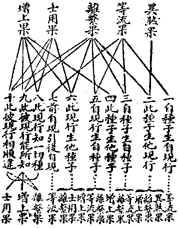
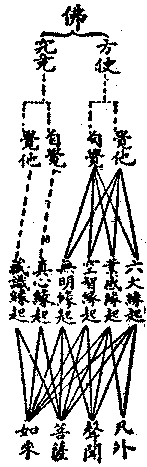
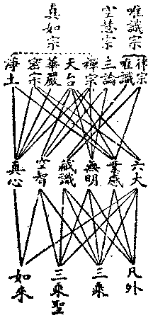

# 第五節　所知關係評判

## 目錄

- 一　所知關係慨論
- 二　事素關係與因果
- 三　因緣果名義之決擇
- 四　佛剎緣起之討論
- 五　因緣法界之討論
- 六　緣起決擇概論
- 七　緣起決擇之新釋
- 八　別釋意識緣起
- 九　別釋心識緣起
- 十　緣起決擇之結論


## 一　所知關係慨論

所知現實，不外成事蘊素。故其關係，亦唯在於成事與成事之關係，成事與蘊素之關係，蘊素與蘊素之關係。觀其關係而分別之，條理為種種之公式，即成為種種因緣生果之格律。然成事之程度上，有異生——有情、聖者——超情之別；成事之性質上，又有情身——生命、器剎——非命之別；蘊素之轉變上，亦有雜染、清淨之別。蘊素之法體上，尢有性相、色心之別。種類之差別既甚多，關係之格式亦非一，非佛陀之圓智，殆無足以窮其奧者？雖廣尋正覺法界等流之至教，如理作意思擇，證以現知，決以比知，燦然有所敷說，以言大概，雖無所不包括，然而一花之放，一星之墜，動物之各呈其毛羽光澤，人生之各流其情欲意謂，盡其所有之性，如其不悖之量，洪纖畢舉，綱目悉張，則超世間雖有其人，而世間尚無此文字言語之工具也。今就所已言者，且再加以評撢判抉焉耳！

## 二　事素關係與因果

依前四節之所敷陳，成事與蘊素皆因緣所生之果，亦皆是生果之因緣；則成事非蘊素之果，蘊素亦非成事之因緣也。然則成事與蘊素之關係，固非因果關係。然此章標所知事素關係之題，而緒言又說蘊素與成事之關係即為因與果之關係，亦無甚大違礙；其尚有餘理未盡耶？答曰：成事與蘊素雖皆是果，亦皆是因緣，深察之則有殊異也。一者、成事之名成事，乃已各成一個之事體者——事物個體、佛書一和合相續之假者——。一金，一樹至一星球，一蟲、一鳥至一人生，雖此一蟲、一樹與餘一切皆可有互相依資之關係——作緣——，然固可移此至彼，合彼離此，而似有其獨立之存在——我執法執皆由薩迦耶見而起，亦緣乎此——。至諸蘊素之為蘊素，唯在名理上可施以分別，而於事實上則灼然必藉多種關係存在。諸無為法，藉諸有為而顯；諸分位法，藉色、心等而立。雖至一眼識相應感受心所焉，一眼識所知青色焉，要皆為因緣之一聚，而莫從見其單獨存在之相焉。故始終為眾蘊素聚中之蘊素，而不能似獨存之個體焉。然彼有「似獨存個體」之假相者——一電子以至一太陽、一人及穀麥等假種——，莫非此諸蘊素之和合連續相！故此為因緣，而彼為果焉。二者、成事既為和續假者，故非親能生種子之現行，亦非親能生現行與種子之一切種；雖亦為緣而不為因。為因者唯在諸蘊素，是親能熏生諸種子之現行故，亦親能生起諸現行之種子故。而成事之和續假者，則由諸種子起現行，有惑業或慧行等為勢力和續所成者耳。由此、故蘊素為因，而成事為果；唯諸蘊素亦互相為因果而已。

## 三　因緣果名義之決擇

因緣生果節中，對於六因、十因、二十四緣皆廢不用，雖用四緣而亦改為一因三緣，變其名為親因、誘緣、知緣、勝緣。擴充所緣緣為能所知緣，擴充誘緣亦通色法，則義亦異。又於一因分為三類：

三緣分為七類：


```
　　　　一、前自類現行滅引生後自類現行者…………誘緣
　　　　二、此現行生彼現行為能知或所知者…┐
　　　　三、一切種子為生現行第八識者………┴……知緣
　　　　四、此現行與彼彼現行互相為順違者…┐
　　　　五、此現行助他類現行生他類種子者…┤
　　　　六、此種子助他類種子生他類現行者…┼……勝緣
　　　　七、此種子助他類種子生他類種子者…┘
```


此雖語越常聞，當準之於事理，固無違害。然於五果，則仍先立，豈亦能適用於現行生「種果」等而無悖耶？答曰：名義以順先立為妥，不獲已而改作四緣為一因三緣等，例誘緣之一名，亦殊懼其未當；而五果於三類因、七類緣之所生果，名義皆可通用，則何待更為改作耶？然亦可再分析如下：




士用果為增上果中之一特果。凡彼為此特殊助力所辦成者，彼即為此之士用果。此唯汎為彼助緣者，彼即為此之增上果。例第八識為一切種之能知緣，一切種為第八識所生士用果；一切種為第八識之所知緣，第八識為一切種之增上果。或廢除士用果亦可。

## 四　佛剎緣起之討論

於超情佛剎之緣起，雖說三增上學及三慧、三智等，而不及情器緣起之十二支法整然有序。轉染成淨之淨緣起，為佛學中最應注重，何反無有系緣之組織耶？答曰：三十七品菩提分法，分者因也，此即為有序之組織，然說因緣不曾與果組成一系統耳。今更用二十二根試說之：


```
　　　　　　　　　　　　┌信根………善信……正慧等相應之正見正願
　　　　　　　　　　　　│勤根………善勤即四正勤亦即戒增上學
　　　　　　有漏五善根┬┤念根………善念
　　　　　　　　　　　││定根………善定
　　　　┌─應化身剎─┤└慧根………善慧
　　　　│　　　　　　└┬未知欲知根…淨慧為上意喜樂捨信勤念定為助已知具知根同此
　　　　│　　　　　　　├已知根┐─┬他受用身剎┐
　　　　│　　無漏三根─┤　　　│┌┘　　　　　├法性身剎
　　　　│　　　　　　　└具知根┤┴─自受用身剎┘
　　　　└───────────┘
```


有漏五善根及資糧加行之未知欲知根此為能感，菩薩已知根及佛具知根為能應，合此感應之緣能起應化身剎。菩薩已知根為能感，佛陀具知根為能應，合此感應之緣能起自他受用身剎。具知根為緣，能起佛之自受用身剎。已知根、具知根之分證、滿證於法性，即為法性身剎。此八根與應化、受用、法性身剎，可以全見佛剎緣起之因果矣。

## 五　因緣法界之討論

情器佛剎之因、緣、果，前已論及，於說因緣法界應可除外。然無為法亦不離因果律，心不相應行法亦為因緣之有為法，何亦不論及耶？答曰：因緣法界中以說諸法親生因，及親因所生果為主，無為法及心不相應行法，但為緣果而非因果，故不說及。然緣果義，茲可略論：擇滅與非擇滅無為，但果非緣，以但是滅所顯示故。擇滅、是知緣、勝緣所顯增上果及離繫果；非擇滅、是勝緣——相違勝緣——所顯之增上果。虛空及真如二無為，能作所知緣及順違勝緣，亦作能知緣及順勝緣所顯之增上果或離繫果。以雖可說是離繫果，而離繫果即擇滅無為故。此無為法之緣果也。至於諸心不相應行，或是識之分位，是何識即可依何識因緣而說；或是何心所之分位，即可依何心所因緣而說；或是何色法分位，即可依何色法之因緣而說；或是何心、心所分位，即可依何心心所因緣而說，或是何心、心所、色之分位，即可依何心、心所、色因緣而說；故皆不須別說能生彼之因緣。以能生起彼之因緣，不出前能起情器、能起佛剎之緣，及能生起色、心、心所之因緣故。唯其轉加繁複，則隨事別詳耳。至其能作之緣，大抵皆能作所知緣、勝緣，間亦能作等無間緣。例前命根不捨，後命根即不能起等。茲舉命根以示其例：


```
　　　　命根……業種力引潤第八識種生起現行之勢限
　　　　生能引能潤業種之因緣…………┐
　　　　生被引被潤第八識種之因緣……┼…合為成命根之因緣
　　　　生第八識現行之因緣……………┘
```


起命根之因緣如此繁複，餘可知矣。

## 六　緣起決擇概論

緣起初唯十二支緣起說，亦唯說十二支是說緣起。此緣起唯說「異生情器」以何緣而起，應從何擇滅耳。瑜伽、攝大乘等，加說持一切有漏種之阿賴耶識緣起，阿賴耶寄存清淨種，始通淨法緣起。至於中華，日本，次第加立諸緣起說，前雖略述及之，應如何抉擇耶？答曰：緣起在指出「為緣能起」之法屬何法，但由諸法緣生四緣生法觀之，固無一法非緣之所起，亦無一法非為緣能起。然則尚何緣起論之有歧異而須待抉擇之耶？唯施設言教，本在方便開導，引之令趣行證果，是則就為緣能起之諸法中，觀何法為發行得果之勝方便，即說何法為緣起之主，於是有緣起論之殊說。佛徑說十二有支之流轉為「緣」能「起」雜染諸法，正可謂之無明緣起、業感緣起耳。唯是諸經所說，淺深不同，而菩薩造論，古德判教，又復解釋有異，故緣起之通相雖在於無明業感，而有說賴耶緣起者，有說真如緣起者。華嚴家綜合之曰：業感緣起、賴耶緣起、真如緣起，自居為法界緣起而加前三之上。日本真言宗之東密派，仿列前四，自居為六大緣起而加前四之上。統計各家自命後來居上之緣起，各說不出下別五項：


```
　　　　一、業感緣起…┬………小乘教
　　　　二、賴耶緣起…┤
　　　　三、真如緣起…┴………三乘教
　　　　四、法界緣起…┬…┐
　　　　五、六大緣起…┘　└…一乘教
```


右為華嚴、真言等家，依緣起論，判教淺深之常途說。由今觀之，依彼各教顯由淺至深之程序，雖亦不無片面之理，按其實則不能盡然。蓋六大者，乃依堅、溼、煖、動、無礙、了知之六性，所立地、水、火、風、空、識之六相。前四色法，後一心法，第五則由非「色有質」非「心能慮」之非二法，從非色以反顯出者。色非色為五，而心總為一，是為六大，指此六大為情與無情為緣能起之根本，祇是心物二元論耳。此心物二元論，實為凡情外道共易知者。若希臘原始哲學多計水、火、風等為萬物本元，而勝論之實諦——地、水、火、風、空、時、方（空）、意、我（識）之九法，與六大僅開合略殊而已。初見者為地形，進察流變之質為水，更進察能令凝流之變化力用為火——今西洋物質文明多得於火——，更進察形質變化之極、僅存浮動之輕氣為風，輕動所通過之無礙性法為空；反之、乃始悟更有能了知之心為識；如斯逐層增進，認識此六性相，遂認此六性相為萬有生起之本元，固為稍能觀察者之所易知也。故前文所舉之五種緣起，於所知法、於能知人皆當以六大緣起為最淺，由此乃更有正名之必要。

## 七　緣起決擇之新釋

茲先列三式之程序如下：

一、以所知所得法判淺深之程序：


```
　　　　前五屬色
　　　　　　　　六大緣起………┐
　　　　後一屬心　　　　　　　：
　　　　　　　　　　　　　　　├…色心……五蘊
　　　　能感是行蘊心　　　　　：
　　　　　　　　　　業感緣起…┘
　　　　所感通於心色
　　　　二空所顯真
　　　　　　　　　空智緣起……┐
　　　　如證智相應　　　　　　：　　　　　　六
　　　　　　　　　　　　　　　├…意識……第　識
　　　　無明相應執　　　　　　：　　　　　　七
　　　　　　　　　無明緣起……┘
　　　　二分為我法
　　　　菴摩羅清淨法
　　　　　　　　　　真心緣起…┐
　　　　界之如來本識　　　　　：
　　　　　　　　　　　　　　　├…心識……第八識……阿賴耶識……一切種識
　　　　阿賴耶真異熟　　　　　：
　　　　　　　　　　藏識緣起…┘
　　　　識之眾生本體
```


二、以能知人判淺深之程序：




三、以能得人判淺深之程度




能得人者，謂能成就此法之人。依此第三能得人之淺深程度觀之，故華嚴、真言之淺深說，亦不無片面之理由。業感、專指能感三界異熟之有漏善及不善業，三乘聖人已不造之，故不成就。若就無漏業感變易生死言，則三乘聖亦成就。若就無漏業感無漏果言，佛同成就。則廣義之業感應與六大皆眾生、如來所同得，故密宗之三密與淨土之淨業，其功用全在於業感。自覺以華嚴為專極，而天台、密宗、淨土，皆以覺他之方便勝之。言覺他之方便，當以淨土為最方便，而唯識則為究竟之覺他。蓋凡外二乘雖成就無明而非所知，凡外二乘雖成就藏識而尤非所知：菩薩之知藏識，亦由佛之開示知少分耳。以第八識從不與慧相應，一相應即成佛，故藏識非佛不知也。

## 八　別釋意識緣起

今依「可知法」及「能知人」言，六大緣起最為粗淺。地、水、火、風、空為色法，識為心法，別詳色法為五，總合心法為一，此乃異生常情。如是例之，五蘊雖同色心并列，略色詳心，猶此六大為進。至業感緣起，已能別提出行蘊一分為能起緣，以五蘊聚為緣所起，所明者已稍進深細。然尚是色心並立之麤相而已。進至真如——空智——緣起、無明緣起，則於五蘊內別提出最深之識蘊中獨強之意識心心所一分以為能緣起法，尤深細也。

然此中意識兼意及意識，合名意識。以八個識第七別名為意，正名意識，第六別名為識，應名識識，隨不共依立名，亦名意識。故此意識一名，總括七、六二識。云真如緣起者，正名空智緣起。空智謂達二空證真如之正智——妙觀察智相應心品、平等性智相應心品——相應意及意識心品。然此正智由達二空所顯真如而發，故亦展轉名為真如緣起。第六、七識，於菩薩地，有漏無間發生無漏，則證二空所顯真如。此通菩薩見、修道位。但修道位又時有無漏無間發生有漏者，此由無漏而至有漏，即由正智相應意識而至執障相應意識；亦即起信論等常途所謂真如不守自姓，「不覺心動，忽然念起而有無明」是也。

起信論文：一、『所言不覺義者，謂不如實知真如法一故，不覺心起而有其念』。二、『一者、無明業相，以依不覺故心動』。三、『以依阿黎耶識，故說有無明不覺而起』。四、『以不達一法界故，心不相應，忽然念起，名為無明』。按不如實知真如法一者，即六、七識無漏無間不覺心起而有其念，即由無漏無間發生有漏。不覺——或不如理作意——即大隨煩惱中以無明為性之失念心起，謂由失念有漏心起。有其念、謂有二執二障相應之意及意識虛妄分別。二、三、四項，皆可照上消釋。

由是觀之，起信論所言之覺相，亦依第六、七識由有漏無間所發生之無漏智而說可知。故其文曰：『所言覺義，謂心體——根本智——離念。——離二取分別而無分別——。離念相者，等虛空界，無所不遍，法界一相，即是如來平等法身——此指二空所顯真如，即登初地時所證遍行真如——。依此法身，說明本覺』。此言「本覺」，猶所云「根本智」。依此法身說名本覺，即是以所證真如為諸法根本故名根本，能證此根本之智故名根本智——以法身為本，能覺此本名本覺——。除根本智及佛果智而外，其餘信智、順解脫智、順抉擇智及菩薩地之後得智，皆名始覺。故曰：本覺義對始覺說，以始覺者即同本覺——後得智仿同根本智——。始覺義者，依本覺故而有不覺——依未有根本智而名不覺。如論云：又心起者，無有初相可知。而言知初相者，即謂無念。是故一切眾生不名為覺，以從本來念念相續，未曾離念，故說無始無明」。及由無漏無間發生有漏，皆是此中依本覺故有不覺義——故說有始覺——依未得根本智名不覺，故說有順解脫智等位始覺；依無漏無間發生有漏名不覺，說有菩薩地後得智，始覺是所緣故——。即以佛智曰究竟覺，亦曰一切種智、一切智智。

由是觀之，起信論云：『心生滅者，依如來藏故有生滅心。所謂不生不滅與生滅和合，非一非異，名為阿黎耶識。此識有二種義，能攝一切法，生一切法。云何為二？一者、覺義，二者、不覺義』。此言如來藏，即初地以上六、七識相應後得智所緣之變相真如。云依此有生滅心者，謂由後得相應末那無漏無間生有漏，執障相應末那重故，執第八為我愛執藏，故曰：所謂不生不滅與生滅和合非一非異，名為阿黎耶識。言此識有覺、不覺之二義，蓋由「智相應末那」緣之，則為如來藏之覺：由「執相應末那」緣之，則為阿賴耶之不覺而已。

由是觀之，起信論於生滅門之前所說真如門，當知即指菩薩真見道根本智所證非安立諦實體真如。而真如門之後說生滅門如來藏，當知即指菩薩相見道後得智所觀安立諦之變相真如。無漏意識後得智，忽生有漏意識無明執障，遂為心、意、意識之生滅相。所云依一心法，有心真如、心生滅門二門，各總攝一切法不相離故，亦是依菩薩見道位心說。真見道根本智位，即心真如門——真如依言分別有二義，已通入相見道位——。相見道後得智位，即心生滅門覺義。見道位後無漏無間忽生有漏執障相應意識，重執阿賴耶為我法，即心生滅門不覺義。此三即證發心中之三種心：一、真實心，二、方便心，三、業感心。如次相配，根本智證真如，攝一切無為無漏法；後得智攝一切有為無漏法；心生滅門不覺義，攝一切有為有漏無明染法。故各攝一切法。

由是觀之，可知起信論等之緣起義，乃以登地以上菩薩心境而說。無漏無間續生無漏，無漏無間忽生有漏，可云真如緣起——正云空智緣起，亦云法性緣起。真如指根本智所證實體真如，如來藏指後得智所緣變相真如——或如來藏緣起。有漏無間忽生無漏，有漏無間續生有漏，可云無明緣起，以末那無明相增故，以無明為雜染依故——起信論以一切染法皆是不覺相故。——而天台家常言「法性」「無明」互依無住之義，亦可於是明之。茲真如及無明之緣起義，一分生空真如及一分人我執無明，亦通二乘，故此猶為三乘共教之緣起理，未是大乘至極不空之一切種識緣起理。一切種識，唯佛無漏，一無漏永無漏，無有忽有漏忽無漏之變。無始法爾有無明種，種在忽現忽伏，種斷永不復起，亦無有由真如忽生無明之義。彼言由真如忽生無明者，或言無明無因托空而忽起者，皆三乘聖智，未通達一切種智之謬言耳！

## 九　別釋心識緣起

進言「一切種識緣起」，即從第八阿陀那識明緣起也。第八識即心識，故云「心識緣起」。於此分二：其一、即華嚴宗之一真法界緣起說，茲曰「真心緣起」。第八識別名心，此即無漏第八菴摩羅識，是無倒清淨圓成實性攝、故曰真心：即大圓鏡智相應心品、海印三昧相應心品——此即佛果大智大定——，亦即一切種智。換言之、即持一切清淨種之心，故曰清淨法界；界即「種」義，清淨法界猶云清淨法種，或持清淨種之心義。清淨法種，猶云持清淨種之心。由此識清淨種而現行一切法，故一切法莫非佛法。華嚴「稱性緣起」及密教曼荼羅，如是如是。其二，即唯識之一切種識緣起，茲曰藏識緣起。具三藏義，簡別真心緣起之菴摩羅識故——亦得名真異熟緣起以簡別之——。此二同為從一切種子親因緣，以明其緣起者。緣起之最深微義，唯佛所知。以本心唯佛有大圓鏡智相應故，除佛而下，皆仗佛言教得少分知耳。

然真心緣起，是佛一切清淨種緣起，唯佛法界；藏識緣起，是眾生一切染淨種緣起，通九法界，亦由進轉成佛法界。前者是佛自證智之究竟，後者是佛悟他智之究竟。佛智以悟他為究竟，不為自利求菩提故，故尤以藏識緣起為至極。真心緣起是佛自受用之境界，華嚴等雖依諸菩薩隨分所證略明大概，於諸異生，則纔令大凡依所舉果起信心而已。欲開其解而令由解起行，由行入證，乃非從眾生分明其藏識不可。故華嚴若善財童子，所以成其大乘習所成之種者也。從華嚴得信心成滿，乃從唯識之解行住，悟入究竟。舉果令信，在令觀自齊佛，故教是頓；示心令解，在令悟自成佛，故教是漸。頓為未入劫以前，屬十信位；漸為入劫以後事，屬十住位以上。然頓是漸之頓，信由佛生，佛由漸成故；漸亦是頓之漸，住由信來，信由佛起故。漸頓相依，佛生交攝。此二心識緣起。有共同之義二，為他種緣起義所不具者。如下：

一、各現各種————現現增上遍諸法

二、頓起頓滅————起起不到攝十世

達此二義，則知賢首十玄無礙、六相圓融之說，實華嚴、唯識之共義，不得謂唯識無此也。

此「心識緣起」，與前「意識緣起」不同者，按成唯識論說二所轉依：一、持種依，謂本識；二、迷悟依，謂真如。意識緣起，正是從迷悟依以說緣起，悟真如即空智緣起淨法，迷真如即無明緣起染法。故此二者亦可總名「真如緣起」，依真如而悟而迷故。然彼迷悟等心心所諸分，實皆各從自種子生，而真如僅為其所緣緣、增上緣而已。即空智相應心品與無明相應心品，亦各從其自種子生，而空智、無明等亦為等無間緣——若無漏無間生有漏等——、所緣緣、增上緣而已。故此正應謂之緣起，但明增上等三緣故。此心識緣起，雖從持種之本識得名，實從此識所持之一切種以談生起，故曰各現各種；謂各各現行之法，各各親從自種子辦體而生起也。故此二者，亦可總名「法種——或曰法界，界即種義；或曰法性，性亦種義；或曰法體，體亦種義——緣起」。此一切種，正一切法各各親辦自體之因，屬四緣中之因緣攝。通名可曰緣起，四緣攝故；別名應曰因起——或曰性起、界起、種起、體起——，正是親因緣故。然此親因之性起義，佛華嚴等雖明其概，必瑜伽、唯識等乃詳其致。故立言善巧、建義顯了，以唯識為最。

## 十　緣起決擇之結論

由是觀之，「心識緣起」義，與前諸緣起義，有一大別：即前諸緣起，皆未明實因緣法之一切種；依增上緣、等無間緣、所緣緣等假說因緣。六大與諸事物是增上緣，業於所感果亦增上緣。由未明一切種，於是或計六大為萬物因，或計諸業為眾生因，或計真如為萬法因，或計無明為雜染因，皆莫明其本因，遂滋過謬。而真心緣起——或曰真界緣起，如曰：大哉真界，萬法資始——，雖如證而顯，說亦未了；至藏識緣起，乃盡發其秘，歷破其謬而徹體顯了之，故為無上無等究竟了義。齊此再加分別，則唯有更退還於妄執耳。此論緣起頓漸之義，在色心緣起中，六大為頓，以是同時之因果故；業感為漸，以是異時之因果故。頓淺，漸深，三乘漸法門由此立。在意識緣起中，空慧為頓，以我法本空理則頓悟故；無明為漸，以習氣難淨，事須漸除故。頓主，漸伴，大乘頓法門由此立。禪宗所云：前念迷即眾生，後念悟即是佛。又云：佛迷即眾生，眾生悟即佛。此皆菩薩地智有如是義，而佛藏識覺即不迷。在心識緣起中，真界為頓，佛觀眾生同佛——眾生皆具如來智慧德相——亦令眾生觀自性齊佛故；藏識為漸，就眾生觀眾生，令觀雖具如來種性，而須熏習、資糧、加行、修習乃究竟成佛故。頓始、漸終，頓他、漸自，而為佛法非頓非漸即頓即漸圓滿法門。此心識二緣起，有圖如下：


```
　　　　　（十信種性位）
　　　　　　　：：
　　　　　　　：：
　　　　佛……………頓…………眾生（他佛加眾生）
　　　　　　　　　　　　　　　：
　　　　　　　　　　　　　　　：　　（住行向地位）
　　　　　　　　　　　　　　　：　　　：：
　　　　　　　　　　　　　　　眾生……漸……佛（眾生自成佛）
```


由上重重道理觀之，唯識雖專在明藏識緣起，已能具明前五緣起，具除在前五緣起說上之迷謬。故緣起之說，須以唯識所言為最詳抉也。今論非橫欲將古人定案一翻，蓋由邇來各宗故籍復興，近人往往列舉古來諸緣起說，如陳芻狗，徒狀狼藉，不能令閱者生決了之智，有不得不加以抉擇之勢。機之所在，說由以興，諸聰智者，幸思察焉。

