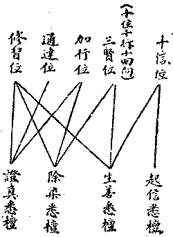

# 第一節　能知方法之決擇

## 目錄

- 一　能知決擇概論
- 二　四道理之建立
- 三　四道理之略釋
- 四　證成道理之廣釋
- 五　四悉檀之名義
- 六　四悉檀之作用
- 七　四悉檀與行位
- 八　至教量之差別相
- 九　歷史考證之決擇


## 一　能知決擇概論

第一章所論能知之方法，初節由現比量辨析真似，為令自能知之方法；第四節為令他能知之方法；第二、三節明算學及語言文字，則為令自能知及令他能知所用工具，算學為比量之準繩故，語言文字為聞量之依止故；第五分辨先覺遺教，俾於古今學說能捨謬而取正。由此五重，能顯現證知於現實自相之事義，或推比決知於現實共、差別、因、果相之理義。亦能藉他言義助令自知，亦能建自言義引令他知。諸算學、語言文字學，此唯端緒，今世多有專門學者，精微奧博，非茲能詳。邏輯之學，今亦時有增進。數理邏輯之用符號推演於廣遠之理想，使不為名句之所限，可同純粹數量，普遍應用，亦成殊勝方便；然不精算學則無從了解，較之名句邏輯又轉加艱晦矣。凡此皆在諸聰慧者之自求耳。勤學五明，是菩薩之行處，固當采容而不當排阻也。然仲尼曰：知所本末先後，則近道矣。此宗依論，取其能為內明之基礎者；內明為本，所當先務。故於能知方法，尤注重能知現實之真相。現比立破，如何遣似存真，除不清淨而成清淨；諸所聞義，從何擇顯究竟可依歸之至教，則當再為之思決耳。

## 二　四道理之建立

內明之學，楷持以四種之道理，如解深密經云：

又此道理略有二種：一者、清淨，二者、不清淨。由五種相名為清淨，由七種相名不清淨。云何由五種相名為清淨？一者、現見所得相，二者、依止現見所得相，三者、自類譬喻所引相，四者、圓成實相，五者、善清淨言教相。現見所得相者：謂一切行皆無常性，一切行皆是苦性，一切法皆無我性；此為世間現量所得，如是等類，是名現見所得相。依止現見所得相者：謂一切行皆剎那性，他世有性，淨不淨業無失壞性。由彼能依麤無常性現可得故；由諸有情種種差別依種種業現可得故；由諸有情若樂、若苦、淨不淨業以為依止現可得故。由此因緣，於不現見可得比度？如是等類，是名依止現見所得相。自類譬喻所引相者：若於內外諸行聚中，引諸世間共所了知所得生死以為譬喻；引諸世間共所了知所得生等種種苦相以為比喻；引諸世間共所了知所得不自在相以為譬喻；又復於外引諸世間共所了知所得衰盛以為譬喻。如是等類，當知是名自類比喻所引相。圓成實相者：謂即如是現見所得相，若依止現見所得相，若自類比喻所得相，於所成立決定能成，當知是名圓成實相。善清淨言教相者：謂一切智者之所宣說，如言涅槃究竟寂靜，如是等類，當知是名善清淨言教相。善男子！是故由此五種相故，名善觀察清淨道理。由清淨故，應可修習！

世尊！一切智者相當知幾種？善男子！略有五種：一者、若有出現世間，一切智聲無不普聞；二者、成就三十二種大丈夫相；三者、具足十力，能斷一切眾生一切疑惑；四者、具足四無所畏，宣說正法，不為一切他論所伏而能摧伏一切邪論；五者、於善說法毗捺耶中，八支聖道、四沙門等皆現可得？如是生故，相故，斷疑網故，非他所伏能伏他故，聖道沙門現可得故。如是五種當知是名一切智相。善男子！如是證成道理，由現量故，由比量故，由聖教量故，由五種相名為清淨。

云何由七種相名不清淨？一者、此餘同類可得相，二者、此餘異類可得相，三者、一切同類可得相，四者、一切異類可得相，五者、異類譬喻所引相，六者、非圓成實相，七者、非善清淨言教相。若一切法意識所識性，是名一切同類所得相。若一切法相性業法因果異相，由隨如是一一異相；決定展轉各各異相，是名一切異類可得相。善男子！若於此餘同類可得相及譬喻中有一切異類相者，由此因緣，於此成立非決定故，是名非圓成實相。又於此餘異類可得相及譬喻中有一切異類相者，由此因緣，於所成立非決定故；是名非圓成實相。非圓成實故，非善觀察清淨道理，不清淨故不應修習。若異類譬喻所引相，若非善清淨言教相，當知體性皆不清淨。

四、法爾道理者：謂如來出世若不出世，法性安住法住法界，是名法爾道理。

## 三　四道理之略釋

諸行指一切有為法。觀待若因若緣能生、有為無常諸法，即緣起、緣生之道理；觀待若因若緣能起隨逐知識諸法，即法相唯識之道理。此二道理為諸法之根本。世間由初道理立宇宙觀，由次道理立認識論，於此總為依他起義。由此因緣能得、能成辦諸法體，或諸法體生已由此因緣能造作諸業用；顯彼因緣法體有能得、能成諸作用故。如善不善因緣、能得福非福果，如修八支聖道、能成辦沙門果，如佛能作度有情事，皆顯其有功能作用；世間於此立價值論及人生觀。所立、所說、所標義者、「宗」也；若因者、因支也；若緣者、喻支也。若因若喻，令宗成立，令自決知，亦令他人決知。自覺、覺他，生正覺悟，總由證成道理，故今說能知之方法，亦最注重。世間於此立方法論及邏輯學。全捨置能知、能說之主觀，亦不得云純客觀界，既非主觀亦不名客觀故；唯存諸法本來如是真相，故曰法爾道理；世間於此立本體論或自然學。然證成道理中，有清淨、不清淨之別。完具證成道理五清淨相，則餘道理亦皆清淨。如雜有七不清淨相，則諸所建立之理觀學論，以含有迷謬故，不應修習。以此審觀世間所建立諸學理，雖不無合於證成道理之清淨相者，然亦無不雜有不清淨相。故隨所聞思，皆應依一切智者——佛——善清淨言教相及真現比量以嚴密甄擇。故法爾道理、非世間之本體論及自然學；作用道理、亦殊世間之價值論及人生觀；觀待道理、尢異世間之認識論及宇宙觀。以世間之方法論——科學方法等——及邏輯學，雖亦是現量、比量，以非善清淨現量、比量之言教相故。

## 四　證成道理之廣釋

四道理中特詳證成道理，以其正是能知之方法故？五清淨相：一、現見所得相，是現量境。二、三、是比量境。圓成實相，通現比量；聖教亦然。在能說者是現量境，曾親證故；聞者識上是比量境，未證得故。現見所得相之一切行無常性，一切法無我性，及一切智者所說之涅槃寂靜，即「三法印」。皆是苦性不遍於一切行，故非法印。非一切行皆苦，唯一切有漏行皆苦，非無漏行亦皆苦故。然云此為世間現量所得，而世間現量所得之諸行，固皆為有漏行故，亦得云一切行皆苦也。一切行無常，一切法無我，已為今世科學之所公認。唯有漏行皆苦，由彼未能知無漏故亦不能知有漏，故於錯誤估價中，時認有漏為樂，熾然造諸有漏行也。依止現見淺麤之相，所推得不現見之深細相：例由人老及山崩等麤無常相現可得故，推知萬有皆是新新不住之剎那生滅性。又由人等老年安閑、依壯年勤勞而獲，子孫殷富、依父祖營積而得，由此由先業得後果之麤淺相，可推知由前世善惡業、得今世之樂苦果，由今世善惡業，可招來世樂苦果之他世有深細相。由上道理，即可推知所造淨善或不淨善之業，有繼續不失不壞性，可招來世樂苦果故。由狹少相推知廣多之相，為自類譬喻所引相：如某人死、推知人皆有死，如某星球壞、推知一切星球皆有壞；於共知之生死相，推知內——有情、外——器界諸行皆無常；以共知老病等種種苦相，推知內外諸行皆苦；以共知之不自由相，推知內外諸法一切無我；加以共知之世間盛衰興廢相，推知皆是無常、無我。有現量及世間公認之相以為依止，所標宗義決可圓滿成立，是謂圓成實相。然猶未也，若無一切智者之所宣說，仍不能得到絕對決定之真理，摧伏邪謬，斷除疑惑，使人有積極進行修證之遠大公共目標。故善清淨之言教相，尤為重要。善清淨言教相，由善清淨之一切智者生。由論生論故，必知有一切智者之相；肯定一切智者，遂有一切智者之至教量。而七種之不清淨相，一、二，三、四皆是因支上過，第五者為喻支上過，因喻有過，不能成立宗義，故非圓成實相。以無一切智者之五相故，其所宣說，亦非善清淨言教相。依此準繩，勤求正知，庶能存真而去似矣。

## 五　四悉檀之名義

大智度論說四悉檀，譯音未譯其義，或譯遍施，望文生義而已。楞伽云：『譬因成悉檀』，則為與因喻對舉之宗義。正音皤囉提若，悉檀殆譯音之訛略歟。四悉檀者，言佛陀施行教育之四宗旨也。法爾道理——現實——本離思想言說，一切智者一切智智如如相應，法爾道理不待尋伺議辯，亦如實了知現實真相，非名等所能安立。然有所言說者，唯為隨順開示諸未悟者，漸令悟入離言法性故。能自無所執，應機誘導，隨一時代一方域之群眾普通心理，說天地人物之情況，不違世間常識而漸將能通達於真理之軌道；開闢其上；或顯示神奇事以驚動之，使見之聞之者無不欣然信受以從之游履焉，是名「世間悉檀」。觀各人各別之天性、情好、業習等之才質，因材而篤施特殊之教育，使各由其道而娓娓進行不倦，日有所增益而不知其止，以趨於向上發達之修途，是名「為人悉檀」。信心已堅，善根已深，經得起煆煉爐錘者，則祛其不自知之痼疾，而破其有所滯之偏執，滌蕩其有漏有分別之無始來雜染情習，啟發淨慧，是名「對治悉檀」。於信心上長養善根，祛除染習，將至純熟之候，如卵中雞雛欲啐殼而出，母雞助而啄之，啐啄同時，殼開雛出；佛陀對於將證果之弟子，亦復如是。或慈、或威，或逆、或順，或默、或語，或靜、或動，使之頓悟入於現實真相，是之謂「第一義悉檀」。悟入第一義諦，則亦由一切智如如相應於離言法性矣？合於此四種施教育之宗旨者，則為善清淨言教相，可依修習以求正知。如執真理即在於言說中，或執真理無言而不能施方便之教育者，則若依修習必不能求得正知，其為非善清淨言教相可知矣。

## 六　四悉檀之作用

此四門教育宗旨之功用：其一、世間悉檀，在隨順常俗世間或學者世間之所知者，發揮其共同承認之真理——例因明學應用世間現比不相違之義以立宗——，使肯定其同而不能違異，因之而生歡喜信受。例中國往者普遍於儒化，施行佛教者植其基於儒化之同點，乃能安置其上，流暢無礙。今之各國普遍於科學化，故施行佛教者亦當植其基於科學化之同點，乃能流暢無礙。第二、為人悉檀，則由人之個性各有不同，種種性情、種種樂欲、種種業習、種種地位、種種環境及當時切身之感受，則非世間悉檀之一例能為普遍之適用；猶學校中於普通教育外，當更注重個性天才教育，以養成其特操之美德焉。第三、對治悉檀，其作用在去除其雜染之惡習。然具有普通與特殊之二方式：一切有情皆具有名相分別、我我所執、雜染業行之習氣，故皆當以生空法空之二空觀而為對治，此為普通對治。然其病狀萬差，或重淫貪，或偏嗔害，或固邪愚，或多忽亂，或富疑惑，或習傲慢，或俱增盛，或皆輕薄；故又當各因其病以藥之，此為特殊對治。而第一義悉檀，始達到佛陀教育之最高目的。然德本深厚者，亦不無直施以第一義悉檀者。故於四悉檀可活用而無定次序焉。然就大概言之，非第一悉檀，則不為世間公認，難以施行第二悉檀；非第一、第二悉檀，則莫施第三悉檀；非前三悉檀，則不能信善清淨而令悟入於第一義，是為四悉檀作用之次第關係。茲表於下：


```
　　　　　起信────㊀───樂欲………離苦求樂
　　　　（隨俗示同）
　　　　　生善────㊁───便宜………銷罪植福
　　　　（以人同異）
　　　　　破染────㊂───對治───捨染取淨
　　　　（對世顯異）
　　　　　證真────㊃───實證───滅妄歸真
　　　　（泯超同異）
```


## 七　四悉檀與行位

四悉檀之施用，於不次中而有次第，故於三乘賢聖修行證果之位次有關係。今就大乘行位辨之：




斷智俱圓之究竟位，於四悉檀更無用處，以無學故。然是正能用之以悟他者，除佛以還，一切賢聖於四悉檀皆有用處。然十信位，信心圓滿入於初住，貫達究竟；故世間悉檀唯在十信心，然十信心亦兼生善悉檀。三賢位積集福智資糧，正為生善悉檀；然伏執障現行，亦兼除染。加行位、正為伏斷執障之染法；然亦意在證真。通達位時短故，唯是證真。修習位、則生長未生長之淨善，破除未破除之染障，悟證未悟證之真實，故通三悉檀焉。於此次第，更可以一方式表之：


```
　　　　㊀………起信攝受……………┬方法
　　　　　　　　　　　↓　　　　　：　│
　　　　㊁………生善培育……………┤　│
　　　　　　　　　　　↓　　　　　：　│
　　　　㊂………破障鍛煉……………┘　│
　　　　　　　　　　　↓　　　　　　　↓
　　　　㊃………證真成功……………………真實
```


至於究竟證真成功，即為佛位可知。經說一切智者善清淨言教云：『五者於善說法毗捺耶中，八支聖智四沙門等皆現可得，當知名為一切智者善清淨言教相』。亦見於以此四宗旨所施之教育也。

## 八　至教量之差別相

由前四道理故，四悉檀故，已知善清淨言教之本相。今更廣明差別，亦如解深密云：

『世尊！凡有幾種一切如來身所住持言音差別？由此言音所化有情，未成熟者令其成熟，已成熟者緣此為境速得解脫』？『善男子！如來言音，略有三種：一者、契經，二者、調伏——毗捺耶——，三者本母——摩呾理迦——』。

『世尊！云何契經？云何調伏？云何本母』？

『善男子！若於是處，我依攝事顯示諸法，是名契經。謂依四事，或依九事，或復依於二十九事。云何四事？一者、聽聞事，二者、歸趣事，三者、修學事，四者、菩提事。云何九事？一者、施設有情事，二者、彼所受用事，三者、彼生起事，四者、彼生已住事，五者、彼染淨事，六者、彼差別事，七者、能宣說事，八者、所宣說事，九者、諸眾會事。云何名為二十九事？謂依雜染品，有攝諸行事；彼次第隨轉事；即於是中作補特伽羅想已，於當來世流轉因事；作法想已，於當來世流轉因事、依清淨品，有繫念於所緣事；即於是中勤精進事，心安住事；現法樂住事；超一切苦緣方便事；彼遍知事——此復三種：顛倒遍知所依處故，依有情想外有情中邪行遍知所依處故，內離增上慢遍知所依處故——，修依處事；作證事；修習事；令彼堅固事；彼行相事；彼所緣事；已斷未斷觀察善巧事；彼散亂事；彼不散亂事；不散亂依處事；不棄修習勤勞加行事；修習勝利事；彼堅牢事；攝聖行事；攝聖品眷屬事；通達真實事；證得湟槃事；於善說法毗捺耶中世間正見，超昇一切外道所得正見頂事；及即於此不修退事。於善說法毗捺耶中不修習故，說名為退，非見過失故名為退。

『曼殊室利！若於是處，我依聲聞及諸菩薩顯示別解脫及別解脫相應之法，是名調伏』。『世尊！菩薩別解脫幾相所攝』？『善男子！當知七相：一者、宣說受軌則事故，二者、宣說隨順他勝事故，三者、宣說隨順毀犯事故，四者、宣說有犯自性事故，五者、宣說無犯自性事故，六者、宣說出所犯故，七者、宣說捨律儀故。

『曼殊室利！若於是處，我以十一種相決了分別顯示諸法，是名本母。何等名為十一種相？一者、世俗相，二者、勝義相，三者、菩提分法所緣相、四者，行相，五者、自性相，六者、彼果相，七者、彼領受開示相，八者、彼障礙法相，九者、彼隨順法相，十者、彼過患相，十一者、彼勝利相。世俗相者，當知三種：一者、宣說補特伽羅故，二者、宣說遍計所執自性故，三者、宣說諸法作用事等故。勝義相者，當知宣說七種真如故。菩提分法所緣相者，當知宣說一切種所知事故。行相者，當知宣說八行觀故。云何名為八行觀耶？一者、諦實故，二者、安住故，三者、過失故，四者、功德故，五者、理趣故，六者、流轉故，七者、道理故，八者、總別故。諦實者，謂諸法真如。安住者，謂或安立補特伽羅，或復安立諸法遍計所執自性，或復安立一向、分別、反問、置記，或復安立隱密、顯了、記別差別。過失者，謂我宣說諸雜染法有無量門差別過患。功德者，謂我宣說諸清淨法有無量門差別勝利。理趣者，當知六種，一者、真義理趣，二者、證得理趣，三者、教導理趣，四者、遠離二邊理趣，五者、不可思議理趣，六者、意趣理趣。流轉者，所謂三世三有為相及四種緣。道理者，當知四種：一者、觀待道理，二者、作用道理，三者、證成道理，四者、法爾道理。……總別者，謂先總說一句法已，後後諸句差別分別究竟顯了。自性相者，謂我所說有行有緣，所有能取菩提分法，謂念住等，如是名為彼自性相。彼果相者，謂若世間若出世間諸煩惱斷，及所引發世出世間諸果功德，如是名為得彼果相。彼領受開示相者，謂即於彼以解脫智而領受之，及廣為他宣說開示，如是名為彼領受開示相。彼障礙法相者，謂即於修菩提分法能隨障礙諸染汙法，是名彼障礙法相。彼勝利相者，當知即彼諸隨順法所有功德，是名彼勝利相』。

曼殊室利菩薩復白佛言：『唯願世尊，為諸菩薩略說契經、調伏。本母不共外道陀羅尼義！由此不共陀羅尼義，令諸菩薩得入如來所說諸法甚深密意』！佛告曼殊室利菩薩曰：『善男子！汝今諦聽！吾當為汝略說不共陀羅尼義，令諸菩薩於我所說密意言詞能善悟入。善男子！若雜染法，若清淨法，我說一切皆無作用，亦都無有補特伽羅，以一切種離所為故。非雜染法先染後淨，非清淨法後淨先染。凡夫異生，於麤重身執著諸法、補特伽羅自性差別，隨眠妄見以為緣故，計我我所，曲此妄謂我見、我聞、我嘗、我觸、我知、我食、我作、我染、我淨如是等類邪加行轉。若有如實知如是者，便能永斷麤重之身，獲得一切煩惱不住，最極清淨，離諸戲論，無為依止，無有加行。善男子！當知是名略說不共陀羅尼義』。

此中所說不共陀羅尼義，正唯「現量實相」之現實義。故真現實論是善清淨言教之總持，亦為如來最深祕義。

## 九　歷史考證之決擇

問曰：大小乘教同源釋尊，雖已聞命，然釋尊生年既傳說非一，且因錫蘭所傳大乘非佛說之死灰熾然復起，加以大乘之出於龍宮、鐵塔、拈花者尤無信史可徵；今據為聖言者，大抵皆本乎釋尊所說之大乘，安能樹堅強不拔之基礎耶？答曰：佛之教法緣起，辨者嘗紛紛矣，今此舉要言之，約為四說：

一曰、佛住世時已有文錄：根本說一切有部毗捺耶雜事第四云：『時諸苾芻誦經之時，不閑聲韻，隨句而說，猶如寫棗置之異器；彼諸外道諷誦經典，作吟詠聲。給孤獨長者白世尊：「聽聖眾作吟詠聲而誦經典」。世尊意許，默然無說』。同藥事第三云：『圓滿與諸商人共入大海，彼諸商人晝夜常誦嗢柁南頌眾義經等，以妙音聲清朗而誦。圓滿問曰：「是何言辭」？商人報曰：「是佛所說」』。同第四十四云：『勝光王宣告國人：不得夜中燃燈火。長者善興於其夜中然明燈讀佛教，將置獄內。四天釋梵來聽妙法，王遙見光明，問長者：「仁有大力今何願求」？曰：「願於夜尋讀佛經，唯願大王勿禁燈火」！王遂宣告：夜中燃火為讀佛經，悉免其罪』。同第四十八云；『紺容夫人夜讀佛經，復須鈔寫，告大臣曰：「樺皮貝葉，筆墨燈明，此要所須，宜多進入」』。據此、可知佛世已習經誦。且傳佛說法度僧後，即逐事制止，作結界布薩，眾處匪一，不皆隨佛宣讀，豈無律文！又傳舍利弗、目犍連、迦旃延嘗作論呈佛，則經、律、論皆有之矣。

二曰、結集但舉證成儀式：大迦葉發起在千葉窟內結集三藏，為恐新學違異，乃會諸聖證同，勒成定本，期永依遵，非於此外別無傳誦之籍。何況西域記云：『諸學無學數百千人，不預大迦葉之結集，更相謂曰：「如來在世，同一師學，法王寂滅，簡異我曹，欲報佛恩，當集法藏」。於是凡聖咸會，賢智畢萃，復集素呾纜藏、毗捺耶藏，阿毗達磨藏、雜集藏、及禁咒藏』。又智度論說：彌勒、文殊將阿難於鐵圍山間，集大乘三藏為菩薩藏。則大乘顯、密諸經，亦基於是矣。彌勒、文殊確為歷史人物，集由彌勒、文殊，藉阿難以證成，亦期傳信而已。其未經會證而述錄之者，當猶不止於是。

三曰、語言文字誦錄非一：釋尊說法，遊行不居，或用五天梵文雅語，或用巴利語等隨方俗言，經律論中有多例證。由此佛世述錄之者，語文非一，州土亦殊，何況結集之眾，人非一區，結集之會，處非一地，誦錄應有多種語文，傳布亦在多種方域。故以巴利文為原語原典，或梵文為原語原典，或以南傳小乘、北傳大乘，或反於是，皆不應為執定之說。蓋各方各語皆有原典大小乘教耳。不無寫錄緘藏而未經集誦證成流布者，亦多私人記誦傳承而每致湮亡者。故大毗婆娑第十云：『商諾迦衣大阿羅漢般涅槃時，即於是日有七萬七千本生經，一萬阿毗達磨，隱沒不現』。由此亦不應執初結集時都無錄本，佛世已有寫讀者故。亦不應執曾集誦者都經寫定，佛後亦多誦記失傳者故。

四曰、流布分別次第先後：大迦葉之結集，承以阿難等上座之權威，一時王臣緇素尊視為佛教之正統，遂先流布。所寫或巴利文，是為原始三藏。然此外者，亦非不同時潛流也。由此大天等得憑據為大眾部之說。至於大眾部興，窟外多眾所集誦錄傳之五藏，因漸彌布。佛寂三四百年之後，諸部分裂，正統權威失墜，彌勒等所集傳與私人錄承者，亦漸廣布。乃緣起馬鳴，龍樹、無著、世親等大乘三藏，是為流布次第先後。佛世由私人或少數人各為錄誦者，隨其心智淺深通狹，各尊所聞，傳記有殊；然皆稟佛，同一師學，尚無大小顯然對峙。迦葉結集，則為小乘所依；彌勒結集，則為大乘所依；窟外結集，則通小大之郵；然亦相攝而未相拒，或廣於小、含大於小，或廣於大、含小於大而已。大乘無不許阿含等為佛說者。四阿含中，若增一序品，有菩薩發意趣大乘，及彌勒菩薩問具足六度等文。中阿含、有授彌勒成佛記等文。長阿含第二遊行經，有大乘文。雜阿含亦有大乘及毗盧遮那等文。律則根本說部有授記提婆達多成佛名具骨。又有令未生怨王得無根佛性。又授施燈乞女成佛，亦號釋迦牟尼。又善財童子為賢劫菩薩。又舍利子為眾說法，或發無上大菩提心等文。彌陀、般若、法華、涅槃，於阿難、須菩提、舍利弗、迦葉諸聖眾，皆推上首。故大毗婆娑論一百二十六云：譬喻云何？謂諸經中所說種種眾多譬喻，如長譬喻、大譬喻等，如大涅槃持律者說。方廣云何？謂諸經中廣說種種甚深法義。脅尊者言：此中般若，說名方廣，事用大故。可知大般若、大涅槃等經，固早流行，且為脅尊者等共所尊信；可見在馬鳴前後，大小乘相攝未相拒也。至龍猛師造論，廣明一切空義，大破薩婆多等諸部論執，由是諸部論師斥非佛說及為空華外道，並據阿含等三藏以拒之。乃亦為龍猛等大乘師斥執此等三藏學者為小乘，另集大乘三藏，龍宮之華嚴、鐵塔之大日等亦次第傳出，且公然言非出阿難結集。然此亦非漫然無根據者，蓋據之佛世私人所錄藏更廣演耳。故小大乘教之顯然分別，起於龍猛，龍猛為大乘建立人，亦為大小分裂人也。由是中國禪宗所傳拈花微笑與七佛等偈言，雖無所本經傳，當知亦出口口之傳誦耳。無著、世親與龍猛，猶大乘一味。空有之諍，起於護法，清辯。智光為戒賢之弟子；據空義與玄奘諍者，或獅子光而非智光，以智光承清辯與戒賢並稱者，出於訛傳，未足信也。然玄奘作會宗論，並廣譯般若經等，大乘猶然一味。大乘教之分裂，則為顯密，顯密之分起於龍智。龍智即慈恩法師傳所載，玄奘從龍猛弟子長命婆羅門學中論者。龍智長命且婆羅門，根據龍猛鐵塔所傳，廣演儀軌，成為密部。是為分別次第先後，此觀之五天佛教之勢則然矣。

蓋阿育王時佛教之傳廣，則勢非迦葉之正統能限，由是窟外之結集行而諸部裂。諸部及諸外道相辯既多，勢必廣搜博聞，而彌勒結集及佛世錄傳之大小經教行，於是大乘流布。大乘既興，為欲廣宏其化，於是破諸部執而小大分。折之既勝，而欲廣攝內外凡聖，於是演為華嚴、大日。逮婆羅門復興，而龍智以長命婆羅門攝化之，於是演為密部而顯密分。觀此四義，則同源佛說，而有小大顯密之流別，固昭然可知矣。

至於釋尊生年，誠難考定。生周昭之俗傳，不定為據。眾聖點記與費長房等說，距今僅二千五百年前後，覈之梵華之翻譯史，若童壽譯世親之百論釋，與真諦譯陳那論等，亦難遵依。竊意佛生以來，當有二千五六百年；唯既無明確之史證，只能闕疑，然此與教義，蓋無關弘旨者耳。

