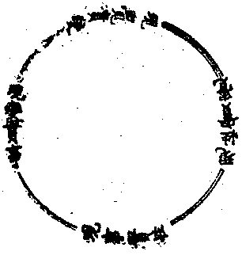
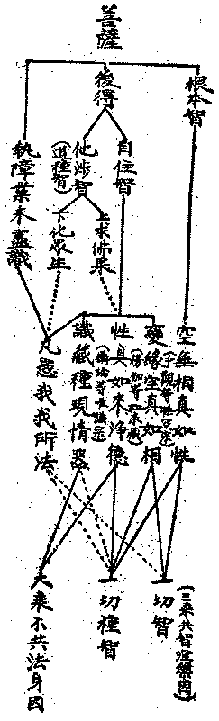
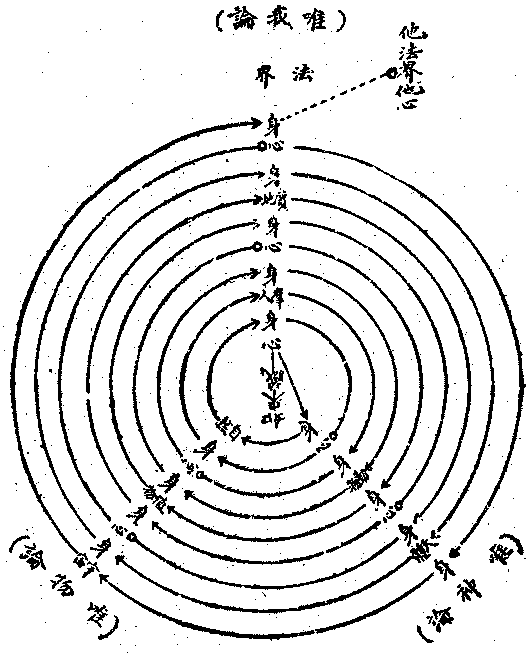
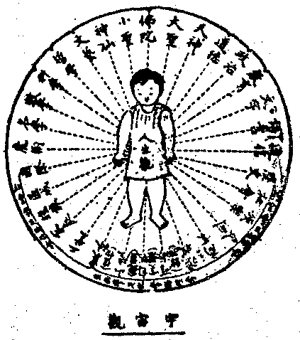

# 第五節　四現實輪

## 目錄

- 一　四重現實之關係
- 二　現變實事與現事實性
- 三　現事實性與現性實覺
- 四　現性實覺與現覺實變
- 五　現覺實變與現變實事
- 六　現實是唯一大總持
- 七　真現實無邊中始終
- 八　真現實之真進化
- 九　發達人生即證佛身
- 十　淑善人間即嚴佛土


## 一　四重現實之關係

甲、四現實圓輪表：四現實的關係，是重重攝入而展轉關連的，如表：




此表應從「現變實事」看起：現變實事一節，正是說明緣生無常的有為法。從現變實事到「現事實性」間的關連是一條線，這說明了現事實性的「現事」，就是上節的現變實事；將第一重現變實事攝入在這現事二字之中而無所遺漏。更在那現變實事的有為法上去說明其無為真常的「實性」，所以這一節的名詞，也叫「現變事的真實性」。能總攝前一節，且進明前所未明之義，故畫一線以表明其關係。

再看從現事實性到「現性實覺」，這中間的關連是兩條線，這說明現性實覺的「現性」，就是前的「現變事真實性」；這將上面二重現實義都已攝入在「現性」二字中。而且在這現性上，又加一重能對此真實性的覺了義；這覺了，並不是依言教所得的比量覺了，而是對這現事性已有一種修證所成的現量體驗，所以這叫「實覺」，這是前二重所沒有的。在現性二字上包括了前二重，又在前二重的現事性上進明「真實覺」義，所以用兩條線來說明其關係。

從現性實覺到「現覺實變」間，是三條線，這是說：「現覺」二字，已將前面現變實事、現事實性、現性實覺三重現實義，都包括淨盡；而且在現覺上起窮神極妙的無盡變化，這神變決非前三重之所有。如二乘聖者和登地菩薩，都能於現事性上，起真實覺了，但能起神變妙用者，則非彼之所能；僅佛果或八地以上菩薩有之。這是括前現變事實性覺三重現實，而進興無盡的實際變用，所以叫「現覺實變」。

從這四相輪再進觀之，以前重重攝入的道理說來，豈不「現覺實變」又可攝入於現變實事中的「現變」，而佛可以復成凡夫嗎？要曉得從現覺實變到現變實事之間的關係，和上來重重攝入的關係，是有所不同的，所以用一條虛線來表明它。第一、「現覺實變」的所變，與「現變實事」的變，大有寬狹的不同：現變實事變，就凡夫不知不覺而卻在聖者明澈覺照中的變；聖者覺了中的窮神極變，則非限凡夫變事。聖者覺智變廣，可攝凡夫現變事；凡夫現變事狹，只是聖覺中一小分的變。第二、眾生所有的現變實事，固然都在聖者現覺的照了中，如眾生阿賴耶識的變根身、器界，是佛所洞了明知；但佛的異熟已空，這一切眾生的現變事，非復是佛自住的果法。這佛智如明鏡，明鏡雖可以現起種種物像，而明鏡本體卻不是物像。所以佛不會再變為凡夫。它的關係是間接的，所以畫的是虛線。

佛實體智不變為眾生染法，依此說佛全淨無漏。然現覺實變上對眾生界的一切事物又無不變，甚至把犯戒等惡逆相亦復變起，依此又可說佛果不斷性惡。這如月現於水中，清水中現明相，濁水中現混相，池水中現大相，杯水中現小相，雖現起這種不同的影相，而實月不到水中；月雖不到水中，而又能現種種相。佛果現覺實變的變相亦復如是，雖現起一切眾生界的事物，但並不同於眾生的業報變現。所以這中間的關係，絕不與上來重重攝入的關係相同。

這是本節的總義，下面都是分解。

乙、四現實淺深表：四重現實的淺深比較，亦有一表：


```
　　　　│現　　　　　　覺實變
　　　　├──────────
　　　　│現　　　　性實覺
　　　　├────────
　　　　│現　　事實性
　　　　├──────
　　　　│現變實事
　　　　└────
```


這四種現實之中，現變實事最淺，所以線最短。現事實性的現事，就是現變實事的事，所以兩個「事」字相平；而在現變事上進一步去探討它的實在性，已經深入一層了，所以所畫的線稍長。現性實覺的現性，就是現變事真實性，所以兩個「性」字平列；在這現性上進一步去說明它的真實覺，又深入了一層，所以表上的線又較長。現覺實變的現覺，就是上重現變事性真實覺了的「實覺」；現在再從這性覺上實起變用，是最深的，所以表線最長。

丙、能所狹廣表：就能量心智和所量事境來比較觀察這四重現實，有著相反的廣狹不同。如表：


```
　　　　　　　　　唯有為　　　通無為　　　　　境契智　　　　體起用
　　　　　　　　　┬───────┬───────┬───────┐
　　　　　│　　　│　　　　　　　│　　　　　　　│　　　　　　　│所
　　　　　│　現　│　　　│　現　│　　　　　現　│　　　　　現　│量
　　　　　│　　　│　　　│　　　│　　　　　　　│　　　　　　　│之
　　　　　│　變　│　　　│　事　│　　　│　性　│　　　　　覺　│廣
　　　　　│　　　　　　　│　　　│　　　│　　　│　　　　　　　│狹
　　　　　│　　　　　　　│　　　│　　　│　　　│　　　　　　　│
　　　　能│　事　　　　　│　實　│　　　│　實　│　　　│　實　│
　　　　量│　　　　　　　│　　　　　　　│　　　│　　　│　　　│
　　　　之│　實　　　　　│　性　　　　　│　覺　│　　　│　變　│
　　　　廣│　　　　　　　│　　　　　　　│　　　　　　　│　　　│
　　　　狹│　　　　　　　│　　　　　　　│　　　　　　　│　　　│
　　　　　└───────┴───────┴───────┴
　　　　　凡　聖　　　　　哲　聖　　　賢　聖　　　唯　聖
```


先從左至右看起：在能量心智說，現變事實的範圍最廣。不但通於一切大小聖人，就是一切凡夫下至地獄、餓鬼、畜生——低等動物——，也都能夠了知它自己的一分境界；通於凡聖，表其最寬廣，其線最長。第二重現事實性，說明究竟的真性，雖非世間外道所能，但學者世間中的一分哲學，也已能用其心智去探究，多少能夠得到一些片面的真理。所以、它通於三乘聖者及世間哲學者——哲聖——，而除去了大部分的凡庸眾生，故比第一重較狹了一些。第三重現性實覺，則須得定慧相應的覺知者才有，所以最低限度已是佛法中三乘賢位的境界——賢聖，已非世間學者所能知的了，所以又狹了一層。第四重現覺實變，則唯是佛法中三乘聖果的智慧才能覺了——唯聖，三乘賢位的還不能聞問，所以是最狹。

再從右看到左，就所量來說：第一重現變實事最狹，因為它只限於緣起生滅的有為法。第二重事實性稍廣，因為它通到了無為法性。第三重現性實覺又較廣，因為上來所說的有為無為都只是境，現在又加上了契證這有無法為境的覺智。第四重現覺實變是最廣了，因前面三者中，就是到了範圍最廣的現性實覺來說，也還在明體上做工夫，未能達用；此則能起窮神極變的妙用，例如華嚴所說的性起法界，所以是最廣的了。

## 二　現變實事與現事實性

甲、現變實事的抉擇：在現變實事的一節中，共有十段，現略抉擇之。這十段中，在說明一切世間法：第一段是總敘。第二、辨證法的世界，第三、易的宇宙。為甚麼在一切世間學說中，單取這二種而不及別的呢？這有兩個原因：

⒈除了佛法以外，對世間法說明得最恰當的要算這辨證法和易了。因為別的學說，對於世間的說明，或如宗教最後歸之於神，或如科哲學最後歸之於一實物。這都是獨一不變的意味；而實際上，世間相並不是這樣。世間永遠在無常演變中，絕對沒有獨常者在。這辨證法和易的學說，是恰到好處的說明了這個道理。在辨證法中，若偏執於唯心或唯物已經是有所偏礙的了；只有那單純的辨證法，說明世間一切無不在正反合的法則下演變著，這對世間相的說明恰甚相當。「易」的名義就是變易，正說明了世間對待流變的意義。「易是不易」，只有變的理不變，除此沒有什麼不變者在；澈底的主張是變，這也正恰說明了世間的真相。因為兩種學說，都適當的說明了世間，所以只採取了它。

⒉這兩種學說的流行，都是很普遍的，一個是西洋學說的系統，一個是中國的學說系統。中國的一切學說，可以易為大全，無論儒家、道家或其他諸家，其哲理之說明都不出易外，所以都可以統攝在易中。也可見易學之於中國，極為普遍。西洋自古希臘以來就有辨證法，無論是唯心、唯物哲學，無不在辨證法的影響關係下發展，可以說都在辨證法的範圍中。所以它在西洋學說中，是一非常普遍的系統。同時、這兩種學說的內容，也包括得很普遍，從自然科學、社會科學說到自心思維的方法等；易學也上從天地的自然，說到修身、治國。因為這兩種學說流傳和內容均最普遍，所以單取他來說明現變實事。

從第四段到第十段，都是以佛法的道理來說明世間。第四、業果的二種生死，第五、色心的剎那起滅，第六、現行種子的熏持，第七、非斷非常的恆轉，第八、有為法的自然滅，第九、三性的無常義，第十、八不的因緣義。在這七段中看來，第四第五和第十的三條，就可以將佛教的世間法說全了。第六、第七、第八、第九四段，在佛法的系統上是大乘法相中所特明，他宗所少言及；在這現變實事上，似乎可以不說。不過要知道這四條雖也可以不說，但說了是要圓滿充足得多；因為現在的一般學者世間中，在探討世間相的時候，往往從粗相顯現的事物推論到微細潛在的法體，而在這微細潛在的法上起執著認為就是萬有的本原或實性。對於這種的謬誤，不能不用一種微細分析的說明來加以剖解，以見其為無常生滅的道理。在佛法中，足以勝任這項職務的，正是大乘法相上所說的這幾種義理。同時，這微細境界，也是菩薩後得智及佛果一切種智的實境，所以在這節中加以說明，是有其需的。

乙、現事實性的抉擇：現事實性，是在差別事上說明它的普遍理性。十段中的第五段，是「眾緣生與唯識現」，這在平常都覺得是說明事相的，並不是說明普遍理性的。為什麼要把說明法相的「緣生識現」的道理，放在現實性上呢？要曉得眾緣生與唯識現，雖是說明事相的，但因為它是一切事相的共同普遍法則，所以也可以說它是普遍理性。如佛法中常說的「諸行無常」性，無常本來是用以說諸行——一切有為法——的變遷相的，可是因為凡諸行無不皆是無常，無常就成為諸行普遍的共同法則，於是乎無常就成為諸行的普遍理性。眾緣生和唯識現，也是如此，它雖只是說明諸法事相的，但諸法普遍都是眾緣生的，永遠都是眾緣生的；普遍都是唯識現的，永遠都是唯識現的；於是眾緣生與唯識現，就成為諸法普遍的理性了。因之，也就把它說在現事實性裏面。

復次、本節終於第十段「重重二諦性」，說明了大小諸宗的重重二諦義，只是沒有說到華嚴的事事無礙法界性，這豈不是一種缺漏嗎？不，不缺漏！要知道在現事實性所說明的重重二諦性，本已含有法界性的普遍性。至將其事事無礙相詮顯出來，那是應在現覺實變裏說明的。

丙、有為相與無為性：將前面現變實事和現事實性兩節合起來看，則現變實事是有為相，現事實性是無為性。不過這裏所說的無為性，比起尋常單純的無為性，要來得寬廣。普通所說的無為性，是空無相的單純理性，和事相對稱的一種理性；在這裏所說的無為性，卻是包括有為相於中的，是諸法的重重二諦性。換言之，它是包括了現變事，而在這現變事上去究明它的普遍恆常的真實性。是即有為相而明無為性的，是無為不為的，和單純的無為有差別。所以不能拿平常那事與理、自性（事）與共相（理）、緣生（事）與無生（理）等絕然相對的眼光，來看這現變實事與現事實性的關係；而他們的關係，是前前攝於後後的。例如現變實事可以是事法界，但現事實性不止理法界，而是兼括理法界、理事無礙法界、事事無礙法界、一真法界的。

（妙欽記）

## 三　現事實性與現性實覺

甲、現性實覺的抉擇：現性實覺一段中可起疑問的是：實覺，應該是實證現事實性的聖智，起碼要見諦的三乘聖者才有；何以現性實覺段所講的智，并不限於聖智而通於未得聖智以前內凡——賢——位的解行智？此因賢位的解行智，也很重要。前節的現事實性，完全是教理之所知境；然要實證於所知境，須依文理了解之境趣修觀行，才能進達到實證的聖智。若沒有理解與聖智間聯繫的觀行過程，則無法達到聖位的現觀智。現觀是就聖者現證的觀察而立名，但六現觀之前幾種，都是未達聖位現證智的現觀。如是賢位解行智相應，可以引發趣證實性的覺智，亦應攝為現性實覺。如無分別智，沒有加行為引生，則不能得根本無分別智，故加行智亦稱加行無分別智。所以、各種智——如六現觀等——都不是單在證勝義上名智，亦通於趣證勝義及勝義引起之世俗智；故現性實覺也是取廣義的實覺。

乙、相性境與世勝智：現性實覺既包括真俗二智，故現變實事及現事實性，即是諸法相性之境；而證此境之智，亦兼世俗勝義兩智。由此、引發無分別智之加行智，無分別的根本智，及根本智引發之後得智、一切種智，俱攝於現性實覺中。

## 四　現性實覺與現覺實變

甲、現覺實變的抉擇：現覺實變，是佛菩薩的智境，如左表：




菩薩有根本智，及由根本智無間起的後得智，還有後得智無間起的有漏心。根本智所證者，為空無相真如性。後得智分自住後得智及他涉後得智兩種。自住智境，又分三種：一、變緣空性之真如相；二、從空性中見到具足如來清淨功德；三、見到業識幻現的種子和根身器界；依此凡夫外道執為我我所，愚法的小乘執為實法。這種業識所現境，唯是菩薩後得智境，凡夫、外道、愚法的二乘，確乎不能了知。所以菩薩一方面從後得智上見到藏識幻境，一方面又見依此而起的愚所執的我我所法。菩薩後得智的三種境，第一、變緣空相真如，即中觀等的空無自性宗；第二、具如來淨德，即楞伽等經的如來藏宗；第三、藏識種現情器，即攝大乘等賴耶緣起唯識宗。菩薩智上這三種境，佛分說之以偏適三種根機，但三境在後得智上是相通的。後得智從根本智引生，所以通依根本智境的，要是離了根本，即成為惡取，故都不離空無相真如性；故根本智與後得之自住他涉二智，都是相通的。由此三智境亦各相攝，性空宗以如來藏攝于空性中，藏識幻境攝於凡愚我我所中。性具如來淨德的如來藏，攝空性，亦攝阿賴耶識。攝大乘以藏識為根本，說藏識含有清淨無漏種子，即是如來藏；同時亦說識以二空所顯真如為性，故亦兼明空性。不同的主要點，雖在適應根機，而菩薩智上亦原有此三境差別。但若到佛果境上，根本後得不二，名一切種智，其智完全是清淨無別的境。藏識的名稱，在菩薩位上有，佛果清淨智上已離此藏識之名，故用虛線表示。這虛線也表明佛果上的現覺實變與現變實事之間關係。菩薩智，法相中用根本智、後得智，般若中用一切智、道種智；佛果同用一切種智。在我看來，一切智通根本及後得一分，故一切智比根本智來得廣，不單是觀空，同時也見我我所空；所以一切智更有通到我我所一條虛線。道種智卻比後得智來得狹，祇是後得上的他涉智；上求佛果，下化眾生，上求間接性具如來淨德，下化間接凡愚我我所法，故皆以虛線表示之。一切智是三乘相共的涅槃因；菩薩後得智上的性具如來淨德與藏識種現情器，是大乘不共的法身因。

乙、境智體與變化用：現性實覺與現覺實變的關係，是體與用的關係。在現事實性一節裏所明的是境，現性實覺一節裏明的是照境之智；境智都只是明體，所以總攝之曰「境智體」。現在在這境智體上，進一步生起窮神極妙不思議化用，就是現覺實變一節的主要義理。所以這兩節的關係，就是從體起用的關係。

## 五　現覺實變與現變實事

現覺實變與現變實事之關係，即依前表可說明。菩薩的後得及佛的一切種智上，間接都涉及凡愚我我所執法。菩薩雖有出世功德，然尚未圓滿，故未能全超世間，所以菩薩一方面具出世功德，一方面仍屬三界所攝。佛則不然，唯是諸法空性及無漏清淨功德，亦即唯是一切種智之清淨法身；已捨去藏識之名，故佛不屬三界所攝。雖眾生法佛完全了知，變現也都可現；但法性身及自受用身上全無染法。故佛果現覺實變與現變實事的關係，只是間接的一分。

## 六　現實是唯一大總持

依前重重分析及綜合之說明，可知現實一詞，包含意義之廣，無論凡愚菩薩佛，都不能超越現實這一詞之範圍。從現變實事到現覺實變，又有重重關係及含義之深淺等差別。如此現實一名，所詮的意義，任何名詞都沒有與相等者。現實，似乎等於宇宙之義，但如四現實重重之義，絕非宇宙一名所能詮顯。佛法中法界一名之含義，雖與現實之名相等，但直就能詮的名上講，現實所詮重重的義，亦非法界一名所能表達。故法界一名雖可與現實一名範圍相等，但就本名直詮多義言，還是比不上現實一名。起信論以「眾生心為法界大總持」，亦此處以現實為唯一大總持之義；但側重唯心，仍與唯物不免相對。此講現實，則從眾生現下一剎那的事實，到究竟的佛果，亦不越此。所以現實是「舉之無上，按之無下」，均在現實之中。故現實為唯一大總持，亦即是唯一大陀羅尼。

## 七　真現實無邊中始終

現實本不必加以真字，因為通俗所謂現實是與理想相對的，今為簡別通俗的現實一名，故加一真字，名曰真現實。真現實，「推之無外，反之無內」。推之無外即是無有邊際，反之無內即是無有中堅，無中亦即無實體或無自性。此現剎那事實法，又索之展轉無始而追之展轉無終，無邊無中，無始無終。更無理想能越此現實之外者，故真現實即已包含了理想。無邊中始終，而又即中即邊即終即始，此為真現實之輪廓。在緣起上看，任舉一法，無論為色為香，即是一切法。缺一法為緣則此一法不成，故一切法以此一法為終止，亦可說此一法即是邊際。又一切法都以此一法為緣而成，缺此一法彼法不生，故此一法即一切法之始，亦即一切法之中。真現實只是就現下一剎那事實而言，故無內無外，無始無終，即內即外，即始即終，而非對理想以言也。

## 八　真現實之真進化

自由史觀云：

現實主義教育即自由史觀教育。而自由史觀之教育，由內而外又由外而內為一度之提高擴大；再由內而外又由外而內為二度之提高擴大。如此一度二度以至七度，乃臻究竟。並以圖式表之：




此圖一小「○」符、表提高擴大之一度，「↑」符、表每一度中由內而外由外而內之程序。內謂心、身為介，外謂自然及人群等。人為生物，由內心之活動起身之活動，由身之活動接觸自然——動、植、礦三界——之活動，由接觸自然之活動同化為身之活動——新農工商教育——，由身之活動提高擴大于心之活動——新科學哲學道德——，此為生物教育之第一度。亦儒家格物——接觸自然與攝受自然。格者、來也，即攝受自然物來身心也——，致知——攝自然來身至心，而有新科學發明也——，誠意——由新科學成新哲學——，正心——由新哲學成新道德——之學。然儒家不詳於此，而孔子以來唯詳于身修以後之事，致但能代表人群教育，而不能代表生物教育。其鵠的在強健富榮，其哲學亦以此為人生觀，故道德亦以衰病貧陋為罪惡。教育而以此為終止，則教育為經濟之奴隸，而不能自由進化。然此固自由史觀教育之基也，不應捨棄，且首須重注之。從此展進有一歧途，由身健榮而逕從身發洩，則為生殖力之向下活動——人以下之動物蓋屬於此，為近代動物教育之弊，亦楊朱等主張也——；一為由身強富而到心之健榮——即哲學道德等——，由心健榮而到身之表現，則為身修之禮樂等——文章藝術——。由此有二歧途：由身修逕到身心者，但為各個人相對之個人，淺之若伊壁鳩魯及個人無政府主義等，深之若小乘解脫等。由身修到生殖力發洩之夫婦、父子、兄弟之家國等人群，則為正途。然第一度成社會經濟之利，養成各個人相對及自職團相對之個人而已。三種人生態度以第二種為主，而以第一第三為伴。若由心之健榮表現為身修——由身修而直達天下平者為出家菩薩——、家齊、國治、平天下；則為由心到身修，由身修到人群治平，由人群治平到身安樂，由身安樂到心清泰之第二度提高擴大，是為人群教育。儒家始於家庭之孝悌而終以國際——天下——之忠信，故為代表。此人群教育能養成各個人至自世界之相對個人，其鵠的為調和安寧。且自人群教育而起，已廢第二人生態度——征服利用自然態度——，唯用第一第三人生態度互為主伴而已。然此人群教育，但成國際政治之平，若教育從此而終止，則歷來以教育為政治奴隸之弊不能去，而不能達於較人間更進化之境矣；故尚須有天神教育以引進之。以天神為「唯一之造物真宰」，或完全脫離生物關係之靈怪等——魔術迷信——致有高壓人世、冥仰天國之弊，吾人固當捕滅；但視天神為人間以上更進化之生物界——若火星等——，固為進化之所承認，亦為自由進化之所應有，於是有由心到動物及植物之第三第四度之提高擴大。不惟同類能有心意文語感通，異類——獸等——亦能以心意文語感通而相化；不惟能製死物及感通動物以充資人工用——若機器牛馬等——，亦能感通植物以供人之衣食及音樂等，則從北俱盧人以至三禪天之生物界也。再進為由心身到地質及天體之無機物，亦能感通隨身有無之第五第六度提高擴大，則為四禪天是也。以上皆可謂之天神教育，其鵠的在超人勝進，故亦謂之超人教育。再進為由心身到宇宙之無量世界、皆能隨身有無之第七度提高擴大。究竟圓滿，乃為佛陀之法界身，而仍與他法界心境——即諸法界身或眾生如來藏——相感相應，無盡無極。第七度為佛化教育之特點，其鵠的在進化圓滿。

復依前圖所示，世人不知走現實主義——自由史觀——由內而外由外而內為一提高擴大之活路，而專走從上而下各偏一邊之死徑！其最高明之唯神論，則從天體以外之身——神——，由天體走到內心，再由內心走到天體以上之身之一旋復耳——若大梵、耶、回一神教。其下者，或由內走到天體——若拜日教——及走到動物而止——若拜物教。其最高明之唯我論，則從最外身走到最內心，由最內心再走到最外身為一旋復耳——若數論、耆那教——。其下者，則由最內心走到最外心——若柏格森——，或最外心以內身——若尼采——而止。其最高明之唯物論，則由宇宙走到自然，再由自然走到宇宙為一旋復——若赫克爾萬物有生論、或唯物的一元論——。其下者，則由自然走到第三層之心——若行為派心理學——，或走到第八層之身而止——若原子、電子論——。此唯物論與唯神、唯我論，有一共同之點，則始終皆棄最內心不問是也。故於此等思想系統中之學理，在自由史觀教育中皆不適用，非以真現實論徹底改造一番不為功也。

## 九　發達人生即證佛身

自由史觀云：

一曰、學齡教育，則成人對於未成人輔成其自覺自營自治之自由力，能自由營資生事業，及自由治共存社會者也。二曰、成人教育，則成年後之人，入人群世界自然宇宙之大學，由個人與他人及生物無生物互以為師，互以為資，以成參贊人生宇宙化育而自致為完全之人者也。因字之曰相對的個人主義之教育。相對故、普遍能助人之自由而不奪人之自由，個人故、獨特能充己之自由而不失己之自由。乃析之為相對各個人之個人，相對自家庭之個人，相對自職團——包學校及團體——之個人，相對自區域之個人，相對自種族之個人，相對全人類之個人，相對自世界之個人，相對眾生類之個人，相對全宇宙之個人，終以體達全宇宙緣成的個人——如來藏——為中心，開發個人實現乎全宇宙——法界身——為極則。在個人曰全人，在社會曰大同，在宇宙曰圓融法界。自一至七之個人，為學齡應受之教育；自八至十為成人自致之教育。茲製一圖以明其意：




科學教育為學齡之教育，宇宙教育為成人之教育。魔術迷信為原人及幼兒心理，魔術發達之極為神仙，看破魔術則以神仙為山林高士可也。迷信發達之極為天神，看破迷信則以天神為世間偉人可也。文藝、藝術，為科學哲學之結晶，亦科學哲學煤爐所生之火燄。道德為教育政治之結晶，亦教育政治煤爐所生之火燄。語言、文字、名學、數學，為知識教育之基礎，亦思想交通之工具。天體、地質、河海、山陸、植物、動物，總為自然演化。農林、工業以至區域，漁牧、商業以至社會，聯合之為國際，續持之為歷史，總為人工演化。至魔術盡而迷信空，為各自個人而解脫，則成小聖；為無量眾生而精進，則成大聖；至于究竟，則為佛陀。大聖為相對眾生類之個人及相對全宇宙之個人，佛陀為體達全宇宙緣成之個人而開發個人實現為全宇宙者。其餘則大抵可知矣。

## 十　淑善人間即嚴佛土

甲、現實人間之苦惱——吾此人間之苦惱：一曰、依外界苦，二曰、依內身苦，三曰、依人群苦。依外界苦者，若風雨、雷雹、霜雪、旱、潦、震嘯、薄蝕、波濤、險阻、蚖、虎諸難。依內身苦者，若飢渴、寒熱、淫慾、衰老、殘廢、疾疫、夭死諸患。依人群苦者，若負擔、被制、爭奪、傾陷、監禁、驅役、戰鬥、殺傷、恩愛別離、怨憎會合諸害。今藉科學之征服自然及機器之發展人力，對於依外界及內身之苦似可漸減；然為科學機器之力能不能防止之天災，若颶風、洪水、地震、海嘯、惡疾、巨疫等，反時見為大規模之出現毒禍人間，無從逭避。以此知不清眾生心業之本源，僅憑物力以相掩拒，終至變形橫決而出，達於不可收拾之域！至依人群之苦則日增月劇而靡已，更可慘矣。自教人類「師法生物以爭生存」之學說出，所蘊皆為殺機，所爭皆成戰爭，夫婦、父子、兄弟則相爭相殺於家庭，親戚、鄰里、鄉黨則相爭相殺於村邑，士、農、工、商則相爭相殺於社會，軍、政、議、警則相爭相殺於國族。各各疆域之爭則醞釀為帝國侵掠之大爭殺，種族階級之爭則醞釀為勞農專政之大爭殺。舉世火併之禍迫於眉睫，搖蕩驚駭，莫知其可。嗚呼吁嘻！是誠業燄燎原毒煙蓬勃之世界哉。

乙、改善之行法：⒈為治本之法，此又有二：一者、在於力行不故殺生、不盜他物、不行邪淫、不妄言、不兩舌、不惡口、不綺語、不貪、不瞋、亦不邪見。故今亦惟各人各自歸依佛法僧寶，仗三寶力，勵行十善，修人間增上之善業；由改造自心以造人間淨土而已。二者、改良陋俗，滅弭兵刑，寬裕生計，慈幼安老，救廢恤煢；去貪則勞資之階級可平，去瞋則國際之戰爭可息；由此改造人間環境，以造人間之淨土也。在人間淨土中，則身命資產自得保持安全矣。⒉為治標之法，此亦有二：一者、由全球各國佛教徒，依佛法為大聯合之國際組織，請求各國政府護持。平時安分行善，互助互益，不相擾害；遇天災人禍等之生命資產危險時，由佛徒之國際聯合，設法救護。二者、依「法界無盡」、「自他不二」之三寶諸天威力，當修真言密宗之祈禱法，息災增福，降伏魔怨；及臨時舉行全世界佛徒聯合之悔罪祈福等，便能遇難成祥，逢兇化吉，以護保身命資產之安全。

丙、造成佛國之模範：無量壽經云：

法藏發願之後，於不可思議劫積植菩薩無量德行。不生欲覺、瞋覺、害覺，不起欲想、瞋想、害想，不著色聲香味觸法，忍力成就不計眾苦，少欲知足，無染、恚、癡，三昧常寂，智慧無礙。無有虛偽諂曲之心，和言愛語先意承問，勇猛精進志願無倦，專求清白之法以惠利眾生，恭敬三寶，奉事師長，以大莊嚴具足眾生。令諸生功德成就，住空、無相、無願之法，無作無起，觀法如化。遠離粗言、自害害彼、彼此俱害，修習善語、自利利人、人我兼利。棄國捐王，絕去財色，自行六波羅密，教人令行。無央數劫積功累德。隨其生處，任意所欲，無量寶藏自然發應。教化安立無數眾生，住於無上真正之道。或為長者、居士、豪姓、尊貴，或為剎利國君、轉輪聖帝，或為六欲天主乃至梵王，常以四事供養恭敬一切諸佛。如是功德，不可稱說。口氣香潔如優華缽羅，身諸毛孔出旃檀香，其香普熏無量世界；容色端正，相好殊妙；其手常出無盡之寶。衣服飲食、珍妙花香、繪蓋幢幡莊嚴之具，如是等事超諸天人。於一切法而得自在。

此彌陀因地中創造極樂佛國之模範也。

（正果記）（本論稿見海刊十九卷六期起至二十五卷二期止）

（附註）宗體論擬為五章，即現實之理，現實之行，現實之果，現實之教，現實之教理行果。今以大師示寂，唯講出初章，餘四不復得聞；眾生福薄，悲悼何極！

