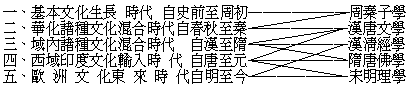

# 中國文化之佛教因素
（1938 年春，作）

閱東方雜誌春季特大號，見其研究中國文化問題之特輯。關於一部分的政黨政治鹽政、中算、婚制、繪畫、醫學、交通七篇，關於一般文化的起源發達等五篇，洵皆各有特殊闡發。然要以林惠祥君的中國文化之起源及發達一文為最善，其首先闡明基本的華夏文化之發生及特質，然後再論其由歷代逐次吸收而擴展，誠得事理之真而毫無偏見，由之結示其發達之分期，條貫秩然，甚為明晰。所分五期，與余所言中國文化之五個特徵，頗可相為發明。茲為表列於下：

蓋周、秦子學，乃上承基本文化以為第一期吸收擴展之結果。漢、唐文學，乃秦、漢及隋、唐兩番吸收擴展之成績。經學成立於漢；成為漢以來佛教之骨幹；抵清由理學反動更發揮至極，擴究周秦子學而進入吸收歐洲文化階段。隋唐佛學則正為印度文化輸入成果；宋明理學乃襲取經學與佛學各一分以產生。由此、可見佛教已為中國文化一重要因素。研究中國文化，若無視於佛學，或排於佛學，實為不知中國文化為何物者也！為中國人，又烏可不研究於佛學哉？

（見海刊十八卷五期）

