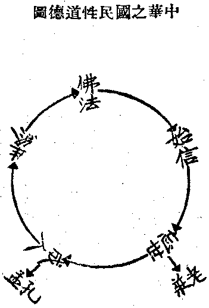

# 怎樣建設現代中國的文化

## 目錄

- 前言
- 一　中國歷史文化的追溯
- 二　中國固有之社會組織
- 三　現代的世界鳥瞰
- 四　落伍中的中國現狀
- 五　從固有道德以建設現代中國文化
- 六　從改進教育以建設現代中國文化
- 七　從改進政制以建設現代中國文化


文化是人類改造所依所資的自然物，以適應人生需要的方式和工具，乃豎窮語文所權、橫遍舟車所達的一切人類努力交織以成。然因受時間、空間的限制，故一時代有一時代的特徵，一方國有一方國的特徵。但云現代，則時間限於現代，而空間卻通於中外；但云中國，則空間限於中國，而時間卻通於過未。今曰現代中國，則於現代是以中國為本位而內攝民族，外攬國際；則於中國是以現代為本位而檢討過去，創造將來。就中國即可有三個方面：一、中國個別的地理與物質環境，二、中國個別的民族性格，三、中國個別的歷史文化的社會組織。一二兩項讓之地質學、生物學等專家。茲先就第三項一論究之。

## 一　中國歷史文化的追溯

有四五千年歷史的中國。自伏羲畫八卦、神農播百穀、黃帝垂衣裳而治天下以來、歷堯、舜、禹、湯、文、武，至老子、提舉其精要為道德經，遂成黃老的道家文化。自契敷五教，周公制禮，至孔子「祖述堯、舜，憲章文、武」而刪訂六經，遂成周孔的儒家文化。繼是而有墨、名、法諸家，則皆不過此二家的旁流。道家乃帝王的文化，所謂君人南面之術，雖務光、許由儘多隱世，而以能作帝王為行其道；儒家乃士大夫文化，所謂致君澤民之術，雖孟軻、荀卿功在授徒，而以能作卿相為行其道。唯至漢世，由升之在朝的儒家而張為儒教，孝弟力田以取士，孝廉方正以舉鄉，儒之教化乃漸及民俗，浸習成風。同時、由降之在野的道家而潛成道教，乃綱羅積古以來醫的丹藥、巫的符籙等神仙天鬼的修煉崇拜，上誘時君，下攝愚氓，藉以自存或乘機興寇遷政。西漢後、除外族侵入外，大抵治平之世，儒教當權；而由治入亂、由亂致治，則皆出於道教。迨東漢佛教初入，經魏、晉入南北朝，民族混雜，戰禍時作，佛教乃成為真正之民眾文化。蓋不參糅任何政爭治權，而惟憑民間自由信仰之所樂從也。歷六朝入隋、唐統一，所謂道教固十六七託佛仿造；其間君相雖用儒教為治具，其濡涵德性、順應民心的精神，固已潛移於佛教。趙宋以後，中國整個之民族，皆為道、儒、佛三要素之所滲透；於此三教混合的庸眾心理上，由少數特殊份子，各張其或儒、或佛、或道的門戶。讀儒書的所謂讀書人，往往憑其所讀的死書，及所友的讀書士大夫，惟認儒教為中國文化正宗，斥黃老為異端，屏佛教為外來，乃由未嘗一著眼於活的民俗風習之所誤也。故由時代以言之，四千年來有道教的文化，二千五百年來有儒教的文化，一千八百年來有佛教的文化，皆中國固有的文化也。由性質以言之，以帝王文化為本位下而及卿士民庶的道教，以卿士文化為本位而上佐君治下輔民德的儒教，以民庶文化為本位而上及士夫帝王的佛教，皆是中國固有的文化也。非道教莫溯中國文化之源，非儒教莫握中國文化之樞，非佛教莫廣中國文化之用。居今日若仍持昔時儒士之狹見，則適以斲喪中國文化的生命，弱損中國民族的元氣。故於檢討過去的中國文化，首應於此三致其意。

何況藏、蒙、滿民族文化惟是佛教文化，若排佛教而外之，即無異拋除藏、蒙、滿民族，而道教神秘亦多有可溯源苖族文化者。除上道儒佛三要素而外，次要者為回教，於西北諸省民俗風習，關係頗深；但其散居內地者，則大抵與漢族同化，已無深嚴區別。他若祆教——波斯祀火教——、猶太教——挑筋教——、摩尼教及景教、可里溫教、耶穌會等耶教別派，雖亦曾傳來唐、元、明各代，今皆已湮滅無存，祇可供史料之考查耳。而隨歐、美近代勢力傳入吾國之耶穌舊教、新教，則當歸入橫的現代國際關係中，而非中國固有之歷史文化矣。

## 二　中國固有之社會組織

近人論社會制度之演變，每根據馬克思之學說，指中國為由封建社會進入資本主義社會之過渡階段。其實、中國數千年來之社會，乃以家族為中心之一種特殊組織。先有許多「各人自掃門前雪，莫管他人瓦上霜」的小家族，套上一層中家族；而由許多處鄉為紳士、出任為官長之中家族上，再套上一個大家族。上層的大家族，即皇室、亦即國家。國家即「皇家」的家，以中層的家族為臣佐；中層的家族即公卿大夫士，亦即所謂「世家」，以下層的小家族為家僕佃役；下層的小家族，即所謂尋常百姓家。國家既即皇家，故必曾膺一命以上而受過皇族祿位的，乃有「國家興亡」之責；若尋常小百姓，固無國家的責任。直到屢亡於異族後的顧亭林，始逼出一句：『天下興亡，匹夫有責』的話；而明、清兩朝下的黨會，乃稍有民族精神。在此家族層套的社會中，內無獨立的個人，外無合組的團體與國民，所以只有父的子，子的父，夫的婦，婦的夫，兄的弟，弟的兄。朋友為兄弟的引伸，亦即上層與上層，中層與中層，下層與下層，各家族相協的關係；君臣為父子的引伸，亦即上層與中層，中層與下層，各家族套屬的關係。又此五倫的倫理，尤以中層事上層為完備。上層無平等的朋友倫理，而下層缺嚴正的君臣倫理。故五倫的倫理道德，亦以卿士本位文化的儒家為最重視。此種家族層套，一方易分散大群的合組，一方又易牽制個人的特動，故無敵國異族的外來災患，則每能長久相安。由此、歷代帝王無不獎導扶掖之。佛教的僧伽，本為平等個人和合群眾的集團，到中國亦分化成中層家族的大寺院，與下層家族的小菴堂。只有家族的派傳，無復和合的清眾，此可見家族化的普及與深入。其弊則「各人自掃門前雪，莫管它人瓦上霜」，十分之八九的下層家族，只有且只能各存身家的顧念；對於村里鄉邑的公共利害，亦復漠不相關，更何能有國的觀念，但以為此唯紳士、官府、皇帝的事而已。由此、若遇敵國異族的外患來襲，亦祇仗帝王、官紳的抗禦，而往往易被摧破侵入。斯所以中國常為異族所凌佔，而近數十年來屢敗於環逼的列強也。然又以層套家族中的中上家族，有深酣的安樂可耽，故悍麤的他族一嘗及溫厚的甜夢，即易馴服柔化。但今世強敏英銳的諸國，非復昔諸異族堪比，設不因勢利導，化家族為國族，則將無立國保民的可能性。故孫中山先生欲令家族化成國族，實為中國復興的要著，惜尚無化家族成國族的方法耳！

## 三　現代的世界鳥瞰

備有現代的特徵，夠得上稱為現代的民族國家，自然是科學發達後、工業革命後的個人資本主義或社會主義國家。但個人資本主義國家已漸趨崩潰，而集產的或共產的社會主義國家或世界，猶未有建設成功把握。以反個人主義，反一元主權主義，新個人主義的三個思潮，尚在洶湧澎湃的爭流中也。個人資本主義所造成的，其正面即為掠侵的帝國主義，而反面則為弱小民族反抗的民族自決；社會主義中馬克斯派所造成的，其正面即為無產專政的共產主義，其反面則為資產階級反抗的法西斯蒂。由此捲起民族與階級的抗鬥，使世界人類陷入戰爭漩渦。其弊同在一元主權的謬執未能破除。一元主權本為君主、神權的遺毒，個人資本主義則將「一元主權」移轉到議會萬能，共產主義則將「一元主權」移轉到無產專政，皆極度的剝奪他共權利而發達自私權利，故不免其他的民族和階級起與抗爭。而反抗的民族和階級，既為自立和自衛，亦勢不能不託一元主權以集中力量，敵視他民族、他階級而爭取自私權利。若能糞除一元主權觀念，從相對的新個人主義而到於相對的新家族、新社會、新民族、新國家，一切皆為多元的、相對的、相資互成的存在，若中國以三民主義為過渡而祈達的大同之世，庶其可為度脫現代戰禍的救星。

五來欣造所作西洋文化的窮途與東方的救援，嘗謂西洋文明的功利主義，在十八世紀造成了君主自利的專制：而德國之菲特立克大王，則以儒家「君主為人民而始有」的君主義務主義的覺酲，從廢止貴族特權避免革命的和平中建成近代國家。然至二十世紀西洋文明的功利主義，又造成了階級鬥爭，而慕沙里尼以羅馬精神的復活救治了意大利，從之而德國的希脫拉，英國的麥唐納，美國的羅斯福，皆以之挽救了階級鬥爭的革命。然利用多數特權的議會政治和共產主義，誠為造成階級鬥爭的因素，而法西斯蒂精神雖抑止了階級鬥爭，或將引起更深廣的民族戰爭，故猶不足醫好現代世界危症。必得東方文化的「天下為公」大同主義，始能澈底救治。但擴張慕沙里尼的法西斯主義，與羅斯福的善鄰主義，導城威爾斯與斯太林會談記中所謂『大船是全人類，不是階級』的世界人類主義，則漸漸可渡入東方文化的大同之世了。

## 四　落伍中的中國現狀

中國人向來自成為一天地，中國之外，則胥為蠻、夷、戎、狄。雖由佛教嘗認印度為大國，然除佛教外既鮮他種之政治、經濟等關係，亦夷之狄之而置於不見不聞耳。明季以來，乾、嘉之前，曾有布教經商之歐、美人來往，其等之蠻戎也猶昔。故中國之加入現代世界中，成為與今歐、美、亞各國國際來往之一國，蓋始於清道光十六年之鴉片戰爭。在鴉片戰爭前，中國人對外國人，則輕之笑之而已。鴉片戰爭之後，忌之排之之心漸熾，積數十年為拳匪之亂。然鴉片戰爭之後，同時亦即有羨之效之之心。其羨之效之者，初則在乎槍炮、兵艦，以為強國之道唯在乎此耳；其結果、則中日戰爭之失敗。由是、其羨之效之者，更進一步而及軍、政、法律、農、工、商業，庚子之後，既捨中國本有政教重心，將謂立國之道胥賴乎彼，遂進行益力；其結果、由清末之立憲，而成政柄迭更、軍閥割據之民國。民國八年，新文化之運動思潮起，其羨之效之者，更進一步，而及學術思想之文化根本，同時更以俄國式之革命相號召，宗教、政治、經濟、權力等，皆入於混亂劇變之中，乃成一變二變三變而至於今日。

庚子之後，中國岌岌不可終日。以國危有救之之必要，而國人救國之心亦日熱切。觀日本之中興也，有取法於鄰意。未幾、而日本勝俄，遂以唯一所學者為日本。其時親日之熱度，可謂極甚。未幾而日本奪據朝鮮，又稍稍由親而畏；至民四迫訂二十一條約，乃對於日本之救中國，完全失望，而大多數人民皆仇敵視之矣！清末民初時，覘德之強，頗有倣效，且希望德國之能救中國者；至歐戰加入協約，則此希望亦告終矣。民初以來，多有希望美國之援助及拯救中國者，迨臨城劫車案起，乃美國首倡共管中國之說；於是國人之有識者，漸知美國亦不能救中國。而一部份親俄者，則專欲仿效俄國，以望蘇俄之能救中國；至今彼蘇俄但用空言宣誘，藉以宣傳其不宜於中國之共產主義，冀擾亂中國以遂其私耳！九一八遼瀋事變後，依賴國聯之結果，尤足令吾人恍然：知英、法等列強諸國，皆不能扶救中國，而中國人之欲救中國，唯在中國人之努力自救而已。

然自清季變法、民國革命以來，亦未嘗非中國民族的力圖自救，而卒致愈救愈艱苦者，不唯起初固守陳舊而整個的排斥為錯誤，五四後拋棄固有而整個的輸入為錯誤，而「擇焉不精」的採取尤為錯誤。此三者皆未嘗洞觀現代文化和中國文化的根本——選中國固有文化要素以建立中國民族的生命，選各國現行文化要素以資養中國民族的生命，徒為扮飾的、翻掘的以益斲喪中國民族的生命也。例如初以為西洋所長者但在鎗炮、艦車、電機，乃為此種技末的擷取；繼以為西洋所長者更有政法、軍警、學制，再為形表的仿效。殊不知歐美近代文明乃為科學和工業的文明，其政制在全國人民皆有民族的意識和國家的組織；不於此採取其所長以補吾所短，乃反自斲命根而務西裝革履的形似！不知無現代科學工業生產力而欲建立現代的軍備，無現代意識組織國民力而欲成功現代的政制，猶欲今羸弱的、癱瘓的病人跳高競走，徒速其顛蹶耳！此為中國近年顯然的現狀。借觀日本，既益發揚其固有的、受之中國的武士道和儒佛文化，以成長為特殊的民族意識，復根本的、盡量的吸習科學以造成現代的工業生產力和組織的軍政力；其一失一得、一敗一興之幾，不甚瞭然耶！

今日的中國，無論追逐資本國家或共產國家的後塵，皆不是路；即所謂迎頭趕上，從根救起，也不是辦法。唯有切實看清了現代中國的需要，擇取中國五千年歷史文化及現代全世界流行文化的所宜，憑藉之以為基本，以創造「復興中國民族」和「解救世界危機」的新文化耳。

## 五　從固有道德以建設現代中國文化

察之中國現狀，非無政治也，特政治無國民性之道德以為綱維，致爭營私人權利耳。非無軍備也，特軍備無國民性之道德以為綱維，致反成群盜割據耳。非無教育也，非無實業也，特教育、實業無國民性之道德以為綱維，致教育適以坑陷青年，實業因之停滯進步耳。故今日雖有教育救國，實業救國，練兵救國，興政救國之需要，而尤以有一種「國民性之道德」精神，貫澈於實業、教育、軍警、政法之間，以為之綱格，以為之維制，乃能各循正軌而漸臻調協耳。

省之中國往情，唐、漢而上之國民性德，存在今此國民之活情意中者，殆已潛消無痕矣。惟宋、明來之國民性行，蓋猶為今日最普遍最深厚之國俗民情也。經元代而蒙古同化，經清代而滿洲同化，故雖間元、清二代，適恢宏宋、明化之量而未嘗變失宋、明化之質也。然宋、明化之國民性德，為如何之國民性德耶？則佛、道、儒三元素之融合精神耳。如團聚而淬礪振作之，則國民性之道德不勝用也。第余此說，非現時唱三教合一之粗劣的同善社、道德學社、悟善社、道院、救世新教、道德會等所能假借。蓋余之所提出者，乃經過現代的科學、哲學、宗教等精密審量，加以鑄洗鎔練，得有重新估定之價值者，非漠然昧於現勢之開倒車的盲舉也。今請分析言之：

一、建佛法以建信基也：吾華佛法，至初盛唐始完備；武宗毀後，各宗皆衰落，獨禪宗水邊林下，自葆其真。復經五代而入宋初，最稱隆盛，不唯掩包佛教之全局，使時人知有禪而不知有佛，但以禪稱；抑且遇人即頂門一錐，要問渠未生前本來面目，或當念是誰，死後何存，震盪得全國人心非向此中討個消息沒個斷疑生信處，於是禪宗乃打入全國之心底深處。故宋、明來，不但佛教各宗皆張設門戶於禪宗之信基上，即儒道二家之門戶，亦張設於禪宗之信基上。若宋儒之要靜坐，要尋孔顏樂處，要看未發前景象，要先立乎其大，乃至明得古聖賢之言皆為我之注腳；而道流若陳搏，若張紫陽等，修命之前要先之以修性，其修性即修止修定之別名耳。雖儒、道二家於佛之禪皆淺嘗輒退，依舊回到其刑政倫常及長生固命之本旨，以自張其曰儒、曰道之門戶；然嘗築信基於禪上，則固為事實之昭然不可掩者。誠以非如此則當時之知識階級，末由得個安心之地也。此風至明末為盛，知識階級如此，演為庸俗之小說戲劇，皆處處可以見之。雖劣陋之白蓮教及袁了凡教，亦即產生及培養於此種學者庸俗之風氣間；今日四川所流出之劉門、同善社等，皆吸其餘流也。入清以後，禪宗之勢垂盡已不可用；今之佛法，循隋、唐之軌復興，亦不須專重禪宗矣。然在此經過西洋的基督教及哲學科學化後之時代，儒的祖先教——儒之敬天意亦以天為太祖耳，故儒以祖先為宗教，今生物學乃以人祖為猿，故難置信——與道的天仙教，皆不能定信心之基矣。信基不堅，則建築在上者，皆隨時可以動搖傾敗，故非宗依佛法全體以豎立無可搖動之信心基礎不可。佛法全體之正信為何？則信有已成無上正遍覺者；信必有無上正遍覺所用宇宙萬有之真理，及有能得無上正遍覺者之種種方法；信有已從事學習於趨向正覺之方法者，及自己與眾人皆可從事趨向而必獲正覺。此之三信，換言之，即皈依佛、法、僧耳，即發起無上菩提之信心耳。勝解力生，樂欲乃起，信解樂欲心淨名信，由智而信，智信一致，非基督教等盲從之信仰，而不違於哲學科學之推究實驗，故唯此為足於今世裂難斷之疑綱，建不拔之信基也。至由研教、參禪及其他佛教中之方便等，要皆為建此皈依佛法僧之信基而已。人心上若非建成此信基，則終在悵悵乎惘惘然中，混過一生，豈不深可惜哉！

二、用莊老以解世紛也：晚明憨山大師嘗言：不知孔孟不能經世，不知佛法不能出世。今御物質之華美，頌淫靡為文明，恣行言之放僻，標競爭為進化，是非有貶落文明，糞除進化。若老莊之鎮以無為之樸，貞乎自然之淳者，其不為西洋化之環境所迷惑馳騖者，蓋戛戛乎其難也。是則章太炎之齊物論釋，最能稱乎其職。

三、宗孔孟以全人德也：信基建則天君定，世務解則亂賊定。如園藝然，種得時地，則生機勃發而積極之精神具矣。圍以短垣，則患害不侵而消極之防衛成矣。當繼施孔、孟之道，以勤耕耘灌溉，然後發榮滋養以成為枝葉扶疏、花果繁碩之園林焉。孔、孟之道，言其大要，則施行五常於五倫以全人德耳。五倫乃秩序之人群，五常乃理性之人心實現乎人群人世者。茲列一表以說明之：


```
　　　　　（外表形下的）┌物質───人世┐
　　　　人生宇宙之實際─┤　├───人群├渾然一體
　　　　　（內容形上的）└精神───人心┘
```


西洋大部文化，偏於外表形下的；東洋小部文化，偏於內容形上的。孔家儒化，是符合內外上下渾然一體之宇宙人生實際施行者。注重之點，在乎人群：一、如何調達人群之內心，使發為適宜人群之倫理常德——此倫常為儒之中堅——，二、如何制用人群之外世，使成為適宜人群之器具事物——此事物為儒之表面——，依第一條，則佛之五戒、老之三寶——慈、儉、讓——雖皆近之，而不及孔、孟於此最為詳審精切，故當宗孔、孟。依第二條，則雖不同西洋之專務物質文明，而厚生利用諸學科及軍工農商之適宜人群生活者，皆應攝受開發，使人群能制用外事，而不為外事之所制，則對於西洋化亦儘有容受消融之餘地。內養人心之正，外應人世之變，以成為具有倫理常德之人群，是孔、孟宗旨之所在也。故孟子曰：『人倫之至謂之聖』。章太炎曰：『宋明理學諸師，所以不肯直趣佛法者，祗以其道玄遠，學之者多遺民義，故為調停補苴之術；然茍識其情，厲行六度，亦與儒術相依，唯有漏、無漏為異。若撥棄人乘之義，非獨不益世法，亦於六度有虧矣。大抵六度本自平等，十善乃其細者。在家、出家皆不能離十善；東聖、西聖亦並依於六度，以此倡說，自然殊途同歸』——見余所著人生觀的科學後序——。亦可謂知其旨已。

四、歸佛法以暢生性也：佛稱大雄，依佛立信，成勇者之不懼；老稱大玄，用老忘世，成智者之不惑；孔稱大成，宗孔成人，成仁者之不憂；備三達德，人德全矣。然德業方新，老病已迫，無長不消，無形不毀，既濟終於未濟，有生歸於必死，而此老病死三關，任英雄豪傑亦無術以衝決，世人之可傷心隕涕者，寧有過於是哉？道家長生之說，欲有生而無老病死苦也；印度灰滅之論，因老病死而並欲無生也——照流居士徐松石，指佛教為滅生息命避世，乃誤以灰滅外道為佛教，未夢見佛教也——；是皆未明生理，故失閼乎生而未能暢達乎其性也。唯大乘佛法之明緣生性空，乃能宣暢生性，蕩然無閡，使老病死不留痕跡。言緣生則莫善賴耶之非斷非常，言性空則頓顯真如之不生不滅，不生不滅，則生老病死之事本無；非斷非常，則愛生惡死之情何寄？茍知乎此，其最低限度，不唯乘萬化而未始有極，樂不勝計；且能自擇於萬化之間，操人定勝天之樞紐，以優遊乎人天善道，漸成增進。其上者，則趨無上菩提，三無數劫，有進無退，淨法滿足，究竟常住。必如此，然後人樂為善，疊疊不倦以相引進而靡極。故吾人既得乎生，如是乃能不虛此生，非佛法不能賦與充分之意義及永存之價值，而人生遂必以歸佛為終也！

茲之四義，皆就中華國民中固有之心德條理而揭出之者；撮為一圖如左：




觀此中華之國民性道德圖，則可知今日欲求中華國民性之道德，必始乎佛法，終乎佛法，捨佛法莫為功也！誠能發揮光大，篤行實踐乎此者，則如病危之際，真元恢復；然後固之以軍警，理之以法政，培之以教育，資之以實業，調而養之，可臻健康。

## 六　從改進教育以建設現代中國文化

中國國民的實際生活，十之七八是兼帶漁牧林圃和紡織等手工業的農民；近來以各商埠的工商業漸趨發達，故亦百分之十六七從事工商。至於入政法軍學界及起為農工商業領袖者，當不過百分之五六而已。假使要革除近來的教育弊端，將教育適應如此如此的國民而使之普及，並能在實際上得到遍增國民能力、推進國民生活的效果，則考察全國學齡的兒童，亦十分之五六恐僅能受初小教育，十分之四五能受高小教育，十分之二三能受初中教育，十分之一二能受高中教育，百分之一二或四五能受大學教育。觀此、可知適切國民多數的需要，應當辦怎樣的小學、中學、大學了。

一、初小應多分為辦在山鄉中的農村小學，教師亦須能實習農事並有當地及超當地的農事知識經驗，能率領小學生並小學生的父兄共同農作及指導其從漸改進農事，務令學校生活與實際的一般農家生活相近。作了小學生以後，不但仍能去作農務，而且於農務有逐漸改進的效力。如此的小學，才是大多數人民需要的教育，才有普及大多數人民的希望。若養成少爺雙料少爺、的小學，則唯有使大多數人民對之疾首痛心而已！那有普及的可能？高小可多分為辦在鄉鎮的農工小學，兼學習一般初步的工商知識經驗以外，其餘一切皆與初小同。至於為預備升中學、大學而設的小學，則在都市另設十分之一二的小學便可，或並此亦可不須另設，使升中學以上的學生，亦皆從農村、農工的基本教育中而出，則於都市兒童身體的強健勞動的操練與自然生活的接觸和實習，乃至他日擔當國家社會的公務，亦深知民間的疾苦，尤有莫大的裨益。而且中國人民向有重農的心理，士人商人亦無反對其子弟入此等以農事為中心的小學的理由——對於已過學齡而失學的民眾，當另辦民眾夜學、農暇學校、民眾圖書館等以教化之。

二、初中應為辦在村鎮間的農工商學校，使學生生活仍與一般農工商民眾密切融洽，并實習農工商的事務以養成其知識和經驗，俾大多數至初中輟學的學生，皆能安於一般的農工商生活，從事農工商業而能逐漸為鄉鎮邑巿生活的改進。高中則可為升大學的預備或小學教師與較高等的專門職業的修習等等，宜辦在都市，使能漸漬觀摩近代工商業而為實業進步的基礎。要之、小學在養成其農工中心之天然生活、人工生活的知識經驗，而中學則在養成其工商中心的人為生活、人群生活的知識經驗。

三、大學或學院、研究院，應看其性質如何而定：理科中心的應設在富自然物區，工科中心的應設在工業區，商科中心的應設在商業區，農科中心的應設在農業區，法科中心的應設在政治都會，文科中心的應設在文化都會；其他若醫學應設在人口繁盛都市，軍校應設在首都或國防區等，皆以便實際生活的聯絡與研究，而對於近今務名不務實而濫設的大學之類，尤有緊縮和精煉的需要。其最大的急須改良點，則為除專門學外交和學外國文學與預備外國留學的以外，從小學一直到大學，皆停止外國文的學習。其理由、以既為中國人，當然於中國的文字不能不學通順，然學通順一種文已經不易，若再須學通一二種與中國文絕然不同的外國文，勢必使學生的身心力量只能用於文字的學習，而對於各種專門學問更不能有精深的研究。此所以中國現今的大學學生，認真用工的每致過勞病夭，而大多數在不良學制的無可奈何下，僅以敷衍光陰弄得一卒業文憑是務，絕不能有真才實學培成出來。而大學所以成此現象的原因，則由留學回國當教授的博士等中，有一些僅能依照其所讀的外國文課本照本教讀，雖譯成國語來講而不能，由此才假借要研究科學必學外國文的謬習，以文其淺陋。而國內的大學遂除卻學一點文學、法學以外，沒有學到科學的專門識力的可能。於是、不甘自棄的，群趨於向外國留學一途，而經濟人才的耗損乃莫此為甚。故今大學等等的改良，第一步應由國家設編譯所，盡量的將各國已出的、續出的各科科學書譯成國文，使高中以至大學的學生，只要學通了國文便能研究專門的科學；同時、由國家設研究所為二步養成能獨立創生各種科學的學者，則中國的大學始有自存的地位，否則、無論怎樣總不過外國大學的附庸，豈不可恥？

四、留學生除理科、工科、醫科、農科以外，一律停止。但於各大學助教，講師、教授，曾服務學校十年或五年後，得派至國外各大學研究政治、經濟、法律、文學、哲學、社會學等等，以資深造。此中所省下的留學費，一、足可提高二三大學使極完備，二、聘各國最著名學者來充教授。

五、民國以來，軍隊擴充不已、軍閥產生不盡的緣故，國內軍校和國外留學軍事的軍官大批產生，亦為要因。今應停止各地所設的軍校與軍官留學，再不增選未學軍事的青年學軍事學，唯選拔中級以上軍官可深造者，在首都設一高級軍官學校，並派遣各國留學，以資研究。

對於中國現在的一般教育，有這五種的革新，庶其可由適應實際而蔚成復興中國民族的文化。

## 七　從改進政制以建設現代中國文化

化家族為國族既為目前最切要企圖，而順中國固有的良風美俗，復不應破壞農村趨重工商的經濟劇變上，使成為個人資本國家或社會共產國家。於此、應先建立風紀極良的陸軍，實行徵兵制，使國民一達成年皆有入軍訓練一年至三年的義務。既導人人發生為國服務的觀念，復令人人過慣組織嚴密、紀律整齊、群眾廣大的團體生活，自然而然可有超出自身自家私利的觀念，養成民族國家的意識，而散漫無組織的舊習亦因以革除，可成為健全組織的國民。

其次、則無論國民黨訓政也好，憲政也好，終希望能將中央與地方的均權制度確立。早成均權的統一，將物質應建設的建設完成，肅清貪污土劣，治內成廉潔清明的政府，對外成平等聯立的國家。

由此、使個人成為顧全國族道義的新個人，不流為資本主義的個人，亦不淪為抹煞個人的社會主義；使國家成為顧全國際道義的新國家，不流為帝國主義的國家，并不淪為廢滅國家的世界主義。如是的新個人和新國家，便是踏入天下為公、大同之世的初步，也就是復興中國民族與造成世界和平的奠基石。

（見海刊十六卷七期）

