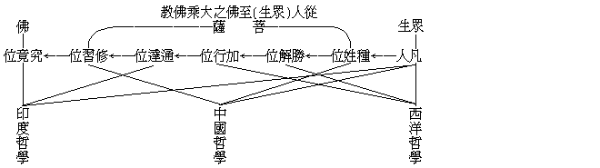

# 西洋中國印度哲學的概觀
（1930 年 2 月，在閩南佛學院講）

## 目錄

- 一　本體論——宇宙觀
- 二　知識論
- 三　行為論——人生觀
- 四　西中印哲學與佛教

## 一　本體論——宇宙觀

甲、形的，可測量的，拒攝的，合成的：哲學大分為本體論、知識論、行為論之三，茲先就西洋本體論而言之。然亦非謂蓋一切西洋哲學都是如此，但其主要思潮則不逾乎此。西洋哲學之要旨，在說明宇宙之本體為有形質之物，而其各個分子悉為獨立存在者。希臘哲學之開始者，以為萬有之本體為水，繼之者有認為火及風等，漸進而析為分子、原子、以至於電子，大類於印度順世外道之唯物論。所云分子等，大抵為佔有空間位置而可測量者。換言之，則雖極細微而仍有方分也。設在其用上而考察之，有兩種性質：一則為抗禦不相容拒力，一則為吸受能相容之攝力。今時更發明一種能子，而其體雖早非耳目所見聞，但在其心理上固仍認為是一有實體者。總而言之，宇宙之體為可測量之極微形質，其用則為互相拒攝之力而已；宇宙之體用如是，而其所由之以成為宇宙萬物者，即各分子薈萃而結成種種之團體也。所謂由電子而原子，而分子，以至礦、植物等。質言之，西洋哲學者所主張構成萬有之原素，雖大有差殊，而約其大齊，則多數人皆承認為由多數有方分之微小實質組織積聚以成之者。除此派而外，尚有所謂唯心派。若仔細考察之，則西洋並無所謂唯心者，而僅有觀念論與實在論之兩派。所謂實在論者，即認為各個實物悉皆獨立存在，而不為心力之所左右者也。至於觀念論，通常謂之唯心論，其義蓋認一類一類事物之類性為實在，即認事物之共相為真實，而以各個事物為非實也。希臘柏拉圖其人，即此派之代表，蓋據吾人心理上所成各各之普遍的概念為實在者。嘗如我今手中所持者名為粉筆，所以成此粉筆之名相，蓋由其餘多數粉筆、亦共有此相故名之也。一個一個之粉筆或成或毀，而此名相則不可磨滅，故反較個體為真實也。然此派所認為真實之觀念，亦仍為事物之共相，不過非官覺之對境，而為意識上所對之境耳，安得謂之唯心論哉！近代西洋哲學，如英國哲學家休謨之唯感覺論，始有近於唯心論者。西洋學者，初以色、香、味、觸為物之次性，而可以測量之大小、輕重、速度、時分等是物較為實在之初性；迨休謨、柏克萊以至現代之羅素，乃承認感覺所感覺者為事實，而近乎佛教前五識之唯識論。至詹姆士純經驗之意識流，始近乎第六識之唯識論。叔本華之盲目意志，及柏格森之生命流，始近乎第七識之唯識論。然西洋哲學固以實在論及觀念論為主，而此兩派所取者，固皆在乎物，不過、有「自相」、「共相」之別而已。

乙、氣的，難捉摸的，感應的，裂生的：中國哲學家之本體論，實無正確可指明之者。若老、莊、周易言之為「道」、「太極」等，大概都認氣為宇宙之原料。例如老子之沖氣為和，孟子之浩然之氣，宋明儒之理氣等。然此氣也，又無實指之一物，以是之故，即不得知其為何氣。煖氣乎，冷氣乎，呼吸氣乎，水蒸氣乎？況且中國人開口便以氣為言，彷彿無有一物而不可稱之為氣者。譬如憤怒者，稱之為怒氣沖沖；有天資者，稱之為靈氣所鍾；有本能者，稱之為才氣敏捷；二人知交者，謂之意氣相同。諸如此類，不勝枚舉。因此、欲尋求為宇宙本體之氣，則適成其為詭怪奇異而難以捉摸之一物矣。至於氣之作用為何？譬如人與人相交，因有美的或惡的感情之激動，而生起互助或互妨之反應變化，天地之道亦猶是也。如金、木、水、火、土之五行，一逢相激觸之時機，即不無相感相應之變化矣。宇宙之體用如是，而其所以成者何哉？按易經之意義，最初為混沌一氣之太極，既而氣有所偏，感生應起，忽然分裂為二：一為陽氣清者上升為天；一為陰氣濁者下凝為地。由兩儀生四象之四時，由四象生山、澤、水、火、風、雷之八卦，於是乎萬物發生矣。老氏云：「一生二，二生三，三生萬物」；意亦近是。總結中國之宇宙論，不出陰陽發生感應而分裂以成之也，即如雌雄而有雛也。但原始無陰陽而僅一氣裂生，則亦猶原生物之由獨體裂生焉。

丙、神的，不思議的，變化的，幻現的：此所言印度哲學，不是從佛教意義而講，乃從印度一般之哲學思想而略明之。其義在前後彌曼薩派：蓋謂宇宙之本體，皆由大梵所造作而成者。即彼大梵，茲稱之為神；以其不可思議者，亦即越乎論理之判斷者也。非但成宇宙萬有之大梵為如是，而吾儕有情亦莫不具有真我，而此真我實與大梵同性無別，所謂「我即梵，梵即我」者是也。已而尼犍子——即耆那教興世，乃從梵即我中，而打破我外有梵之見，與數論同僅承認神我之獨立存在；且每一有情，皆各有一普遍之神我也。無論大梵、神我，悉為人之所不可思議，以見聞莫及而推理亦不能證之也。宇宙之所以成者，不思議之神之所以變化而幻現出者也；譬幻師能演木石為象馬之幻境，又如夢中能現種種人物。大梵既已幻成此宇宙矣，著欲得解脫時，非用修持方便以冀還歸此不思議之神不可也。迨至佛教小乘學說行時，乃不僅否認梵，而我亦無之，獨取變化幻現之心、色諸法而已。

## 二　知識論

甲、數理的，以數度數的計算：吾人如欲解決宇宙之根本問體，必須恃乎極有技能之手腕，然則此技能之手腕為何？則知識也。但西洋取以考定宇宙本體之知識，不外乎數理而已。數學包括所謂數目、代數、幾何學等。而其作用，近則能於多物中或一二物中、計算互相相差或不相差之點，遠則推定宇宙萬有之質量。故西洋柏拉圖、亞利斯多德，即以數學為一切知識之基本，推求事事物物，務得明晰確定之觀念。於是、可知西洋人之知識，胥在乎數理之中矣。按數理知識審之，能知所知皆以數為焦點，所以能有知識者，數理也；而所推求之事物，亦不過測其長短、廣狹、厚薄、與重量、速率、時分等之數量耳。宇宙之本體，又如何而推測之邪？分析而又分析之，一至於極微，指人所不能見聞者以為宇宙之本體，雖無可得，而其推認為佔空間時間之一實質之觀念，則尚存乎中心。西洋哲學，近雖有否認實質，而認為宇宙萬有僅是一種一種之方程式者，亦正見其皆為數量之計算所致焉。近來經驗派，以感覺所經驗之色、香、味、觸為實在，叔本華、柏格森等以意志衝動為實在，似乎與數理之計算為敵，但就西洋哲學思潮上有力量之知識言，以數理而推度萬有為數理而已。

乙、情理的，以情絜情的忠恕：代表吾國知識，則惟儒家之情理，意謂理存人情之中。西洋用數理、論理學推理，專趨客觀之物質，若夫人生情意，全擲理外；中國則舍情而外，無所謂理矣。絜、推度義，人人不欺的、忠實的，審知自己之人情而推及於他人者，即忠恕也。質言之，知自之所好而亦推知人之所好，知自之所惡而亦推知人之所惡；人我既同一好惡，則於己應涵養心氣，凡舉措者，須認清於人情不悖之理性，方可為也，亦即較為有利益、或道德者取而行之也。己所應作及好惡，同時推致他人，亦莫非如是而已矣。此即以情絜情；蓋彼此有相似相近之情理在也。儒家非僅知識於情，而其道德亦據於情。然本篇扼乎知識，其知識即量己之情、以忖人己共通之理者，由盡人之性至於盡物之性，則其推之宇宙本體，適成難以捉摸之氣矣。蓋因人之心氣和平時，每有若天地人物混然而為一者，一旦稍有偏激之感，則反應而為分裂之形勢，卒就冰炭二者不相容，又調和而成第三者焉。一生二，二生三，天地之道，何獨不然？故中國人要旨，在於養氣。語云：十年讀書，十年養氣，斯誠證也。儒家固然，即老、莊、宋明理學亦爾，故中國知識與西洋相殊。就西洋言，數理知識是最有明確固定而不變之性質者，無論何時何處，凡判定之理均不變更，例如二加二等四之類。情理知識的中國則不然，孟子曰：「親親而後仁民，仁民而後愛物」；蓋隨其情之厚薄而有差別，非待遇萬物一致之博愛、或兼愛所同日語也。因其自然最相親者而親之，謂之親親；因其同類可相偶互助者而相偶互助之，謂之仁民；已而推萬物同賦天地之氣所生，亦兼而愛之，謂之愛物，此乃儒家情理知識上之差別境也。且人與人相偶，皆以有彼此相感應之作用，而其變易至為無定：我善遇他人，則他人亦善遇我，我若稍一不慎而致忤他人，他人則亦將現慍怒面色之反應矣。隨順情之至不齊者而適符其分，無過不及，是為情理之知識，又安能以數理知識之物理齊一之哉！

丙、心理的，以心觀心的定慧：主張即情見理之中國，注重涵養心氣；印度則不隨俗而定事物之標準，而採取以心觀心之定慧，以判斷之。蓋就心以觀，則見森羅萬象悉為心理內容，為心理活動之所轉變呈現。然習氣擾濁心識，須煆煉而清明之，方能徹底了知事物本來如是之真相。所謂定慧者，佛說吾人皆必修習而後得成，能統一吾人身心隨六塵而起喜怒哀樂等流動散亂而集中之者，定力也。能於心理內容所知境，審諦觀察而知其悉為心之變現者，慧力也。定深則境若無，逮心動則境隨現，宛然若由一論理推理所不及之「一不思議的神」變化而幻現為萬有也。然定慧有勝劣之區別，不獨佛教以之修行，在佛以前之印度婆羅門教，即有森林之哲學。森林者，入森林而修靜慮也。企圖個人之我能與刱造萬有根本之精神的梵相吻合。佛說梵為禪天之主，修得初禪者得親之，但仍有漏世間耳。後有數論等雖糞除梵而我猶存，以為人人有一實我，其體為常住普遍不變者，一切千差萬別之萬有，乃由此我之要求而起，若欲止其要求而解脫者，非假途定慧不為功。猶太之耶穌基督、與阿剌伯摩哈末德之尊崇上帝，殆近崇拜梵天之思想，但較之崇梵天更為粗劣耳。

## 三　行為論——人生觀

甲、神對物的：凡人身語意志之動作，皆曰行為。擇定人生有價值之目標而行，即人生觀之意義也。要而言之，決標乎行為之價值與否，即以之而確定人生應如何行為之旨趣也。

為西洋數理知識之對象者，不外有形可測量之物也。超出數理測量之外者，即不能入其知識之範圍；甚至置其能推測之自身而不顧。故近人有認宇宙僅為各種之程式者，此在佛典即百法中二十四種不相應行之類耳。希臘古詭辨家，嘗言宇宙以個人主觀為計量；蓋能推測之主觀，既不在知識之範圍內，遂為超越所知宇宙上之神，故康德亦以人心為宇宙之立法者，如神對物之可造作與支配。但各人之測量方法雜遝，以致客觀成為各種之宇宙，而主觀成為各種之神。古時希臘之神甚夥，殆以各種之主觀方面皆為神，而其對面客觀之一切，則無非可計量之物。既而希臘滅而羅馬興，亦大抵以縱其超越之我，攫我外之萬物而宰割制伏之以為利用品，否則、取而消滅破壞之以快其意，為其最有價值之唯一人生觀耳。故唯以智能勇力為貴，而憐愍自他之苦以謀普遍安樂之仁德，非所措意。已而基督教輸入，強者更假其宇宙上帝所造作主宰之說，自居於神父、神主之地位，造成支配之權力階級，視被支配階級為蠢然之物，遂激成宗教及政治之革命。近世則造成資本與無產兩種階級，資本階級對於無產階級視之如機械，遂又激成共產黨領導之社會革命，致常陷於「神抗物」、「物抗神」之階級爭鬥途徑。蓋共產黨亦以神自居，視餘為物，故對於社會，如木匠之對木，截而短之，或鋸而薄之，一唯其意是行；至於人情之甘苦，概非其所計！此豈非西洋人以神自居，對餘為物之觀念所產生者邪？故尼釆之超人說，正可為西洋的人生觀之代表。

乙、人對人的：能拔除視他人為機械而利用之觀念者，殆惟中國人對人之人生觀。自居以人，視相對者亦為人，則人與人之間必須互相感通諒解，乃可提攜和合，各遂其情之所樂，各得其生之所安。否則、將陷於阽危阨窘之地。故人生有價值之行為，首在乎對於生我之父母，教我之師長，以及兄弟、伯叔、姊妹等親族而親愛之；推之於同文化之民族，同形性之人類，以及動物、植物、礦物，莫非與人同稟天地之氣所生，亦應汎愛及之。故儒典曰：『萬物並育而不相害，道並行而不相悖』。又曰：『四海之內，皆兄弟也』。又曰：『父天母地，民胞物與』。故天地人物互相調劑而各得其所宜者，華夏民族所欣然而踴躍以趨之者也。

丙、物對神的：印度所視為人生有價值之行為，蓋趨向於物對神的方面。雖則人與人之間，亦承認為兄弟、朋友，但不如中國思想特別重視人類，而夷視人類為一切有情動物中之一類，列之眾生之內，與諸眾生同具神性，以期各各實現同具之神性，解脫眾生之苦厄，故謂之物對神的。由物而欲到達圓滿之神，須擯除俗欲而靜觀個人之我，即為萬有本體之大梵或神我，然後達於神界，此為印度行為論之大概。雖亦有主張唯物的順世論，別開生面，大抵為印度人之所輕視。

## 四　西中印哲學與佛教

佛教亦從心理的定慧觀察而出。數論等認為心理變化之下，有一實體之神我，然此為推理經驗所不能證明者。佛教大小乘之共通思想，首先攻除此點。據佛教言：除心理現象外，了不可得，梵固非有，實我亦無。心理現象為何？色、受、想、行、識也。色者、見聞感覺之對象，而受、想等即見聞感覺等也。雖數論等亦有無我之義，但彼希冀解脫心理錯覺之個人小我而返歸神我，佛教則即斥彼神我亦出於錯覺心理也。至於小乘佛教所謂身心世界，又如何而有乎？不出乎五蘊中所造行蘊之惑業，致招感識蘊、色蘊等，以成有情展轉流浪生死，及世界成住壞空之相續不斷。只要無明惑業消滅，即得解脫永滅，更無所謂實我存在。大乘不但觀實我空，即色等五蘊亦非實法，而似光影、水月之幻化，其幻化亦無定相之可得，所謂一切法空者是也。如何而能證得之乎？徹底完成心理慧觀，銷融梵及神我之僻執，見為心理作用中之阿賴耶、末那識，而證一切法唯心所現，即以心力而轉變之，轉煩惱為菩提，更有漏為無漏，遂能圓滿成就佛果身土，湛然相續，無有窮盡。由此大乘佛教乃從吾人實際修持進化，而漸漸轉識以趨向無上之佛果者也。從行為論以言之，佛教謂眾生皆可成佛，能有「物對神」向上之利，而無其迷執之弊；菩薩苦樂同情，能有「人對人」親和之利，而無其庸俗之弊；佛陀大願度生，能有「神對物」勇決之利，而無其暴害之弊。更從知識論與本體論以言之，解行智之推理觀察，於色等法及不相應行法，悉能普遍精細而審慮之，有西洋理智之勝而不滯形數；後得智之如量施設，有中國感情之妙而不拘氣習；根本智之稱性親證，有印度定慧之德而不落神祕。總而言之，佛教能攝西洋、中國、印度之長而去其短，及為其所不及者。梁、張二君未見佛教之大全，故望望然去而之於中國、之於西洋，而卒莫知所歸歟！

更攝為一表，以見佛教與哲學比觀之大意：

自其皆未脫凡夫之見以言之，悉離佛教猶遠；自其各有特點之相似言，則中國哲學於種姓位尤近之，西洋哲學於勝解位、印度哲學於通達位、有其趨向而未能至。故梁君不須改佛以從儒，但修大乘菩薩之種姓行可也。張君不必慮佛教無共享堆積之理智，求之大乘菩薩之勝解慧亦可得也。此則竊願為梁、張二君進一言者也。

（默如記）（見海刊十一卷二期）

