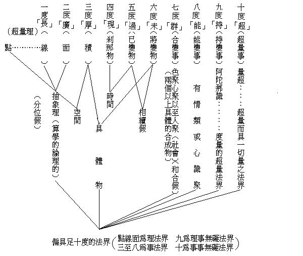

# 說四度以上的事

向來度量一物事，只一、度量其若干長，二、度量其若干廣——廣長僅分位假，非具體物——，三、度量其若干厚，便以謂盡了。新近愛因斯坦的相對論，以為一物事，必要加入什麼時，以為第四重的度量，乃能盡致。故不管說什麼物事，都要將時加入為度量；就是要說這一物事是若干長廣厚，更要加入說在什麼時是若干長廣厚了。因為這一物事，在換一時候，便不是此所說的長廣厚故。這便是愛因斯坦相對論的四度說，影響於今日算學等各種科學思想，起了一個大變化。

但細為考究起來，四度說亦祗可度量僅一剎那存在的物事而已。若空中一現即滅的電光，僅一現的若干廣長厚故，以不相續，自無過未，故但以某一剎那之長廣厚度而止也。若言此時的長城或此時的地球，在此時的即具有昔時的，故除此時之外必更度以此時以前之時代經過。若地質學上之某紀某紀，以及長城之何時建築何時改修等，則不惟以此時的現在度之可了，必更加以前的過去以度之，則須五度矣。夫長廣厚為空間三度，非長廣不易顯空間；非現過——今古——不易顯時間。故稍占空間之事物必有長廣，稍占時間之事物亦必有今古。宇宙世界，宇界即廣長厚，宙世亦即今古。故除僅現一剎那以外之物體，必應皆須五度度之。然細言之，所知事物，實無僅現一剎那者，故無不皆須為五度。

然猶未也，此五度祗可度諸死物耳。以諸死物死定如此，在過去時雖曾以他事物相加而經轉變；然今祗論此物，不涉及其他之事物，則此死物必永死定，無有未來之變，故無復未來之時代。然諸生物則便不然，今度一夏草，則前有春青後有秋黃同時可度；度一壯年人，則前有孩童後有老耄同時可度；故度諸生物，必於長廣厚現過之上，更加未來而為六度。然細按之，一一事物，既實無僅一剎那而以有現過相續，且相續中必緣他物交涉而有轉變，然則亦必實無獨不轉變之死物者。既無死物而莫非轉變之活物，則皆可有未來之度，故又靡不須有六度（至此有相續假）

然猶未也，使此一六度物——譬長城——，與其他六度物——譬砲彈或人身——，若一若二若多交加相涉——自他和合——，轉變起一事物。譬長城砲彈合為毀，氫氧合為水，五人合為團體——社會屬此——，此則必更加一群義度之——中文若仁、若偶、若眾、若群，皆是六度；佛書若蘊、若聚、若集、若和合等，亦皆如此——而乃能充足。故二事——或二緣、或二法、或二事素、或二論理的元子——以上相加而起之事變，必須有長、廣、厚、現、過、未、群之七度。然深究之，一一事物，莫非二事素以上之一聚——莫非眾緣生法——，則靡物不須有七度——三個人立足點不同，則所見物方、位、時代亦異，亦屬於此——（至此有和合假）。

然猶未也，七度蓋纔可以度生物聚耳，度有情聚，則尚未足。何者？前生物變，亦定律變，但為被變，非自能變。而有情心識聚，雖亦同被所變，而有一分即為主動之能變力；缺此能變則不能充足以測度有情心聚。故必於長、廣、厚、現、過、未、群之上，更加第八度之能變。然精究之，一一事物，既靡不續轉而合變，應無有離能變之所變物——唯識義——，變不離能，則事物無不須有「能」加入為八度矣。

然猶未也，此八度纔可度粗淺識中——前六識或前七識——之情非情界耳。若深細識中之心境，則猶有待——深細識指阿陀那識——。夫粗淺識上之情非情等，皆相續而恆轉，亦相攝而和合。以何而得續而不斷？以何而得攝而不散？不斷不散，則由有大潛勢——異熟一切種命根阿賴耶——以為統持；持續不斷故恆轉，持攝不散故和合。粗顯的恆轉和合之鉅變相，則有情有生長老死，而器界有成住壞空。然「能持」之潛勢力深細的恆轉攝藏，則永均衡；故能持續持攝，令粗淺的情非情界之生長老死、成住壞空，永遠循環而不息。彼前八度皆為所持，而此則為能持。故此必於長、廣、厚、現、過、未、群、能之上，更加一持為第九度。然窮究之，粗淺識情非情界，完全即是阿陀那識，以粗淺識了粗淺相，則為情非情界；以深細識之深細相，即為阿陀那識心境。粗細識相有殊，實事不二，故依勝義，一一事物莫非阿陀那識，亦復靡不須有九度。

然猶未也，前之九度，僅能度量事之幻相，猶未能度量事之真相。事之真相，超一切度量而不可度量，謂之事事無礙一真法界。然以此不可度量而超一切度量以度之，則此超量，即為十度。在第十度，一一事物，皆小大無礙故——長、廣、厚——，小大重重無盡；皆久暫無礙故，久暫重重無盡——現、過、未——；皆一多無礙故，一多重重無盡——兩六度以上之合群——；皆主伴無礙故——亦曰能所無礙——，主伴重重無盡——兩七度以上之不離——；皆隱顯無礙故，隱顯重重無盡——兩八度以上之不二——；皆真幻無礙故，真幻重重無盡——即九度之量事，是十度之超量法界，即十度之超量法界，亦即是一一度量事——。一一事物皆為無礙一真無盡法界，平等平等，圓滿圓滿。此為事事真相，唯是如來正遍知量之所知量。此度量即超度量故，一切度量至此皆息，更無有上。

故依無上勝義勝義，如來正遍知量，隨拈一物皆為法界：亦長、亦廣、亦厚、亦現在、亦過去、亦未來、亦自亦他、亦知所知、亦持所持、亦幻非幻，而亦非長、非廣、非厚、非現在、非過去、非未來、非自他、非知所知、非持所持、非幻非幻，以超量為量量即超量故；隨度一事，皆須十度。若依世間勝義，度一一事皆須七度；若依道理勝義，度一一事皆須八度；若依證得勝義，度一一事皆須九度。唯依世間世俗而談，區別如下：

夫愛因斯坦僅發表相對的四度論，已能使科學界的思想起大變化，若能將此相對而絕對又絕對而相對之十度論，影響入科學界，其思想之變化又將何如歟！然數千年前佛家早已發明而發表之矣。今以一世人皆以愛因斯坦四度的相對論為新異，故特將此佛家的陳舊古說比較而言之。

（見海刊第八卷第十一二期合刊）

