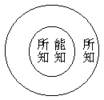

# 行為學與心理學

## 目錄

- 一　引論
- 二　論傳統心理學之淺狹
- 三　行為學與心理學之分界
- 四　行為學與心理學之裨益
- 五　行為學與唯身論
- 六　行為學與唯根論
- 七　結論

## 一　引論

西洋之傳統心理學，吾人向視為淺狹，謂其未足盡心理內容之深廣。若探究其中古以來，從基督教之起源，則始為研究基督教所謂靈魂之學；繼在文藝復興時代，由研究具體之靈魂者，演化為研究唯心論，所謂「精神現象」——與唯物論的物質現象相對者——的「心」之學；繼而又演化為研究主觀的「意識」之學。故其所云心理學者，由靈魂而心，由心而意識，故始終立在與肉體或外物或客觀相對之一方面，為研究所謂靈魂或內心或意識之學也。而所謂傳統的心理學，亦至演為意識心理學乃成科學。此意識心理學，若推究其源于上古之希臘哲學者，所謂意識，初僅側重知識之研究；繼由盧梭等特別注重感情，乃並列知識與感情，為構成意識之二成分；繼又由康德、叔本華等特別注重意志，乃並列知識與感情及意志，為構成意識之三成分。知、情、意三分法之意識心理學，遂為百年來傳統心理學之定例。然所研究之意識，大抵指成人醒時顯然之心理現象而言；繼研究到成人睡時，及兒童與動物等本能的反射作用，有非顯然之意識所能包括者，遂有潛意識或閾下意識之說明以濟其窮。復因孔德、斯賓塞等所倡之社會學漸興，於是研究到群眾心理，又有社會意識、民族意識、國民意識等說明。雖合離異趣，繁簡有殊，對於心識的研究，未實未盡，而為研究與物理相對之心理，則大致從同。名以心理學，固猶可名實相符也。

然傳統心理學，其研究之對象為成人意識，其研究之方法則內省為主，而觀察為輔者也。繼因內省之經驗，各人不同，不能成為科學之公例，漸多注重觀察方法者。以成人意識之不易觀察也，於是侈為群眾心理之測驗，兒童心理之測驗，動物心理之測驗。心理學家不管其主觀的成人意識，而務以群眾或兒童或動物的心理為觀察之對象，於是漸變其研究方法，以觀察為主而內省為輔，浸假取銷內省而專主觀察，以求合於研究物理的科學方法，成立等於物理之一般公例，於是乃有行為派心理學興起。行為派心理學，刱始於美國之瓦特生，纔有十多年之歷史。但以其合於研究物理之科學方法，得多數熱心科學者之研究興味，不斷的從事觀察實驗，對於傳統心理學又勇猛的加以攻擊，頗有突飛之進步。於是遂蔚為心理學界新起之一強國，與傳統心理學所派分之各派相對抗。由此派研究之結果，對於吾人所謂心理，頗增加不少之發見。此派以基於物理的「反射作用」及「交替反應」，以解釋一切心理現象，皆目之曰行為；而主張取銷意識，以但是行為故。有藉思想以證有意識者，則目思想為「隱微言語」而取銷思想；有藉動機以證有意識者，則目動機為「遲延反應」而取銷動機。然意識、思想等，本為非物理的「心理名義」，故研究意識等學，可名心理學；今行為派即一切解釋為基於物理所起的行為，而取銷一切心理名義矣，顧猶襲用心理學之一學名，殊為不合！故有主張取銷心理學一名而改為行為學者，吾則贊成其改稱行為學，而視為另成之一科學；非有行為學，即可取銷心理學也。其義試分析言之：

## 二　論傳統心理學之淺狹

何言西洋傳統心理學之淺狹耶？以吾人所謂心理學，應包括八個心識及五十一個心所有法為研究之對象。而傳統心理學之基於基督教以靈魂為研究之對象者，既同吾人所破除之神我，唯是妄執之一空名，全非事實；而演為基於唯心論哲學之心的心理學，與近於科學之意識心理學，又大抵祗研究得吾人所謂八個心識中之第六意識及其相應心所，且亦多遺漏舛誤之處，其為淺狹可知矣。

又傳統心理學以內省為方法，而大抵以成人意識為其研究之對象。此成人意識即凡庸成人之心理也，下不遍於兒童與一切有情類——有情類即一切動物——之心理，上不及於聖智成人之心理。且於凡庸成人之心理，亦祗及其膚淺者，其為淺狹又可知矣。

吾對於心理學，嘗有兩次論及。一見於刊在道學論衡之教育新見篇中，是就一切凡庸有情類之心理言者，以其所有者之唯在「情」也，故以情為普遍基本，而分此「情的心理」為情感、情習、情識、情意之四幹。後是在於第五年海潮音月刊上，又發表一篇由「凡庸有情類」進及「聖智有情類」與「佛陀」之心理，而大分「情的心理學」、「想的心理學」——亦曰情智的心理學——、「智的心理學」三級。情的心理學，則研究遍於今人已知之一切動物，及其餘未知諸動物之心理者也。想的心理學，則研究一切修學佛法之三乘賢聖的心理者也。智的心理學，則研究佛陀的心理，或阿羅漢、辟支佛之心理者也。此其橫廣豎深，與彼兩相形對之下，彌可見西洋傳統心理學之淺狹也。

## 三　行為學與心理學之分界

何故贊成行為派心理學改稱行為學，不贊成以行為學取銷心理學耶？以行為學可與心理學分界,猶行為學可與生理學、物理學分界也。蓋行為有二：一、如云意行、語行、身行——即身、語、意三業——之所謂行為，是倫理學範圍內之行為，可名為規範的行為學，或狹義的行為學；二、如云諸「行」無常，一切有「為」法之所謂行為，是遍於一切因緣生法之行為，可名為說明的行為學，或廣義的行為學。行為學既自認非倫理學，且自認非心理學，則考其所云「行為」之義，應是廣義的行為學。如有行為派學者云：

將一張紙摺過一次，便留下一個印象，而對於第二次的摺紙生一種影響。不僅摺紙如此，無論什麼物體，若受一種外界影響，總可和過去發生關係，而影響將來。所以在某種限度之內，我們也可以說物質界有時間或空間超越性，不過物質沒有自覺罷了。

依此、可見行為派所云的行為，不限於有機體的行動，而一紙一葉之被動，亦可包括於彼所云行為之內。則彼所云行為，應等於「諸行有為」之行為可知矣。有為諸行，就其具形，可分為「有情眾生」與「無情器界」；就其含素，可析為「根塵等色法」及「心心所等心法」。唯「色法」——五塵——之一分者為「無情器界」，具足「色法」與「心法」之全者為「有情眾生」。就有情、無情之色法以研究說明者，為物理學、生理學；就「有情」之心法以研究說明者，為心理學；就「有情無情及色心法」之行動事為以研究說明者，為行為學；就「人」或「有情」之行為以究明其規範者，為倫理學。雖一切不能離開行為派所云行為而單獨存在，然對行為學既可別有物理學、生理學、倫理學，何獨不可對行為學而別有心理學耶？

若以心理不能離行為而存在，故但以行為學包括心理學，而不能別有心理學者，然行為即動作，凡「有」皆「動」，絕無可離行為動作而存在者，則亦應以物理等不能離行為故別無物理等學。反之、行為派既許對行為學別有生理學等，豈不應許別有心理學耶？何者？諸法緣生，互相資應，絕無有一法可離絕於餘法者，亦絕無有一法不涉入於餘法者。若因觀察餘法不離此法，即執祇有此法而無餘法，則不唯可以但有行為學而別無心理學乃至別無倫理諸學；且亦可但有倫理學，而別無行為學乃至物理諸學也。若能觀彼於此雖不可離，而彼非無特有之德，則對行為學可別有生理學等，亦何妨可別有心理學耶？

行為派難之曰：行為不離物理、生理，而彼物理、生理非無特有之德，故應別有物理、生理諸學。而心理則正是行為，而無特有之德，換言之，心理學與行為學名異實同，故今既正其名曰行為學，不應別有心理學也。答曰：若云心理別無特有之德，則心理之非無特有之德，證據正復不遠。如前所引行為派云：『我們也可以說物質界可有時間或空間的超越性，不過物質沒有「自覺」罷了』。行為既承認有此自覺，又承認是物質所無，則此自覺，非心理之特德是何？無自覺的行為，是物理的行為；有自覺的行為，是心理的行為。雖皆不離行為，對行為學既不妨別有物理學，亦何妨別有心理學！蓋凡自覺即是心理，心理雖復非一，若無自覺即非心理。有情眾生所有之情，換言之，即是有自覺而已。能覺他的心必有自覺，無自覺的亦必不能覺他。諸心所之自覺，即其「自證分」；其「能覺」他，即其「見分」；被覺之「他」，即為「相分」。有自證分及見分及亦可為相分者，則為心理。此自覺者，就有情言，即於有情而云自覺；就「眼識聚」乃至「藏識聚」言，即其一一自聚以云自覺。究其根本，則由一一心識，一一心所有法，各有自覺，故能自覺。使無此一一各有自覺之心法，無自覺之物質，又安能憑空突有自覺耶！研究及說明此一一各有自覺，且能覺他者之特殊事體，即吾人所謂心理學。

行為派曰：我儕所謂行為，廣義雖可遍於萬有，而今謂心理即是行為之行為，則專指動物之有機體的活動而言。動物之有機體，非礦物等之無機體，故動物之有機體的活動，可以有自覺的活動，不同礦物等無機體，不能有自覺的活動。所以自覺的活動，亦動物有機體的行為之一。豈動物有機體的行為之外，別有汝所謂自覺心理之事耶？答曰：動物有機體，吾人謂之「有情身」。礦物身——即無機體——不同植物身，植物身不同動物身，豈唯「組織」不同，亦由「成分」有殊。使非成分有殊，則用礦物成分作動物之組織，何以不能成為有自覺之動物身也？物含鹹之成分則有其鹹，物含有自覺之成分則有其自覺；不含鹹之成分不能有鹹，不含有自覺之成分不能有自覺，其例正同。故正由礦物身無自覺之成分，故無自覺；動物身有自覺之成分，故有自覺耳。動物身所有自覺成分，即為心理研究之對象。伴此自覺成分與無自覺成分之活動曰行為，或伴此諸成分所組成的礦、植、動物身之活動曰行為；心理是心理，行為是行為，各有研究之對象，各成說明之學理。安可以動物身之行為學取銷心理學也？

行為派曰：我儕以科學方法研究說明之科學，貴有客觀之對象，可為實驗之觀察。而汝但據自覺為研究心理對象，則自覺但為主觀而不是客觀，既不能從客觀為實驗之觀察，不唯不成科學法方所究明之科學，且既非被知之客觀，則不入於可知範圍，在我儕之可知範圍中，實無此自覺心理之一事，又安能有研究說明此絕無之事的心理學耶？答曰：先不云乎？有自覺的既能覺他，亦可被覺，既可被覺，豈非被知之客觀耶？且君等客觀、主觀之分界，以何為標準而定耶？若以自有情身為主觀而餘為客觀，則客觀應但是他身而非自身，然則將謂但有他身而自身實無耶？如曰自身可被知故，自身亦有客觀存在，則君等以自身為客觀時，又指何事為主觀耶？主觀、客觀，相待而立，設無主觀，亦無客觀。又安可以知客觀自身之主觀自心為無耶？向者自有情身曾為主觀，今可轉為客觀，則自有情心雖為主觀，亦何不可易為客觀耶？諸有自覺之心心所，可互為主客觀，亦猶諸有自覺的有情之可互為主觀、客觀耳。若云身等諸物有形體之恆續存在，故可為客觀之研究，而所謂自覺之心理飄忽無定，內省互異，故不能為客觀研究，但可從身之行為以研究之者；夫心心所等誠多有不恆續者，然自有為諸行變動不居觀之，無不剎那謝滅，新新不住不相到者，又安有恆續之身物可研究耶？自剎那生滅之相續觀之，雖心心所亦不無恆續者，亦何嘗不可供客觀之研究耶？且自覺非知耶？即祇現一剎那之心心所，既自覺矣，即被知矣——如自證分之知見分——，何嘗不在可知範圍中耶？故依吾人之說，有無自覺非能知者，若色法等；然無有不可被知者。以自覺知能之心法，亦皆可被知故。可知即所知之範圍，大過於能知。其式如下：

故能知之心法，亦可為被知之客觀。習吾人觀心之觀法，可據為察驗之對象，說明以成為科學也。若云飄忽無定，不能準確，則從相對論之數理以言，雖前此物理學據以為基本之牛頓數理，亦何嘗可為準確耶？且君等不亦知微隱之行為，較粗顯之行為為難知乎？則較更難知之心法，亦唯有更求能知之方法以求知耳，豈可退求易知，遂無進求確知之勇氣耶？至於求知他有情心，吾人雖不必唯以他人自述之言語以知，亦可從察驗其身行以知；且兒童、動物，尤待察驗其身行以知。然更有不待聽其言語察其身行以知者，有他心智能知之也。此雖非平常人心理而為變態心理，但是變而更健全之心理，且人人可修得之者。真有求知之志者，亦何樂不從事乎？若唯以但可為客觀之色法為可知，而不知可兼為主客觀之心理亦可知，且撥之為無有；則如光中昭顯諸像謂唯有諸像而無光，不睹光光自昭互顯，非狂愚耶！

## 四　行為學與心理學之裨益

或曰：然則彼以有情身活動的行為為對象研究者，固無裨益於心理學耶？答曰：此亦不然。蓋行為學固有行為學自身之價值，而行為學有裨益於心理學之研究，亦猶物理學、生理學之能有裨益於心理學也。就廣義的行為以言，心法既不離於行為，則行為學至少亦能究明於心法之一分。就狹義的行為以言，所謂意行既是心的行為，且身行、語行亦關係心理，彼從身行以研究於心理，未始非一方法，但非唯一之方法耳。今以其裨益心理學之處，分述如下：

甲、消極之裨益有二向來論心理作用之關繫於肉身者，或謂在於心臟，或謂在於頭腦，近世尤以心理作用為出於頭腦。此皆受一神教帝制國之誤謬，以為必別有一主腦之物，出發一切活動。不知就和平的民眾以言：全宇宙的活動，即為萬有活動之總調和；全國的活動，即為全民眾活動之總調和；則全有情身的活動，亦為全身靈肉活動之總調和。不得但據肉身一處為心之所在也。然依瑜伽師地論，說心臟與心之關繫，生時最先而死時最後。由近今生理之研究，亦能證明，當較在腦之說為勝。而行為派說諸心理作用，遍關身裏身表種種之反應活動而成就，尤可摧破向來偏執在頭腦、在心臟之說，其有裨益者一。

西洋或印度——除佛教及順世派——與他處之古來宗教及哲學家等，大抵說人身中有類同神我之靈魂一物。西洋之傳統心理學，雖由靈魂而心，由心而意識，猶不脫神我靈魂之色彩。中國後代佛教徒，不明佛法之真義者，亦往往以身比房屋，而謂身中別有一心為主人；或喻身為皮袋子，而謂身中別有一心如猴子，藏在袋中。皆同神我靈魂之謬見，實不明大小乘教所言心理之真義。得行為派從全身內外部之種種活動，以說明於心理，完全否認靈魂及類似靈魂之心與意識等，不無摧謬破執之功，其有裨益者二。

乙、積極之裨益亦二傳統心理學，大抵祗說明得第六意識之一部，而於依色根——肉體——而活動之前五識，殊少發明。尤其是依身根而活動之身識，缺於研究。今得行為派之精進，依全身筋肉分泌腺之活動，以說明心理之關係，於身識既大有發明，而其刺激反應之說，於前五識必待根塵接觸而起心理作用之義，亦多闡發。羅素曰：

感覺、說是物理可，說是心理亦可；印象則祗可說是心理。

感覺的特別性質，就是發生時必須有個刺激，從生物之外界來的，不像印象是從內部發生的。

所說「感覺」與「印象」，以吾人之術語言之，感覺雖通於八識，而是前五識之特徵；印象雖通於八識，而是第六識之特徵。而前五識之特徵，其所謂必須有個刺激來，此即須有不隨心之性境之謂也。而行為派於此研究，最為詳切，其有裨益者一。

西洋傳統心理學，鮮有能攻究及第七末那識、第八藏識者，唯近時之潛意識說，及生機派的隱德來希說，稍稍涉及，誤謬不少。而藏識執受身根為自體，安危與共，行為派力從生命有機體全身觀察實驗，漸能窺及深細，以察見身肉與藏識隱祕的流行活動之變化，其有裨益者二。

故行為學雖非心理學，然從生命物之有機體全身活動的行為，觀察實驗，以為研究心理學之一方法，於心理學實多裨益，但不應執著此為唯一之方法。應知用內省法，群眾意思測驗法——社會的、民族的、人種的群眾等——，他人語言忖度法，各人內心經驗分析法，修奢麼它禪定以澄靜觀察法，發得定通、慧通之他心智以觀察考驗法，兩人以上聯心作用——催眠術——之試驗法，皆可取為研究心理之一塗術。最靈妙深廣之心理，幸勿執一以求，亦勿一得自封，斯則吾有厚望於今之攻究心理學者！

## 五　行為學與唯身論

## 六　行為學與唯根論

唯身論乃吾從范縝之神滅論以引伸者，唯根論乃吾從大佛頂首楞嚴經引伸者。此之二種，皆與行為學及心理學有極深關係。茲姑列於此，他日再專篇另論。

## 七　結論

近今科學界對於最微妙難知之心理學，紛起研究。舊時以物理學為基本科學者，今漸有移科學之基本於心理之趨勢。無論何種科學，皆必推究於心理，若治社會學則須究社會心理學，治教育學則須究教育心理學，治任何一學皆各須有其一學之心理學，各科學之與心理學，猶眾星之拱極北辰，萬川之朝宗東海然。心理學一學，可對抗其餘一切科學而有餘，實為知識界之一良現象。

但除行為派之外，近之另標為聯念派、完形派、生機派者。生機派以杜里舒為代表，假定有一「隱德來希」——生元——為區別生物與非生物之一元素，以之說明一切心理。此隱德來希者，乃靈魂論之理論化。雖近於藏識之變起身根，及由種子發生諸識，然未有精澈詳審之觀察，頗涉含混。而完形派以惠墨塞苛勒考夫卡為代表，頗能說明心理由眾緣所生之一點；但從知覺據為起點，祗以之說明第六意識之心理現象，未能究及前五識及後二識之心理。聯念論從心理分析至以感覺為原點，然後聯念以解釋知覺、記憶等種種心理作用，為培根、洛克以來之機械論相承舊說，祇及由前五識關係說到第六識，即於前五識根塵刺激反應與諸心心所，皆眾緣互成義，亦有缺漏。此諸各派與行為派，皆不無一長，而各有偏執。取其眾長，去其偏執，更進而為佛教心理學之研究，庶其有漸明「心理真相」之可能。此則吾人所希望於諸心理學學者者也！

（見海刊第八卷第一期）

