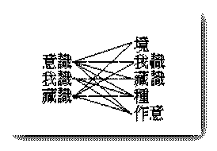

# 心之研究
（1922 年 4 月，在黃陂縣前川中學講）

中國文「心」之一字，含義最廣。通常之心字，多指吾人身中之肉團心而言，然此肉團心不過專司人身血液之流行，其本質為一物體，於空間占一位置，其時非永久不變壞，此非佛法上之所謂心。近代人多誤以腦筋為有知覺思想之能力，遂指此為心，殊不知腦筋亦為一種物質，亦應屬於肉團心；惟吾人心念發動時，在身體中之各部，常與此一部分有關係耳。

佛法上就心之功能力用及發動之方向，由淺至深，由粗至細，將心分作三類：一、慮知心，二、集起心，三、真實心。慮知心者，將吾人能思想知覺之功力而姑認為心者也。此慮知心雖無邊際方所、時劫短長，非形色可限，非容量可局，然實為一心之所起，作用時不免虛妄錯誤而非真實。人身中能表現之功用者，厥惟六根，根者非為心所從生，乃是心之所托，與六塵接而發為六識，心之用於是始顯。就此種心之功用言，似可指此功用即是心，然前五根仍非是心，而第六根亦慮知心耳。

意識之背後，尚有所謂我識——即第七末那識——此識常處黑幕，念念執我，而為前六識心之主動。前五識為根境所限故，其用有時而窮；意識之用，則能橫遍十方，豎徹三際，廣漠無垠。其所以能具如是之大用者，因其背後有我識為之主宰，以此我識極廣大，故意識之功用及境界亦極廣大，孟子謂萬物皆備於我，與此相似。

我識一面為前六識之主宰，一面念念收羅一切萬有而藏於藏識之中。此藏識能含藏萬物，有任持一切之力。藏識喻如專制時代之國土，我識則如專制之國王。前說之八種心識，皆屬於慮知心。

藏識雖貫徹三際十方，永不斷滅，而又生滅成壞之相相續不斷、剎那不停，而所以現此生滅相者，因我識念念執之，遂見其有生滅耳。如朝代更異，國土本無變動，而國王或遂以為國亡焉。


```
　　　　　　　　　　　　　　　　　　　　　　　　┌──明
　　　　　┌───眼───┐　　　　　　　　　　├──空
　　　　　├───耳───┤　　　　　　　　　　├──色
　　　　慮├───鼻───┤　　　　　　　　　　├──眼根
　　　　知┼───舌───┼識　　　　　　　眼識┼──意
　　　　心├───身───┤　　　　　　　　　　├──我
　　　　　├───意───┤　　　　　　　　　　├──藏
　　　　　├───我───┤　　　　　　　　　　├──種
　　　　　└───藏───┘　　　　　　　　　　└──作意（動）
```


眼識以明等九緣生。耳識去明，以聲易色為八緣。鼻、舌、身三識去明、空，以香、味、觸易色為七緣。意識為五緣識，我識、藏識均為三緣識。




```
　　　　見┐
　　　　　└………能慮知─┐（精神現象）
　　　　　　　　　　　　　├慮知心…………體
　　　　　┌………所慮知─┘（物質現象）
　　　　相┘
```


慮知心於起不起，體恆常在，其現起時，見、相二分同時而起，即精神物質兩現象同時起矣。

（王淨元記）（見海刊三卷十一十二期）

