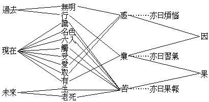

# 論天演宗
（1915 年，在普陀作）

## 目錄

- 一　玄論
- 二　宗趣
    - 甲　名義
    - 乙　道理
- 三　效功
- 四　較量
    - 甲　觀同
    - 乙　證異
- 五　解蔽
    - 甲　惑相
    - 乙　斷德
- 六　綰言
- 七　寓意

## 一　玄論

情器世間，自有所謂人類能群居其身而交感其意也。發乎喉舌、習乎耳識者，浸假而有互喻之語言；示乎指畫、寓乎目官者，浸假而有共解之文字。積時既曠，操術彌精，遂總合數千年數萬里之人事而供思考，會通數千年數萬里之人智而悉受持，恆憑先覺，益濬新知，推著以及微，察邇以探遠，於是乎獨成一宅靈秉彝之類，逈出庶物矣。雖然、人之所異乎禽獸者幾希耳！其間非有劃然之鴻溝可判也。經久而化，待緣而起，其來極遐，其成極漸，昧者未察，徒訝其知富而能廣，迺有神造帝降之謬說，不知實造端於物種劑變也。

夫人之所日遠於禽獸者，以能通才共工，開物成務，蔚為治功道術，宰制無盡藏而備為之用也。然果由何道克臻此乎？非以能鞏群體萃群力故耶？而所以能鞏群體萃群力者，則以能通群意綜群思也。群思之能綜，群意之能通，則語言文字之功也，此其為幾己微矣。顧語言化聲耳，一雞遇食而啼，則喔喔者群集，一犬逐人而吠，則狺狺者咸奔，安知彼曹絕無語言以相曉也？文字徽幟耳，蜂能部署其所居之房，出入異門；驥能認識其所經之路，往還百里，安知彼曹竟無文字以相誌也？故語言文字之道，苟索其朕而窮其委，人語鷇音同為識心流露，特互殊而不能知云耳！假令殊方異族，乍相逢遇，互聽所言，亦何異雞鳴狗吠，不能讀其所自化，意其所將為哉？於此而輒曰彼無語言文字，彼亦固可以無語言文字誚我。此理非難明也，何獨於禽蟲而疑乎？蝯蜛之能通人性，鸚鵡之善學人言，更無論已！然人類終能相喻相習，非異生之可比，則形氣之拘既別，識想之趣亦殊，其作始也簡微，其將畢也繁鉅，自有書契以來之人類，且非猿狙所能企，況下及蠢動之品乎？然其累差積異之因緣，千條萬緒，非可一往而罄也。

草昧初民，畫地而居，結繩而治，雞犬聲相聞，老死而不往來，大山巨渤以為阻封，各成風氣，人文之發達因有遲速，夫誰曰不宜！其迄今猶聚處蓬艾間者，幾又自為一類矣。然洪荒之前果已有人文否？人文果一進而不退否？退者將以何底？進者將以何止？此一大事，橫宇亙宙，欲得至誠之公例以為真確之判詞，吾實未足與者。第通計今世輪蹄之所及，六州百國有書契可考者，後起或二十稘，最先達者亦六千載耳。以六千載而視無始無終之大化，真不啻萬里之一步；然吾人據此六千載之陳跡以推覈之，其權藉世厚，其事功代著，繁變媾化之跡，固已大足驚奇而有不容掩者存也。粵稽政教與學，皆始起於名、相、數三而貫之以人心分別。生成之物，作有之事，察其德而類別之，命以名而習稱之，自意識之幽至河山之顯，自膚髮之親至日星之疏，異同並著，先後相承，一一欲探其原行，究其真際，以期厚生正德，明己善群。於是乎言學之流曰歧，昌佛之端曰異，聖世者終且錮世，亦往往然矣。

輓近爰有天演宗揭櫫西土，其學察化知微，思精體大，苟善悟其恉，深藏之心，用以窮理，或以涉世，殆無入而不得，無往而不宜！富哉道乎！實集有史來學術政教之大成，而尤賴四稘以還格致之新理，乃得確定公例，極成玄宗。溯而上之，則額拉吉來圖，以常變言化，已開其端；而上神、鴻鈞、天命、真宰諸家言，亦彼所憑依者矣！顧必待達爾文而本立，斯賓塞爾而用備者，亦瓜熟蒂落，會逢其適焉耳。今其說出世且百年也，雖風行八寓，雷轟兩間，然人性不齊，心習互殊，見智見仁，可狂可聖。蒼帝能制字，不能令億醜皆識字，今猶古也，故得意者妙道之行，過不及者執之一往而惑乃大滋。矧細玩彼宗之比例及定義，亦間有偏至而未臻圓滿者乎！夫兩智相劑而新智出，兩理相謨而新理成，吾黨為學，又豈在竺守陳言是貴哉？吾固素持佛藏者，請攄所見而參訂之。

## 二　宗趣

### 　　甲　名義

古今譚名理者，往往意中了然，及達之語言，施之文字，即容易渾涵不明，則散名之被於萬物，其字義多歧出而不畫一故也。今此天之一字，則歧義之尤夥者也。攷初民創制天名之本義，亦曰有物處高而臨下，與大地相待，雖聽之無聲，搏之無質，嗅之無臭，而視之則有蒼蒼之色焉耳。已而見雲騰雨降，電閃雷震，日月之迴旋不忒，燠寒之往復無差，意在上必有巨靈以紀綱而執行者，遂引申為真宰之義。又以風雷雹雪炎凍雨暘時時與人生之休咎相關也，乃益引申謂天之真宰，恆鑑察左右，監臨上下實操賞罰之權，人生之壽夭禍福，家國之興亡治亂，胥聽命焉！此儒家稱天而治之說所由盛也。更進焉而有物之大元出於天，精粗遞演，明文以興，所謂天命之性，率性之道，天生蒸民，有物有則，蓋又以天為元理也。綜真宰、原理二說，又證明天為實有聲容、體質、官骸、身肢之一大神，全知全能肇作萬物者，則景教所謂造物主，及竺土所謂大梵天也。老氏道法自然，實摧破造物主之說。邵雍宗之曰：自然之外無天。何謂自然？物各有自具之性德，物各有自成之業用，火之性德自熱，火之業用自燬，此火之自然性也，初無待乎外緣者也。在火如是，非火亦然。故造物者，物自造耳。談天者至此，益精微已。在昔身毒、大秦之言物理者，皆以凝質、流質、光、熱、輕氣為原行，故無以氣質為天者。支那獨以金、木、水、火、土為五行，氣不列居也。於是儒家之愚者，復有以地局濛氣為天之一脈，如朱熹所謂天有九重，籠罩地體，如蛋白之裹黃，逐層加堅，其最外層則猶蛋之硬殼；日星盤旋，陰陽消息，皆不出此硬殼中者是也。近世法人笛卡爾以天體旋渦，言日星運行之故，義亦相似。特彼不言濛氣外層為硬殼，並區別地局之濛氣，而遠指太空有元氣為天體耳。至釋迦氏則以驚惑於天說者既久，非一時所能摧陷廓清也，乃等列之情世間五趣中，曰：天與人、禽同為大輪迴內之一類，特處境食報，較人優勝焉爾。故天不寧不能肇造員輿，禍福人倫，且亦身隨業牽，無從自脫。高唱唯心勝義，獨超欲、色、無色天，大雄無畏，迨今莫能加矣！彙上所列者而數之，則蒼蒼而在上也，真宰也，元理也，造物主也，大梵也，濛氣也，優於人類之情世間也，天之義至是已得七數，其他荒謬不經之甚者，尤不在此。演字之義，雖亦繁碎，訓之曰流行不息，曼衍無窮，固未為大逕庭也。然天字義歧若是，不啻變一名而為七名矣。今曰天演，果何天之是演乎？曰：天演一名，自英吉利迻譯而來，彼土衍聲之字，義當較精，然欲即名以求義，究討宗趣，已屬難能之事，況拘拘於譯名歟？第有界說也，有因果也，有體用也，有公例也，曷試求之彼宗各家之所言哉？

### 　　乙　道理

凡一宗之立，一學之成，皆應有四種道理：曰觀待道理，曰作用道理，曰證成道理，曰法爾道理。法爾道理者，其道理無待發明，本來如是者也。然法爾無待於發明，發明必有符於法爾，始為知本之言，不僢實相。特法爾道理性離言說，終非思量分別所能及耳。今姑置此，由觀待、作用、證成三種道理而尋之。觀待者，內籀術之求得公例者也；證成者，外籀術之獲得定義者也；作用道理，則所以現之業用者是也。執是以覈其宗趣，庶幾無遁形乎！

觀待道理：天演宗之成立也，匯群哲之明慧，窮百昌之蕃變，大而日局星氣，散而草木禽蟲，幽而生生之機，顯而存存之功，蓋不知曾費幾何內籀之工，始得完全之理證，確然不搖！淺學如余，惜未能廣徵群籍也，姑就所曾見洎所今憶者而言之。曰天演者，翕以聚質，闢以散力。方其所用事也，物由純而之雜，由流而之凝，由渾而之畫，質力雜糅，相劑為變，此觀待於質力者一也。曰：天演有大用二：曰物競，曰天擇。物競者，競於萬物，爭其獨存。天擇也，擇於自然，存其最宜。此觀待於物天者二也。曰：天演有大界二：曰天行，曰人治。天行恆毀人治，人治務反天行，人治天行相待消長，天行人治同屬天演。此觀待於天人者三也。曰：萬物莫不始伏易簡之儲能，終極繁殊而效實，實所效必能之所儲，能所儲實不必有效，故成演之化，至賾而不亂。此觀待於能實者四也。曰：萬物莫不逐大運而常然，其來無始，其去無終；莫不待際會而詭異，遠跡一物，世差代殊，故天演之變至漸而不息。此觀待於運會者五也。天演宗觀待之道理，雖不僅乎是，然亦略備其要也；而初重觀待質力，尤其大綱者已。

證成道理：證成者，由觀待所證明之公例，以成立其究竟不易之定理也。吾今執第一觀待之證例以窮究之，又覺其究竟之定理，未易見也。何則？天演宗之言質力，非根據質力不生滅、不增減之說者耶？質力既不生滅不增減，設曰力自然翕以聚質，質自然闢以散力，則萬物應無始起之期，亦無終了之日，既無始終，又安有由純、流、渾以至雜、凝、畫之先後可言耶？脫轉計質力雖屬常住，非能自為翕闢聚散，則始為翕闢聚散者又誰耶？若是天演，則天演實可司翕聚闢散之權，肇起萬物，而質力僅為造作之材料，然則所謂天演者，與上帝、天神、大梵、真宰諸說，特異名而同實者耳。所異實者，特彼為物物而造之，無論巨細洪纖，皆造者意匠之所存，且恆監察而監視之，以施行賞罰；此則僅憑原有之質力，為之翕聚闢散，及質力既聚既散而能自為翕闢，即自化其身為一種無形而不可變易之規則，附於質力，相隨不離，使不能不恆翕恆闢，相劑相變，由純、流、渾以至乎雜、凝、化而已。顧天演宗之意，又不盡然也。將曰萬物之成而毀，毀而成，統而計之，實無始卒先後。今吾宗所研究者，第據吾人所處之一日局星系耳。此一日局星系之始終先後，固無與於質力之全量。蓋專就此一日局而言，其質益聚而老，其力益散而離，力均質毀，天地乃終。然質體毀而質無恙也，且飛合於他日局之將成者，在此為毀為終，在彼方為始為成矣。抑使他處之日局有同時毀散者，質力相值，重心勢成，翕闢聚散之用又生矣。故質力且為翕闢聚散，不妨質力之常住。然而吾所疑者，猶未盡袪焉。夫信如斯說，則質力之自為翕闢聚散，以有一日局之成毀始終，乃猶乎陰陽之自為消息，而有一歲之寒暑往來也爾。則質力不生滅、增減之全量，非拘拘於此一日局，而此一日局之外，其日局方且無數，則此無數之日局，其成毀始終，程序後先，與今此之一日局，為有同一之規則耶？為無同一之規則耶？若曰有同一之規則，則從何而證有此規則耶？何以見其同一耶？既軼出測驗之境，必非科學力所能答矣。若曰無同一之規則，則今以一人一物而對於日局，固無異一日局而對於無量日局也。一日局與無量日局，同為日局，尚無同一之規則，何以此一日局中樊然殽亂之萬物，及有此由純、流、渾以至雜、凝、畫，同一而不可踰之規則耶？此則亦非天演論師所能自解也。夫是、猶依質力聚散所成之萬物而對勘耳。更就質力自性而語之，所謂質者，非炭、養、輕、淡等耶？所謂力者，非光、熱、聲、動等耶？從炭、養、輕、淡等所合成之金、石、動、植，固人人同見其消長成毀，未見其不生滅增減也。觀金、石、動、植所附著之光、熱、聲、動等，尤人人同其倏忽隱現，未見不增減生滅也。於是有原質全力之說出焉。然執為原質常住者，非以其析至極微而不可破耶？執為全力常住者，非以其流轉恆動而未息耶？則吾又知所以問彼矣：所謂不可破之原質，為依人力析化至不能析化而言其不可破耶？為不待人力析化乃原質之自性不可破耶？若是原質自性，則今原質不可破者人也，非原質之自性也。既無待人力矣，人又安知之原質之自性不可破耶？若但是人力不能析化，則可言人力不能析化之質，不能曰不可破之原質。蓋人類之力不能析化，固不妨有非人類者能析化也。抑今日之人力不能析化，異日固不妨有人力能析化也。今日之人力不能析化，不足為莫破之真因，則莫破之義壞，則原質無由自別於非原質，而原質之義亦壞。原質之義既壞，附原質而有之常住義，益不待乎遣而自毀矣。所謂未嘗息之全力，為附乎質而有者耶？為離乎質而有者耶？若是附質而有，質且有滅，附於質者又奚能不息耶？若是離質而有，則離去人身而有言語作為，既違世量，亦墮自義——按質力學者，謂思想、感覺、亦屬腦力，故不得如宗教之言性靈，可離質而有。天演宗之言質力，取義亦同——。因果全謬，無異啖鬼，豈猶得謂之科學耶？抑今日全力流轉恆動而未嘗息者，亦人見之、人言之而已；去乎人類同分所見者外，力固未嘗自告人以流轉恆動而未嘗息也。且今見其未嘗息也，烏知異日不竟息耶，人見其未嘗息也，烏知不有非人者見竟其息耶？故全力常住之義，亦非能無滲漏者也。吾今試退一步而承認質力常在之說，第從而詰之曰：質力之自性，為一乎？為異乎？夫既異矣，異則相拒而不相合，烏能有其翕與聚耶？且未嘗翕聚矣，烏能有其闢與散耶？此亦非科學所能答者也。吾今試再退一步置質力自性一異而不究，且承認質能闢散乎力，力能翕聚乎質，第從而詰曰：力何為翕以聚質乎？質何為闢以散力乎？質力雜糅相劑為變，何為而有太陽為群星朝宗乎？眾星何為而止於八乎？自星氣以至動植，其用事何為而必由純、流、渾而至雜、凝、畫乎？其莫之為而為者乎？其起於有所不得已乎？凡此、皆敢預決彼宗必無真因能語我者也！然則此日局與無量日局有同一之規則否耶？質力之自性果常住否耶？質力之自性有一異否耶？質力之翕闢散聚、劑變程序亦有緣故否耶？此四個問題，彼宗皆無知者也。由是而就第一觀待道理而證成其究竟不易之定義，非即此無知二字歟？但此無知之名，殆非天演宗所樂受，彼固將曰此四個問題雖不可知，盡是自然耳！夫自然誠冠冕於無知者多矣！無如自然無知，異名同實，舍諉之真宰上神無他途，斯誠膠固於法我者莫能逭避者也。

夫自然既彼我所共許矣，則可得而推斷之曰：萬物有同準而不可踰之規則者，自然也；其規則為由純、流、渾而進於雜、凝、畫，亦自然也；守此規則，則得存在之果，抗此規則，則得滅亡之報，亦自然也；則可知天演者自然也，自然規則也。天演宗者，講明此自然規則為進化，為凡欲存在而不滅亡者必守此而勿抗也。於戲盛哉！此真天演宗究竟之定理焉已。執此定理而廣求證明，則物競者，自然規則之趨勢，挾之使不能不進化也。天擇者，耘去抗自然規則者，而存其守自然規則者，以成萬物之進化也。人治之與天行，蓋物競之一境也。儲能簡易、而效實繁殊者，亦自然規則所以使物蕃而爭烈、益速其進化也。實所效必能之所儲者，所以使萬物品性各異而起爭也。能之所儲、實不必效者，品性雖具，苟稍抗自然規則，或不能盡暢也。大運常然者，自然規則，恆挾萬物而進化，前之無首，後之無尻也。際會成異者，雜糅劑變，或競爭而占優勝，得天擇而成物種之進化；或競爭而歸劣敗，不獲天擇而成物種之滅亡也。苟執此定理，以求證明於其說，殆無往而不貫澈筦絡者，是特略及其大凡耳。於戲盛哉！此真天演宗究竟之定理焉已！吾先不嘗云有法爾道理也，今所證成自然規則為進化之定義，即法爾道理是也。以此之定理，彼宗固曰非天演宗出而始有，亦非以天演宗出而所增益，法爾常然，振古如斯者也。故天演宗之立，必有得乎此，乃能證成其定理。第其所證成者，果為不易之定理否，則須驗之果符法爾道理否而後決，茲請姑緩其議也。

作用道理：夫科學之所成者，恃有因果律也，而吾所謂作用道理，則即因果之謂。然因果之相，放紛繁賾，因果之理，微眇奧衍，磨訶衍諸論皆略說十因、五果，盡譚名理者之大矩也。而泰西學者，以習聞一神真宰之說，先存一萬物一因之觀念，因果義相，未能善巧。故從事事物之究竟極其所詣，往往軼出經驗外，陷入無知之界，強為之名曰：自然。夫曰自然，尚何因果之有？因果律破，則科學之基亦毀，是皆不知因果但依作用而有，離作用而求大因，宜其躓矣！亶天演宗雖借言質力，所觀者、實在天地人物之詭化蕃變，苟置其第一因而考夫物化之跡，固無往非因果之事也。遠跡一物之由來，不勝其悠久也；旁推一變之呈現，不勝其綜錯也，此天演宗之執果以窮因者也。有累分而漸微之消也，有積久而大著之息也，有緣會成異之嬗變也，有擇存最宜之進化也，此天演宗之即因以明果者也。物變何以日進以優耶？以所存者必最宜也。物性何以有宜不宜耶？以萬物常相競故也。萬物何以常相競耶？以物物各有自營之私慾故也。物何以能遞嬗而蕃變耶？以相競之結果有異也。物競之結果、何以有異也？以值遇之地界時分、及所競之外力，與所權藉之地界時分、及能競之內力各有不同也。物何以有積久大著而息者耶？以不為地界時分、及外力所限，競爭而勝進也。物何以有累分而漸微之消也？以為地界時分及外力所限，競爭之敗退也。所謂天行者，即值遇之地界時分及所競之外力也。所謂人治者，即權藉之地界時分及能競之內力也。儲能者，一物有一物既定之因也。效實者，一物有一物既定之果也。實所效必能所儲者，總一物既定之因果而言也。能所儲實不必效者，則是所權藉者不勝所值遇者之故也。扼要言之，則物物各有自貪其生，自蕃其種，自張其勢之自營私慾，第一因也；以是而恆欲吸取外境為私有，第一果也，亦第二因也；以之而與不受吸取者競，第二果也，亦第三因也；以相競而各以所值遇所權藉之異而見優勝劣敗，第三果也，亦第四因也；以優勝劣敗而判存亡，第四果也，亦第五因也——案：此特依其法爾之次序言耳。若言其變，則以劣敗而能改變其為競之法，如能群之動物，不以獨競而能群競，則每可轉劣敗為優勝。如人為裸蟲，無爪牙，無羽毛，無鱗甲，本不足與他物競，而竟能戰勝萬物、霸王兩間者，則以能群也，知群之有大利而能償其私慾於群外也。又如私慾流行於群內，足以敗其群也，於是以仁孝忠公等調劑之，又以禮義刑罰等法制止之，又以功名賞恤等事勸誘之，又以伎樂詩畫等術融洩之，皆所以益修其群而益弸其群者也，此人群之所以有今日也。但人類所貴乎有此群者，要不過競勝爭存以償其自營私慾而已。設有人焉，能諦審諦觀，可以藉乎群而獲償其勝存之慾者，則固可以離群而獨往，非大群所得禁也。何則？人非為群而生，群以人求遂勝存私慾而立，今此人可以藉群乎而自遂其慾。群雖美甚，於彼無加，則彼之於群，固將如涼秋之團扇，海鳥之太牢，捐之舍之，乃其宜也。群又烏得無禁之哉。設又有人焉，知群之所貴，本以求勝存之私慾，而以勝存為大苦，私慾為大罪，不獨無所藉於群，且以群為引賊之媒，導虎之倀，群之日進化而日優美，彼視之方猶賊之媒益精，而虎之倀益兇而已。瞿然棄之而遠離，則尤非群之所得呵問也。之二人之心行既如是，或者徒見群之為大利，必欲使之二人者同乎己之所為，效忠於群，則如樂斥鷃以鐘鼓，饗鸞鳳以腐鼠，不寧違物情之甚，抑亦昧立群之意矣。此則余欲為務群而過當、愛群而發狂之徒，好執己律人恃眾暴寡者告也。然余非有憾於群者也，欲人人知立群之本意，得其中道，因便及此——；以存亡而成進化，第五果也，亦第六因也；以進化而有嬗蛻——如魚之化獸、猿之化人等——此第六果也。嬗蛻之結果，則自營之私慾，一擴其分量，一改其方向，仍與所不受吸取之外物相競而已。其因果法為循環，而因果所依之物則種業相附而進化矣，故有萬物進化為旋螺形之喻。此六因、六果，萬物之所同者也，亦因果之所以悠久者也。而物之又各有遭值時地之不同，競爭方法之互異，故或劣而存，或優而亡，此因果所以紛糾繁賾，莫可究詰而綜錯者也。然則天演宗之言因果，雖未解十因五果之義相，而一果必一因，一因必一果之惑，亦庶幾遣矣。使所言而可信，則吾人於即物窮理、處群觀化之術，可知其方矣；抑可知其難矣！

## 三　效功

俗諺謂天演宗未出前為一天地，天演宗既出後又為一天地，其言之過當，固不待詞畢而後決；然亦可覘此宗與政教學術世道人心關係之深且大也。夫天演宗之為學，誠鏡涵萬流，吞宰十世，不可課其效功於一時之人事。第創之者人也，吾今議之者亦人也；百年中人創之，百年中人議之。創之、議之，不出百年中之人，則舍百年中之人事而求其效功，其效功將為何如之效功，殆非吾所知也。抑任舉一並世之人，皆非所能知也。吾聞有所知而有言者也，未聞無所知而有言者也；非曰無言，以其有言等於未有言耳。若曰效逮千稘，千稘後之事，非今人所知也；抑果將有所謂千稘與否，亦非今人所知也，則何如姑待其效逮千稘，任千稘後人自言之為得哉？若曰：功加兆品，兆品之心知，非吾人之所通也，又烏知功之加彼與未嘗加彼者？故今欲言其效功，必以已達見於人群者為斷。按天演宗之起，蓋權輿於園丁、牧夫，察見動植物種類之漸相詭異；繼由醫生察見黑白二人種之互變。而格物學者，以物種由遞化而來，則足以推上帝造物之說也，乃益肆力尋討之。尋討乎現在之動植物而不足，則又究及乎地礦中之蜃灰、僵石、獸骨、古器，於是遂定生物之種類皆由遞變而成，及物種之遞變皆由不善而進於善之公例；依此又推定物種之遞變，出於互競，互競而進乎善，出於所存者必強且宜，此天演宗之根柢也。自達爾文之後，治此宗者蔚起，所搜集為物證者，累京溢垓，雖未能使人必信，殆已使人不易疑也。抑格物學者，以此宗為格物新學最大之成績，曾經多數先學所證明，且實為新學與古教分途之大界。宗之可得博達之時譽，反之將遭頑錮之惡名。而近稘來物質文明發達，格物學之大利，人群已久食其賜，故雖有所疑，不欲輕毀，蓋破壞上帝造物教之正鵠，及是庶乎命中矣！俾人心解脫神權之羈絆，其效功一。第天演之學，初僅究論乎生物類耳，巳而及非生物之地礦日星，巳而及無形物之聲熱光氣，至康德、斯賓塞爾更演及國治、群化、道德、心靈，會天地人而一之，俾人人知生存競爭——按即物競——之劇烈，自然淘汰——按即天擇——之倚伏，並確信有郅治全盛之世界懸於未來，各以偷安苟活為懼，咸懷慮遠憂深之志，而向前生無限之祈嚮，而往上作勇猛之進步，其效功二。天演宗既隳天神肇造之談，於是謂薈兆物而成為此世界，必皆有其因緣，不唯不欲輕諉之造物主，非至甚不得已，而亦不欲輕諉之自然——歐字天帝之天，天文之天，天演之天，本截然三名，形音亦異。天演之天，蓋以名形氣因果之不可知者，唯自然二字，為得其似。故天擇既為自然淘汰之代名，天演亦為自然趨勢或法則之代名也——。故跡一物之由來，推一事之所起，必參互交錯，旁蒐遐徵，窮其繁變之觀，極其悠久之致，然後敢斷然有所建言，斯則足袪淺人庸妄粗疏之謬論，傖夫鹵莽徑簡之心習，而漸能擴充人類之智藏者，其效功三。之三事者，雖不盡出於天演宗，而天演宗實尸其高位。吾黨苟以之三事為有裨於群己者，則不可不向天演宗稱謝矣！

## 四　較量

天演宗之既立，西士若康德、若斯賓塞、若赫胥黎輩，嘗胥希、印兩土之古教古學為比論。逮入震旦，閩縣嚴氏，亦剌取易、春秋、中庸、大學之言疏瀹之，其言既瀏然清矣。夫易、誠天演宗之樞哉！太極非即不易不離之理耶——他處亦云自規律——？二氣之消長，非即質力之翕闢耶？有太始焉，精者其為三光，粗者屬五行；行生情，情生汁中，汁中生神明，神明生道德文章，非即物種遞變而漸進於善，始乎純、流、渾而終乎雜、凝、畫耶？首乾而尻未濟，非進化之無窮耶？易初祖庖羲氏，僅以著天地變象耳；後姬、孔二氏，乃以之括張百蕃，揮斥八垠，迆及人倫之治功，君子之德業。唐代李通玄、釋澄觀，又假以演華嚴法界緣起之旨，可謂極易之能事矣；而與天演宗昌大之次第，若𭰞符節。夫易誠天演宗之天樞哉！所異者，易之辭渾涵而簡隱，天演之論詳證而辯晰耳；此殆即文字思想進化之率歟？而物種遞變之理，與莊周之萬物皆種也，天地與我為一；孟軻以萬物皆備於我，尤足互為發明。然今不具論，而請較之吾佛緣起之經。吾佛之談緣起，隨人智顓敏而異，約有三門：太上心體緣起——有唯心、唯識、真如、如來藏緣起等異名——，其次法界緣起——亦曰無盡緣起——，其次惑業緣起。心體、法界二緣起，其義稍艱深，或非恆情所樂聞；且語焉不詳，轉生見障。故專就緣性說，以一量天演宗外幟之廣狹與內弸之深淺。

### 　　甲　觀同

無明——亦曰無知癡闇——緣起行——亦曰業相——，行緣起識——亦曰轉相——，識緣起名色——亦曰現相——，名色緣起六入，六入緣起觸，觸緣起受——案此處若不論三世，依作意、受、想、思五遍行心所解，則作意即行，觸即名色，受即是受，所謂細分不相應者也——，受緣起愛，愛緣起取——案此愛、取二支，即起信論之智、續、執、分別、起業五相——，取緣起有——案有即起信業繫苦相，合上五相為現行六粗相，而即為未來之無明與行——，有緣起生——此生指未來，即現在識、名色、六入是也——，生緣起老死憂悲——案老死憂悲，即愛取所行境——，是謂十二支緣性緣起。三世銜接，蟬聯不斷，故亦曰鉤鎖緣起。煩惱、業、報，互為滋潤，故亦曰惑業苦三如惡叉聚，今設一表以明之：

此十二支奚以名緣性緣起也？必十二支輾轉支柱，相引而起，闕則不現，非自性有，一也。所得現在愛非愛果，及造成未來善不善業，須關待父母眷屬師友以至貴賤貧富而時代境地，眾同分中眾多因緣，會合而劑變，雖有夙業，緣違則謝；如眼識以空、明、根、境等九緣而生，隨缺一緣則不生起，起唯緣起，滅唯緣滅，二也。以是二因，故曰緣性緣起。又曰：三界緣起者，無色界、色界、欲界，是謂三界；今不詳宣。第知人、禽等皆以淫欲而正性命，居於最下劣之欲界足矣。而此三界者，各有兩種世間：曰有情世間，曰器依世間，欲界之有情世間，即今人、禽是也；而器依世間，則眾同分業所現，即今所執為世界者也。此三界之情、器兩世間，皆以十二支因緣生起，而揀別超過三界之四種正覺世間，故曰三界緣起。既略明緣性緣起之理，今乃可比合天演宗之例矣。蓋十二支緣起，與前所述彼宗之觀待及作用道理，雖間有增略，殆無遇而不同也。吾不嘗謂彼宗根本之定理即無知也，即彼亦自認為不可知，或美其稱曰不可思議，強名之則云自然；顧彼之不可知者，今曰無明。唯彼之無知，不止今之無明，以今此行與識二支，亦屬彼之無知故也。質力自性果常在與否，非彼所知也，而即今此之行也。此行變易無恆故非常，流轉無間故非斷，緣會則有故非無，離緣則無故非有，蓋是過去所有善不善業也。又質力自性為一異，亦非彼所知也，而即今此之識也。夫識以了別為義，唯了別故，內外、自他、一異相生，此情、器世間緣起所託始者也。亦莊周所云一之所起，有一而未形，物得以生謂之德者也。即了別時即有內外、自他、一異之對待相起，此對待者，即名色是也，故曰識緣名色。色是形礙，即天演例所謂質，名即受、想、行、識，即天演例所謂力。既有自他、內外、一異等對待，則攻異黨同之用生，是以有翕聚闢散。六入者，在情世間為眼、耳、鼻、身、舌、意六根，在器世間即為色、聲、香、味、觸、法之六塵，至是則根境樅然，見不超色，聽不越聲，簡者繁，純者雜，融者固，渾者畫也。故名色緣六入，即天演例所云物之用事，由純、渾、流至雜、畫、凝是也。而根與塵觸，故曰六入緣觸；塵與根合，故曰觸緣起受。則天演例所云質力雜糅、相劑為變者是也。又天演例質力劑變，物之幼者多質點力，既壯多質體力，以涅菩星氣言點力，以周天日局言體力。又謂點力即愛力，翕聚為用；體力即動力，闢散為用。余謂點力即俱生我執相，今識緣名色是；體力即遍計我執相，今名色緣六入是。又例謂根心之受感覺思為點力，欲動為體力，此猶於觸受為無記，識了別境愛取方起身口意三業之說密符。吾於此不得不驚彼觀照之深細，抑不得不疑彼嘗攟摭佛藏也。又古德有以識、名色、六入，觸、受、愛、取七支言人生者，曰流愛為種，納想成胚，三緣和合——案即精子血胞及業識也——，凝滑成胞，是名識緣名色。曰體以日堅，形亦月變，百骸俱成，九竅俱備，是名色緣六入。曰呱呱墮地，始對外境，雖有接觸，無所領錄，是名六入緣觸。曰略辨名號，輾增聞見，童子之年，惟務容納，是名觸緣受。曰既壯既冠，選聲慕色，馳驟五欲，惟日不足，是名受緣愛。曰忽入中年，慮深慮遠，取著染相，逐逐老死，是名愛緣取。雖人性黠頑躐絕，靜躁敻極，蓋亦可得其大較已。而六入、名色、識、三支，由純、流、渾至雜、凝，畫，義最明瞭。然觸受渾而不畫，愛取畫而不渾，斯氏謂物至畫則壯且老，亦云奇驗矣。夫物變起於體合——與天擇之義略似——，體合起於物競，物競起於過庶，過庶起於孳乳而貪生，孳乳貪生而起於自營私欲，固天演家言因果者之大矩也。而此生貪與私欲，則吾今所謂愛也；此愛支依託過去之無明種子，任運而起為現在無明之現行，既現行矣，又儲作未來之無明種子。唯以任運而起，故昧者惑曰天賦，不知乃無明種子所賦也。無明種子，亦云先在觀念，質言之、則情與習耳。斯例固徵於今之言衛生學、言倫理學、言群學者也，謂道德不以思理學術為正鵠能發生效力，惟以感情習慣為正鵠乃能發生效力者，無往不伸。然愛之發現，逆施、順施、恆隨所觸受之外境而為轉移，是即天演宗所云以體合而變異也。故在物有拒有迎，在力有正有負，在見有是有非，在情有貪——愛喜欲在內——、有瞋——怒忿惡在內——、在受有苦有樂，在意有善有惡；而於物、力、見、情、受、意六者，又莫不各有中庸之一境，是為無記。常人亦間有時熙怡、駘靜，渾忘、忿嚏、恐懼、好樂、憂患等心行，適合乎大學所云心得其正者，則即此無記是也。隨此愛習，以起身語之作為——案即前所云體力之發動——而殺害，而盜竊——案為護身而殺蚊蚋等、唯是殺業、為嗜食而殺雞羊等，兼殺盜二業。蓋害豬魚等生命而滋養自己之生命，無異強盜掠擄他人之財物而受用也——，而淫媾，而誣誑，而謗詈，而調唆，一往堅鞭，執著不舍，則是吾今所云取也。此取支有正例，有變例；茲所云者，則其正例也。亦名曰想、心顛倒，亦名曰愛、恚二繫。惟任性情，直動徑行；天演宗則云物競，云天行，云大運常然，云實所效必能之所儲；荀子曰性惡；孔子曰性相近；均是物也。何為變例？曰變例蓋起於宙合之外緣，凡情世間眾同分所依者，若時代、若國土、若地理、若歷史、若禮俗、若風習、若政教、若法律、若倫理、若學術、若藝業、若朋黨，乃至一生所遭值貧富、貴賤、榮辱、得喪等境遇，皆足改革其性情，禁制之使漸不現行，而適合周遮之外緣以求其生存。然非必不現行也，特異其現行之趨向耳。故處於尊君之國者，則雖甚惡其君之所為，不敢以非禮加之而致其忠焉；但對於非其君者，好則敬之，惡則非之，於忠何有也？務合於愛國之俗者，於己所託身之國家及民群，則守助親和，若出本心，頌之曰神聖，美其名曰華夏；然移之與國及敵國之民群，則曰僿野，曰兇虐，破壞之、戕賊之惟恐不及；抑亦最善破壞戕賊者為英雄。春秋言非義戰也，孟軻言善戰者服上刑也，而不能不嚴夷、夏之界，拒楊、墨之道；苟有為他國他族訟直者，且詬為喪心病狂，大逆不道，刑罰隨加焉，於守助親和何有也？信天神之教者，以人類為帝之愛子，宏忍博愛，普救萬國，可謂極平等矣。而以禽獸為饔餐，以蛇蛙為蠻狄；且耶、回、新、舊之相軛，流血者數千里，殺人亦數千萬，烹醢屠戮，慘酷莫甚！皆曰非此無以為帝之肖子，於救世博愛何有焉？主張共產、無政府者，無智愚賢不肖，無黑棕黃紅晢，無非澳歐美亞，無孔子耶釋回鬼，咸令遂其情，得其所，樂其生，可謂至公至仁矣。然對於阻礙其主義進行者，不恤以玄鐵購彼之碧血焉，於至公至仁何有焉？研究物化之學者，使人人自致厥心於宇宙之形氣，求其因果之公例，可謂極思想之自由矣。然脫有以真理實惟二約，大聖實惟三皇，境塵不足尋伺，闠鬧不足欣愛；倡者則蟻擁而至，訕罵之曰迷信，詆諆之曰悖謬，曰違犯天然之法規，曰搗亂進化之程率，於思想自由亦何有也？隨舉人事，略及數端，若汎論之，可盡物物，雖窮年終身、脫腕爛舌可也。此變例之取支，亦名曰戒、取二繫，亦名曰想、見顛倒；天演宗則云體合，云天擇，云人治，云人擇，云際會成異，云能所儲實不必效；孟子曰性善；荀子曰積偽；孔子曰習相遠；今人區之曰家庭上、社會上、國家上、倫理上之天職及道德；抑亦儒宗克己復禮、四勿、四毋所緣起也。余不遑遍為捆攏群言，讀者固可意會而通耳。總逆順之愛與正變之取，而成身、語、意三業之所作，於是有榮辱、繁悴、壽夭、智愚、賢不肖、仁暴、聖狂、哀樂、慶戚等結果，則吾今所云有也。然此有支，亦有同相、異相，如勤於衛生則得壽考，此因果之同者也；而所以有異相者，則亦天擇——案即境緣——所致。如居於淺化之群，所告者分明正理，違其習俗，則或遭惡果；所為者分明欺詐，合其習俗，則獲善報等是也。故大智若愚，大巧若拙，內懷真見，外任俗尚，必得其資而後語以妙道之宗；否則、沒世悶焉自熹耳。此有支，在天演宗則曰生存，曰進化，曰劣敗，曰滅亡，亦即所懸想於未來之極美備、極幸福世界也。故雖謂天演宗之說，盡於緣性緣起之愛、取、有三支可也；抑謂莊嚴世俗之言，胥具於愛、取、有三支，亦無不可也。而生與老死二支，本三世邅旋之理，謂今既作有身、語、意善惡等業，則未來世必循是而更起識乃至取之現行耳。然域內之說，大都衍子姓而不衍業識，故天演宗寓其希願於萬世後之郅治也；是皆天演宗與緣性緣起宗之大同者矣。

### 　　乙　證異

夫天演宗所觀待與作用之間，緣性緣起說洵大同矣，獨至證成之理，則砉然絕異。何則？彼曰自然——案含有不可知之真宰之意味——，故有不能不如是之意；此曰無明，故有必不可如是之意。彼曰自然規律，生活秩序，故有不能不闡明而依遵之意；此曰法爾——案法爾之義，較彼自然規律之範圍為大，以不僅順十二有支而流轉生死為法爾，即修四念處、四正勤、四如意足、五根、五力、七覺支、八聖道等三十七道品，逆十二有支而滅證真如，亦為法爾。以順愛取等即轉輪迴，修定慧等即趨涅槃，決定因果不昧，而無其不昧之所以然，故云法爾——，故有更不必研究而推求之意。然之二者，仍是作用上觀察之異點耳；顧究竟楷定之理，即由之而殊。彼究竟楷定者曰進化，故文明美備、郅治久長、富樂真實、安固平等、親和自由等義附之。此究竟楷定者曰牽轉，故無我、無常、苦、空等義附之——案我有四義：一、對待他人假名曰我。二、執取義，執身、曰我身而取苦樂等相，執業、曰我業而取善惡等相，乃至執國曰我國而取文野強弱等相。三、主宰義，謂獨力堅持之主體。四曰、自在義，謂離繫無礙之自由。今曰無我，蓋是無三四之意。以對待曰我，但便稱呼，此雖聖者不廢。執取之我，內本於無始習種，外益於有生染相，非修止觀獲證生空，誠無以離遣。唯主宰、自在之我足以增盛取執之我，執取之我又能消失主宰自在之我，以既有執取之我，但依所執取者，立主宰，求自在，故主宰卒不可立，自在卒不可得也。萬物莫不偕執取之我俱生，故萬物皆無主宰、自在之我。試舉通攝力例證之：地局內之凝、流、氣、質、動、植、飛、潛、以至乎人，皆不能不親地，而地又不能不親日旋繞而轉，此物之不能立主宰、得自在之一端耳。廣言之，則隨取一人一物觀之，其前後、左右、內外、上下之所集，殆無時不此牽逼彼、彼牽逼此者，初不容稍作主宰，從未嘗略得自在。愚者不知，因乎有執取之我，而歸之神造、諉之天命。輓近乃詫為自然規律，益執取之以為主人翁，奉志承則，自比廝養。烏乎！眾生之顛倒，洵可痛也！故今此無我之義，乃萌俗所共認，唯大雄之士，以不能成主宰而得自在，恆引為奇恥大辱，而又深知其因在乎有執取之我，於是誓斷除執取之我，而完全其主宰及自在。華嚴所云：「淨諸心念若虛空，令其所向皆無礙」者是也。故對待之我，則異生與大覺同有。自在主宰之我，則諸佛有而眾生無。執取之我，則諸佛無而眾生有。茲首標無我者，據眾生所共認之事，使知不能自主，不得自在，故恆被牽攝，流轉三途，輪迴五趣，無由自免！又使知此皆起於執取，而所執取者，畢竟無主宰自在可得，以是漸厭離損滅所執取者、以至斷滅，執取既斷已，則主宰自在更無庸外求矣。無常固世間現見，雖日星諸局終有毀時，此皆今人所共認者也。苦有無量相，即小教亦說一百八苦，今略攝之為三相：曰苦苦，曰行苦，曰壞苦。凡欲祈嚮一樂境，必勞身苦志以赴之，是為行苦。所祈嚮之樂境，十九不達，是為苦苦。幸而得其少分，又轉瞬變滅，是為壞苦。羯通哥斯著社會學，謂凡彼樂受，先由軋轢。第一軋轢，惟是苦觀，則苦亦世間所共知也。要之、人生所受，苦為其本，所謂樂者，但略減苦；飲食以醫飢渴，男女以瀉慾火，譬如疥夫，癢極爬抓，當爬抓時，微生樂受，俄頃之後，則痛癢益甚，疥疾不愈，痛癢不已。空者、非實義。三界本空，人心妄執，爰如幻師咒成幻境，此理則世人稍難喻矣；但據無常之義，以變易無定、物相暫現，用釋空字，亦可也——。無常、苦、空，咸所以開示我之執取者無足執取，益發明無我之義耳。然斯皆世人所現見，抑天演宗所公認者也。而天演宗明知世人如是，顧又以此不足為一定之理，乃必證成曰進化者、何也？余蓋常反覆推覈之，此則現證乎心體而了察乎業用，彼則尋考夫業用而未能洞徹乎心體，歧因一也——案：物心交感，激成意境，爰起言行，是曰業用。所感者物，能感者心，外觸內受，恆為主因，世雖知有，依業用論，妄慮既極，曰不可知，康德諸哲，說咸齊此。癡氓謣夫誑云帝神，孔、墨、耶、回實惟同倫，聃、周、勝、數、猶隔羅縠，聲聞、辟支，亦非自力信受奉行，爰入乎聖，惟佛一人朗然現證。設猶不信者，請略舉事相為例。除過佛藏，試遍取世間之學說觀之，其不根於天帝、不根於自然、有不根於不可知者乎？無有也。其果不可知乎？是殆非然。惟可以聖智內證，不能以名言示人耳。故釋迦自謂四十九年未說一字，但心體雖離言說，吾得就修增上心學者，從心體所發現之增上作用、而證明世所謂自然秩序、生活法式，實非能範圍吾人者。夫催眠術，心學之至淺者也；而已足衝決天然之規律。昔南宋時，蜀郡有大樹，摧於風，樹中空，一僧跏趺坐，髮覆兩肩，爪纖長卷屈，身微煖而不傾不動，挺然自若無所覺。居民詫異極而譁聞於郡守，郡守聞之朝，命輿舁之都中。帝心知為入定僧，顧無術使其寤，桑門有言可以手磬聲就耳畔覺之者，試之、果然舒目展足而立，無異恆人。詰其生平，始知為廬山遠師弟子，為時幾千年矣，自言無異彈指，不知今何世。詔令住某寺，辭不獲，翌日則已留簡而莫知所往云。佛藏中神僧傳記載者甚多，以此事為平日千萬人所共聞見，故獨及之。莊周曰：「至人神矣，大澤焚而不能熱，河海沍而不能寒，疾雷破山、風振海而不能驚，若然者，乘雲氣、騎日月、而逝乎四海之外，死生無變於己，況利害之端乎」？世尊曰：「假使十方諸有情類，一時吹擊大角大鼓，或現雷震、掣電、辟歷、諸山大地傾覆動搖，不能令佛舉心視聽」。證於茲事，夫亦何遠之有？今之桑門隱於終南山者，數月不起乎坐，亦恆有之。即吾黨捆縳情解，習染戲論，顧稍能靜攝，但須浹旬，必亦能觸證心一境性，發現定境，若昏闇之夜忽然明光，數里之外人語了了等事，是在現證心體者觀之，誠奚足道！但世俗心量狹劣，姑言其近而可徵者耳。抑此非所以表示心體也，蓋藉心體之增上功用，俾薄俗知希世大寶即在自心，可反求而獲之，非不可知，非居乎天。所得以憑恃者，又萬非社會、國家、眷屬、子孫之堪比擬。而有此心在，縱為空氣，仍將隨所造業，升沉五趣，永無已時，則三世輪迴之因果，自不疑矣。夫近人亦有所謂心靈學也，顧祇及人事相交之抽象，不敢一探其祕，乃相為欺紿，滋世煩惑。夫物、理淺者耳，猶知非察觀所能窮其變，而必以術為試驗，何獨於最深切、最貴重之心靈，反漠然置之，雖有試驗之術，不欲問津耶？吾言及此，吾於今之桑門，乃尤悲之！桑門且不知此而歆世，吾於世又何責耶？雖然、出世種性，固非可以形跡限者，吾豈必於桑門求之乎？世有欲得其術而試驗者歟？則奢摩它、毗缽舍那、三摩提之說具在，前修之道跡，可計步而行也。吾嘗以兩個因明量楷定斯義，用附錄於此：一、佛所說阿賴耶識人人所諦信；以凡可內自證知者必人人所能諦信，如人居闇中，皆審知非無自身；凡人所不能諦信者，必不可內自證知，如上神天帝。二、佛所說三明六通，眾人皆能諦信，如試驗化學；凡眾人皆不能諦信者，必無同分現量可得，如上帝創造天地——。此安住心色實相而贍足乎內，彼執著宇宙假法而繫係於外，歧因二也——案：吾所云色法有實有假，身形假也，色之實法即今人所云物質。小乘宗假立為實，大乘則一心耳，無實色法也。宇唯是方處，宙唯是時代，乃依心色二法和合離散、變易所經過之分位而說，亦是自心之礙相。自眾同分之員輿、民族、國土、社會、宗教、家室等，所有成毀、強弱、興衰、存亡、治亂，以至一身之佼醜、壽夭、皆假法也，惟有男根、女根及命根所孳乳增長。世人如蠶作繭，自纏自縛，無不為其繫綴役役至死者。此假法亦名不相應行法，彌勒、天親皆說二十四種，康德之十二原型亦近之。知為心色變現，而又知能變惟心，則無動乎外矣——。此衍心識而三世輪迴，彼衍形氣而一生斷滅，歧因三也——案：前二條之理既明，此條固不待更辨矣——。此隨業受報，唯在自己；彼造因責果，爰及孫曾，歧因四也。綜此四端，結成一錯，即此則唯訢合於真如，彼自唯訢合於幻變是也。訢合真如者，不為形氣所拘，故見其無不牽轉，深知過患。訢合幻變者，恆唯身世是篤，故見其似有增進，極生貪戀。彼安立天國及未來美利安寧之至善世界者，要不外養命求福，篤其生活之一念耳！故終不免身見、慢見及貪、瞋、癡惑所纏縛耳。故但能於增進己若親若族若國之生活，不問其心行之善惡而皆足稱矣。自進化論出，有能於增進己與群之生活之外，別懸一正鵠者乎？滅人種，夷人國，凡一切獸行禽德，有不以增進已與群之生活自託者乎？所謂道德，道德視此為進化，所謂政治，政治視此為進化；所謂學術，學術視此為進化。進化之所依在乎生活，生活之可羨在乎進化，生活乎，進化乎，洵人情獨一無二之正鵠哉！夫未證生空，誰不縛於生活，即未入大地菩薩猶不能無生活怖畏，吾於人群之惟生活是祈響，又烏得而非之。所欲申其忠告者，進化之說，未必若是其可欣耳！夫牽轉之與進化，胥心色聚散所變現之假相耳；今既許有牽轉，奚獨不許有進化乎？進化蓋心色之變相，等流而增長之義，從幼至壯，物物莫不有其增長之一期；然須知從壯至老，又物物莫不有消損之一期也。今夫員輿，亦異生共業所感之一大物耳；生住變滅，亦何能異？員輿且然，人群益信。故進化惟篤時之談，牽轉實必至之理。牽轉惟業，造業唯心，食果憑前業，造因憑今心。任前業而食果，浮沉聽之；慎今心之造因，決擇行之。則雖未度越死生流，誕登涅槃岸，而柁柄在手，方向固可自定矣。余豈必欲立牽轉之義哉！亦以形氣之內，勢實如是，雖欲為之飾諱而美讚之，有所不能耳！故希望群化增進者，無異小兒之希望為成人，而不知既為成人，將及老死矣！欲促速群化增進者，無異小兒欲速得為成人，而不知實無速之之法也。以群化增進為安善欣利者，無異小兒以成人快樂自由，而不知成人惟憂患艱辛也。抑小兒之望成人，固實有成人比例，未來之美備世界，可比例者誰乎？亦吾人蒐取種種之陳跡，隨戲論習氣幻想浮現，以構成此結晶概念耳。執此概念，惑為實有，其愚不較小兒尤甚乎？夫天演進化之論，不能圓滿如此，則彼宗所見於人群之效功，吾亦不得不為之稍貶其辭矣。

## 五　解蔽

世論無不以男根、女根及命根為依止者，亦無不以眾同分、和合性及宇宙為究竟者。由所依止者，故無不蔽於種姓見——案：種姓起於夫婦父子，若中國之十族，印度之四姓，以至輓近人類學之分為若干種、若干族，要皆由男女二根所孳乳寖大。歐人兢兢以保種強種為要義，及自視為貴種輕蔑他族，由斯見耳——。薩迦耶見、斷見、愛見、慢見，而成貪、瞋、癡等惑，起殺、盜、淫等業，受迫縛壞等苦。由所究竟者，故無不蔽於戒禁見——即人民對於國家、家庭、社會等義務，及對於上帝等義務——、疑見、邪因見——即計上帝為世界因等——，增上慢見，而成貪、瞋、癡等惑，起殺、盜、淫等業，受迫縛壞等苦。凡是皆吾教小乘宗，預流果之前，四加行、十六智所斷盡者，而世間出世間所由判也。今天演宗固世論之一，然以視神鬼之教，見網稍解矣。吾惜其鄰於緣生義，而歠其流喁其聲者，仍陷入邪見稠林，末由出離也！乃摘其蔀蔽之大者以為祛解。

### 　　甲　惑相

近世學者大都不滿神教之說，天演宗立物種遞變之例，反對造物主之聲浪，益高唱薄霄漢矣。顧由予觀之，彩畫稍新，質素惟舊，殆未能竄出全知全能之神權範圍也。故其天演之天，不僅不可知及自然之義，實兼有元理真宰之意味。何則？近世學者之言想，固莫不極於不可知之界也；而是不可知中，又必帶有天神地象之觀念。吾試條舉天演宗鉅人之言為證。斯賓塞曰：古宗教之言天，與今之言天所異者，亦漸離乎跡而日即乎玄耳。赫胥黎曰：有一不易不離之理行乎其內，有因無創，有常無奇，設宇宙必有真宰，則天演一事即真宰之功能。惟其立之之時，後果前因，同時並具，不得於機緘已開，鴻鈞既轉之後，而別有施設張主於其間耳。又曰：是天工也，特無為而成，有真宰而不得其朕耳。康德曰：天神者，超乎認識圈外，非人所能有無也。泡爾生曰：神之實體之全量，超於吾人知識之外，強擬以吾人知識生活最高之形式及內容，於是宗教之模人論立。模人論者，謂造物主之視聽言動，一如人也。最近歐美大陸派學者，謂上帝恆寓居人類之生活力中，以行其創造世界之職務，致世界非已造而方造者。要知彼宗常以不可知之元因及眾同分之趨勢，與天魔并為一談，而以眾同分之趨勢為天然法理，不可違抗，即戒禁見；元因不可知，即疑見；與魔神——按歐土所信天帝，恆以生死法繫綴人類，與印度吠檀多教之高等大梵異，而同其劣等大梵，劣梵、則吠教所斥為天魔者也——並為一談，即邪因見；而自謂所言最真最當，嗤反其說者為迷謬，即增上慢見。是皆膠擾乎神教之言，始為厲階，至今為梗者，其惑相一也。

萬物由質力調劑，業緣輻輳，積久而遞變成異，種姓繁衍，或復寢滅，其理固自圓通。而彼宗推尋物證，遠及數十萬載、數百萬載之前，以骨骼、石器等足成其說，則轉失平實，流於荒誕不經矣。夫文字所紀，未越五千祀，尚多不足信者；憑陳跡臆斷為倍倍之五千祀，顧可深信，斯亦反已！吾國儒先，有尊信彝器、抗慕古篆者，於是鐘鼎紛紛出於土；彼治地質學以言物種由來者，毋亦類是乎？不悟地質中物，縱非出於偽設，亦由意中先存此一觀念，逐物聯想，積成心習，故隨得一不經見之物，即若可為物種考據耳。今脫有人翻其物種進化之說而為物種退化，以三數人終身之跡考，得千百人為附和，安見不又有古物古器等堪為證據乎——按：章太炎君作原變曰：「亞洲之域，中國、日本、衛藏、印度有蝯蜼，其他不產。澳洲無猿，亦無反噍之獸。其無者，化而為野人矣，其有者庸知非放流之族，檮杌窮奇之餘裔，宅岫窟以禦離鬽者從而變其形也」。余讀天竺古志，述人群退化之事相甚詳。謂生民之初，皆受天然之樂，壽長八萬歲，每百年遞減一歲，減極為十歲之時，性最兇惡，人與人相殺食，弱者逃入荒岫杳壑，食草而僅免。其時、人形長不過二尺，土地礁确，穀麥麻桑皆不生，禦饑以血肉，禦寒以毛髮云云。試默想其狀，非即與猿處同乎？以證章君之說，益以相通。抑此說，阿逸多亦取之以談人群由善惡之共業，人壽增劫減劫之理：謂減劫之極，性惡者死之略盡，逃入巖岫之性柔善者，乃得漸復其舊，福慧壽命，日以增長，則是猿類進化為人類之謂乎？且今人於地帶熱寒之遷變，尚有一說，謂地軸側轉久之，向日局之方面易異，故南北冰洋寒極變為熱極，其冰融為沸水流下時，今人所居洲陸，將盡變為洋海，彼時唯處最高之山巔者，乃得僅存，其餘則一切滅沒。又今人之原人種，皆起於帕米爾高原，震旦古建國者，亦皆在西北，名曰中華，足徵楚、越等地，猶為海島。今瀕居海地者，皆謂海沙漸漲為地，數十年即不同。而東西古志，太古咸有洪水之言，其地帶寒熱易位之證歟？居山巔以幸免之人類，則以大海汪洋，孤嶠懸居，思慮言語都無所用，乃漸退化為猿類。或與山中猿類交合，生為野人後洪水漸退，地亦漸舒，乃人群相爭，再起人文。抑進化教又謂人類先有水族，覈之洪水之言，義亦可通。且今之海棲族類，有類似人形者，有類似獸形者，安知非陸居人獸為洪水漂溺，乃變水棲動物乎？然則洪荒之前，必先有人類，其人類人文之發達，或迴出今人之上。印度古志謂有前一減劫中毗舍浮佛等古蹟；今美洲及中國以開鑿山礦，往往有彫琢工美之石像等發見，亦可說洪水前先有宗教之據也。夫蝯蜼則進化教依之為人類進化之證者也。而余依之則亦得說為人類退化之證。然余非欲成立人類退化之教也，特言進化教所取為進化證據者，未必可作為證據，用遣進化教之謬執耳——？因此所證明之事，非關現今，故無親量；非載地誌史乘，故無聲量；其比知者，又皆荒遠茫昧而不可確知，無異證明山精鬼魅上帝大神者，可隨其意擬而為比傅，執自幻想為外實法，其惑想二也。

進化之說，初纔及於動植物耳。故斯賓塞之天演界說，亦不外述一物生長之理，謂之生理大經則可，以言物種之蟺蛻，已覺牽強，通之國治群化，益扞格難符矣。然斯氏則身援其例以倡群學，而力言群學同乎生學，又泛引人物生理為證明。然群理與生理，實不能相侔也，今請以人身覈之。夫吾人得察究人身之生理者，非徒以其有眾多之細胞及各件之機能也，兼有其外包之共相可觀也；而國群外包之共相則何在乎？將曰在疆土，無論其界域但由地圖之染色為憑也，假使據此疆土之人群今忽死盡，而疆土不隨以亡也。雖疆土如故，所謂國者固烏有矣。抑疆土不寧不隨此土人群以亡，苟他土人群入據之，疆土之作用亦仍可如舊也。而人身則豈有各質點各機能皆消滅，其外觀之身形尚宛然者乎？此可見疆土不足為國群外包之共相矣。將曰在法制、在政府、在宗教、在禮俗，此則但可比人身之表業，益不足言其共相也。又既以大群比全身，個人比細胞，則一個人固可獨處於大群外，抑從此國群而入於其他一一國群，或竟老死於異鄉，或仍返居於故土，而始終皆有其自相可得；一細胞之於全身，豈亦能如是乎？雖童子亦知其不然也。又既以政府比頭首也，則政府之倒，應如人首之斷，豈得全群仍能行動而更建頭首乎？又今言人身之生理者，亦人身之共相言之耳，決非人身中之質點所能言也。既以大群為拓都，而以小己為么匿，則此么匿者，又烏能言拓都之生理乎？使么匿者而能言拓都者之生理，則此么匿者，非人身質點之比，拓都者亦非人身共相是同，又不待辨矣。要之、國群之與物體，個人之與質點，斷斷乎不能相類，欲廣為徵引，雖累億萬語猶將不窮也。蓋個人實先於國群而有，國群但是個人對於所依處者之觀念，即此觀念亦非國群自有，而為個人之觀念孳乳而成，離各個人無國群之自相可得，離國群實有個人之自相可得；非若物體之與質點，同時並有。物體實有自相可得，質點但依物體之剖解而得其自相；而斯氏則著為學說，抑若初無可疑者。乃知心習既成，雖識見閎富，往往以智起愚，其愚謬又甚於蝡生者，其惑相三也。

第斯氏之治群學，亦知蔽於心習之為害也，故於物情、政教、學業、黨國等所有篤時拘墟之見，亦既歷歷言之而中肯。尤力斥天命、世運之說，不令人崇拜神祗、英雄；一事物之成，歸功於全群之漸化，已與華嚴宗世界以無量因緣生之說近似。惟不知毗重於全群，致個人與全群主客先後之位倒置，較彼梏於流而辟於教者，特深淺寬狹之異，其未能無所蔽則一也。雖然、吾黨責人，應稍恕其辭，若斯氏之談群化，恆拳拳以不務近功，不欲速達，其流蔽亦末減矣。赫胥黎則以社會進化、生齒日繁，殷憂群道之終窮，乃發為簡單之厭世思想，恨不能剿絕萬物之生化，此其論根誠淺薄！斯賓塞所云腦之事費，則生生之事廉，已足摧破之。然人齒過庶之言，蓋起於達爾文生物繁殖例。然人之生殖，不可與下等動植物相比。愚者見一夫一婦赴於新荒陸，二十年而得四人焉，又二十年而得八人焉，遂謂人口以幾何級數遞加，每二十年輒增一倍，不知再經二十年，則死率與生率相抵，固不復增矣。顧謬種流傳，此迷至今不破，地球人滿之禍，時一浮現於人意，乃一變人世界而為張牙舞爪之獸世界，抑若其國中將即見駢肩重足而立之狀，不得不汲汲攘他群之地，夷他群之種以自殖其民者。持此以鄰為壑之主義，以加慈善柔直之群，幸其技之果售也，乃益信殺害之足為正法，強存弱亡，公例非謬。不知此非群化之自至，乃先執一強存弱亡之見，仗一旦獸力之強悍，廣為劉彌戕賊之所致也。苟隨其群化之自至，則人心之靈，固無不善變者，亦體合其外緣而漸適於宜耳，又烏得萎絕哉？而強權進化之談，愈演愈烈，則甚且以人為世界進化而生，當為世界之進化而犧牲，傅以帝國主義，益尊獎強權，幾全同回回之教，曰人惟為神戰爭，得生天國也；而今日歐洲之大相斫，即欲以獸力達進化之目的者，以成績及其真相揭示吾人者也。或謂歐陸經此次蠻觸之戰，後將永息干戈，不知彼方種其報復之因於無涯：勝者益高其貪燄，敗者益蓄其仇毒，循斯道而不知返，吾恐不至強者亡盡而弱者僅存，無稅駕時也。君等縱希望人滿，人又烏得滿耶？夫世人固多盲從一時之風說，羊突狼奔而進，不暇計其苦樂利害者，此誠野心家所得陰驅而利用者也。積其慣習，皆自忘其何所為而為，若出乎自然；如染著嗜好者，妄計為人人若是，以戰死疆場、奴傭國群為人生至樂者，亦同乎此耳。雖然、此類特最少數而已，就眾人恆情論之，適得反焉。故以今日之世界為至善醇美者，始無其人，唯以現今之世界校善於過去，而未來必有至善醇美之一期，則人人信之；此實世俗之大惑，吾不得不稍進正言而冀其一悟者也。吾今姑承認群化有進而無退，未來必有美善之世界，果用何標準定其為滿足完備乎？又與今人有何等利益，乃希望而經營之、若是其切乎？理求其誠而事效其實，此當人人所不迕者；今曰滿足完備，所滿足完備之內容，果為何物乎？又以何者為不滿足完備乎？將在意志乎？感覺乎？智識乎？在感覺有惡美苦樂，是曰俱生癡；在智識有善惡、是非、真妄，是曰分別見；而意志之衝動，但是無記；及其執取焉，則又不得不聽從乎感覺或智識。人之用以衡量事理者，術盡於是，故恃為標準者，應不出乎惡美、苦樂、是非、善惡、真妄之外。但世人既無現證心體之智，則所謂智識者，不得不以眾人所同然者為歸依，眾人所同然之善惡、是非、真妄，大都以習尚為轉移，以習尚為轉移，則智識不足自恃，必更證明於感覺，而後始克判斷其善惡、是非、真妄。然則感覺尚矣！而感覺之所有者，惟是美惡、苦樂，好掉舉者，以居聚落為美，耽寂靜者則惡之；戀妻子者以離家為大苦，慣游歷者則無地非樂境。蓋美惡苦樂，亦未有不隨俗尚及根習為變易者；然則感覺亦不足恃。既無公同一定之美惡、苦樂，則無公同一定之美惡、苦樂、善惡、是非、真妄，又將烏從以決擇此未來之世界，為滿足完備與不滿足完備乎？藉曰：此世界自性滿足完備，無關乎人之感覺智識，則既無關乎人之感覺智識矣，縱使滿足完備之世界，今既實現，亦與人渺不相涉，況在千萬歲後者乎？或曰：人固往往無所為而為，不必有關於美惡、苦樂、善惡、是非、真妄者，如好勝好名等。夫好勝好名，初亦起於苦樂善惡，積漸成慣，乃時時妄動，但是無明染相耳。且既曰無所為而為，則都無方向進退，如何復有美善之世界為正鵠乎？然則吾人生此世間，固茫然無所標準者乎？曰：是又不然，蓋謂無常世相，不能有公同一定之標準耳。然吾人自有其標準，太上現證心性，而隨順正因果律，其次、各人自憑其感覺所符者，以為智識之基，超乎感覺之外者，不以妄信，則感覺雖時時變易，當其未變易而正感覺之時，固有誠而無偽，足以楷定其是非、善惡、美惡、苦樂者也。夫世俗所重，本唯生養之道，種種事業，實為生養而輾轉增設，乃窮高騖遠，計著幻相，致反絯生養之道。昔印度外道妄計墜淵、吞炭可生天國，非斯類歟？燈不燃蛾，蛾自投燈，鬼不魔人，人自崇鬼，其惑相四也。

### 　　乙　斷德

今欲斷其惑染，須明諸法緣生——案：此所謂法，與世俗所謂法者有別。此法乃總舉一切心物事理而言之者也。略言之：有心法、色法、心所法、不相應行法、真如法等五科——。緣、言其因，生、言其果。一果之生，非一因故，故但曰緣；一切法以生為初起相，故但曰生。緣生之義，以前所說十二緣起支為經緯，以四緣、十因及五生五果為體相。以之談世間名理，雖未親證心體，凡橫計妄執所成過，吾知免矣。蓋知諸法但從眾緣生，則自不信宇宙為真宰；知諸法起唯緣起，滅唯緣滅，則自不於現法中起種種執取；緣會則生故因果不昧；生由緣會故世相本空，則無歆乎分外而致謹於心行。夫天演宗固近乎緣生義，而其效不在乎是者，則於現法中起執取耳。織意組想，乃由是繳纏無極！故曰「即今休去便休去，欲覓了時無了時」。

## 六　綰言

太虛曰：近世學界稍能自樹者，無不知佛矣。如赫胥黎曰：自有談理者以來，未有如佛者也。斯賓塞對耶教徒曰：東方有聖人曰佛，其於化世導民，斷然有可言者。牧師李登曰：淨飯王子之所為，吾人對之不發憤增愧者，未之有也。麥惕孫、庵羅知、馬克拉夫等專研究佛學者，可無論矣。蓋格物之理大明，神教既摧，思想所極，未有不與佛學鄰近者。而言論自由，又非宋明儒束於孔父之比；正教推及全球，此其因緣時節哉！但微窺歐陸最近之思潮，若現漩澓之狀，將以民生國政為歸宿，不復進步，殆以思想漸成統一，乃入於隨眠狀態乎？是不可不有以棒喝之。所望於支那學者，則稍息其政治熱，習法律、軍事等學者日少，而習名數、質力、農礦、動植等致知厚生之學者日多，庶乎生養之道既舒，而學理益彌進乎精闢耳！

## 七　寓意

爰有諤諤先生詰太虛曰：若之議天演宗者辯矣，但予於若所言緣性緣起，猶不能無疑也。若不曰順十二有支則流轉而繫生死，修三十七道品則還滅而證涅槃乎？然何以有十二有支，何以順之流轉而縛生死，又何以有三十七道品，何以修之則還滅而證涅槃？若幸有以詔予矣！設曰此唯是法爾，可諦信而不可思索，則與天演宗之無知自然之不可思議，亦奚擇焉？若幸有以詔予矣！太虛憮然有間曰：惡！君斯問抑胡悍且突哉？蓋淨名之所口緘，馬祖之所頭痛者也，太虛其將奈君何！何則？夫緣性緣起宗，至此既云法爾，則心行滅言語斷矣，太虛其何以語君！豈不曰尚有法界緣起宗，然設無因緣，則大通智勝十劫坐道場，佛法不現前；釋迦牟尼、諸法寂滅相，不可以言宣，而生不可說，生不生不可說，生生不可說，不生不生不可說，太虛又將何以語君？設有因緣，則百界千如，十玄六相，帝網既重重無盡，法門亦別別無量，雖以四十二法身大士、微塵點地湧古佛，一一舌相遍覆無邊剎海，流出無窮名言，一一名言表詮無數法相，如是乃至極未來邊際，極虛空分齊，猶未能宣說普賢願身之一毛孔。縱略言一毛孔之一毛孔，已足矼實三千大千世界，縱略言一毛孔一毛孔之一毛孔，亦足窮形盡壽。言者雖不知倦，亦徒增君之惘惘耳，太虛又將何以語君？豈不曰尚有心體緣起乎？然設以空拳相誑，楛葉相紿，則楞伽、密嚴之教，瑜伽、莊嚴之論，六百函之般若，七千條之葛籐，捫飄風而玄釋，談者誠可翏翏，搏舄跡夫太空，聽者未免役役，太虛又將何以語君？設不以空拳相誑，楛葉相紿，則纔曰心體，早污染矣，太虛又將何以語君？雖然、敢姑妄告君曰：以無明故、以行故、以識故，是以有十二支可順而流轉以縳生死，有三十七道品可修而還滅以入涅槃。

設更詰以何以有無明、有行、有識，則但告君曰：君何以忽有斯問？君乎！君須知此所告者，乃狗日之翼，月兔之角也；亦釋迦所以無佛性，彌勒所以失布袋也。蒼鷹而有靈，固將一見成擒，則心境銷亡，知不知寂，復何所動？復何所生？知寂故無無明亦無無明盡，無動故無行亦無行盡，無生故無識亦無識盡，無無明行識亦無無明行識盡故，乃至無老死亦無老死盡。然則曰何以順十二支而流轉生死？何以修三十七品而還滅涅槃？寧復成話言耶！設君猶不自知反，棄卻家寶，甘於貧乞，則太虛固無奈君何！君曷詰之無明，詰之不可知，詰之上神天帝，詰之自然規律歟？於是太虛欹窗而歗，諤諤先生，忽不知所往。

（見道學論衡）

（附註一）原作「訂天演宗」，今依文鈔改題。

