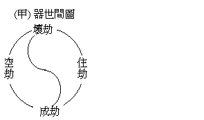
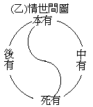

# 世間萬有為進化抑為退化
（1925 年，初春在武昌佛學院講）

近百年來，風行一世，而影響於世界人心最鉅者，厥為進化論。然諺云：江河日下，人心非古，則又反對進化而主乎退化。但二者雖異其進退，而世間萬有為變化的、非固定的、則同認無異也。故世間萬有之變化，為向勝進乎？抑向劣退乎？正可成為問題而待解者也。

關涉此問題之學說，紛紜不一。今分為非佛法的與佛法的二條，略述於左：

甲、非佛法的一、物本的進化論及斷見論。物本者，即以物質為宇宙萬有本源之論，如印度之極微論師謂：地水風火，漸分微細，分至無分可分，此即極微。地球之大，微塵之小，非有二本，皆極微成。又云：兩兩極微生一子微，合本有父母微成為三微，此三微復合他三微，生子微第七，其量等六本微量。如是輾轉相生而成大千世界，乃至世界中之吾人；此進化之義也。至西洋之唯物論謂：世界未成之前，有最極微之物，曰電子。此電子散布空中，由熱力不均，有冷煖之殊，成太陽與眾星之異。地球為眾星之一，動植諸物漸以蕃生，乃至成靈於萬物之人類。蓋人、猿同種，人固由下等動物進化而來，是則地球之成住，物類之優劣，非本有而為進化，故所求唯在向前發展上之進化；此依物之類而言。若反觀其個體，人生數十寒暑，即歸消滅；心靈作用，雖若前念後念雜遝而來，此想彼想奔湊并至，亦如物質之組織及機械的活動，是中固無所謂常住不變之心體，如靈魂、精魄、自我者。世界萬物新陳代謝，滄桑疊變，風雲翕合，亦不過物質聚散離合之變化，是間亦無所謂常住不變之天神，如上帝、真宰、大梵者。故天地人物物質構成，人死質散，心靈隨滅，無有後世，亦無業報，故名斷見論也。

二、神本的退化論及常見論。有超過人間以上者為天神，有主宰一身及支配四肢者曰神我，示別物質則曰精神。謂以神為世間萬有之本，即神能肇造萬物。或曰：精神流出形質。此派依物之類而言，則成退化論。如印度之婆羅門，謂萬物之本唯一梵天，梵天初生之物，兩相鄰近，轉生轉下，引發物欲，漸漸低降，遂為人、為獸等，器世間之變化亦與相類。他如柏拉圖之「初皆清淨」，墮為萬物；基督教之初為上帝所生，住於樂園，後乃有罪而受苦迫，皆其例也。而婆羅門之事梵天，基督徒之求天國，皆為復初。以今後為退化，故所求乃在還復其本。中國孔、老等一分復古思想，亦為斯類。

夫人類之異於天神者軀彀，而類同上帝者神我——或曰靈魂——。軀彀異於天神，故遷流變壞；神我同類上帝，故亙古常存。宗教徒之苦行精進，亦為由軀殼中超脫與天神相同之神我耳。故由個體言之，為常見論，計有一遍常之神，或各有一不變不滅之神我故。

乙、佛法的一、謬似的。謬似之中，有二大類：（一）、是前物本之類：在佛法緣生性空而不壞因果，無如弗達緣生之徒，謬似佛法，成惡取空，撥無因果，遂轉成虛無外道，實即從前物本的進化論之末流也。蓋攷物類之變遷，生物之增進，如地質學上考得古時嘗有極強盛之物，屬蜥蝪類——東方古書曰龍——，全世界之生物，莫相與匹。然極盛之後，不久消滅。由是觀之，則生物最極強盛之際，即近於消滅變壞之時。故認人類為進化，日進強盛，殆無異進於消滅也。於是產出虛無主義，及自殺主義等等，在西洋學派中時發呼聲；在印度則由佛教而起之惡取空，及古時撥無因果之邪見外道等。然惡取空雖為外道，有時亦可對治染著世樂之凡情焉。（二）、神本之類，即惡取不空。如佛法中聞如來藏、法身、真如等名，不善了達，謬以神我與天神等為實有，執為吾人本體性，後以一念不覺，為無明所覆，物欲所蔽，遂成眾生；雖成眾生，復可以返此真如、法身、如來藏之本位，以為修持。然此雖屬謬誤，而於人天乘中，依之施設補特伽羅，使止惡修善，亦無不可。故列入相似佛法之類，用以攝受佛法之人天乘機。

二、正確的。正確佛法，依俗諦言，可分二類：（一）、世間之輪迴論：器世間成、住、壞、空之四劫循環，有情世間本、死、後、生之四有輪轉，與大小乘之十二因緣，由無明而老死，由老死而無明，如環無端，無暫間斷是也。莊子中冉有問曰：『未有天地可得聞乎？孔子曰：古猶今也；無古無今，無始無終』。亦輪迴之義也。由是世間所謂進化退化，皆片段之偏執耳。







（二）、出世間之還滅圓常論，萬有之生滅流轉，謂之世間；出世間者，即滅除萬有輪迴之有漏種現，而獲得進化于圓常之無漏種現也。蓋出世之緣修有漏勝善，由有漏勝善引發無漏勝善，得出世間之無漏種，以無漏種證真常性，由真如智起無漏用，出世之義，如是如是。然出世法有三乘共及大乘不共之別：蓋逆生死流而解脫之，屬還滅論，是三乘之所共也。大乘不共之因位菩薩法，則為進化論；蓋第六住為信不退，第七住為行不退，初地為證不退——未證初地之前，偶有證得，未能不退——，至第八地為念不退，以念念遷流入薩婆若海，此積極之進化論也。直至佛果，以圓滿故更無有進，以均常故更無變化，曰圓常論。撮表如左：


```
　　　　　　┌三乘共…………………………還滅論
　　　　出世┤　　　　┌因…………………進化論
　　　　　　└大乘不共┤
　　　　　　　　　　　└果…………………圓常論
```


依真諦言：諸法離言，實性平等，真如界中絕生佛自他之假名，非進化，非退化，非不進化，非不退化，亦非輪迴非不輪迴，離四句，絕百非，泯一切相，即一切法，常遍如是，何思何言！依俗諦義，得下列之二條：一、世間萬有非進化非退化而為輪迴。二、出世的一分大乘不共因位菩薩法，為真正進化。世有誤認輪迴中一片一段之偏執進化為金科玉律者，亦知其但是輪迴，毫無進化價值之存在而幡然從事大乘真正之進化論歟！

（育普、滿智合記）（見海刊六卷二期）

