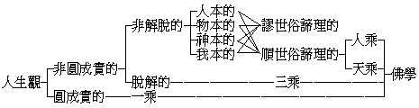

# 近代人生觀的評判
（1920 年春，作）

依照平常的做人習慣做去，在平常的人、對於做人本不發生什麼問題，所以也用不著什麼解決人生問題的人生觀；獨到了依照平常人習慣有些做不過去的時候，於是遂發生了：做人是什麼樣的？做人是為什麼的？何必要做人？人是個什麼？可以不做人嗎？這種種的做人問題既發生，便紛紛擾擾的不安起來，乃皆欲得一個解決此種疑難的人生觀，現今便正是這種的時候了。但是此不過指庸俗的人而言，若在憂深慮遠、玄鑒妙悟的哲人，則隨時隨處皆自有其適當的人生觀；然一到紛擾不安的時候，則一般庸俗的人亦成了必要的需求。故此種人生觀，亦祇將隱伏在泛常知識中的，採集之、顯出之而已。今各家所標立的人生觀，種種不一。由予觀之，循環單複，大約不出下列的四款，茲一一將他詮敘出來，亦可見近代各家人生觀的分齊了。

一、人本的人生觀這人字，含有人類、人倫、人道、人群的意思。要之、凡以天地間人的現成生活為基本所生起的人生意義，即是此所謂人本的人生觀。此種人生觀，對於人何從生，何名為人，但依據人類習常的情形行為，指之曰人。生則稟之父母，死則歸之天地，此外即無須推究。即依此立地戴天的人類，目為與天、地並稱的三才。曰「天地之性人為貴」——性亦性類，謂天地間芸芸萬類，以人為貴——，曰「人為萬物靈長」。其所以翹異於萬有者，固由形體，尤在性行。辦之以性行，故恆以勉赴此人類的性行為標準，惴惴然恐幾微之間墜失其性貴、靈長的地位，下伍於禽獸也。然性行即係之於人倫、人群、人道，既為人類中之一人，依茲一人為本位而觀其各方面的聯合關係。基之以始生終死的關係，有父妻子女等一倫，兄弟等一倫；基之以承前啟後的關係，有夫妻等一倫；基之以分工互助的關係，有主從、師資等一倫，朋友等一倫。於此各種關係之間，所有適如分宜的理性，謂之曰性。依此理性所起的行為，謂之性行。依人類渾括此各種倫理的關係，和合言之，謂之曰人群。人群以同情心為性，是謂之仁，仁之中又有信、義、禮、智。蓋無仁不群，無信、義、禮、智則群不整理堅靳也。依此群性所起的行為，亦謂之性行。推人類的本然者溥遍其群性言之，謂之曰人道，人道以自由、平等、博愛為性，依此理所起的行為，亦得謂之性行。以此推之四海而皆準、則普遍，俟之百世而不惑、則常恆，得此常恆普遍之理，故其心泰然安也。但身命危脆，死滅短迫，既遮撥鬼神之有，宜有以慰其長存永在之慕，於是舉出立德、立功、立言的三不朽，而以名物文史保留其痕跡，俾得垂久。全依理性所成的行為，謂之立德，可與天地人俱久。不全合人的理性——若唐太宗之類，頗有乖倫理性——，或不關人的理性——若發明造成各類有益於人類的器用等——，所成大有利益於人類人群的事業，謂之立功。關於上二類或其餘種種但著之言語文字未措之行事者，謂之立言。則隨人群信用的高下以成久暫，此即所謂經營人類的歷史生活者是也。此種歷史生活中所存在者，分別說之：則曰德、曰功、曰言、曰名；總之、則言行的遺痕遺跡而已。其託之以存在者，雖在語文器象，而實賴於子孫民族人群，合言之、則社會的委形委蛻而已。故此種人生觀，其根底上必永遠的能保存人的社會不破滅，乃為有意義、有目的、有價值，否則、到底還是一場無結果！然在此人本的人生觀，既依固有的天地間、固有的人而起義的，所以決不論思到未有人或人已無的際合外去的。此種人生觀，即是世俗中庸常之理，能於此安得落心的，對於人生便也不成何種的問題了。中國孔門一流的人，雖微有側重人倫的傾向，於人群、人道未能發揮圓滿，然大致也便可以代表此一類的人生觀了。

二、物本的人生觀物本的人生觀，約分三組：

甲、物質學的：若中國古來或說為陰、陽二氣的，或說為金、木、水、火、土五行的；印度若順世外道等說為地、水、火、風四大極微的；其說亦散見儒道諸子。以為人生者氣之偶聚，偶聚偶散，渺渺漠漠。宋儒亦嘗論氣之全偏純駁，以為得其全者為聖傑，得其偏者為凡庶，得其純者為人類，得其駁者為畜類；極成於近世的元子組織論。依此則人與土石、草木、蟲魚、禽獸，固同其物質，但其元素的增減分合，其分量上有種種的不同而已。

乙、物種學的：中國古來，若列子所說的青寧生程、程生馬、馬生人；若莊子所說的萬物以不同形相嬗；若賈誼所說的或化為異類。其間似有「偶變的」、「進化的」二說，亦極成於近世的物種進化論與細胞生命論。依此則人與一切動物，或與一切植物，乃至與一切礦物，亦但有地位的不同，或程度的不同而已。

丙、物類學的：中國古來若莊子等，往往比人世為蝸角，比人生為朝菌，比人類為微蟲；又若晉阮籍比人生天地間如蝨處褌。近世因天文學、地質學、物理學的進步，彼大地既為太空無數星中的一星，地質積層既動以幾百萬年稱，而礦、植、動物之類，亦以幾十百萬計，則此世間有歷史來的人類，不大足證實其為蝸角、朝菌、微蟲嗎？

此物質、物種、物類，莫非唯物論的物；人生亦物中的一物，置人生於物中，而後有人生的名義，故皆謂之物本的人生觀。此種人生觀，或有因為在此看透了沒有甚麼天、神、鬼、我等事，一心定志回轉到前面人本的人生觀，以專盡力於人群的事業；或由之看輕了物質，別求非物質的存在，進入下面神本的人生觀，我本的人生觀，或解脫的人生觀。但在此種人生觀的本位上說來，卻是瑕瑜互見，短長相掩。使人觀念精深，心量遠大，能察破群俗情偽，擺落功名富貴，得一較為明確的理智系統，因任自然之巧，取宇宙萬有之利以為人用。其弊也，則覺得人生無目的、無價值、無意義，遂百無聊賴，但縱放數十年的逸樂，聽數命，任運氣，或恣逞其暴惡，而以能早死為佳。蓋不徒可以摧陷廓清後面神本的、我本的人生觀，而前面人本的人生觀上若三才、三不朽等主要義，亦皆為之搖拔而不能直立。則但有終必與蟻犬、木石、大地、群星、同化為游離太空的元氣，聚而散，散而聚，起而續，斷而滅，夫亦尚何道德責任之可言、與福樂目的之可論哉——此即無因無果、無罪無福的虛無斷滅論！

三、神本的人生觀先認定有一個無始終、無內外的宇宙本元創造者，及人生究竟主宰者的天神，由之遂說到宇宙人生的意義上來，謂之曰神本的人生觀。這種人生觀是從何而起的呢？大概也有許多由上面人本的——若儒家的天地祖先等種種祭祀，物本的——若懸揣默想質元、生元，更有一唯一的本因、真宰等，及下面我本的——鬼靈神祗的唯一元因主宰等人生觀，展轉積累成就的。但直接的緣因，大約兩種：一、是人生的意外獲得、意外巧遇，或不能如志、不能自由，遂想到必是另有一創造人、主宰人在冥冥中擺布人的天神。二、是因見宇宙日月星辰、風雨雷電、山川海陸、草木禽蟲，及時節寒暑、陰晴變化等種種瑰特的情狀，森嚴的秩序，遂認定必有一創造宇宙、主宰宇宙，事事物物皆不能違越的天神，於是傾心盡意的向之歸依，而神的意思完全成立矣。

此中的神，在古書上或稱為上帝，或稱為天，或稱為天帝，或稱為昊天上帝，或稱為帝，要皆主宰的意思，而絕少創造的意思。說得最明顯的，便為墨子的天志；其餘道家的玉皇大帝、元始天尊皆是；而極成於婆羅門的大梵天、大自在天，回教的真宰，基督教的耶和華，此則皆詳言創造及主宰者也。此創造主宰的神，為宇宙的本元與究竟，亦為人生的本元與究竟。此各宗教的共同意義，則皆有此一「神」以為奉戴，以為依歸，以順從神所以生人的神意，孜孜做一個信順神的人，以邀神的恩眷，冀得到與神一般永久、一處快樂的效果。但其影響於人間，有種種不同者：一、因各教各認天神所以生人的神意各有不同，若墨翟、耶穌為一類，以努力為人類公益犧牲自己，便是得到神的天國的門路。儒家附此以盡力於倫理性的德行，為生天的門路——忠孝節義等。回教自為一類，以能盡力於同族，戰爭傳播，自蕃自衛，以為入天國的方法。婆羅門又為一類，大約一方面自私自尊其族類，一方面解除人世種種煩累以求與梵天冥合為歸。道教又為一類，以一方面煉自身的精氣神使能脫卻死的肉軀，另成長生的神仙，一方面在人間做些與人有益的行為，作膺受天封的因地。二、因各教各認神的主宰權力有不同：或集重於獨尊專制的，則此中的一神教也。或泛重於分散統御的，則此中的多神教也。一神教的顯者，若耶穌教；多神教的顯者，若道教。但此中卻無絕對一神教、或絕對的多神教者，何故呢？若絕對的唯是一神，則天子、天使、天魔、靈魂生天等義，亦皆不應有故；有則此亦不得不謂之是神，是神則神固不是唯一，特創造主宰的神是唯一而已。若並立的定有多神，則宇宙主宰者的意義應不能有，有宇宙主宰者，則非無一神之義，無宇宙主宰者，則便不能成立神本的人生觀。彷彿言之，則耶教等的天主，若獨裁政體的皇帝；道教等的天帝，若貴族政體的共主，或立憲政體的君主而已；至酋長式的多神教，則未足預選於此。

然近古以來，更有於神的本身上所認不定之點：若新婆羅門教——吠檀陀——謂有幻的大梵、真的大梵，宇宙萬有皆幻的大梵所作。人能打破幻的大梵，始契合真的大梵；否則、便為幻的大梵所宰制，不得歸入真梵。若一契真梵，則也別無幻的大梵及其所作的宇宙萬有，以皆即是真梵故。此則根本上取消人世，且幾乎根本上取消創造主宰宇宙的「神」——幻的大梵。其所謂真的大梵，則非復言思之境，而成為一種解脫論矣。近世以各種自然科學的發達結果，既深致不滿於耶教等擬似人主人世的天帝天國，亦不以唯物的元子為愜意，於是更從物的底裏進一層，說有非物的神為本體。但神不是在宇宙萬有之外的，宇宙萬有皆即是神，皆即是神的本體的實現，實現萬有的歸宿皆即是神，成為一種汎神論。在中國古書，若道書所謂大道渾成，先天地生，窅冥恍惚，有精有物；所謂天與之情，道與之貌；所謂天命之謂性等；及柏拉圖之說皆近是。此皆以神為本，而後乃有人生的意義可言者。

此中神本主義所賦與人的價值，亦各不同，大多看人類與其餘各種動物、或各種生物乃至一切的物，不過程度與地位的不同，非無展轉相通變的可能性者。故此即有生死流轉的意義——輪迴論——。但耶教則特別看得人與他物絕然不同，獨許人乃有所謂靈魂者，得登天國同上帝永生，否則、永貶地獄。究之、亦不過斷割一期的永定說耳。若輪迴論，人生意義、或在兢兢積善業以求善報，或在取得一不退墮的地位。若永定論，人的意義、則在生天。其意義雖皆在乎超人的靈性之我，但要皆從依歸那宇宙創造及主宰的神或宇宙實體的神乃有者；故非我本而是神本。昔康德說形而上學所依據的理性觀念有三：一曰、靈魂之觀念，即以絕對的統一供給於內的經驗者，而純理心理學上之根本觀念也。二曰、以宇宙為一體之觀念，即以絕對的統一供給於外的經驗者，而純理的世界論上之根本觀念也。三曰、神之觀念，即究竟的統一供給於內外經驗之全體者，而純理神學上之根本觀念也。獨以神為究竟統一的內外全體，可見神更為宇宙及靈魂的根本。

四、我本的人生觀此中所謂的我，即是自我，亦同近人所謂的個性。但於這個我性，要須涵有捨身受身、永續不斷的意義，或更加有普通自在的意義。在中國古書，莊子謂：乘萬化而未始有極，樂不勝計；或謂：物各一太極，人各一天地；又各個鬼神靈性的意義擴充到極端，不復認有創造主宰宇宙的唯一大神，亦即成為我本的人生觀。如此、則人生乃是神靈不滅的我性的實現的一節；這實現的一節，亦並未割斷那我性的全體，而且也就是那我性的全體。人生所有之意義、之價值、之目的，胥在乎此。而於此亦有進化論、輪迴論、解脫論，以印度的數論師為我本的人生觀之正宗，若瑜伽派、勝論派，則尚依違於神本的、物本的之間者也。衡量既立，今且用以一評判現代的人生觀。

今尚在西曆二十世紀的初期，故現代的人生觀，大概不外在十九世紀的餘勢與其反動。十九世紀來乃物本的人生觀最發達的時代，在初但與神本的人生觀盡力搏戰，神本的人生觀便漸漸的立不牢了。但人在物本上尚有相對的地位，且益見趨重人群的進步，依此進到了十九紀末二十紀初，從孔德、斯賓塞以來，便有些覺得人生的意義和價值也漸漸減到零度了，漸漸醞釀遂反動出人本的人生觀與我本的人生觀。到近來、似乎都成了一種新的調和融化的人生觀，於這新的調和融化中、似乎德國的歐根——或譯倭鏗——稍側重於人本的；德國的柏格森稍側重於物本的；英國的羅素稍側重於我本的；於神本的，似乎俄國已故的託爾斯泰尚稍稍注重，於現在其終不能再恢復耶穌教式的神本觀乎？有之、或新婆羅門解脫的神本觀，或汎神的神本觀而已。審觀現代的趨勢，其在人本的人生觀代物本的而興起乎？其興起或即在人道的充量實現乎？且東鱗西爪摘錄現代人關於人生觀的若干言說，以覘一斑：

一、人生在世，個人是生滅無常的，社會是真實存在的。一、社會的文明幸福，是個人造的，也是個人應該享受的。一、社會是個人集成的，除去個人便沒有社會，所以個人的意志和快樂是應該尊重的。一、社會是個人的總壽命，社會散滅，個人死後便沒有連續的記憶和知覺，所以社會的組織和秩序，是應該尊重的。一、執行意志，滿足欲望，是個人生存的根本理由，始終不變的。一、一切宗教、法律、道德、政治，不過是維持社會不得已的方法，非個人所以樂生的原意，可以隨著時勢變動的。一、人生幸福是人生自身出力造成的，非是上帝所賜的，也不是聽其自然所成就的。一、個人之在社會，好像細胞之在人身，生滅無常，新陳代謝，本是理所當然，絲毫不足恐怖。一、要享幸福，莫怕痛苦，現在個人的痛苦，有時可以造成未來個人的幸福。譬如有主義的戰爭所流的血，往往洗去人類或民族的污點；極大的疫瘟，往往促成科學的發達。總而言之，人生在世究竟為的甚麼？究竟應該怎樣？我敢說道：個人生存的時候，當努力造成幸福，享受幸福，并且留在社會上，後來的個人也能夠享受，遞相授受，以至無窮。——右陳獨秀說的，見新青年。

反對物本的人生觀，為沒有人生的目的及人生的價值，足以生縱欲、任運、壓世的三種不良結果。而以為健全的人生觀，必基本於精神之我，有精神之我而後有個性、有人格可言。欲發展個性，必以一己之精神貫注於人群，而後其精神滔滔汩汩，長流於人間，永不止息，隨社會之進化而俱長，此之謂自我實現，此之謂化小我為大我，此之謂靈魂不滅。又曰：執於生者，適以自喪其生。一粒麥種，方其塊然，依然一粒，迨已腐爛，甲坼萌生，久之成熟，結實纍纍。且我之為我，本屬群我，我與大群息息相關，我之生命非我有，社會之委形也。我之人格非我有，社會之委蛻也。我既與社會無分，為人即所以自為，為人即所以擴充自我。——右劉經庶說的，見太平洋。

一、人生以前有生活，死後也有生活，人生不滅。二、現世生活為全體生活的一段。三、現世的生活有兩方面：一、理性的生活，二、肉體獸性的生活——指所反對的物本的人生——。理性的生活，承生前、啟死後，是無窮的；獸性的生活，有生有死，是有窮的。四、理性的生活，是博愛，是服務，是忘卻自己，是互助，是不畏死的。五、獸性的生活，是私己，是爭奪，是殘殺，是畏死的。——右託爾斯泰說的，見新教育。

一、人是具有體相、質力和生命，而且能夠自覺的東西；或者可以說是：人是具有體相、質力和明瞭目的，意志的自動，主動的適應，急激的進化，而且能夠自覺的東西。二、人是為精神與肉體、社會與個人、理想與現實相一致的欲望，就是為精神的、肉體的、社會的、個人的、理想的、現實的、各種快樂。具足的快樂，亦為是人類圓滿的、普遍的、永久的快樂。三、人要改造做工作的、創造的、博愛的、犧牲的新自我，和自由的、公財的、共同的、科學的新社會。總之、人應促進自覺，改造新生活以謀人類圓滿的、普通的、永久的快樂，及人人應該工作求學，擔任教育、撲滅強權、改造社會。——右沈仲九說的，見教育潮。

陳君的人生觀，乃物本的、人本的混合人生觀，其立足猶在乎物，反對神本的；而與其餘各家於人本的皆有一部分的反對。至劉經庶與託爾斯泰，皆反對物本的人生觀而歸宿於人群的、人道的人生觀，將人本的、物本的、神本的、我本的、選取調融入人道的人生觀。以沈君的說得最為周密，但總是以這個物質世界上的人類、人群、人道的生活為根本依止的，所以我認為皆被蔡君元培的言語駁掉了的：

人不能有生而無死，現世的幸福，臨死而消滅，人而僅僅以臨死消滅之幸福為鵠的，則所謂人生者，有何等價值乎？國不能有存而無亡，世界不能有成而無毀，全國之人、全世界之人類，世世相傳以此不能不消滅之幸福為鵠的，則所謂國民若人類者，有何等價值乎。

以此回視陳獨秀君等諸說，將不知其所說，為主張人生有目的、有價值、有意義耶？抑為主張人生無目的、無價值、無意義耶？由予觀之，直是主張人生究竟毫無意義、目的、價值者耳！故蔡君逼進一步，而認現世幸福為不幸福之人類到達於實體世界之一種作用，而懸無方體、無始終的世界實體為究竟之大目的，於是進乎神本的、我本的人生觀。在「超人類化」、「超世界化」的傾向上觀察之，其進程固應當由人本的進為物本的——宇宙的——、神本的——人及宇宙的實體——、我本的——個性自在的實體——。但陳獨秀君的雖進至限於天然因果律的物本人生觀而止，而劉經庶、託爾斯泰、沈仲九三君的，則皆能通至乎神本的、我本的人生觀者也。

太戈爾B.Tagore所著的自我之問題，謂一方面我與木石同居，所以應該承認宇宙的條例；我生存的基礎，便也深深的立定在那兒。我們人的強力，也穩穩的潛伏在這萬有世界的懷抱裏，與眾物的充滿量裏。又一方面則我是離開了萬物，我已擺脫了平等的牽制，我是絕對的單一，我是我，我是不能比較的，宇宙的重量不能厭碎我的這個「個性」。在外像方面，個性是藐小的；在實際上，個性是極偉大的，比全世界更貴重的多。又曰：唯有無止的新與永久的美，能給我們自我的唯一意義。要之、他於自我問題那一篇深廣周詳的解答，卻所見由人本、物本而已進於神本、我本的人生觀。

然我以為：為人間的安樂計，則人本的、神本的人生觀為較可。為理性的真實計，則物本的、我本的人生觀為較可。至於現代的適應上孰為最宜，則我以為四種皆有用，而皆當有需乎擇去其迷謬偏蔽之處而已。茲不極論。但是在佛學上，對於右所述的各種人生觀則又何如？吾以為：在佛學上於右所述的各種人生觀，皆有所是、亦皆有所非，然尚無一能到達佛學的真際者！今不能詳分判，撮為一表以見大略：

（見海刊一卷四期）

