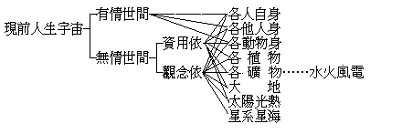

# 新僧

## 目錄

- 第一章　發音
- 第二章　僧義
    - 第一節　僧之體義
    - 第二節　僧之量義
        - 一　僧量之古義
            - 甲　僧之古狹量義
            - 乙　僧之古廣量義
        - 二　僧量之今義
            - 甲　有情的
                - １人類
                    - （一）家族僧
                    - （二）學校僧
                    - （三）教寺僧
                    - （四）社會僧
                    - （五）民族僧
                    - （六）國民僧
                    - （七）國家僧
                    - （八）國際僧
                    - （九）人倫僧
                    - （十）人間僧
                - ２非人類
                    - （一）現前者
                    - （二）非現前者
            - 乙　非有情的
                - １生物類者
                - ２生理類者


## 第一章　發音

阿！僧阿！僧阿！爾何所在？爾何所不在阿？尋不著爾底終始，窺不到爾的中邊，爾非縱、非橫、非大、非小，爾非古、非今、非新、非舊，猛不防今時此刻我和爾卻簇嶄全新底和合了！和合了無爾無物、只是我阿！無我無爾、只是物阿！無物無我、只是爾阿！爾只是和諧合聚底日月星辰山川物植，又誰知天地人物，只是一一和諧合聚底群眾阿！爾今無量無數底化身中一個底化身已新了，將續續以新遍爾千千萬萬、萬萬千千底大化全身。新僧阿！新僧！知爾、信爾、思爾、歌爾底，只是爾新底僧阿！

## 第二章　僧義

### 　　第一節　僧之體義

尋此僧之一名，所名之實維何？明此所名之實，是曰僧之體義。梵語僧伽，古華言和合眾；翻以今語，應謂之「和諧合聚之群眾」。三人以上名眾，未及三人則不得以名眾；四人以上名僧，未及四人則不得以名僧。故僧之本體相，即為群眾，若離群眾而為孤寡單獨，理應不得以云「僧」也。然猶有進，須合聚之群眾乃得云僧，雖群眾而離隔分散，仍不得以謂之僧也。然猶未盡，必為合聚且和諧之群眾乃得云僧。雖合聚群眾而乖爭亂突，亦未得以謂之僧也。故應以此「和諧合聚的群眾」義，為僧之自體義。然此和諧與合聚及群眾三義，所難者不在於群眾，而在於合聚之群眾，尤在於和諧之合聚群眾；故惟和諧為最難能可貴。嘗稽故訓，和之為義：有事、有理。理和惟一，曰同證真如性。事之和有六焉：一曰、身和同住，則何有華屋、茅屋、上床、下床之異乎？二曰、說和同悅，則何有妄言、惡語、兩舌、多口之諍乎？三曰、意和同懷，則何有幸災樂禍、鬥狠報怨之違乎？四曰、見和同解，則何有是非水火、黑白冰炭之礙乎？五曰、戒和同遵、則何有滋長過惡、損害淨善之嫌乎？六曰、利和同均，則何有富驕貧諂、貪得患失之污乎？懿矣休哉！此其和順諧協為何如歟！

嗟夫！嗟夫！古今賢哲者對於人世之群眾，所絞腦鉥肝而不能已者，將何求乎？非求離隔分散者之歸合團聚乎？非求乖爭亂突者之和睦諧適乎？嗚呼美已！系以歌曰：僧兮僧兮！和諧合聚之群眾兮，一詠三歎兮！吾為世人歡迎汝之合聚兮，吾為人世歌唱汝之和諧兮！汝其聽兮，汝其來臨兮！

### 　　第二節　僧之量義

僧之量義，所以說明彼僧——指和諧合聚的群眾——內包之容積、外延之範圍者也。質言之，僧之量者，即和合眾存在上之「宇宙分限」是已。茲分二條說之：

#### 　　　　一　僧量之古義

##### 　　　　　　甲　僧之古狹量義

古之所謂僧者，正指依佛律儀之出家人眾言，故其內包外延之界，可表之如下：


```
　　　　　　┌非佛教徒　　┌鄔波索迦
　　　　世人┤　　　┌非僧┤
　　　　　　└佛教徒┤　　└鄔波索夷
　　　　　　　　　　│　　┌沙彌
　　　　　　　　　　│　　│苾芻
　　　　　　　　　　└─僧┤沙彌尼
　　　　　　　　　　　　　│式叉摩那尼
　　　　　　　　　　　　　└苾芻尼
```


除世間人類以外之異類，既不得依佛律儀而出家；其不出家之佛教徒，又非是僧，故僧唯是依佛律儀而出家之男女沙彌等五眾人而已。男女必入沙彌律儀，乃入僧之量內，除此則皆在僧之量外者。沙彌等五眾人之特殊性，祇在已依佛律儀，誓終身捨離󷨖欲為根之親眷，及取著為根之財產耳。今中國通俗之所謂僧者，已失其捨離取著為根之財產之第二特點；而日本之所謂僧者，則并捨離󷨖欲為根之親眷之第一特點，亦失之矣。故狹義純正之佛教僧，今此人世尚存否，已成問題！

於此、予對於中國現所謂之僧，請附二議：一、由每縣各佛教寺菴聯合組成一某邑佛教財產經管處，由全邑各佛教寺菴僧公同處理支配之——按：此予將由溈山倡辦之——。各縣區聯合為道區，各道區聯合為省區，各省區聯合為國區，漸圖擴充。二、由每縣各佛教寺菴聯合組成一某邑佛教經懺應赴處，由全邑各佛教寺菴僧公同辦理分配之——按：此須仿公司章程辦理，予屢向人提倡，但由私利，尚難實行——。其漸擴充至全國之聯合，同上。竊謂必此二事成立，從消極方面言：中國之僧乃真出家為僧，以無復私產及傳承私產之私眷故。從積極方面言：僧乃真能擔荷宏法利生事務，除宏法護教、度世利眾無復家業故。在出家人顧名思義而實行此，本非難事！顧全中國十餘萬僧，皆以私利私眷為梗，終未有實行之希望！此予十六年來心底最深之痛痕也！

##### 　　　　　　乙　僧之古廣量義

然考經論，多有稱四向、四果、三賢、十聖為小大乘僧寶者。除第四果在人趣中必為出家者外，其餘固可遍在諸趣及諸色人等者。是則諸有情類，無論所感之報、所具之儀為何形類，但已能修證得小乘向果、大乘賢聖之道法者，皆可攝在僧之量內，不應以相狀拘礙也。此以捨異生性入同生性曰僧，乃勝義之僧義。昔天竺某論師依某聖者三升睹史陀天，見慈氏為天像，三次不能禮次開示，皆以拘世俗形狀以為僧，而不知勝義之僧故。但修證未臻初向、初住者，在古之正義中，仍應格以前之狹量，以別僧俗之界。故在家學佛者，應居近事三寶之類，而不得妄同於已出家之僧也。要之、前說住持三寶中之僧寶，此言別相三寶中之僧寶。住持佛法於世間故，須前狹量之僧；修證佛法而出世故，有後廣量之僧。

#### 　　　　二　僧量之今義

何者是僧量之今義？曰：和諧合聚的群眾之內包外延，是今之僧量義。茲分二段明之：

##### 　　　　　　甲　有情的

有情、言有知覺情意之類，茲分二類言之：

###### 　　　　　　　　１人類

就人類中分為十別，以此皆是群眾，皆是已合聚之群眾，皆可為和諧合聚之群眾，皆本應是和諧合聚之群眾故。所分十別如下：

###### 　　　　　　　　　　（一）家族僧

家族者何？即依夫婦關係為根本所發生、所成立之人的群眾是也。使人類無一夫一婦、一夫多婦、多夫一婦之倫理法，則所生之子女，但知母而不知父，即無父子關係；及既長大，無賴於母，且復不記有母，亦亡母子關係。既不知身所從生之父母，寧復知身所同生之兄弟、姊妹，以及父母所從生之高曾、翁媼，所同生之叔伯、諸姑者哉！此既不知，寧復知自身及祖父子孫等妻女間接關係之親戚哉！故無夫婦必無家族群眾，由家族群眾而生遺傳財產之關係，由遺傳財產之關係而演成民族、國民、國家的群眾，故無家族即無國家。儒家之五倫的人道，全以夫婦為基，故曰：「君子之道，造端乎夫婦」也。此以夫婦為基之家族的群眾，原來必為合聚，初始即有能生父母、所生或同生弟兄三人或四人以上之合聚群眾。此合聚群眾，即應為夫倡婦隨，父慈子孝，兄友弟恭之和諧者，且為合聚之最難分散，及事勢上最易和諧者。故家族即最良好之和諧合聚的群眾，亦最自然之僧也。此家族僧以儒教之倫理、及佛教之人乘，最得和諧合聚之理。近人偏於個人主義、或社會主義、及國家主義之故，致令家族的群眾漸成不合聚和諧之勢。然此實為保持人倫理性最大關節，墮此即為禽獸，超此則為天與三乘；今之世人，大都奉法禽獸——即動物進化例——，擾亂離散此家族僧，使人倫墮落於畜道，殊可悲矣！

###### 　　　　　　　　　　（二）學校僧

學校雖有由個人、家族、社會、國家、國際發生之不同，而教師學徒之關係實為合聚學校群眾之中心力。或雖未成一學校之形式，而有以教師、學徒關係合聚之群眾，即為學校之類；已成形之學校群眾，必為合聚，可無待言。其中教者、學者、同教者、同學者，皆應為知覺情意、道誼德行之最和諧者，亦無待言。故學校者，實應為和諧合聚群眾之最完美者，而為僧之模範者也。比來失其由教學團結之要素，轉成名位權勢生計所關之市易場，致呈混亂渙散之象！若由真能教者、真求學者相攝持而成立，則靈山、杏壇、百丈等威儀躋蹌之和合眾，何難重現於今世哉！

###### 　　　　　　　　　　（三）教寺僧

宗教之寺廟，為住持及附從者以同一信心合聚之群眾，若今基督教之教堂，有其住持之牧師及附從之教徒者是也。此其所要，全在乎同一之信心；由此同一信心，感情得其安慰，意願有所歸著。此住持及附從相合聚之群眾，果由同一信心為本，自必和美諧洽，無諸乖舛，而為一和合眾。及其末流，住持者取為居奇之生業，附從者視為夤緣之捷徑，不由同一信心之源泉而發動，致成背謬！世之有智者，已知今之牧師與教徒，已皆失其對基督之信心，故譏為虛的基督教，以雖有形式名稱上之基督教團，而實非信心上和諧合聚之群眾也；他教亦復如是。當如何發揮不二真理，以呼起一般人之同一信心，形成為信心上和諧合聚之眾，以為世間可寶之僧，則當視其宗尚之教理有無圓滿成就之真實義為斷耳。

###### 　　　　　　　　　　（四）社會僧

社會群眾之所和合，殆皆起於通力易能、貿無遷有之故。村落者、農牧之社會，市場者、工商之社會，城邑者、軍政之社會。約之可別社會為六：曰行業之社會，若商會、農會、醫生會、律師會等。曰住籍之社會，若各同鄉會等。曰學術之社會，若哲學會、科學會、書畫會、音樂會等。曰政治之社會，若縣議會、省議會、國會、政黨等。曰娛樂之社會，若讌會、廟會、戲劇會、跳舞會等。曰特殊之社會，若歡迎會、追悼會、祈禱會、運動會等。凡社會固皆合聚之群眾，但其和諧與否，蓋尚難言！若能觀循其發持之條理，行不踰軌，必可為和合眾之僧，則無疑矣。

###### 　　　　　　　　　　（五）民族僧

人民種族之起，殆由家族擴張所致，或由多數家族及兩個以上之民族婚媾結合而成。由之，其言語、文字、禮教、風俗、性情、嗜好，皆大致相似，而構成為一個民族。此民族即為多數之群眾，亦為團居一地、或團居數地之合聚群眾，使其不受他民族、或其他外緣及族內強烈之激變，則亦可為合聚且和諧之群眾。無以名之，名之曰民族僧。

###### 　　　　　　　　　　（六）國民僧

同一國籍之民眾曰國民，純由國家軍政權力所範持區分者。可一民族而成數國民者，可一國民而包數民族者，故與前民族異。國民為合聚之群眾，無待言說；然亦時有叛亂離貳之變，故不定為和合；而由一民族構成之國民，較為和合。但國民之為物，本應為和諧合聚之群眾，故謂之國民僧。

###### 　　　　　　　　　　（七）國家僧

民族者，國家之根也——增上緣——；國民者，國家之種也——親因緣——；而國家、則此根此種所現起之事也。此國家事表現之處，即中央及各屬行政、司法、議會之機關是。扼要言之，則此機關皆為佔守治育一國民之總產業而設者：以軍佔之，以警守之，以政治之，以教育之，國家之事，軍、警、政、教、四事盡之。然彼國家機關皆為一合聚之群眾，而由此各機關總合之國家，尤為合聚之群眾，更無待言。使國家有生存發達之象，必其各機關之統率聯絡，有如身使臂、如臂使指之調適。故良好之國家，必為一和諧合聚之群眾，應謂之國家僧。

###### 　　　　　　　　　　（八）國際僧

有佔、守、治、育、一國民總產業之各個國家，此國彼國分際以立，而交相涉入之事遂繁重。昔者、中華以天下稱，四周皆夷狄之，故無國際之事。然在周季七雄、漢末三國之代，亦嘗屢現其國際之事也。歐洲向來諸國林立，鑿美通亞，以成今日此疆彼界之國際團，盟敵和戰之變既殷，互呈不安之態，於是每作共同聯合和平妥協之謀，此正由萬有皆以僧為性。故茲國際群眾，亦能不力圖聯合和平之實現也。然則國際非進化為和合眾，不足以暫存，亦可知矣。

###### 　　　　　　　　　　（九）人倫僧

人類以群眾合聚且和諧為性，絕無孤寡、分散、乖逆得以生存之理。蓋其能生所生之間，已有三人，益以同生，為數彌眾；加以長成存立所關，雖一人之生存，殆亦由橫遍大宇豎亙長宙之眾緣群集而有。故人生倫理之所存，彌綸世界，無乎不在。儒者據其切近言之，祇曰五倫；然夫婦、父子、兄弟之倫，乃家之桎梏，亦國之根荄也。君臣、師資、主從，則國之楨幹也。獨朋友為無乎不在之和合眾，為人倫之至和合眾。何者？家之與國，皆不外二事為執障：一曰、婬愛為根之私親，二曰、佔據為根之私產。由此二私，有家、有國，除此二根，家空、國空。故佛教之出家，質言之：即捨此婬愛所生私親，佔著所成私產而已。乃儒禮運所說大同之世曰：「不獨親其親，不獨子其子，選賢與能，天下為公」。再曰：「力、惡其不出身也，不必為己；貨、惡其棄於地也，不必藏之己」。則私親、私產捨，唯有人世皆朋友之群眾，無復家與國之存矣。然此人倫僧與舊之佛教出家僧異：出家僧之外猶有在家之群眾，人倫僧之外別無人群眾，所異者一。出家僧中須嚴師資、長幼、主從之別，而實無屬；由婬愛而有之夫婦、父子、兄弟，人倫僧中雖可無夫婦、父子、兄弟、君臣、師資、主從之嚴別形名，而事實上不無能生之夫婦，從生之父子，同生之兄弟，以及教學所關之師資，行業所關之主從等，所異者二。故人倫僧實非無夫婦、父子、兄弟也，特不同家與國以此為構成之主要樞紐，其形名乃不復秩然以彰著耳。故此人倫僧者，乃依人類俱身而生「群眾合聚且和諧」之公性，須待人倫至極完成而實現者，今世尚未至其期也。

###### 　　　　　　　　　　（十）人間僧

人生之宇宙曰人間，從現前與人有顯明之關係者言之，昔嘗表現其說於佛乘宗要論，茲引錄之：




右表各人自身以下三項，屬有情世間。各植物以下五項，屬無情世間。無情世間所屬事物，有為人生資用所依者，有僅為觀念所依者，或一或二，分別表列。茲就右表逆推而前以為解釋，如星系星海，與人本無甚關係，僅為觀察思念所及，故屬於人之觀念依，而不為資用依。太陽光熱、大地、礦、植，為觀念、資用所俱依，其事易明。至有情世間之各項亦通於資用依，未免懷疑；殊不知各人之自身，亦為各人資用所依,如科學言人身如一機器，百骸五臟，或為排泄器、消化器、呼吸器、生殖器等等，其為人生所資器用之義，不甚明乎！各他人身，為人身資用所依者，如以人之才、之力、之智、之色、之聲為用是；若動物身，則或資其力，或竟用之為衣食，尤不事辭費矣。以此而觀人間，則人間為一和聚之群眾，復為一原有相當和諧程度之合聚群眾，非甚瞭然之事實乎？但終未至完全和合之度而已，若能完全實現其人間僧之性相者，則即極樂世界。

###### 　　　　　　　　２非人類

有情中之非人類者，有為吾人所能知者，有為吾人所莫知者，故分二別明之：

###### 　　　　　　　　　　（一）現前者

有情中之非人類為吾人現前所知者，可大概分為羽虫、毛虫、麟虫、介虫、昆虫五類，其細類則雖億萬而莫窮。羽之鴻雁，毛之猿猴，以及昆之蜂蟻，皆有和諧且合聚之群眾，可無論矣；即推之餘類，亦皆有合群可能，且亦皆有和合可能，雖虎、狼、蛇、蝎、其同類亦常有聚居之事實,殆由皆含有兩性、或他緣和合而生起之通德，故於和諧合聚之群眾性，無類而不存也。

###### 　　　　　　　　　　（二）非現前者

非吾人現前所能知之有情類，依佛智之所知，或說三界，或說四生，或說五趣，或說五地，或說十二類生，或說二十五有，乃至或說六十二有情類，無量數眾生類。茲約為下表以明之：


```
　　　　　　　　　　　　　　　　　　　　　　　　　　　　　┌獄鬼
　　　　　　　　　　　　　　　　　　　　　　　　┌琰摩王界┤
　　　　　　　　　　　　　　　　　　　　　　　　│　　　　└餓鬼
　　　　　　　　　　　　　　　　　　　　　　　　│　　　　┌畜生
　　　　　　　　　　　　　　　　　┌地居…小三界┤金輪王界┤
　　　　　　　　　　　　　　　　　│　　　　　　│　　　　└人生
　　　　　　　　　　　　　　　　　│　　┌時分天│　　　　┌神仙
　　　　　　　　　　┌有欲有形界類┤　　│知足天└能天主界┤
　　　　　　　　　　│　　　　　　└空居┤　　　　　　　　└天仙
　　　　　有情大三界┤無欲有形界類　　　│化樂天
　　　　　　　　　　│　　　　　　　　　└他化天
　　　　　　　　　　└無欲無形界類
```


於金輪王界有現前所知者，即人類及羽蟲等；有非現前所知者，即他洲之人及未發見之羽蟲等。其餘琰摩王界、能天主界，以至空居四天與無欲——即無男女二性——界、及無形界，均非吾人現前可知之有情類。然彼等之為和合眾，則皆無異，雖至無形想化而生，亦由業感眾緣而得。故中庸曰：盡人之性，盡物之性，窮理盡性至於命也。

##### 　　　　　　乙　非有情的

非有情類，遍周一切，茲分十類言之：

###### 　　　　　　　　１生物類者

立生物學之水平線上而觀之，則有情之動物與無情之植物，同為有機能、有活力、有種性、業性之生。有情類已如前述。若無情之生物，如草本、木本之群植，有花無花，有果無果，種種傳根、傳幹、傳枝、詳為析別，何慮億兆！順其種性栽培之，則生長榮發，違之則萎瘁枯死焉！或依自類群聚而生，或依他類附合而生，生氣流行之內，和合眾之情狀，無處不躍如也。此非所謂俯仰皆是，左右逢源者歟！

###### 　　　　　　　　２生理類者

生理學者，所以說明生物組織之機用之生元者也。故原始之生理學，雖祇就人身研究，繼而進觀乎各動物、各植物之生理現象，以為比較而資會通；今且可由人身之生理，貫通諸生物之生理矣。諸由剖解以察生理之情狀者，不能藉人身為試驗，往往假之其餘動物，由其餘動物推之人，由人又可推之植物。草木有根荄，猶人有頭腦，人之頭腦向上，而草木之本柢鑽下，人之手足垂下，而草木之幹枝叉上，此上下之殊也。人之筋脈臟腑內含，而草木之根絡——猶經脈——、花——猶腎臟——、葉——猶肺臟——外張，此內外之殊也。雖有上下、內外之異，其為生理機體組成則同。斷其根，截其絡，摘其花，除其葉，則或死、或不能傳種，而傷其生、害其理焉。故草木之傷其葉，猶人生之病肺焉；傷其根，猶人生之病其心腦焉；傷其花，猶人生之病腎焉。由生理學上而觀之，人生者何？一生理機件之組合而已。猶之一機器然，各機件中失一重要機件，即失運用。然則各生物皆為各機件聚合之群眾體，且為和協諧調之合群體，明矣！

（見海刊五卷二期）

（附註）此下未續出。

