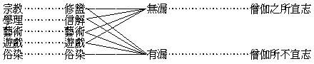

# 由職志的種種國際組織造成人世和樂國

## 目錄

- 一　緒論
- 二　職業與志業說
- 三　職志的種種國際組織之可能性
- 四　全人類世界由此可成一和合豐樂國之可能性
- 五　佛教徒當首先進行佛教的國際組織
- 六　結論

## 一　緒論

天下烏乎定？定於一，唯不嗜殺人者能一之——。此孟軻於戰國世感到列強之分裂爭鬥，非統一不能安定；又觀到列強唯仗屠殺他人之兵力，決不能統一天下，遂發生此之結論也。今此放大之戰國世，亦復如是。非世界之統一，則紛亂不能安定，非有和平之道，又決不能得其統一。然地域既經擴大，人種民族尤極複雜，言語、文字、風俗、宗教、經濟、學術，種種不同之阻礙，加以一個一個舊式國家主義之統治政府，以法律為之籠罩，以軍警為之執持，又如何能用和平之道以達其統一耶？則抽出一一組織國家之元素，使各各成為世界化，並先由已成世界化之各業，成立為一一國際之組織；則國家之實質空，國家之形名亦將漸歸泯沒，而人世可由和平統一之矣。

自馬克斯聯合勞動者組織成第一國際，社會黨、共產黨繼之有第二國際第三國際，合作主義今亦駸成第四國際。更有法律上海牙和平會之國際，政治上國際同盟之國際，此二國際，雖為整個的國家政府之國際，然亦可為政治的、法律的國際組織之先河也。外此則宗教可有宗教的國際組織，教育可有教育的國際組織，俾一業一業皆成為一種一種之國際組織，而由此一業之國際組織的團體，以自治理其一業所關係之事。換言之，教育界即於全人類之世上自成為一教育國，宗教界即於全人類之世界上成為一宗教國；而此一一國——即一一成為國際組織的團體——皆交互周遍於全人類世界，無人種、民族、國籍、領土之區別，譬如一室多燈，光光相網然。則世人不難由此進一步為總組織之統一，而造成為一平洽豐樂之世界國。

## 二　職業與志業說

吾此所言者，驟觀之似與柯爾所刱由職業團體組成國家政府之主張，無甚區別；惟彼在組成國家政府，此在組織世界政府，量的廣狹有不同而已。其實吾此論之意趣，全體吾佛學者精神，尤注重於高尚之志業，且曾於五年前為一度之發表者也。故今言職志，異於柯爾所云之職司職掌，祇限職業，而兼括乎職業與志業二者也。茲請言職業與志業之區別：

職業者何？迫於機械的必然形勢，為應付現前環境之工作；乃由質力之不足，求補充以保持固成局面之艱苦事也。志業者何？發於精神的自由意志，為創造當來運命之活動；乃由質力之有餘，謀施用以開闢生化源泉快樂事也。人格之高下，皆由志業分判，職業之為何不與焉。然矢人惟恐不傷人，而職業亦往往能間接影響於人格耳。

志業之高下可分為五：最高者為宗教：次高者為學理——若玄學、哲學、道學、理學、科學等；其次為藝術——若文學、音樂、書畫、彫塑等；又其次為遊戲——若舞詠、遊覽、拋擊、騎射等；最下者為俗染——若嫖、賭、煙、酒、奢侈等。前四者施之教育，即為德、智、美、體之四育焉。

職業可分為二：一者、直接為維持身命所需要者，若衣食住等農、工、商業是也。二者、間接為維持身命——是維持家及國等之社會力的——所需要者，若政治、法律、軍警、禮教、學校、寺廟等是也。間接者關係深廣，非智者不能明其理，非仁且勇者不能善其事，此四民中所以貴有士民也。

綸貫志業與職業中者，有名權欲與利樂欲焉，即通俗所謂求名求利是也。高尚之志業與間接之職業，易獲名權；卑下之志業與直接之職業，偏從利樂。在得名權者每犧牲其利樂，在求利樂者亦拋棄於名權，二者又分志趣高下焉。

然職志二業，復有相攝相入之處：如政治為職業，在徇國徇名者又即為志業。又宗教為志業，在僧尼、牧師等亦即為職業；若僧徒以宏法利生為家務，即由之受人供養以資身命。大抵高尚志業中少數之職司者，若宗教家、哲學家等，以能志職一致為最善；否則職在於此而志不在此，此之志業必致頹壞——若僧尼志在戀愛，道學先生志在發財等——。而間接職業之政治、教育等，固重志職一致，更以能寄託其精神於高尚志業為善——若政治家同時為宗教之信徒或道學先生等，此中國儒道所以須內聖而外王也——，故志業尤要乎職業。

志業中之宗教、學理，乃是善性，將有餘質力提高於德行智解，可引勝妙之聖果故。藝術、遊戲是無記性，將有餘質力施用於嚴飾情器，但招隨屬之滿報故。習俗欲染是不善性，將有餘質力浪費於損害自他，必感困苦之反應故。故觀志業之何在，可判人格之高下。藝術、遊戲之職司者，雖貴職志一致，而以能尊教崇道為尤善——若道學之文學家等。至職司俗染之業者，損己害人，謀苟偷之生活，流品斯下。然職業在斯而志趣別託高尚之業者，若信宗教之屠沽等，則又當別論也。

間接直接以維持身命之職業，皆通善、惡、無記三性。要以背私利公之量愈大者愈為善，所謂以最大多數最大幸福為至善鵠的者是；背公利私為惡；公私不分者為無記。從此可比知操農、工、商業者，能念念從利益眾群為心行者，可賢於政治、教育家；以政治、教育侵公益私者，其罪亦暴於工、商也。然其志趣限於其所職司者﹐若農、工、商業，非枯槁無樂趣，則流於嫖、賭、煙、酒等；馴至損公益私，故必須有較高尚之志業，以為其情意之寄託，此又宗教、哲學、藝術等所由尚也。

由是觀之，近世偏重職業而不重志業之文化，或不崇高尚志業之文化，甚為偏缺不全，斷然可知。故今不曰職司，曰職志的種種國際組織。

## 三　職志的種種國際組織之可能性

成唯識論卷二：

所言處者，謂異熟識由共相種成熟力故，變似色等器世間相，即外大種及所造色；雖諸有情所變各別，而相相似，處所無異，如眾燈明各遍似一。

誰異熟識變為此相？有義：一切。所以者何？如契經說：「一切有情業增上力共所起故」。有義：若爾，諸佛菩薩應實變為此雜穢土，諸異生等應實變為他方此界諸淨妙土？又諸聖者厭離有色生無色界，必不下生，變為此土復何所用？是故現居及當生者，彼異熟識變為此界；經依少分說一切言，諸業同者皆共變故。有義：若爾，器將壞時，既無現居及當生者，誰異熟識變為此界？又諸異生厭離有色生無色界，現無色身，預變為土此復何用？設有色身與異地器粗細懸隔不相依持，此變為彼亦何所益？然所變土，本為色身依持受用，故若於身可有持用，便變為彼。由是設生他方自地，彼識亦得變為此土。故器世間將壞初成，雖無有情而亦現有。此說一切共受用者；若別受用，準此應知，鬼、人、天等所見異故。

此論三解，後解為正。業之地位同等，設生他方亦變此土，設已生此土亦變他方。業之地位懸隔，設生此土亦不通變。異於第二解之限生此土者及許業地異者共變。器世既然，社會亦爾。第二解當於領土的國家組織，其義多過。第三解當於國際的——此土他方可相通變——職志組織，其義無過。應知共變即為交相涉入之組織義。故由一一職業志業等組織成一一國際之團體，各各遍於全人類之世界，乃根據於異熟識中共相種共變世界之天則。聲應氣求，同類相聚，其勢甚順，其理最正；較之隔疆劃界以組為國家者，其難易正反之相去者遠矣！

然事實上之可成國際組織者，須已為遍於世界或超過三四國以上之事實，乃能成立。若其事業僅在一方、一國、或一民族者，則亦無從組為國際團體。故一一業皆須努力以先成為世界化，其不能成世界化者，將來即與國界、族界同歸淘汰。今就已可成立為國際組織者言之，若國際律師會、國際教育會、國際弭兵會、國際工會、國際法官會、國際警察會、國際交通會、國際文官會、國際農會、國際工會、國際商會、國際醫會、國際哲學會、國際科學會、國際藝術會、國際運動會、國際回教會、國際基督教會、國際佛教會、國際戒煙會、國際戒酒會、國際戒賭會、國際廢娼會等。使此諸關予道德的生計的之事業，各各成為一一國際組織之團體，皆以謀全人類世界之幸福為鵠的，則國爭不平而平，人世不和而和矣。至一一業皆易成為遍世界的國際組織之理勢，已如上明，只須各業皆有中堅之職司者以為提倡組織之耳。

## 四　全人類世界由此可成一和合豐樂國之可能性

一業一業各有其職司者與關係者，如教育家為教育之職司者而曾受正受當受教育之人皆為關係者；僧尼為佛教之職司者，而世界信受佛教之人眾皆為關係者；農夫為農產職司者，而受用農產之人皆為關係者。故職司者各唯人類中之一部，而關係者則各各遍於世界之全人類。明此、可悟如眾燈明各遍一室之喻，世界全人類如一室，各業之職司者各一國際團體如眾燈，各業關係者各遍全人類如眾燈之光明各遍一室；雖各光交遍而不失其各燈各自存在，雖各燈各自存在而不妨其各光交遍，雖各光交遍而同處無礙，雖各燈各住而互助成明。蓋各業雖各有職司者之不同，而無不由互相增上、互為影響而得存在。如職司佛教之僧眾，既宏佛法普利世人，而同時亦受用農、工、商品以資生活，及受政治、法律之保護等。故能成為世界化之各業。果能各各成為一一職志的國際組織，不愁不能由其自然調協之關係，以成一總組合之全人類世界的和樂國。所可慮者，則諸僅能依托一國、一族存在而不能成世界化事業之職司者，為防護其將被淘汰之故，或起為撓阻者耳。然不能世界化之業，即為於勢不順、於理不正之業，職司勢順理正之世界化事業者，能各努力以為世界化的國際組織，則彼為阻者亦必變其方向以求適存，而同化為世界化之事業也。

## 五　佛教徒當首先進行佛教的國際組織

甲、據理由上佛教可首先進行國際之組織也前明二業，志業猶精神焉，職業猶肉體焉，肉體由精神為主動；志業猶頭目焉，職業猶肢體焉，肢體由頭目為率導；故二業之中志業為先也。志業中又以宗教為最高上，而今世已成為世界之宗教者，則耶教、佛教或回教而已。耶教、回教各崇天神之一尊，不相並容，有此存彼亡、彼亡此存之勢，若冰炭不可共爐，如水火不可同器，則與一一國際組織各遍人世而調協成一和樂國之事實相違，故彼於此當為後起之隨從，不能主導前路也。唯佛教以諸法因緣生為大宗，進為大乘佛教，若中觀之因緣生即空無自體，空無自體即因緣生，因緣生故一切入一，無自體故一遍一切。若唯識之雖有情所變各別，而相相似，處所無異，如眾燈明各遍似一。法華之一色一心皆為法界；華嚴之一切即一、一即一切；真言之六大無礙，四曼圓具等。其義皆與各遍相成之事實符合，足樹為最深固之理據。故吾職傳佛法之佛徒，有首先肩此巨任之可能也。

乙、由現勢上佛教當首先進行國際之組織也吾代表東洋之中華文化及印度文化或猶太、天方文化，要皆為普遍全人世之性質，而絕無以割據一區域土地、一部分人類之國家為最高至極之鵠的者。吾此所言，乃本吾東方文化之共通精神，以之救戰國式之西洋國家主義之窮，絕非與持國家主義者為敵。設持國家主義者不能順從勝理，恃強頑抗，吾儕決不另造一強力與之爭鬥，唯有以理化服其心耳。故迷執國家主義者，對茲亦無所用其恐慌，此吾先欲申明以釋其疑梗者也。世界現勢，猶劫持於西洋之割據的國家強力，而西洋所以產此各各割據之國家者，由其心習上、學說上自來偏重於智、勇，殆無仁慈忍讓之德。希臘哲家若梭、柏、亞三氏等，其標舉德綱唯在智、勇，可以概見。而東方文化則智、仁、勇三者同尚，而尤以仁德為根極焉。故儒尚仁義，義亦就人己關係之公宜者立為標準，重在克己者；老尚慈讓，讓則不敢為天下先；佛尚慈悲忍受；耶尚博愛；墨尚兼愛兼利，兼愛即仁，兼利即義。偏尚智勇之西洋人，千九百年前亂極無法之際，得耶教之博愛為救主，其心德中有了仁愛之德素，遂由危亡轉成羅馬之繁榮，千餘年頗享和平之福。後因耶、回之戰，失去耶教之麻醉力；新起諸蠻族——若央格魯撒遜之英、德人等，又後耶教中跳出其智、勇之舊性，益加長足之發展，乃造成世界割據之戰國。外圍擴大則侵遍美、亞、非、澳，內容充盛則更見富強奇巧，於此亂極無法之際，非復寡陋之耶教能救，而救之者固仍在東方文化之仁慈也。今世界之亂源皆起於西洋之亂，救西洋之亂即救世界之亂，然救之者雖在東方文化共通之仁德，若非先由智、仁、勇俱極發達之佛教，以極深博精確之理智及最猛摯堅毅之誠勇，殆不能調伏其野性不馴的學能之智與血氣之勇，而服此東方慈忍仁義之藥以愈其狂易之劇病也。故當首由佛教組織為超出國家之遍於世界的國際團體，將大悲為根本的佛教之智勇，顯然開示於彼，使心折乎以仁為本之智勇，然後能捨其逞強之智、鬥狠之勇，而一一同進於國際之組織，以組成全人類之世界和樂國。

## 六　結論

依上來所推論者，人世可由一一職業志業各成為國際組織而得和樂之果，且當首由佛教進行，其義瞭然可知矣。然佛教之國際組織欲何從進行也？按構成佛之元素，一、佛，二、佛之教法、法制、法物等，三、崇佛傳法之僧徒。佛與法為已成之元素，而變動生發之活力，則在僧徒。僧徒有二：一、傳持佛法之僧伽，二、事奉三寶之信徒；而世人則皆為佛法僧徒所教化者。今全世界佛教徒，據英國戴維茲教授所統計，約近五萬萬人，占全人類三分之一。所餘三分之二，則待佛法僧徒為之教化者也。此三分之一中，約千餘萬人屬傳持佛教之僧伽，其四萬七八千萬人則皆為事奉三寶之信徒。而此千餘萬之僧伽——出家五眾——，即佛教之中堅分子，職司佛教之業者。若能職志一致，發揮佛教之優勝處，以盡宏法利人之責任，自得信徒之擁護扶助，達到全世界人類皆承受佛之教化之目的。然僧伽當如何努力以負其責任耶！

甲、當修養成職志一致之人格也前已略言宗教家，道學家者職志不一致之弊，今且進言以傳持佛教率化信徒及世人為職業之僧伽，其志業之當奚若。常例舉「僧」對「俗」，俗括信徒與世人在內，故佛教之信徒應循常俗，而僧伽則必超俗而有異乎俗。俗即俗染。縱財利、男女、名權、飲食、睡眠之欲，更引增為嫖、賭、煙、酒、奢侈等惡習。信徒則志向於僧而職拘乎俗，內之可為升進階漸，外之可為引導方便，而僧則必超然拔出於俗染之上，標示清淨幢相。故僧伽之志業，必先絕男女之欲以拔除俗染焉。茲略表如下：

僧伽正所宜志之業，僅為學理、宗教、藝術、遊戲之能攝歸無漏宗學者，則為化俗方便之威儀、工巧、神通、妙辯等。宗教、學理之外道有漏者且非所宜志，其五欲俗染之專為有漏，必超然遠離，更可知矣。故僧伽首重乎無漏僧律，而僧律之特殊處，即在完全擯除俗染。雖支持身命之不獲已條件——若衣食等——，亦不令稍存愛欲。婬欲之全絕，更不待論。故三學雖通除諸漏，而戒學專除俗染，定學專除遊戲、藝術之有漏者，慧學專除宗教、學理之有漏者。定慧依戒為基，非除俗染則無僧戒，無僧戒則無僧之定慧，故不除俗染則唯俗而無僧。今世耽妻室、甘食肉而號為僧者，應知其實非是僧也。僧者唯其能以無漏之業為志業，故名僧寶，僧寶然後乃能勝宏法之任，盡利人之職耳。因能宏法利人，則資持身命者即在其中，亦更無待他求矣。是謂能成職志一致而粹然成為佛教僧伽之人格，須先有此修養之僧寶，為佛教的國際組織之根本。

乙、當統率信徒組成有秩序之國際團體盡力於宏法利人也不能統率信徒則團體之力不充或亂無秩序，則其內先無以立，更何能宏佛教化以普化世人耶！不能宏法化人，則雖能信修勝業，獨善自利，則唯志無職，於職為未能盡。上辜負於佛恩，下逋欠於人債——若藉人之衣食為衣食等，即俗諺寄生蟲是。故欲盡僧職，必須宏法利人，欲宏法利人，必組成有秩序之宏大團體，而必先之以善能統率信徒使不凌亂散漫。誠能有僧寶之人格為中心，則信徒之精神自然能團結，而佛教國際組織之大團體即不難實現，故前為根本而此為後得也。

夫佛教僧伽在今世所負之責任洵閎矣，果能於此二者深察篤行者，則不唯佛教可普及於全世界人類，而人世和樂亦將奠基於是焉。五萬萬佛教徒其勉旃！千餘萬僧伽其加勉旃！

（見海潮音七卷第一期）

