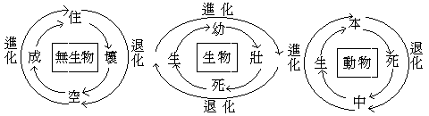

# 第四章　佛陀現實主義之自由原理

## 目錄

- 第一節　佛是現實主義者
- 第二節　四真觀
- 第三節　八正道
- 第四節　三德藏
- 第五節　以佛陀自由原理刱建自由史觀

## 第一節　佛是現實主義者

世界史綱著者韋爾斯，以其進化教、一神教信徒之眼光，未能盡知佛陀者也。然其敘佛之生也，則曰：若干世紀間之印度，驩虞逈樂，無有憂患，而佛陀乃出生於喜馬拉雅山麓孟加拉北一自由之社會中。其敘佛陀之捨家也，則曰：於是俗累盡脫，得自由求其智慧矣。其敘佛陀之正覺也，則曰：忽爾光明爆出，始知獲永遠之勝利，已抉生命之奧，洞然於其真相，乃傳其覺悟於世人。奇哉！此蕞爾小恆星之上，乃能產此一人為過去未來現在眾生之本性作甚深思惟！其敘佛陀之教義也，則曰：其為自古迄今最銳利理智之成功者，蓋不待辯也。歷史之教訓正與佛之教訓合，自我解放於更大趣味中，即無異自桎梏中放出也。然詠歎初期佛徒若阿育王等，能為人類真需要之服務，而慨後期佛徒不悟自我解放之旨，而演怪誕之衰腐。若將佛陀原始之教義，經科學及歷史精神滌清之後，於人類命運前途尚大有所造，未可知也云云。按釋迦為解放印度四姓階級而創建平等自由之社會者，固世上無人不知也。觀此可知佛陀可於近代人類自由運動以基礎上，為人類完成自由本性之導師，然非後代衰腐之佛徒也。

現實主義，謂於現在實際之無生物、生物、有情及人之真相，是如何即了知其如何，而說明其如何——如如——，不參雜絲毫私見私欲之主觀於其中之主義也。故其他各先哲皆自有其所說之物，唯佛為現實如何即還他如何，而自無其所說物者。故現實主義之主義即非主義，為解放一切主義拘囚之自由公平主義。詹姆士等實際主義，於孔為近，然已毗於唯物論、唯我論間矣。然孔子雖為現實主義者，較之佛陀具體而微，未能洞徹現實——現實即指人生宇宙，佛典則曰法界——真相，恆遍無礙。故唯佛陀為究竟於現實，而唯佛陀為真正現實主義者。

現實主義何故能解放一切主義拘囚而自由公平也？各私見私欲之偏執主義——主觀主義——，其本原即唯物論、唯我論與唯神論。以囚於無生物之主觀，窮究無生物之本體，至於脫離現實之純主觀境——若原子等——，偏執為現實之本元，依之演為萬有，則為唯物主義之哲學與科學進化論。以囚於植動物——生物——之主觀，窮究生物之本元，至於脫離現實之純主觀境——若神我等——，偏執為現實之本元，依之演為萬有，則為唯我主義之哲學與道學及循環止息論——若中國儒道家——，或輪迴解脫論——若印度外道等——。以囚於有情及人之主觀，窮究人生之本元，至於脫離現實之純主觀境——若創造主宰萬有之唯一真神等——，偏執為現實之本元，依之演為萬有，則為唯神主義之哲學與神學及退化論。而現實主義則都不如此，但洞明現實之真相如何，即說明其如何。於現實為無生物與植物、動物之三大類，即說明其為三種活動系之表現相。於現實之三類，不由任何一類產生餘二類，亦不由任何二類合生餘一類，則說明三種活動系潛能皆無始而存在——現實主義是無元的，必欲求元，現實即元；潛能非元，是依現實而推出的，亦依現實而恆轉的——。於現實唯第三活動系表現之動物至人類為最能自由活動，即說明當從人類到有情以完成現實之自由本性，絲毫不存私見私欲之主觀偏執，故產生於私見私欲之主觀偏執諸主義，得此皆如黑闇之遇光明，自然消滅，因以解放其被囚而獲自由也。

三種活動系之潛能，在佛學於第一系曰共相種，於第二系曰不共相種，於第三系曰一切種識。每活動系各有其無數之類別，表現為別別之單個——一塵一界至一有情——。於共相種僅有一「聚散變化性」，人皆可以共變共了，故有物理活動法則，由此而得自然科學原則，以聚散變化新新不已而說進化論。然據此原則欲移用之於生理、心理，而生命心靈遂成不可思議矣。蓋不共相種除有「聚散變化性」之外，更有一「死限生殖性」。無生物無死限，而生物有其一定由生長至老死之死限；無生物無生殖，而生物有其遺傳種類之生殖；此生物與無生物不同，而不得拘於物理活動之法則者。唯物主義者不知也，其說明生命，遂流於武斷——若唯物一元哲學等——。於生物而偏執者，另成唯我主義，於死限求不死，說輪迴與解脫；於生殖觀傳盡，說循環與止息。一切種識，除有「聚散變化性」、「死限生殖性」之外，更加有「永續統攝性」與「自覺進化性」，以永續統攝性曰「一切種」，以自覺進化性曰「識」。唯物主義者不知也，其說明心靈，遂流於武斷，若行為派心理學等。而偏執乎此者，以永續統攝與自覺進化，說全能全知之上帝，別成唯神主義。

以第三活動系完備「聚散變化」、「死限生殖」、「永續統攝」、「自覺進化」之四潛能也，故有充分自由活動而表現為有情類也——動物——。或無所依資於第一第二之活動系，若無色界諸有情是。或執受第二活動系為自身而依之攝取第二第一系為資用，若色界、欲界諸有情之身器是。或依或不依第二第一活動系而自由表現身剎，若佛陀之法性、受用、變化身剎。三界有情身器，以未走通「自覺進化」而到「完成自由」之路，故自由猶有限。佛陀已從自覺進化而得完成自由，故其身剎完全自由。斯義深廣，別詳余所著之現實主義，茲但知其大凡可也。

## 第二節　四真觀

一、無始恆轉觀：三種活動系之無始存在，蓋無時不流動而轉變也。以聚散變化而轉變，小則地面滄桑陵谷，大則星球住壞空成。以死限生殖而轉變，隱則剎那陰陽消息，顯則一期幼壯死生。以永續統攝而轉變，近則一有本死中生，遠則三界升沉往返——分段生死——，其式如下；

此有待解釋者，則生物由壯到生之為退化也。蓋此生乃生殖之生，壯時生殖果子，離自體為他體，即為自體趨死之道。故依父母之自體言，即為退化；儘有若稻麥、若蠶蛾，一生殖果子即死者。吾友衛中博士，在其政治與教育，謂生殖力為至寶而不容絲毫濫費者，亦斯意也。由上觀之，可知於此無生物及生物流動恆轉之公式中，說為進化，說為退化，皆偏不全。然亦不說為循環輪迴者，以此可引起一誤解，即謂循一定軌道而復其舊也——儒道家邵雍之輪化論有此意——。然實不循其舊，而有微異突異之變化新樣者；故但應謂之流動恆轉而不可謂之循環輪迴。然動物有自覺心故，若能打破一分於現實之愚昧——佛書謂之破無明——，能保證自覺心永不退時，則可依現實真相之悟契，走上進化於善美之通路，易為進化恆轉——變易生死——。由自覺之進化恆轉到達圓滿，則又易為均化恆轉，則為佛果之「相續常」與「無盡常」，故恆轉無始而亦無終也。然亦可有區別，流動恆轉無始有終，進化恆轉有始有終，均化恆轉無始無終。以始覺心有始而本覺心無始故，由是可洞明現實——現實是現變實事義——無始無終之真相。

二、無性——或無我——緣成觀：物理之聚散也，生理之生殖也，心理之統攝進化也，皆有與他物、他生、他心之關係。故三種活動系中之別別潛能，表現為別別單個時，皆藉無數量或親、或疏、或近、或遠之他系、他類、他個關係而得表現成立。一原子以陽電子中心、而聚環許多陰電子得成；乃至一地球以一熱力、動力中心，而聚環許多原質得成，此其以親而近之他緣關係得成者。更有疏而過之他緣，則生物系之吸收呼捨也，動物系之攝受改變也，皆為無生物多樣多式表現之關係。至於生物，其理更明。一果子之成立也，由父母、祖父母輾轉遺傳變化及吸收呼捨於物理等關係得成；其發生長大，更有藉於水土日光空氣等。疏而遠者，且有動物系之攝受改造等關係，以之有生物多樣多式之表現。至於動物，其相尤顯。一人生之成立也，基於永續統攝之一切種識無始來流轉熏習多類多別之潛勢力，攝受「生理父母遺體」、「物理物質空氣」、及衣食等無數關係得成；而一切種識更藉三界諸有情中轉展熏習，得統攝各類多別潛勢力，永續不已。自覺心之發現，進化業之增勝，亦藉潛能、遺傳、環境及「先覺之教化」而得成。由此觀之，一原子、一果子、一人生、一心識之表現流行也——現行——，其真實相皆為全宇宙或全法界之眾緣，而無單個獨有之固定自體性——無自性或無我或空——；而個體但為眾緣和合連續之假相——假——；無性故緣成，非無性則不假緣成，故無性非緣成則不顯無性——中——，以無性緣成、緣成無性故，活動變化，自由無礙。印度之中觀學，中國之天台六即三觀學，華嚴法界六相十玄觀學，日本之真言宗六大三密曼荼羅學，皆發揮斯義耳。由此可洞明現實——現實是現事實性義——無邊無中之真相。

三、無相真如觀。夫無始恆轉與無性緣成皆就相對之關係上說明，其立足點近於安恩斯坦之相對論。據一剎那——假定為最短時——時間為主，十世古今攝於一剎那而為其伴，然其伴中各各剎那皆可為主，皆可攝十世古今為其伴，則時重重無盡，長宙都在一剎那中，而了無恆轉之轉相可得。據一原子——假定為最小空——空間為主，十方星球皆攝於一原子而為其伴，然其伴中各各原子皆可為主，皆可攝十方星球為其伴，則空重重無盡，大宇都在一原子中，而了無緣成之緣相可得。推論之無盡而現實自如，分別之無盡而現實自如，善能分別諸法相，於第一義而不動。觀固善觀，說故善說，其如觀之說之為得於現實乎。到此誠有「竭世樞機，如一滴投於大海，窮諸玄辯，如一毫擬於太虛」之概。心欲慮而知亡，舌欲談而言喪，心言絕故，一切寄於知識言論之分別相，都無安立之處。於是無分別故，無所得故，自明現實如是即現實如是故，自明現實真是如此即現實真是如此故；一切之分別言說相，到此悉皆退還，更無能所知及能所詮相，亦無現實如如真如之相，亦無無相名相，大徹悟之現實——不分人生宇宙——如此。然為開示未悟者故，說為無相，說為真如，說亦無相，說亦真如，為亦無相真如，悟亦真如無相，無為而為，為即無為，無說而說，說即無說，無悟而悟，悟即無悟，真如故無相，無相故真如，真如真如，現實真是如此。或因真如之名，迷為未有現實前之本體，由此本體創生萬物，復彌貫於萬物之中而為萬物之主，則沾染於唯神論之大梵、上帝、真神說而錯解，非此無相真如之謂；而中國之禪宗學，則發明斯旨者也。由此可洞明現實——現實是現量實相義——真如絕對之真相。

四、無元心樞觀。由無始流轉、無性緣成，則為自然法則支配而不能自由；由無相真如則無可分別言說而無出路。然則現實人生宇宙，豈不為機械死物乎？又安能趨入進化、均化無礙自由乎？於是有無元心樞說。然無元心樞說，不同唯心論也，蓋唯心論皆為有元說而非無元說。有唯物的唯我、唯心論也，雖認知者我所知識之現象皆唯心變現，而別認有不可知之物體——若哲人以我為萬物計量等，亦是康德及承認境隨心轉之學者等——。有唯物與唯神或唯我之唯心論，雖認意識現象皆為意象，而別認有發生境象之物體、與發生意識之我體或神體——若穆勒是——。更有唯物的唯我唯心論也，則數論之以神我要求受用而自性三德變生萬物，復由神我覺悟後不要求受用而萬物復還為自性之德；耆那教與叔本華亦近之。有唯我的唯心論也，主張皆由作者我之刱造進化而有萬物，若勝論及尼釆、柏格森是。前此之四種，皆可謂之自我唯心論。有唯神的唯心論也，推人及物皆為心之變現，主張宇宙絕對唯一真心——亦可謂之宇宙唯心論，絕對唯心論，他物唯心論，汎神唯心論，一神唯心論等——。要之、皆有元唯心論，非此無元心樞說也。後人誤解大乘起信論等為唯心一元論，說如來藏緣起同於上帝真神緣起，此亦由沾染唯神論邪思惟邪教而妄談，非此無元心樞說也。然有雖為無元心樞說而未完成者，則為業感緣起之唯心論。此雖知無始流動恆轉、有識心造業感苦之關係為樞紐，由現實之識心於覺悟以後不造業而得解脫於苦——小乘——，未知無始無終而永續統攝、自覺進化之一切種識，故解脫於苦而不能自由於樂。今此無元心樞云者，三種活動系皆無始存在，恆時轉變，故無有始，亦不以何為本元體。但第三系表現之有情類，有永續統攝性故，能攝持自系他系一切潛能——一切種——而為轉動之樞。有自覺進善性故，能於一切種識之潛勢力中，現起情意知識，自覺自系——心理現象——、他系——生理物理現象——一切現實而為進化樞紐。有永續統攝性故，不同第一第二系表現之無生物、植物，可析其質斷其種而使之散滅，且漸能統攝一切為自身依資，不全受自然法則支配而轉能習熟自然法則，恢恢乎游刃有間而自由無礙，變化無方。有自覺進化性故，不同第一第二系表現之無生物、植物、可解其體——若冶金、割木等——食其生而為之利用，且漸能進善一切為自身依資，不全受自然法則支配而轉能明了自然法則，恢恢乎游刃有間而自由無礙，變化無方。然其自覺必進化至於現實之「無始恆轉」、「無性緣成」、「無相真如」皆完全顯了正確覺知時——真現量——，乃能打破迷現實之無始愚昧——無始真實愚與異熟愚之無明——，不復退回於唯神、唯我、唯物等迷謬中。於是、自覺心成立而漸進於善，有進無退，得成功真正之進化。印度之瑜伽唯識學，正明斯義。由是可洞明現實——現實是現變實力義——自由可能之真相。

## 第三節　八正道

八正道者，依上所觀現實真相，從自覺心能自由進化於善之一條正當道路，而解說之則有八義，非偏僻而平遍，非邪曲而端直，故謂之正。

一、正見：謂於現實真相有正確了知之見地，肅清違越於現實之唯神論、唯我論、唯物論、及由派生之一切迷謬知見，了然不復被其障蔽，卓然不復被其搖惑，此非改進教育而有最善之教育不為功，亦為教育所蘄響之正鵠。二、正欲，或正思惟：欲非不善，亦非是善，有善、不善，亦有非善不善。和合私心貪、瞋、癡、慢、邪見而起之欲，則謂之不善欲。和合正見及大公無私心——無貪、瞋、癡、慢——而起之欲，則謂善欲，亦曰正欲。欲望為人生一切事業之發動及推進機，須絕滅其邪惡而導進於正善，不當籠統壓抑使之萎縮。但如何謂之善？此當解釋。有利益於此時後時、自身他身之心身行動謂之善，反是、有損害於此時後時、自身他身之心身行動則謂之不善。有損害於此時自身而有利益於後時他身——他身指群眾——者，謂之準善，有利益於此時自身而有損害於後時他身者，謂之準不善。無何損害利益及但損害利益自身而無涉此時後時、他身之心身行動，謂之非善不善。而欲望之發動，於此當伴於正見之觀察，善則奮勉精進以行，不善則滅之不稍猶豫。善不善未自覺自決，則當考之現實真相，繩以正見而求解決，不可盲昧從事。孔子告顏回以復禮歸仁之道，亦惟此耳。三、正精進：放逸、懈惰、懶怠，最為人生進化於善而求自由之大障礙，故必撲滅一切放逸、懈怠、懶惰習尚，得正見、正欲擇善固執後，當繼之以勤勉奮發勇猛之大精進。如一狹士與萬人戰，大雄大力，不屈不撓。世之但以懶散、閑逸為清高者，是孔子所謂「飽食終日，無所用心」之朽木而已。四、正業，或正命：夫身安則道隆，欲得身安，必有正當資生事業之生活法。此根據上述現實之真相，不可利用其他動物以厚人生。但當用近代之科學方法，發明利用一切無生物、植物以厚生之正業，由是而得衣也、食也、住也、交通也、衛生也、體育也，皆此正業之果也。五、正語：言語文字為人生自心他心交通之利器，由此可收儲他心——古今人類——一切知見情意於自心，亦可放射自心一切知見情意於他心——今後人類——。然有心者各有其永續自覺之自由活動，不可強制，不可侵犯，若強制侵犯之，必生反應而還以強制侵犯加之於自心。故於他人以及人群，不可藉語言文字之利器以為侮弄欺罔，當為不粗惡之柔軟文語，不巧飾之質直文語，不挑唆之和悅文語，不虛妄之真實文語，是謂正語。人眾之和合為社會，基於人與人之信用，而人與人之信用樞紐於正語，正語失則人群之樞紐解，而社會分崩矣。六、正行：謂人與人之人群社會間，所有正當行為，亦即人類立身處世之道德、政治、法律也。據人各有心、不可強制侵犯之原則，及自心他心可以感應交通之原則，人當自治，亦當有公平之政治，此導之以德、齊之以禮——謂公平原則——之公平政治，謂之正行。七、正念：念者、謂習熟明記而憶念之也。根據正見所知宇宙人生真相而習熟明記之，且於起欲及精進與營業發語動行之間，時時憶念而不忘失，不令流于錯誤，是謂正念。八、正定：定謂心力集中，亦謂心一於境堅固安定。不流蕩於唯神等及其派生等邪僻迷謬之見，而能專心於現實之真相，是謂心力集中。於現實真相洞明契應而無復絲毫違越，是謂心一於境。顏回之「三月不違仁」近之，而究竟則唯佛陀矣。

此中正見、正念、正定、則為教育，然學齡教育注重於正見，而正念、正定、則待成人教育自修之。如佛陀之淨土學，亦修正念、正定之一種法門耳。正業則為經濟，正語、正行、則為政治，佛陀之律儀學屬之；此人生社會之三原素也。正欲、正精進、則發動推進此三原素而完成之者也。正念正定亦為教育，故人生自由社會之構成，發軔於教育而終于教育，不同帝國主義社會以教育為政治奴隸，共產主義社會以教育為經濟奴隸，斯其異也。

## 第四節　三德藏

依四真觀，行八正道，至於究竟充圓美滿，謂之佛陀，有三德藏：一、圓滿安靜藏：佛書謂之圓寂，謂無限福慧皆圓滿，無限惑苦皆寂滅也。其義深廣，說有四種，茲不詳述。但知由真觀破除一切之妄執，永不復有違越現實之愚昧及煩惱，由正道滅盡一切之繫縛，被囚現實之拘牽與逼迫，畢竟都無，由是清淨光明，安樂閑靜，曰恬靜樂。二、遍正覺知藏：佛書謂之無上正遍覺知，義廣難窮。今但知由比量真觀於有情界修八正道，進成現量真觀，更於廣有情界行八正道，至於究竟充足，能於一剎那心正覺遍知十方三世現實——法界之性——絕對、相——相對、事——事物、理——法則，而無少乖漏。如實而證，如證而說，不假尋思伺察，無不契理如量，曰覺法樂。三、完美自由藏：佛書謂之法身，以全宇宙為身，亦以全宇宙為依住，相好無量，莊嚴無量。三種活動系之潛能現實，皆統攝於永續自覺之清淨一切種識而平均轉化，應現無方，變化莫測，一身作多身，多身作一身，小身作大身，大身作小身，自身作他身，他身作自身，有身作無身，無身作有身，眼根作鼻根，耳根作舌根，根身作器界，器界作根身，有法觀無法，無法觀有法，少法說多法，多法說少法，而復於他有情根身、器界、心識、文語周遍隨順，方便開導，完全無礙，完全自由，曰自由樂。

此為吾人之現實中所含之可能自由性，亦為佛陀已能完成自由之現實界。到此現實界，三種活動系融通一致，可謂之無性唯生論，或無我唯身論。誰有心者，聞此而不歆往！

## 第五節　以佛陀自由原理刱建自由史觀

有完成自由之三德藏，可為人生要求自由、解放被囚之憑信；有進達完成自由之八正道，可為人生要求自由、解放被囚之通路；有洞明可能完成自由之四真觀，以為人生要求自由、解放被囚之現實真理。於是、猶處自由反自由相搏中之近代人生自由運動，可得確實之思想信仰而發生堅強力量，戰勝反自由矣。

於此建立人生自由史觀，當有三種態度：其一、對於一切現實潛能之普遍自然法：不常不斷——無始恆轉——、不一不異——無性緣成——、不生不滅、不有不無——無相真如——、不來不出、不自不他——無元心樞——，當善了知而習熟之——習熟即修觀行——，契應恰當，則從心所適無不如意自由矣。此為現實主義者佛陀之態度。其二、對於無生物與植物，可取西洋近代科學態度，發見其關係公式而攝取制役之，以利用厚生。其三、對於有情及人，各有一永續統攝自覺進化之心故，未皆成佛，各有自由活動之範圍而未能無礙，則不能用前一態度；以有永續不可制之潛能與自覺不可犯之反動——殺人者被人殺，業報相尋，理存於此——，尤不能用科學態度；故此當用親和感通態度，此為佛陀常用，而中國孔子亦近之。所謂親近善知識和合眾，感而遂通天下之故，皆斯旨矣。依此親和感通態度，彼一自覺自決自動、與此一自覺心自決自動之感應相通，親愛融和，互相受施，互相引隨，互相變化，互相增上，乃上進化於善之道，漸達完成人生自由本性之境，此為今自由史觀之源泉。雖然、佛陀以全宇宙全法界為身剎，完全自由，無間心物。人之心靈感通僅能及有情故，暫以有情為限，文語感通僅能及人類故，乃唯建人生自由史觀耳。

