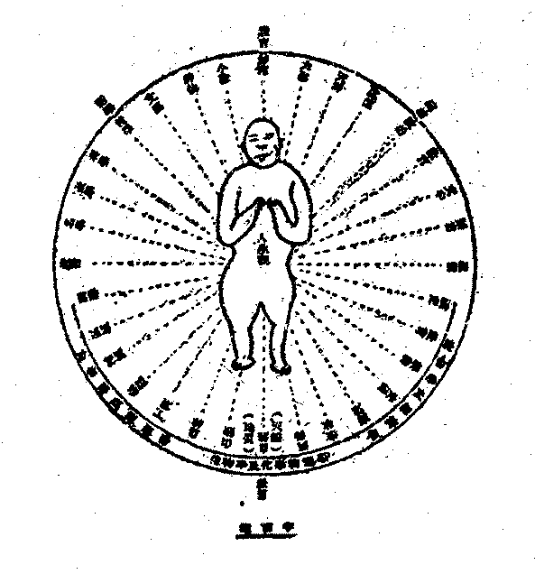
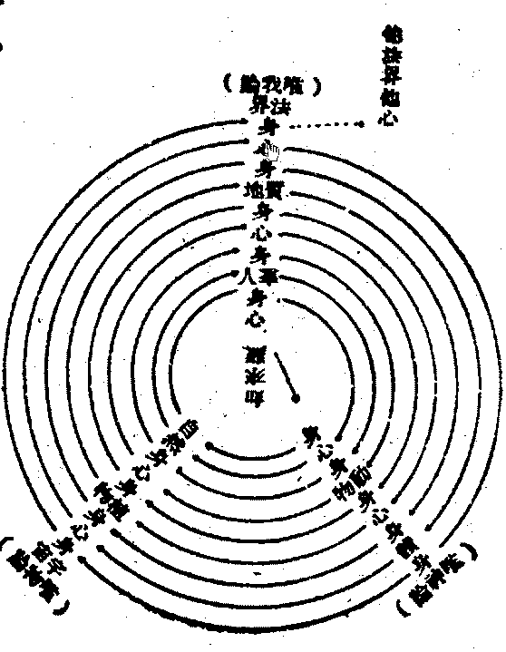

# 第五章　以自由史觀完成近代之自由運動

## 目錄

- 第一節　自由史觀
- 第二節　刱建自由史觀之世界教育
- 第三節　創建自由史觀之社會經濟
- 第四節　刱建自由史觀之國際政治

## 第一節　自由史觀

自由史觀，謂全宇宙以自由活動為本性，而人類有自覺心故，自發自動解放被囚，自決自主要求自由，自存立且自治理，以鞏固自由之基礎。不強制且不侵犯，以平均自由之分位，相感相應以生博愛之同情，相傳相承以成進善之演化。然與身俱生即有被囚之桎梏——按此故不同道家及盧騷謂人生而自由——，內迫自身之需，外震天然之威，欲為工人之解放，進謀人眾之和合，遂因約束，仰信天神——宗教——；天子、神使之元首託而產生，皇帝、君王之統治因以孳乳。自然之被囚稍解，人事之被囚轉劇，則由天子、神使、皇帝、君王，不知人各有心，皆能自覺，妄用其自由之權力，強制他人自由以呈私見，侵犯他人自由以張私欲，乃藉天神之約束，演為帝王之專制，於是近代之民眾自由運動起，以要求各人自由、皆得平等為原則，革除專制之帝王代以民選之政府。以國民之統治依賴猶在，致政府之專權制度如故，資本主義代之崛興，帝國主義因以侵略，雖有多量之財產足資生活，及有多量之文化可益知識，皆壟斷於富強階級，不均沾於貧弱民眾。於此探厥本原，近由遺傳來私有財產之貧富不平等，遠由遺傳來私有文化之智愚不平等，非文化平等而知識平等，及財產平等而生活平等，則統治依賴不能去，而專權制度不能革，人群社會存立之權力即不能平等。然近來雖有為權力平等、財產平等之無政府共產運動，而未知平等之實質在於自由，自由源泉於人類自覺心之自立自治與同情演化；未為文化平等之世界教育運動，故共產主義之結果，不演為身體貪懶至人類無以生活，則轉成佔奪之侵掠。無政府主義之結果，不演為社會煥散至人類無以存立，則轉成混亂之強壓，以致惟能破壞而無建設。雖克魯泡特金主義與基爾特主義，似可為建設自由社會之方法，然以今自由史觀之眼光衡之，猶未能盡然也。

克魯泡特金雖發明生物皆以互相扶助而得生存進化，有契於人生宇宙無性緣成之真相，欲用人類互助本能以達自由社會，去除人類統治依賴之劣根性，而廢專權制度。然若未能以世界教育運動使文化平等發展，人類之自覺心以人生宇宙四真相觀，養成廣大正確之知識量；又以行八正道養成充分自空自治同情演化之力量，以完成人類自由之可能性為方針，則人類互助自由社會，不等於空想，即以其唯神、唯我、唯物之迷習，演為互助以私其家、以私其族、以私其鄉國、以私其階級而相戰鬥爭奪。不探其本而齊其末，此為必至之境，非故為危言以聳人聽也。

基爾特主義雖根據生物官能組織及同業相關原理，期建設職業機能組織之自由社會。然僅知從工會整齊組織——制定劃一政策——，擴大權力——管理生產機關——，為進行之過渡方法，置社會經濟關係於最高權位；雖可減輕社會政治關係，未能增重社會教育關係，則無擴充人類高深自覺心以完成自由生性之道，亦無養成人類廣大同情心以建設自由世界之道。其結果，或易區域戰爭、階級戰爭、為職能機體戰爭，未可知也。

為是、故今當試為刱建自由史觀人生世界，而以提高且擴大人性自覺心為基石，首在刱建世界教育，更以提高且擴大人身自由生活為梁棟。次為刱建社會經濟，以提高且擴大人群自由和合為成功故，進以刱建國際政治。復為完成現實人生宇宙自由活動而進化尚無止境故，又結之於教育。茲依次述之。

## 第二節　刱建自由史觀之世界教育

十年前抒教育新見，嘗分教育為二：一曰、學齡教育，則成人對於未成人輔成其自覺自營自治之自由力，能自由營資生事業，及自由治共存社會者也。二曰、成人教育，則成年後之人，入人群世界自然宇宙之大學，由個人與他人及生物無生物互以為師，互以為資，以成參贊人生宇宙化育，而自致為完全之人者也。因字之曰：相對的個人主義之教育。相對故、普通能助人之自由而不奪人之自由，個人故、獨特能充己之自由而不失己之自由。乃析之為相對各個人之個人，相對自家庭之個人，相對自職團——包學校及國體——之個人，相對自區域之個人，相對自種族之個人，相對全人類之個人，相對自世界之個人，相對眾生類之個人，相對全宇宙之個人，終以體達全宇宙緣成的個人——如來藏——為中心，開發個人實現乎全宇宙——法界身——為極則。在個人曰全人，在社會曰大同，在宇宙曰圓融法界。自一至七之個人，為學齡應受之教育；自八至十，為成人自致之教育，茲製一圖以明其意：

科學教育為學齡之教育，宇宙教育為成人之教育。魔術、迷信為原人及幼兒心理，魔術發達之極為神仙，看破魔術則以神仙為山林高士可也。迷信發達之極為天神，看破迷信則以天神為世間偉人可也。文藝、藝術為科學哲學之結晶，亦科學、哲學煤爐所生之火焰。道德為教育、政治之結晶，亦教育、政治煤爐所生之火燄。語言、文字、名學、數學、為知識教育之基礎，亦想思交通之工具。天體、地質、河海、山陸、植物、動物，總為自然演化。農林工業以至區域，漁牧商業以至社會，聯合之為國際，續持之為歷史，總為人功演化。至魔術盡而迷信空，為各自個人而解脫，則成小聖。為無量眾生而精進，則成大聖。至於究竟，則為佛陀。大聖為相對眾生類之個人及相對全宇宙之個人，佛陀為體達全宇宙緣成之個人而開發個人實現為全宇宙者，其餘則大抵可知矣。

向曾主張佛化教育，分教育為四類：曰動物教育、或生物教育；曰人倫教育，或人群教育；曰天神教育；曰佛化教育，或宇宙教育。謂佛化教育備乎到三者之長而無其弊，超乎前三者之上而貫其通，後有因之設世界佛化教育社作佛化教育運動者，雖極言無前三者之弊與超乎其上，惜未能言貫前三者之通與備乎其長也。吾友衛中博士之新教育方法，頗能得之，茲節錄其說焉。

一、新農工商教育之基本教材為物質，基本工具為人身，凡有接觸物質與使用人身之機會，即為新農工商教育之起點，故新農工商教育當設施於教育全系統，而開端於幼稚園時期。二、設教伊始，全不用書，寫讀算三者亦當力避，特注意於兒童之用物質法。而就人身之強弱，物質之種類，及用物質之態度緩急多少等項，培養其對於物質之興趣，蓋興趣為熱力之表示，熱為變化諸物質之動力，能變化舊有之物質而生新物質，即物質發明之始也。三、在不妨礙兒童身體發育之範圍內，可以任其個性盡量使用物質，蓋兒童之喜用物質非病，病在用之不以其道耳。用物不以其道，斯不能盡物之用，不能盡物之用而見異思遷，勢必外物之激刺勝於應付之能力，而有厭棄外物之虞矣。四、非由感受運動用質而得來之學問，不得謂之真學問，況兒童教育之初期，純在練習感官，寧可忽於物質之運用乎！即就識字而論，必先始於象形而後及於目閱口誦之練習。以此類推，則凡教育兒童，莫不導其由互相關係之物質，得互相關係之智識，進而導之以較複雜之活動。各耕其田，各織其布，各築其屋，則關於農工諸科學，皆由此而生矣。五、既由普通農、工、商學三操作，取得礦、植、動三界之科學知識，更應綜合片段之知識為系統之研究，以明人類之問題。孟軻曰：「人之所異於禽獸者幾希」！倘非具礦、植、動三界與人類之系統觀念，又焉能生超眾之盛想乎？使世人均卑視自然，而以人與禽獸乃不可同日而語者，則至今不發生物質科學可也——按此故儒家缺物質科學——，遑論心理科學哉？兒童不知物性，隨意玩弄，損壞學具，老人笑之。書癡感官不靈，忽於外物，誤解人類，科學家笑之。六、視兒童能力之所及，任其攫取物質，自由採擇，非於其活動範圍內深感不足已有之外，勿及工業；非於己力創造之物品外深感不足已有之外，勿及商業。由是可知新商業教育之意義何在。七、感官因練習而愈細，則腦力之於消受印象者愈多，用腦力多乃善用物質之結果也。春情期發動之兒童，感官之發動乃恆隨其用物質之程度而並進，感官果善用物質，使其通之腦力，則感官與精神，有互通之機會。感官力、腦力、精神三者，果能一氣貫通，則春情期發動之兒童，斷無性欲衝動之危險。蓋性欲衝動者，乃潛伏感官力濫用於產生新體之謂。果使感官與精神相貫通，則濫生新體之隱力，亦必受精神驅使而減少危險矣。近來青年學子，騷動若狂，原因固非一途，而科學教育不足導青年感官使與精神相貫通，致軀體之活動易為外物所誘惑也，實其主因。八、兒童之使用物質，為練習感官之活動，發情期之性欲衝動，乃潛伏感官力不為己用之證明；非感官之練習全告成功，則潛感官力之衝動無由防止。近時性教育家，每於發情期教育，發現極複雜之問題，即由於此。吾人所陳者異於斯，發情期以前之兒童教育，早使感官力、腦力、與精神三者一氣相通，感官之活動，純以精神為指歸而日趨向上，則此衝動性最大之潛伏感官力，反足為物質通達精神之偉助矣。蓋身體果強壯者，則準之上述之方法，使此潛伏之感官力，生極強之活動而無以發洩，專以助強健之感官，攝引外物之激刺，使深通內部精神，又烏有不產生物質發明及精神創造乎。九、由農工商教育產生科學，藉科學教育而使物質匯普精神，以產生發明與創造。然個人精神之表示，尚非完全，教育最終之鵠的，在以精神管理個人之物質感官，是謂個人之道。以精神管理家庭社會以及國家之物質，是謂大群之道。現代嫉世者流，每謂世風日下，道德淪沒等語，殆深感世人只知物質不知精神而發歟！果深悟其病因之在感官力不足溝通物質與精神否耶？

蓋佛化教育即現實主義教育，現實主義教育即自由史觀教育，而自由史觀之教育，由內而外、又由外而內為一度之提高擴大，再由內而外、又由外而內為二度之提高擴大。如此一度二度以至七度，乃臻究竟。茲以圖式表之。

此圖一小○符，表提高擴大之一度。↑符，表每度中由內而外由外而內之程序。內謂心，身為介，外謂自然及人群等。人為生物，由內心而活動攝現身之活動，由身之活動接觸自然——動、植、礦三界——之活動，由接觸自然之活動同化為身之活動——新農、工、商教育——，由身之活動提高擴大於心之活動——新科學、哲學、道德——；此為生物教育之第一度，亦儒家格物——接觸自然與攝受自然，格者、來也，即攝受自然物來身心也——，致知——攝自然來身至心而有新科學發明也——、誠意——由新科學成新哲學也——、正心——由新哲學成新道德也——之學。然儒家不詳於此，而孔子以來唯詳於身修以後之事，致但能代表人群教育而不能代表生物教育。其鵠的在強健富榮，其哲學亦以此為人生觀，故道德亦以衰病貧陋為罪惡。教育而以此為終止，則教育經濟之奴隸，而不能自由進化。然此固自由史觀教育之基也，不應捨棄且首須重注之。從此展進有一歧途，由身健榮而逕從身發洩，則為生殖力之向下活動——人以之動物蓋屬於此，為近代動物教育之弊，亦楊朱等主張也——；一為由身強富到心之健榮——即哲學、道德等——，由心健榮而到身之表現，則為身修之禮樂等——文章、藝術——。由此有二歧途：由身修逕到身心者，但為各個人相對之個人，淺之若伊壁鳩魯及個人無政府主義等，深之若小乘解脫等。由身修到殖力發洩之夫婦、父子、兄弟之家國等人群，則為正途。然第一度但成社會經濟之利，養成各個人相對及自職團相對之個人而已。三種人生態度以第二種為主，而以第一第三為伴。若由心之健榮表現為身修——由身修而直達天下者為出家菩薩——、家齊、國治、天下平，則為由心到身修，由身修到人群治平，由人群治平到身安，由身安樂到心清泰之第二度提高擴大，是為人群教育，儒家始於家庭之孝弟而終以國際——天下——之忠信，故為代表。此人群教育能養成各個人至自世界之相對個人，其鵠的為調和安甯。且自人群教育而起，已廢第二人生態度——征服利用自然態度——唯用第一第三人生態度，互為主伴而已。然此人群教育，但成國際政治之平，若教育從此而終止，則歷來教育為政治奴隸之弊不能去，而不能達於較人間更進化之境矣，故尚須有天神教育以引進之。以天神為唯一之造物真幸，成完全脫離生物關係之靈怪等——魔術、迷信——，致有高壓人世、冥仰天國之弊，吾人固當撲滅。但視天神為人間以上更進化之生物界——若火星等——，固為進化之所承認，亦為自由進化之所應有，於是有由心身到動物及植物之第三第四度之提高擴大。不惟同類能有心意、文語感通，異類——獸等——亦能以心意、文語感通而相化；不惟能製死物及感通動物以充資人工用——若機器、牛馬等——，亦能感通植物以供人之衣食及音樂等，則從北俱盧人以至三禪天之生物界也。再進為由心身到地質及天體之無機物，亦能感通隨身有無之第五第六度提高擴大，則四禪天是也。以上皆可謂之天神教育。其鵠的在超人勝進，故亦謂之超人教育。再進、為由身到宇宙之無量世界，皆能隨身有無之第七度提高擴大，則大乘聖者隨心應現百世界身剎、千世界身剎等是也。究竟圓滿乃為佛陀之法界身，而仍與他法界心境——即諸佛法界身或眾生如來藏——相感相應，無盡無極。第七度為佛教育之特點，其鵠的在進化圓滿。觀此、乃知自由史觀育教——即佛化教育，貫乎前三者之通而超其上，備有前三者之長而無其弊矣。而衛中博士之新教育說，雖僅至笫二度提高擴大而止，然已兼有近代西洋教育及儒家教育之長而減少其弊，故今取之。

依此而設學齡教育，當為幼稚園之教育六年，初生至六歲；小學場之教育八年——非學校式之農場、工場、商場式之學習場，七歲至十四歲——；大學校之教育六年——十五歲至二十歲，於此為系統之研究，成功科學、哲學個人道德——。此學齡教育為人人之所應受，以能成功個人自營生活、自治存立、自覺知識之自由能力為鵠的，且當採用衛中博士之新教育方法者也。若夫成人教育則無程限，得佛陀之大乘，則走上第三提高擴大之自由進化時，即為發大乘心之覺有情道矣。

復依前圖所示，世人不知走現實主義——自由史觀——，由內而外、由外而內、為一提高擴大之活路，而專走從上而下各偏一邊之死徑。其最高明之唯神論，則從天體以外之身——神，由天體走到內心，再由內心走到天體以上之身之一旋復耳——若大梵、耶、回一神教——；其下者，或由內心走到天體——若拜日教——，及走到動物而止——若拜物教。其最高明之唯我論，則從最外身走到最內心，由最內心再走到再外身為一旋復耳——若數論、耆那教——；其下者，則由最內心走到最外心——若柏格森——，或最外心以內身——若尼采——而止。其最高明之唯物論，則由宇宙走到自然，再由自然走到宇宙為一旋復——若赫克爾萬物有生論或唯物的一元論——；其下者，則由自然走到第三層之心——若行為派心理學——，或走到第八層之身而止——若原子電子論——。此唯物論與唯神、唯我論有一不同之點，則始終皆棄最內心不問是也。故於此等思想系統中之學理，在自由史觀教育中，皆不適用，非以現實主義澈底改造一番不為功也。

然今此刱建自由史觀之教育，旨在完成近代自由運動。近代自由運動，在於社會經濟自由平等，國際政治自由平等而已。此則自由史觀教育系統中觀之，即學齡教育之生物教育、人群教育、已夠之矣。然對成人教育，究竟亦不能不顧及之而為設備，則當設自然科學研究院——物理學到心理學——，社會科學研究院——經濟學、政法學等——，哲學研究院、文藝研究院——一切文學、藝術等——，衛生研究院，優生研究院，體育專修院，技術實習院，身心修養院——廢除一切宗教之組織名稱儀式等，寺廟或改為修養院、宣講場、古物陳列館等，古物亦皆收存於古物陳列館——，古物陳列館，圖書儲藏館，圖書編譯館——雜志入此——，圖書印刷館，圖書發行館，電訊新聞館，通俗宣講場，群眾演說場，戲劇音樂場，技術遊玩場。凡以資觀感而益智能為目的，導身心於提高擴大之自由進化者，組為種種文化機關以收蓄宣發之。合前學齡教育之機關統屬於教育事業之中，統為一教育職團機能之組織；對於經濟與政治別為一種獨立之社會，在經濟組織與政治組織中者，但能以受教育之關係及經濟資助政治維護等關係，而協相商榷，不得逕干涉其職權行使及主持統治其事業。然此與基爾特社會不同，彼以此屬之公民組織之一種，純本職團機能之見地而組設，此則依自由史觀之見地，以教育為解放心境上知識被囚而得自由之工作，且為取得經濟上自由、政治上自由之基本工作，故為一獨立之職業團也——學齡學生即以求學為其職業。

然以此而生一問題，即如何解放現代被囚於宗教、資本、階級、民族、國家、帝國主義等桎梏中之教育，使從此等桎梏中而出，以成為教育事業獨立自由之職團組織也。為此、今年嘗向世界教育會議，提出世界教育運動之主張，而今亦云以自由史觀創建世界教育也。

世界教育完全為自由之教育，不為經濟奴隸，以經濟目的而使用；不為政治奴隸，以政治目的而使用。古近宗教與教育，大抵皆為經濟目的、政治目的而設施。古代宗教教育不分——若中國教育等——，宗教為經濟關係政治關係之群眾約束威信，用此威信去達經濟政治目的，故即用此有威信之宗教而施教育。近代宗教威信崩落，資本階級與軍政階級以權威在己，而所信則為科學等，於是另設施非宗教的民族國家教育之學校，而又於原來之宗教組織——教會——及其施行教育，不能禁止，於是宗教教育與民族國家教育分立，而宗教為宗教，教育為教育。然此宗教與教育，要皆為經濟、政治目的而使用之奴隸。

教育為經濟上專利目的之使用奴隸，故一般教師學生皆不以解放心境上知識之被囚而獲自由為目的，偶有心得，寶為枕祕，是丹非素，出主入奴。學者為求私利而求學，教者為得私利而施教，知識經驗授之子孫，傳之徒侶，各張門戶，動云家法，誇為道統，不異財產據為私有，故但有各宗各派之教育，而無普遍公平之教育也。韋爾斯嘗謂：『孤立考察之習慣，自阿剌伯以傳入歐洲，而煉丹術家所行私人秘密之研究，亦復綦夥。彼等與當時之玻璃匠、金屬匠、及藥用植物家、製藥師等，相知最諗。彼等頗能窺探造物之秘奧，然囿於實用之觀念，其所求者非為知識而為私利，其所欲者為用賤價物以煉金，求長生不死之藥，及其他種種幻夢而已。顧其研究所至，於毒藥、染料、冶金諸術，亦每有所得，發見各折光之物用，遂進而製造透明之玻璃透鏡以及光學之器具。顧科學家雖言之諄諄，而好實利之人類，仍復聽之藐藐，終不知為知識而求知識，知識方予吾人以無量之賚賞也。即在今日世界，用之專門實用之金錢，其數尤在純粹科學之上。今日科學實驗室中之科學家，夢寐於專利及秘法者，猶居其半，而不知此輩所為，曾未稍勝煉丹術家也』！其掊擊為經濟目的而教學者，可謂深切。由此種教育助長專利之私欲，其結果乃產生資本主義之階級，而教宗學派及國家民族之教育，皆不能辭其咎也。

教育為政治上專權目的之使用奴隸，故一般教師學生皆以得做官握權地位為目的。衛中博士嘗謂：『政府束縛馳驟其人民之方略，曰宗教，曰教育。宗教所為之事，其崇拜不外往古之聖哲，其諷誦不外天啟之神話，其仰望不外躋天堂而登神域。凡此、莫非尊已往修將來、棄現世捨人事，而重人所不能徵驗者也。人心受其刺激而動過其度，官感反因而隔絕精神，身體至是毫無注意之價值，於是、政府、教會乃能利用其身體以為犧牲之具矣。教權式微，政府轉而利用教育，普魯士一八〇七年之強迫教育，則專以報復拿破崙為目的。政府之假借教育，役民自衛，實自此始。繼之、全歐、北美、東亞皆轉相仿效，中國又從日本而學步其教育之法，則拾取前人之學說，編為多量之科目，注入學生腦中，如荷重負。於是、官能毀而身體疲，由古書報章竊取思想，聽命令差遣而後行動，政府又奏其束縛馳驟之功矣』！由此種教育助長專權之私欲，其結果乃產生帝國主義之國民，而教宗學派及國家民族之教育，皆不能辭其咎也。

然共產黨縱能剷除資本主義，無政府黨縱能剷除帝國主義，顧不能建設自由社會者，則以不知從教育脫離於經濟及政治，組織獨立職團為入手也。世界教育運動組織，既消鎔各教宗學派之教育而去其偏謬，復消鎔各民族國家之教育而解其封蔽，世界教育之外，更無各教宗學派及各民族國家之教育存在。於是、任何專利階級之資本主義，任何專權階級之帝國主義，皆不能用圖其私欲；而凡欲施受教育者，皆須同化於「世界教育組織」之主張。於是、向為階級戰爭、國族戰爭利用為工具之教育，乃可昂首伸眉，出而消泯一切戰爭，締造自由和樂之人世矣。

然世界教育運動之組織又如何成立耶？近年曾有一世界教育會議之組織，擴而充之，能專以喚起全人類之施受教育者，盡銷融一切宗教學派民族國家之教育，而創建世界大同教育為職志，則十年而世界教育一致平等，二十年而社會、經濟、國際、政治，亦解放而自由和合矣。茲試提出各種方案，以供世界施受教育者之討論採擇。其組織當由職能組織而進為機體組織，庶能各盡其職能而又得互相融合為一有機體之功效。

此種職能組織，內容各有立法、行政、司法、監察、考查五部。首為縣區組織，若某縣幼稚園教員團——普通市別為一市區、同縣，特別市別為一市區、同省——；進為省區組織——國小者但縣區、國區亦可——，若某省大學校教員團；再進為國區之組織，若某國小學生團；再進為世界之組織，若世界學術研究團。此中縣、省、國但為地圖上天然區別，不須盡照現時政治區域；且他日國際政治區別，亦須依教育區域而重行分劃者也。此教育中辦教育事業及以受教育為職業者，各成一世界團體之組織，若有一世界也者。然後再依自然區域，從其同為教育職業之關係上為有機具體之組織。縣組縣區教育會，曰某縣教育會，由各職能團體選代表組織之——小學生可選其所信教員充之——；省組省區教育會，曰某省教育會，由省區各職能團體與各縣教育會分選代表各半數組織之；國組國區教育會，曰某國教育會，由國區教會分選代表各半數組織之；世界組世界教育會，由各世界職能團體與各國教育會分選代表各半數組織之。凡本選區對於本區代表，皆能撒回及彈劾之。對於法制，皆有創製，複決之權，且得由選出代表之各職團各區域之合議而解散代表機關以重組之——此中有關涉教育以外若政治組織等者，待於政治節中論之——。此各區域之教育會，則於在區域內專以維持各職能團體之平衡，調和各職能團體之衝突，融合各職能團體之關係，策畫他職能機關——例如經濟團體、政治團體——之互助，發揚本區域之教育，聯絡他區域之教育，執行上級區之決議，通告本級區之決議，皆其職務；而內容之立法、行政、司法、監察、考查五部，可知矣。

其方法當由現實教育而進為進化教育，庶能各盡其天才，而又得相對人群以為一自由人之功效。

一、學齡教育廢除中學，而為幼稚園、小學場、大學校之設立。

二、幼稚園為園林式，不用書，不用寫讀算，但引導嬰兒發出其心力以表現為身力，向其官能接觸到之人及動物、植物、礦物、與衣食器具等，能知識、記憶、查考、習熟、談話、行動、歌唱、應用以為事。大抵就嬰兒身心力能及之環境，條暢發育其官能耳。

三、小學場為農場、工場、商場式，初四年多習農場事，略兼工事；次三年多為工場事，略兼商事；次一年專為商場事。農、工、商為人類進化程序，兒童亦當經歷，乃能由自然物、人造物到自然人造交易物之刺激，得直接經驗之知識。初四年少用書及寫算讀，中三年漸用之，後一年乃充分用之。

四、大學校為學校式，亦為職業團體式，以養成其為社會動物之習慣。分科教學，凡三大科：曰教育科，內分文字言語系，名學數學系，有體物學系——物理學、化學、天體學、地質學——，有生物學系，有知物學系——人類屬之——，美術文藝系，自然哲學系——體系的歷史的綜合——，人事哲學系——經濟、政治及教育之哲學——。曰經濟科，內分農學系，工學系，交通學系——廢除商學，以商乃人群以貨物交易運輸互通有無之事，故屬之交通學——，衛生學系——醫藥亦為解放身體被囚而得自由而設，故屬於此——，經濟哲學系——論經濟與教育，及政治與人群社會，及全自然界歷史的體系的綜合關係之學——。曰政治科，內分選舉組織學系——各種社會至政治機關之構成——，維持公安學系——法律、警察等廢海陸空軍事——，治理區域學系——一縣至一國以及國際之行政——，歷史地理學系，政治哲學系。教育科以自然哲學系，人事哲學系，兼其餘一系為必修。經濟科以經濟哲學系與其餘一系為必修。政治科以歷史地理學系，政治哲學系，與其餘一系為必修。三科十六系。包括一切學術皆盡矣。

五、學齡教育，以從生物教育而到人群教育，養成身能自資、行能自治、知能自覺之一人群世界中自由人為目的。發明進化之業，則付之教員及一切成人之自為研究修習耳。

六，欲減少兒童讀書寫字之工作，俾多有心身之力以交接環境而攝受且同化之，則當改造一種簡明統一之世界文字言語為利器，此為人心之交通器，猶鐵路、汽船、飛艇、郵電也。因勢順成，則當以英文系文語、華文系文語、梵文系文語為主——以用此三系文語之人多故——，博蒐廣采現世界全人類各種文字言語，會合各方文字言語學專家以參訂之。改造成功，乃先從世界教育組織中人，一致施用，則受教育之兒童皆同化，不三十年，世界書同文矣。各種民族文字書籍及方言等，則記錄保存之以為歷史學及考古學者之研究而已。

凡此組織及方法之實施，皆待「世界教育會議」組織一世界教育辦事處，專將此種主張，先喚起全人類教學者，共為併力進行。先將宗教機關財產及學校財產等，完全收歸教育主張者手中以施教育，則事成矣。此自由史觀之真共和的世界教育刱建成功，則社會經濟、國際政治之自由，自不成問題矣。一由經濟上專利階級與政治上專權階級，已無復假借教育以遂私圖之餘地；二由以後之經濟與政治，皆從「世界教育」產生，故自然得成真社會主義之經濟，與真民治主義之政治矣。是謂真共和主義之教育。

## 第三節　創建自由史觀之社會經濟

夫一種社會之事業，固有其職司者，亦有其關係者。就其職司者雖各可分為一種社會，就其關係者則各普遍於人生世界而不可。前就教育以言，就專辦教育事業者及學齡內以受教育為職務之學生，雖可對從事經濟及從事政治者別為一團體，然以曾受教育及現猶間接受教育者——一切成人——以論，則雖謂教育世界外別無人類可也。而經濟之關係，尤為任何個人每日所不能缺，故凡社會主義者之言論，每謂經濟社會外無復有人類，一切人類皆為生產及消費之關係者也。於是、主張每人勞作生產，乃能得受消費。然勞作之生產，指生產能供給為人衣食住行之物用耳，於是乃見其立論之偏謬。產生嬰兒之產婦及嬰兒，彼時不能勞作生產物用，病人病時及醫者亦不能勞作生產物用，兒童在學齡內及教育兒童者不能勞作生產物用，專研究修養及辦文化事業者——若辦圖書館者——不能勞作生產物用，專管理家庭事務及團體事務者亦不能勞作生產物用，會議公務、維持公安、治理公政者亦不能勞作生產物用；用此等人之勞作所產生功用，實為人類所必需，初不異於衣食住行之物用品，且或過之。故其銷費於物用品亦或過之，又安能謂其不能以勞作產生物用品，禁其消費物用品乎！明此、則知社會經濟之關係者雖遍人類，而職司經濟事業者則仍為人類中一部分之人，可得論經濟社會之職能與機體之組織也。其關於生產之經濟組織如左：

其關於消費之經濟組織如左：

然對於山田土地有一待決之問題，則其業主權當誰屬是也。此有三種之解決法：一、辦農業之山林田土，凡非直接從事農業之耕作者——若專靠收租吃飯之田主——，皆不得為業主，當概收歸區域教育會為業主，以實施大量改良農業之計畫。集農人農作之業主農人，各收十分之五，業主所收，即充教育經費——小學場多設農村內——；其直接農業者，則仍得各有其田土而為業主，以營其小量舊法之農業。二、造住所之土地及直接農業者之山田等，當由業主向政治機關報告其地價，按其地價年徵什一或百分五之稅，移充教育經費。地價報定，若業主出售時，須先向區域教育會售之；區域教育會不買，乃得向其他個人出售。三、道路及教育機關、政治機關，與區域公民公所等——若公園等——之土地，皆屬公有，不徵地稅；如須轉移變售，亦先儘教育會購之。要之、田地問題之解決，亦即教育經費問題之解決。

然於貨價交通又如何設立耶？此由區域政治機關設之，若縣區貨價交通機關至國際貨價交通機關，皆劃一標準互相聯絡以設之。個人及團體之存款，其息最少一厘，最多五厘，以除操縱之弊，以平物價標準；且使各人皆省自儲財貨之煩，持一匯劃簿，無論旅行何處皆可使用之。

然生產機關又如何設立之耶？教育會管有之田土——包括林礦——，由教育會設備農場、農具、農舍、及農料等，集農人耕作之；農人自有田土——包括林礦——，由農人自主之。各工業機關概由直接工作者組織而設備管理之；現時各資本階級，當然亦同為直接工作之人，然隨其善於管理長於技能之個人力量不同，所獲勞資亦有多寡，此則當由各工業團各會議決定之。而對於現時之資本階級，使其樂從此之制度，亦可設為優待之法，即工業生產機關廠所機器材料等，雖收歸工業職團，而其已獲餘利則仍得自由使用且遺子孫，但由政治行政機關徵遺產稅耳。其有計畫及管理智能者，亦仍得為工業職團領袖，故與階級戰爭之共產黨方法異。而以交通機關及遺產稅、交易稅、奢侈稅等收入，充政治經費。

然於消費機關又如何組設耶？生產消費及交通消費、衛生消費、娛樂消費、教學消費、文化消費、政治消費，各無問題可知，唯家用消費猶有待論者。設農產交易市，若生果菜蔬及柴煤鹽等。工產者則設飲食交易巿，若米麵餅干牛乳油茶罐頭豆腐油醬及食飲店等。衣服交易巿，若布疋、衣被等。竹木交易市，若桌椅床几等。金玉交易市，若五金器及玉器等，銅鐵床等屬之。交通器交易巿，汽車腳踏車等。文藝具交易市，紙筆墨硯及畫具等。隨要分設，不拘一定，大抵皆由婦女組設為宜。日用必須品可預定由交易巿向各家分送之，略同合作社之辦法。非必需品則由須者向交易市場選購之，其物價標準則由家用消費團與各生產團商訂之。

然何以須設貨價交通機關及貨價中介標準耶？一、免除貨物交易之煩難，二、維持經濟關係之調勻。尤要者，則為增進各人、各家、各團體、各機關移動游歷及隨喜施用之便利自由，必得此之自由，乃能以其勞作所獲，用之於各人願意之用途，隨其自由意思，得其自由娛樂。否則、社會經濟生活，成一呆板形式，乃共產黨剝奪各個人自由之方法，非自由史觀之社會經濟自由方法矣；故此點尤須注重之。然尚有污穢無趣之事，則當定為一日勞作抵三日五日十日之報酬，以徵願意者而作之，是謂真社會主義之經濟。其能成功，則由真共和之世界教育為之基也。

## 第四節　刱建自由史觀之國際政治

雖已有教育會經濟之組織，足以維持且發達人生之精神及物質之自由，然猶有待於政治組織者，則以人生世界以其身體住所及生活所依之關係，生而有區域之分布；復以教育經濟職能不同，而又互相關係，其關係又隨所依住之區域近遠而有親疏——直接間接——之區別。本此二因，乃須有依區域以分治、聯治之政治，以為綜合一區域至各區域之職能機體。政者、正也，治者、理也。維持各域內各職能團體之均衡，所謂正也。調解各區域內各職能團體之衝突，所謂理也。選舉以議事立法也，選舉以考查、監察也，聘請專門人才以司判斷相爭也——法律機關——，聘請專門人才以司保護公安也——警察機關——，聘請專門人才以辦人物交通也，聘請專門人才以辦貨價交通也，聘請專門人才以辦本區分治行政也，聘請專門人才以辦各區聯治行政也，皆為必要不可少之事矣。

分治始於縣治——大鎮及巿別為一區——區域。過小則事業不能舉，且近時交通便利亦無須過小；過大則其區人民不能直接參預政治。故須以縣治為單位，聯治終於國際——全地球。——由縣治進於省聯治——最小國可但一縣治，次小國亦可廢省治——。由省治進於國聯治，由國聯治進於國際聯治；國際如今日一大聯邦國，故國亦如今日之一大省。縣區內各職能團有糾紛不能自解決者，由縣治處理之；縣與縣有糾紛不能解決者，由省聯治處理之；省與省有糾紛不能解決者，由國聯治處理之；國與國有糾紛不能解決者，由國際聯治處理之。非超過一職能團之事件，縣治不得直接處理，但可間接監查勸導。非超過一縣之事件，省治不得直接處理，但可間接監查勸導。非超過一省、一國之事件，國治、國際對之亦然。小之則各人或各家與任何各職能團有關係之事件，非各人各家不能自決或有鬥毆等擾及公安之行動，則任何各職能團及警察等，亦但可間接監查勸導，而不能直接處理之。非此不能尊重自治及發揮自治之能力，亦非不足去除以強凌弱、以眾暴寡之壓抑，而完全保障各個人、各家庭、各團體、各區域之自由也。

政治之組織及方法，茲試述之。

一、代表機關內分四個機關：一、立法機關，專司訂立各種之法制，并接受各職團各機關之刱制者，審查而訂定之，略同今之議會。二、議事機關——等於董事會——，專議決各種應興應革事宜，提交立法機關，訂定法制，付公民複決，并聘請專門人才執行之。故政治機關聘請權，屬於議事機關，略同今之總統。三、考查機關，專司查檢考定各項人才優劣，公布群眾，俾各職團各機關有人才之擇聘——或選舉有標準——，俾各人才持考查證，得於各職團各機關服務。四、監察機關，專司監督偵察各個人、各職團、各機關、各區域辦事之品行能力及成績優劣，公布群眾，俾知效法及改良黜陟等。此四機關，皆由教育職團——教員及辦成人教育業者，學齡內學生除外之——、生產職團之職能團與區域公民普選會——不分男女滿二十歲者皆為公民；消費業包舉公民中——，各選舉半數代表組織之。此之代表機關原選舉之職團或區域公民，得加以四種代表意思之限制，違背原選舉之意思，得彈劾或撤銷其代表權，另選代表。

二、聘請機關，以此中各機關所辦之事，非各人皆能辦，必擇專門人才乃能辦之。其最高辦事人聘請權，則屬議事機關——若警察廳長等。其中辦事人，則由上級擇請議事機關聘之——若警佐等。其下級辦事人，則由中級辦事人，擇請上級辦事人任用之——若警士等。乃聘請法律人才以司法律機關之事，聘請警察人才以司警察機關之事，聘請人物交通人才以辦人物交通機關之事，聘請貨價交通人才以辦貨價交通機關之事，聘請本區分治行政人才以辦本區分治行政機關之事——治理婚姻徵稅等事，學齡後一夫一妻之婚配，悉任自由，學齡內則禁上婚配。此中事務較繁，約如今之縣署——，聘請各區聯治行政人才以辦各區聯治行政機關之事——略如今之外交部，或交涉署等。

由此構成縣區政治，由各縣區代表機關及各省區職能團體，各選舉半數之代表，構成省區代表機關，立制、考試、聘請、監察各項專門人才，構成省區聘請機關；國區、國際、可類推之。由此構成省區、國區、國際政治，國際行政機關則為世界行政機關與各區行政機關，以無復對外之事故。政治權力集中代表機關，而代表之人為各區公民各職能團之所管理，其立制得刱製且複決之，其辦事得彈劾且撤換之，故人民有充分之自由權。政治執行分屬聘請機關，而聘請之人依代表機關之所規定，各循範圍，各行職能，不受公民職團選舉紛擾，故政治機能有充分自由。政治能有充分自由，則政舉事治；社會人民有充分自由，則衡平鑑空，無復革命之破壞，惟有進化之建設。政治正軌於是乎在，統治專權之弊於是乎除，民治自由之利於是乎得！是謂真民治主義之政治！其能成功，亦由真共和之世界教育為之基也。

