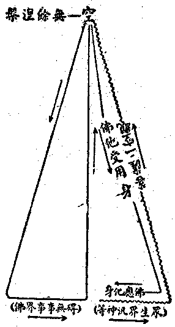

# 略評新唯識論
（1932 年 12 月，在廈門作）

賢首初列玄奘三藏譯場，以意趣不合退出，別弘杜順、智儼所傳華嚴法界觀，乃成賢首宗學。熊君十力，初從支那內學院歐陽君遊，習成唯識論，旋改轍而邁進之不已，今遂有新唯識論甲境論之發表。疇昔支院師資，據唯識掊擊起信，幾將宗起信立說之賢首學之類，一蹴而踣之；余嘗作佛法總抉擇談及起信論唯識釋以明其並是各存而通攝焉。答王君恩洋質疑之後，其議因息。頃熊君之論出，本禪宗而尚宋明儒學，斟酌性、台、賢、密、孔、孟、老、莊、而隱摭及數論、進化論、刱化論之義，殆成一新賢首學；對於護法、窺基之唯識學亦有一蹴而踣之概。馬君一浮序云：『足使生肇斂手而咨嗟，奘基撟舌而不下』，其所懷可知矣。雖然，護、窺之學，果因是踣歟？觀昔支院師資未能踣起信，則知熊論亦決不能踣唯識！蓋仍一「並是各存」之局，而須再為通攝焉耳。

余宗佛法全體而不主一宗一學，其義見於四現實輪：曰現變實事；曰現事實性；曰現性實覺；曰現覺實變。嘗題現實主義以發表其序論。然以名濫世俗所云之現實主義，今後將易題真現實論，再繼續發揮其本論與支論。故余昔評支院師資之掊擊起信，今評熊論之掊擊唯識，皆宗佛法全體立言，非主一宗一學而建義。唯是熊君纔出境論，其量論既未刊發，即不能盡知其意趣；故今亦祇就大端略評之，未暇詳焉。

茲為省構思起見，援引民十二所作佛法總抉擇談數則，以為推論之端緒：

大乘佛法，皆圓說三性而無不周盡者也。但其施設言教，所依托、所宗尚之點，則不無偏勝於三性之一者。析之，即成三類：

一者、偏依托遍計執性而施設言教者，多破鮮立，以遣蕩一切遍計執盡，即得證圓成實而了依他起故。此以中觀等論為其代表，所宗尚則在「一切法智都無得」，即此宗所云「無得正觀」，亦即「摩訶般若」。而其教以能「勵行趣證」為最勝用。二者、偏依托依他起性而施設言教者，有破有立，以若能將一切依他起如實明了者，則遍計執自遣而圓成實自證故。此以唯識等論為代表，所宗尚則在「一切法皆唯識現」。而其教以能「資解發行」為最勝用。三者、偏依托圓成實性而施設言教者，多立鮮破，以開示果地證得之圓成實令起信，策發因地信及之圓成實使求證，則遍計執自然遠離，而依他起自然了達故。此以起信等論為其代表，所宗尚則在「一切法皆即真如」。而其教以能「起信求證」為最勝用。

此三宗，雖皆統一切法無遺，然以方便施設言教，則於所托三性各有擴大縮小之異：

般若宗最擴大遍計執性而縮小餘二性，凡名想之所及皆攝入遍計執；唯以絕言無得為依他起、圓成實故；故此宗說三性，遍計固遍計，依他、圓成亦屬在遍計也。唯識宗最擴大依他起性而縮小餘二性，以佛果無漏事用及遍計執之能遍計者，皆攝入依他起；唯以由能遍計而執之所執為遍計執，及唯以無為理為真如故；故此宗說三性，依他固依他，遍計、圓成亦屬在依他也。真如宗最擴大圓成實而縮小餘二性，以有為無漏及離執遍計，皆攝入於圓成實為真如體、相、用大；唯以無明雜染法為依他、遍計故；故此宗說三性，圓成固圓成，遍計、依他亦屬在圓成也。

依此以觀熊論（指新唯識論，下皆同此），所謂：『今造此論，為欲悟諸究玄學者，令知實體非是離自心外在境界，及非知識所行境界，唯是反求實證相應故』。即知其論屬真如宗，以彼所計「實體」，即指「真如性」故，宗在直明直證真如性故。熊論所宗既別，亦自得成立其說；然襲用「唯識論」為題，且據其自宗以非斥別有其宗之護、窺諸師唯識學，則殊不應理矣！

余謂三宗之學於三性各有其擴大與縮小，語殊關要；而其擴縮之爭點，尤在心法。誠以「心」為萬化中樞，必奪歸於所擴充之性，而後乃能據之以統持一切。故般若宗必奪歸遍計執性內，五法、三自性皆非，八識、二無我俱遣，而後乃無智亦無得；唯識宗必奪歸依他起性內，了境、造業、持種、轉變皆屬之，而後成一切所知之依；真如宗必奪歸圓成實性內，故起信云：『唯是一心名為真如』。熊論亦云：『是故體萬物而不遺者，即唯此心，見心乃云見體』。不如此，則不顯偏勝之相，亦不成宗別矣。然未真達離言自性而見此等施設皆唯假說自性者，則每唯自宗為是，而於他宗不善容察，由是相伐。

熊論以心以智以功能攝歸真如實性，即楞嚴所謂『本如來藏妙真如性』，若以此立其自宗，固無不合。然既許有染淨中容諸心所有法以為習氣，現前身心器物皆習氣俱行；且許佛果不斷淨習，不唯不斷，且須藉淨習增盛以成以顯。如云：

為己之學，無事於性，有事於習，增養淨習始顯性能；極有為乃見無為，盡人事乃合天德，習之為功大矣哉！

夫習氣千條萬緒，儲積而不散，繁賾而不亂。

然習氣潛伏而為吾人所恆不自覺者，則亦不妨假說為種子也。即此無量種子，各有恆性，又各以氣類相從，以功用相需，而形成許多不同之聯系；即此許多不同之聯系，更互相依持，自不期而具有統一之形式。古大乘師所謂「賴耶」「末那」，或即緣此假立。

原夫八識之談，大乘初興，便已首唱，本不始於無著。但其為說，以識與諸法平列，語幻相即均不無，語自性畢竟皆空。逮於無著，始成第八識，引世親捨小入大，此為接引初機。

唯識為言，但遮外境，不謂境無。以境與識同體不離，故言唯識。唯者，殊特義，非唯獨意。識能了境，力用殊特，說識名唯，義亦攝境。豈言唯識，便謂境無？

據此諸言，護、窺唯識學便足成立。故唯識論即唯習論，亦唯行論，無事於性，唯事於習故。種姓有無，據行性辨故。且據熊論，豈但唯識學立，即空慧學亦立。例云：

慧者分別事物故，經驗起故。

世間談體，大氐向外尋求，各任彼慧，構畫搏量，虛妄安立，此大惑也。

慧唯分別境事，故恃慧者，恆執物而迷失其固有之智，即無由證知真理；若能反求諸自性智而勿失之，則貞明遍照，不由擬議，雖復順俗差別而封畛不存，種性玄同而萬物咸序，此真智之境，非小慧之所行矣。

由慧有執，復資慧發解引智而斷執，不唯世人實際生活不能不有用於慧——此所云慧，皆姑順熊論定義，而較般若為狹——，即聖人化世，乃至熊君著論，亦仍有藉於慧。則唯執論——唯執故一切皆空——，唯慧論——乃至破慧亦是慧故——，或畢竟廢除主觀心意識了而唱唯境論，亦皆成立。由此三宗各有論據與立場，互不相奪而盡，遂成「各存而互容相攝」之局。對觀以定其名界，應為下列三系：


```
　　　　　　　┌唯性論………或唯實論
　　　　第一系┤唯習論………或唯幻論
　　　　　　　└唯執論………或唯妄論
　　　　　　　┌唯智論
　　　　第二系┤唯識論………識為慧智共依
　　　　　　　└唯慧論………或空慧論空觀論
　　　　　　　┌唯心論………依熊論心統體義
　　　　第三系┤唯行論………行發於心而達於境
　　　　　　　└唯境論………心空或心無義
```


由此、可見熊論襲名唯識之未當，而欲斥除護、基唯識學，尤唐勞無效矣！

然佛法大乘之說，孰為至真極成，應定於一而正信解，安用三宗並存而談容攝耶？此以各有勝用，宜所被機故。是以余在佛法總抉擇談中有云：

然此三宗，雖各有當，若從策發觀行而伏斷妄執以言之，應以般若宗為最適；譬建都要塞，而便於攘外安內故。若從建立學理而印持勝解以言之，應以唯識宗為最適；譬建都中部，而便於交通照應故。若從決定信願而直趣果覺以言之，應以真如宗為最適；譬建都高處，而便於瞻望趨向故。要之，「教」以真如宗為最高，而「教所成益」每為最下，以茍非深智上根者，往往僅藉以仰信果德故；於「教」於般若宗為最下，而「教所成益」卻為最高，以若能絕慮忘言者，必成妙觀而發真智故，於「教」以唯識宗為處中，而「教所成益」亦為處中，以如實了解唯識相性者，雖或進未行證，而必非僅能仰信故。

此中般若宗為地前「破執」之教，故為最下；唯識宗乃初地以上「後得智境」之教，故為處中；真如宗為八地至佛「法界智境」之教，故為最上。然般若教破相顯性，由加行入真見，益成入地故高；唯識教資發初信入大乘者之勝解勝行，益在由十信而十住十行十向故中；真如教除極少頓證者，大氐皆依以欣慕崇仰，而為彷彿恍惚之揣摩耳。

熊論譏無著始成第八識，引世親捨小入大，此為接引初機；不知此正是唯識教之不可已處。今世科哲學每近小乘論執，則引之亦正須此。而世親晚歲展轉昇進加行，臨入初地，依無著之教，作三十論以資益信解行人，胡可非議！而護法傳為賢劫千佛之一，觀其於無可建立處而熾然施設建立，非名言安足處而秩然決定安置，自非慈氏之流，等覺之儔，殆不能作此大不可思議事！反觀熊論雖託本宗門曰：『夫最上了義，諸佛實證，吾亦印持』。究其語旨，亦推闡如來藏不變隨緣隨緣不變之說耳。而復推尊大易，傅合儒言，貌似頓證，實纔欣仰而已。

余昔嘗作大乘之革命云：

佛法之於眾生，有因循者，人天乘是；有半因循半革命者，聲聞乘、緣覺乘是；而大乘則唯是革命而非因循。故大乘法粗觀之，似與世間政教學術諸善法相同；細按之，大乘法乃經過重重革命，達於革命澈底之後——謂大涅槃——，遂成為法界事事無礙；其革命之工具，即二空觀是也。事事無礙法界，似近於吠檀多等汎神教，及孔、老等生命派玄學，但其根本不同之點，即大乘之事事無礙，是已經過二空觀之澈底革命而離染純淨者；彼汎神教等未經過二空觀之澈底革命，故非清淨，而祇是眾生之雜染心境。可以圖式表示如下：




般若心經云：菩薩依般若——即二空觀——故，究竟涅槃；諸佛依般若故，得阿耨多羅三藐三菩提——即事事無礙法界——，亦明斯義。此圖曲線表雜染生死法，直線表清淨常住法。故修學大乘者，必以二空觀之革命貫澈之，不能茍安圖便，妄想從眾生界橫達佛界之事事無礙；以未經二空觀之澈底空淨，終等于汎神耳。學華嚴、真言者，未經過二空之澈底革命，亦不能達真實之事事無礙界。故華嚴須由理法界觀——即二空觀——經理事無礙法界觀，然後事事無礙；真言亦須阿——即本空義——字為根本觀也。

夫儒、道、莊、易之學，與佛法界之懸別如是其遠，而熊論掍而類之。余前謂『真如宗之教所成益每為最下』，不彌信歟！昔評梁君漱溟東西文化及其哲學云：

梁君以生活意欲之向外求增進，說明西洋古代及近代之文化；處中求調適，說明中華之文化；向內求解脫，說明印度之文化，但言人世，雖覺甚當，統觀法界，殊不謂然！今另為表如下：


```
　　　　　　　　　　　┌向前求進的……西洋文化
　　　　思議的障礙生活┤因循安茍的……中華文化
　　　　　　　　　　　└根本解除的……印度文化及三乘共法
　　　　　　　　　　　　　　　　　　　┌分證的……菩薩法界
　　　　不思議的無障礙生活──大乘佛法┤
　　　　　　　　　　　　　　　　　　　└滿證的……佛法界
```


梁君以現量、直覺、理智三種為知識之根源，蓋即現量、非量、比量之三量也。然非量原以指似現量、似比量者，梁君似專指似現量言。且直覺非不美之辭，在凡情之直覺雖屬非量，而聖智之直覺亦不違真現量、真比量，故成為無得不思議之任運無障礙法界智。另為表如下：


```
　　　　　　┌似現量┐
　　　　　　│　　　├直覺──非量
　　　　　　│似比量┘
　　　　凡情┤
　　　　　　│真比量──理智─────────┐
　　　　　　└真現量──感覺───┐　　　　　│
　　　　　　　　　　┌真智────┼─現量　　│
　　　　　　┌自證智┤　　　　┌─┘　　　　　│
　　　　聖智┤　　　└俗智══┴───直覺─┐│　　聖凡之智賴
　　　　　　└悟他智────────────┴┴比量
　　　　　　　　　　　　　　　　　　　　　　　　　　此比量以通
```


梁君以西洋文化是直覺運用理智的；中華文化是理智運用直覺的。所云直覺皆專指似現量言，換言之，直覺境即「俱生我法二執之心境」也。又言：「佛法是現量運用比量的，或比量運用現量的」。由余觀之，當言佛法是由聖智的比量排除非量的凡情直覺，獲真現量；起不思議無障礙法界之直覺而運用比量的。所云起不思議無障礙法界的直覺者，即示現他受用身土及應化身土也。

熊論不用聖比量以排除非量的凡情直覺，而反引凡情直覺以排除聖比量，又適成顛倒矣。

由此、熊論之排斥護、窺學，每成自語矛盾。夫既自許『毋妨於無可建立處而假有施設，即於非名言安立處而強設名言』，則護、窺之施設安立諸識、諸心所、諸分、諸種，孰不謂於第一義皆假非實者？成唯識論曰：

若執唯識真實有者，亦同法執！

真勝義中心言絕故，如伽陀說：心意識八種，俗故相有別，真故相無別，相所相無故。

論有誠言，何得誹同『宇宙實體，將為分子之集聚，適成機械論』耶？熊論殆未知其說種、說現、說八識、說心所、說諸分，皆為說緣生幻相而非言實體，而實體則顯於言外；此猶烘雲托月，但畫雲而不畫月，原異於熊論直斥實體之但畫月。熊論謂：『舊師分析心識，歸之眾多種子，一如分析物質為極微或分子、原子以至電子者然』；抑若忘其皆為說緣生幻相，而故誣執為實體，抑何傎歟！且熊論他處自許率爾等五心聚集顯現以說識起緣境，不又自墮於極端多元論或集聚論、機械論耶？顧乃以識轉勢用迅疾，不可思議，以『夫唯滯於名言，則疑動而無靜；若使會其玄極，斯悟靜非屏動』，巧自解免。然則護法、窺基奚獨必滯名言不會玄極耶？奚以見其獨非勢用迅疾，不可思議，非一非異，不即不離，即多而常一，即分而常全耶？至若以多元機械——以其執最後許多單元之各自有實體——目唯識而起斥難，而唯識學之諸識諸法以至諸種，究其澈底，莫非緣生無自性之幻相，斯正一即一切攝涉重重而空靈活妙之極者，寧曰多元機械？反之，執『心為渾然不可分之全體』，『為吾一身之主宰』者，已墮神我論；『體萬物而無不在』，又墮汎神論；則為他人作瘡而挖自身之肉矣！

熊論痛言護師掍功能習氣為謬。夫用名定義，各有其權，余斥熊論不應題唯識，以據熊論在直明實體，不在依幻習識用而彰相性之故。至護師之說功能種習，自有定義，安得以熊論實性功能，遮護師種習功能？抑熊論他處亦說習種功用相需，「功能」「功用」為別幾何？又熊論既謗無著以來「性決定」、「引自果」之種子義；他處又自許『即此無量種子各有恆性』。既自說『唯者殊特義，非唯獨義，識能了境，力用殊特』；他處又謗『世親造百法等論並三十頌，遂乃建立唯識，而以一切法皆不離識為宗，唯之為言，顯其特殊，是既成立識法非空』。凡此一論，前後種種相差，取捨任情，是非違理！

或謂熊論但許習氣假說為種，而於習氣又唯許為心所，此則八識及識各有自種，終非所許。況護法唯識義，認心心所各別有自證體，見相各別種生，寧得成立？然熊論既許『又各以氣類相從，以功用相需，而形成許多不同之聯系；即此許多不同之聯系，更互相依持、自不期而具有統一之形式，古大乘師所謂「賴耶」「末那」，或即緣此假立。小乘有所謂「細識」者，亦與此相當』。是即許立矣。夫六識聚，一切佛法所同立，七識依意根立，八識依各有情各有前後經驗之統持力而立；且依根、依境、依心所相應、依能所薰習異故，雖說八聚非一，但亦不說定異。經說八識如水波等無差別故；定異應非因果性故；如幻事等無定性故；諸心心所依相見分說自證體差別，而自證體唯現量離言故，別不可及。安慧唯自證體，當可由此進明心體，故唯識觀遣虛存實，但遣妄執外境；捨濫留純，始唯心心所而無境；攝末歸本，始無相見而唯自證；隱劣彰勝，始無心所而唯識存；遣相證性，乃無識相而唯識性。若至遣相證性，遣相即般若，證性即真如；而前四級接引之梯，正其善巧方便。相傳戒賢、智光，有空各判三時。依大慈恩傳，智光為戒賢弟子，然戒賢寂後，智光或轉崇中觀耳。法性、法相，依證依教，則性前而相後：非不證真如而能了諸行，猶如幻事等，雖有而非實故。依行依觀，則相前而性後：唯識觀印所取空，般若觀印二取空故，智光三時依觀行判，戒賢三時依教證判，義各攸當，隨用無諍。

由此、古唯識義安立無動，退察熊論反多過咎。蓋一真法界心言絕故，出世間智不思議故，華嚴、法華、涅槃、淨土諸經，寄之詠歎，欲示輪廓，使生欣向；而真言之秘密，則微露於威儀聲音光色香味之事；楞嚴、起信稍有開發；禪宗則激之反究令自悟而已，終不以「名理」示之。龍樹、無著皆真覺中人，乃一以遮詮空執情，一以假說表幻事，雖熾言而皆導悟真於言外，斯其所以為善巧矣。天台、賢首爭立圓教；日密橫分二教，豎判十心——藏密於教理唯宗龍樹、無著，故無增立——；賢首尤恣談玄境，斯既滯於言解，反成鈍置。昔著曹溪禪之新擊節，有云：

然自達磨以逮曹溪，雖別傳之心宗實超教外，而悟他之法要不離經量。……故達磨、慧可授受楞伽，黃梅、曹溪弘演金剛。夫楞伽乃大乘妙有法輪之天樞，而金剛亦大乘真空法輪之斗杓。洪源遙流，酌之不改初味；雪山寶林，湛焉有如新瀉。每讀信心之銘，證道之歌，觀般若、瑜伽諸經論，輒覺煥然融釋，妙洽無痕！惟後時宗徒既混入知解——荷澤等宗徒——，而教徒亦強挺荊榛——，四教先亂般若，五教尤亂瑜伽——，江西、石頭以下諸師，或由旁敲側擊使親悟，或由電驟雷轟令頓契，然皆要期自證，不為語通，絕言思之妙心，終不用父母所生口為說。故曰：「若能不觸當今諱，也勝前朝斷舌才」；雖易臨機之用，不失教外之傳。……曹溪曰：『吾有一物，無頭無尾，無名無字，無背無面，問諸人還識否』？纔被神會喚作本源佛性，即呵之為「知解宗徒」。以說一切法雖不離這個，而這個終不能言陳出之，神會名作本源佛性，以為「假智詮」可得之，遂滯於名相知解中而失教外之傳。此與賢首等之知解教徒，以諸美妙言辭，種種形容繪畫絕言思之一真法界，自謂超越先哲，能言龍樹、世親所不能言，殊不知先哲豈不能言哉！特以實非言思之所及耳。雖構種種形容繪畫之說，徒益名想之影，反障證悟之門，故曹溪力呵之。有曹溪力呵之，故雖有神會等知解宗徒而宗風仍暢。慈恩等於知解教徒未力呵斥，故龍樹、無著之教輪輟。

由此以觀熊論以轉變，變，恆轉，翕闢，剎那不住，八義，非動義，活義之無作者義、幻有義、真實義、圓滿義、交遍義、無盡義、不可思議義、及功能即實性非因緣義，一切人物之統體非各別義，與習氣非一義——即活力義——唯無漏義，不斷義，舉轉變、恆轉、功能諸名，以能斥實性真體自居，其視華嚴六相、十玄能上之歟？縱能上之，亦徒障悟門耳。此其探頭太過者！而不及者，一切有為皆緣生法，則心識亦緣生法，皆無自性，其義先明。而復說唯識，在統緣生而轉染成淨，乃不依無始『許多不同之聯系，更互相依持，自不期而具有統一』之賴耶，末那施設有情界，則生死流轉義不成，而涅槃還滅義亦失！乃曰：『夫云有情業力，不隨形盡，理亦或然』。付之或然，則不免斷見！而別言宇宙生生不容已之大流，則類「耶和華」、「大梵」一神之常見，此其於有情相續之未能充分說明也。以恆轉翕闢之變，成色成心，酌「太極兩儀」與柏格森「生命衝動張弛」及天演「元氣抵吸」之流，聊成一說：較之於「一切種起一切現」，「一切現薰一切種」，「薰起無始」，「依變無始」、「依我執習氣成自他別」，「依有支習氣成界趣別」，尤不啻處幽壤而望朗霄歟！

然余許熊論不失為真如宗之屬，以其提撕向上，主反求實證相應，鞭辟入裏，切近宗門，亦正為義學昌熾中之要著。抑其所謂：『護公持論，條理繁密，人鬢魚网，猶不足方物。審其分析排比，鉤心鬥角，可謂極思議之能事。治其說者，非茫無頭緒，即玩弄於紛繁之名相，而莫控維綱；縱深入其阻，又不易破陣而遊』。其言亦頗中學者時弊。余亦嘗以「惡取法相」呵之！余之序慈宗三要亦云：

世親大師嘗集境行果為三十頌，迴施有情，護法諸師解之，大義微言燦然矣，是曰成唯識論。第明境繁細難了，而制行期果又非急切能致，慧粗者畏焉；或耽玩其名句，味樂以妄疲，不覺老至，造修趣證者卒鮮！熊君斯言，乃有同感。故余觀境尚大論真實義，即矯此弊也。

比年遊目佛法藏者日多，往往因智起愚，自生顛倒分別以蔽其明。蓋其心習側重於是，即落窠臼，執此為是，斥餘為非，不能砉然四解，說法無礙。得吾說以通之，庶幾裂疑網於重重！

此余作佛法總抉擇談之尾語也。今略評熊論，請還持斯語以贈之。二一、一二、二八、寫於廈門兜率陀院。

作略評新唯識論旬有餘日，獲閱劉君定權之破新唯識論，破之固當矣。歐陽居士序之，深致慨熊君十力之毀棄聖言量。然履霜堅冰至，其由來者漸！夫起信與楞嚴等，殆為中國佛教唐以來相承之最高聖言，居士雖未獲融貫會通，而判為「引小入大之不了義」說，猶未失為方便；乃其門人王君等，撥而外之，居士陰許而不呵止。殊不知即此便開毀棄聖言之漸！迫令千百年來相承起信、楞嚴學者，亦敢為遮撥法相唯識，彷彿中論，依傍禪錄，奚有瞽僧狂士，攻訐窺基、護法而侵及世親、無著。今劉君猶曰：『除起信論偽書外』，居士亦未揀除，徒責熊君之棄聖言，所謂「有知人之智而無自知之明」歟！

二十二年一月九日太虛附識。

（見海刊十四卷一期）

