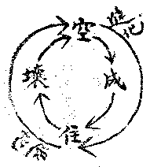

# 論世界史綱

華譯世界史綱，文筆生動，趣味盎溢，頗能引人閱之終卷！且原著者英人韋爾斯，可謂已能超脫英吉利之國拘，而為一歐洲人，或合全歐、全美及西亞、埃及的西方人。然亦以其未能為全球的世界人，故令南亞之印度人閱之，已不能滿意；而在東亞之中國、日本人閱之，尤難滿意；然南亞、東亞實佔地球人類之半也。復以其為赫胥黎弟子而是進化教之信徒也，字裏行間，皆以從天體地球以至人類之進化教義貫注之，亦非有更宏偉之思想者所全許。然得此全歐、全美及西亞、埃及為立場之進化教信徒所示之世界史觀念，已足為拘一隅、篤一時的史家中之佼佼者矣！

使能擴充「有始進化」說為「無始進化」說，更根據現實主義而現實現世界為立場者，必將更有公平正確之史眼，以洞照乎上下古今而表示吾人也。其法應剖三史：曰人文史、曰地質史、曰天體史。以現今實際之人物地球星系天空為立足點，從作史之年逆推而上，曰史前一年十年百年千年等以為紀——真正世界史，必廢基督教紀元——，蓋吾人於歷史之觀察，亦當以空間觀察之由近而遠也。先廣搜地球人類一切文語傳記，旁參現存之古物古剎為材料，細心推析，以忠實之純客觀，察果求因，以敘其後先之變嬗，上推至無復文語傳記可得而止——約六千餘載——，曰人文史。從是石器巖層，更上推之曰地質史。遠至地球由日裂生與各星及天空中無數恆星系，且觀此太陽系未成以前，此處為一空洞無物之以太電子界，曰天體史。於是為察因求果之推斷，結論今此地球人類之果，由若何演成；并預言今後之人物地球當若何，以至今後此一太陽系終當壞滅，再為空洞無物之以太電子果。且天空中無數之恆星系，皆為壞空成住之恆轉，而進化實為由空而成，由成而住之一期現象。且地球人類今固猶在進化期中者，但由住而壞，由壞而住，則為退化焉。其式如下：

然著者未能為全球人類之史觀，姑就其敘西方史與中國史比觀之，即可瞭然矣。夫中國孔子刪訂之六經，雖不必有往昔中國人視同江河行地、日月經天之觀念，然最少與希伯來諸先知編成舊約，當可等量齊觀；且由六經而引生先秦諸子之學派，其價值或亦有過於舊約之引生耶穌以後之希伯來文化者。又由佛教傳入中國後，中、印兩文明接觸而產生之唐、宋、元、明、清儒學，曾管轄中國人思想數百年，且曾同化蒙古民族之一部，及日本、朝鮮、安南等，較之由希臘、埃及兩文明所孕生之亞歷山大里亞之科學與宗教，似亦無何愧色。乃著者於有關於西方史者，則皆各為專章以詳述之；於此屬於中國史者，則僅於敘佛教時略及孔老，與敘耶教時略及墨而已，唐、宋來之儒學，則且無一言提及也。凡是豈不以其未嘗有何影響，當於西方而忽略之乎？殊不知其曾影響於東方人類之眾，在地球上實相伯仲也。

又著者疑中國民族曾經漢、唐等之盛世，何以不能產生科學及發達工商業，其答案僅謂屬於中國之文字不便，或印刷術未進步之所致。夫紙及印刷，固中國最先發明者也，即使文字不便而印刷術未進步，設有發明科學之精神，則改良而進步之，亦為易易；然則其故之別有在可知矣。且中國先秦諸子，若名家、墨家，與後期儒家之荀況等，固已有科學及機器之萌芽；然漢、唐時竟不能產生科學與發達工商者，則漢以來中國重道與重本之精神阻之耳。唯其重道而以天算、理化、博物等為藝而輕之也，故祇能產生漢、清之經學，六朝、三唐之文學，宋、明之道學，而不能產生科學也。唯其重農業為本而以工、商為末務而輕之也，故全國國民皆志為各有若干小田產之農業者，而不能經營大工業、大商業也。夫道生則藝興，本立則末長，但應為先後之序而不應為輕重之別。唯其輕蔑而狹之也，於是所謂道者空疏而無科學之用，而所謂農業之本，亦枯窳而不能立，致工商等枝葉亦不能發榮滋長也。凡此在中國本皆易見，而著者不知，故可為西方人之眼光而已。然其于印度似較中國人所知者為多，故今置餘事，一論其關於言佛教者。

著者稱佛為自古迄今最銳利理智之成功者。謂佛教教義要點，在明人生一切苦惱皆起於私心之貪慾：一、為滿足肉體之貪慾；二、為求不大公無我；於是乃達更高之智慧而得涅槃。涅槃者，心境恬靜之謂也；人或誤會以涅槃為絕滅，不知此但指個人為私我而使生活卑污且可憐可怖之惡絕滅耳。又謂佛陀關於生活之道，曰八正道：一、正見，以嚴格考驗一心求真為求學之第一步，世俗迷信不可有也。次曰正欲，私貪既擯，必有服務人類及求公理之正欲繼之；最初未腐敗之佛教，不以絕欲為目的，而以換為正欲為事，從事於科學或藝術及改良世事皆合佛旨，惟不可與嫉妒好名心羼雜耳。正語、正行、正業、無庸解釋。六曰，正精進，謂於善的意向及不善的應用不假以寬容也。七曰、正念，於所為或未為之事，常防範個人感覺或虛榮心等使不得近。最末曰正定，以防信仰者精神之迷，如敬神者之虛驕也。雖著者拘於一神教及進化教之心習，於佛教「無始恆轉」之勝義未能考求，且多誤解，然其說「離貪涅槃」及「八正道」，頗得其真而足藥中國佛徒之病。中國佛徒惟古禪宗能得「離貪涅槃」之恬靜心境，然八正道已不能充分行之，故明體而不達用，未能化被人類。至其餘則大都本源不清而末流猥妄者耳。今欲有傳佛心印之真僧寶——僧伽和合眾，乃專行佛訓者之團體名稱，世人誤以奉神傳教者稱曰僧侶，謬甚！彼奉神傳教者，應正名曰「神逋」耳——，非從離三貪、行八正求之不可。

又著者敘阿育王之行佛教也，曰「阿育王有才能以和平治國，彼非徒以迷溺於迷信也，於其唯一戰爭之年，遂入佛教團體為一「信徒」，數年後始從事八正道以求得涅槃。此種生活於彼一生事業之如何完全適宜，可於其生平功業見之。正欲、正精進、正業乃特表功業，彼大興掘井之業於印度，且種樹以取蔭，彼任官以理慈善之事業，立醫院及公園，又專設藥圃；若有一亞理斯多德以響導之者，彼必大鼓勵科學研究無疑。彼設專官以理土番及藩民，又設女子教育，彼教育其人民使於生活之目的及方法有一定見解，在歷史中可謂第一人矣。彼大施惠於佛教教學團體，且鼓勵之使於佛教文學益加研究，國中皆樹立碑刻以載瞿曇之教訓；所敘者皆簡單近人情之教訓，而非後世乖謬之舖張。其刻鐫物之存至今日者，尚有三十五件。此外復廣派教士，以播佛教於世界，至罽賓、至錫蘭、至塞琉卡王朝、至托密勒王朝。阿育王為人類之真需要服務者二十八年，歷史上千千萬萬帝王名表中，阿育王之名乃照耀如明星。自倭爾加河以至日本，其名至今受敬禮。中國、西藏及已捨其教義之印度，尚保存其偉大之遺傳。今世之人紀念之者，其數遠過紀念君士坦丁及查理曼也」。嗚呼！若阿育者，真「在家佛徒」之模範也！吾所欲設之佛教正信會之領袖也，吾十年來蓋馨香之心誠求之矣。然中國一般據高位之在家佛徒，但熒惑顛倒於個人生前死後鬼神禍福之迷信，對於正道以利人群者胥無能焉，視此能無慚愧乎！

吾閱世界史綱既終，於其書之第四章所謂歷史之下一幕者，深表同情也。蓋吾固認現實之地球人物尚在進化期中矣。其描寫人類將來之生活也，曰人類對於動物界將另生一種新興趣。在現代混亂失度之日，動物當遭失度之殘害，其悲慘蓋較人類之痛苦為尤甚。在十九世紀中，動物之因此而絕種者以數十計，有多種極饒趣味者，已無噍類矣。將來有力之世界國家實現後，其首先生產之佳果，殆將使今日所謂野獸者，得較良之保護。吾人試一觀察人類史，則銅器時代之人民，已能馴養野獸，利用野獸使為人類之伴侶，而欣賞其生活矣。然此事至今竟無何等進步，誠可異也！吾人現在所謂行獵之遊戲，蓋初民殘暴天性中所表出之無謂殺傷，將來在教育進步之世界團體中，人類必將改變其對待野獸之態度。不樂其死而快其生，不視此等可憐同類之低級生物為可畏可敵可恨之仇，亦不役之為奴隸，而用種種奇妙之計劃使之為人類之友侶焉。偉哉！韋爾斯之心量！幾等於以一切眾生為同類之佛矣。但佛則更須將各宗教所奉之神——若基督教之上帝——，亦視為眾生之一而為吾人之友侶；如此、則韋爾斯之心量，可更由基督教及進化教之拘囚中釋放而出，而實現宇宙之人生矣！然此非一般盲目而吃蔬放生之迷信佛徒所知，吾欲得遠慮宏識之士若韋爾斯者以為之言耳。

（見海刊九卷一期）

