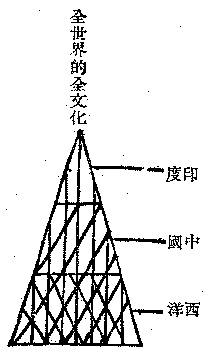

# 評社會學與三種知識

楊續元君述德國現代的社會學，可稱為文化社會學，但主要的學派，有宗教社會學、知識社會學、歷史社會學等等；但其中以知識社會學尤有觀察世界文化的眼光。這種社會學以知識論為出發點，據說十二世紀以後勃興起來的西洋人，自然科學知識，祇是一種認識自然而征服自然的技術，此則為實證主義或實用主義之知識。但是知識不限於實用的一種，此外尚有教養的知識及解脫的知識；前者如中國及希臘支配階級的知識，後者如印度佛教的知識。

近世西洋學者與各國學者之沉醉於西洋學風的，大抵皆已不知有教養的——或修養——及解脫的知識類型存在。故祇認實證或實用的知識為知識，而排斥教養的及解脫的知識為非知識；此為近世學者一般共同的偏蔽。乃德國的知識社會學者，獨具隻眼，知道於近代西洋的實用知識外，尚有教養的與解脫的知識，此種知識與實用知識有同等的或更高的價值，不可不謂西洋思想界的一大革新。

但這三種知識的開展，即為西洋與中國及印度的三種文化。必這三種文化之合一，乃能成為世界圓滿的文化，如物質、生命、心靈之合一，乃成為一完全的人格一般。故不應互相排斥，而應由互相認清以成和合。其層次與關係，表現如下圖：

下中層為中上層所依，但下中層不能包含及支配中上層，而中上層反能包含及支配下中層。

（見海刊十一卷八期）

