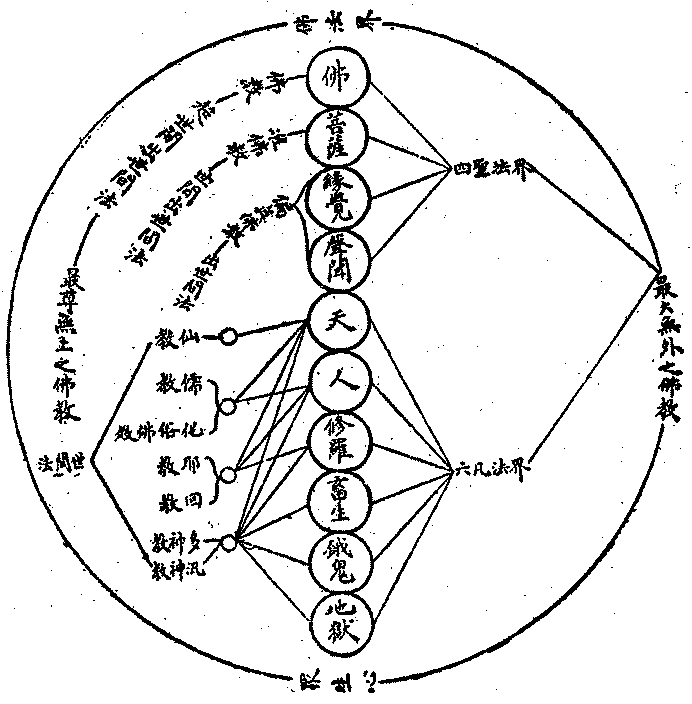

# 二　宗教上之佛教觀

甲、分別觀1.宗教上之緣起，三：一、人人皆有離苦惱而得安樂，免死亡而獲常存，轉濁惡而成淨善，了諸法而明真性之本懷。二、眾生自無始以來，有二種障：一、無明障；二、煩惱障。吾人既有前之本懷，復為二障所障，不能通達，遂生妄見而執妄法。三、有釋迦牟尼佛大覺聖人出世，斷除二障，得遂本懷。本其身之所崇，教示吾人以三界惟心、萬法惟識、一切法因緣生之一實相印印定諸法，令吾人了悟無常、苦、空、無我，得達其常樂我淨之目的，遂有「心佛眾生三無差別」之佛教——唯一正教起。

2.宗教上之要素，五：一曰信仰，他教有三：一、如信有天神上帝為宇宙唯一真宰等。二、如信世界萬物、皆天上唯一帝主所造等。三、如信善惡苦樂罪福唯由上帝命令所支配等。佛教亦有三：一、實——體——佛，信一切法唯心，心真如覺性即佛。二、德——相——法，信一切法因緣生，諸法實相不可思議。三、能——用——僧，信因果不昧，緣起無盡，十方三世利益有情。

二曰心神，心神之界說者，他教則為鬼神：如世俗傳說人之形軀死亡後，其心魂精魄或為鬼為神之類。天神：如婆羅門教、耶穌教、天主教、回回教等，不悟即心自性之真如體用，謂為天上之唯一真性等。靈魂：婆羅門教於三世輪迴執靈魂說，耶穌教於人心死後執靈魂說。佛教則為心性：萬物唯心，心本覺性，即如來藏妙真如性。心神之理論者，他教之有神者三：多神則拜動物、拜山川草木、拜門堂井灶等。一神則祠天主、祠上帝、祠大梵天、祠摩醯首羅天。神汎則以現存之萬有皆神，觀宇宙之閎渺悠久生寅畏心，於宇宙之真體生渴慕心等，皆謂之汎神教。無神者，如虛無斷滅論等。佛教則宇宙惟心，物我無性，直指人心見性成佛。

三曰因果：因果無謬，罪福不亡，固宗教實踐上一重要義。他教或有現在而無過未，或有過未而無現在，或有現在未來而無過去，或雖三世而偏執一端，不識因果之真相，唯佛能圓滿證說三世之理。

四曰慈悲：凡宗教各有慈悲救世度人之義。粗觀之，孔之仁，墨之兼愛，耶之博愛，似與佛之慈悲無別。然細密察之，佛教之慈悲，有生緣慈悲、法緣慈悲、無緣慈悲之三種，他教唯有生緣慈悲之小部耳。

五曰教主：凡宗教必有現實世界上人格最偉大之教主。佛教以釋迦牟尼佛為教主，釋迦牟尼佛為五洲萬國有歷史以來第一偉大人物，其降生尊貴之族、帝王之子，其出家壯盛之年，富樂之人，其修道六年苦行、成最正覺，其救世轉大法輪、度無量眾，故曰「天上天下無如佛，十方世界亦無比，世間所有我盡見，一切無有如佛者」！

乙、圓融觀上來依分別門觀之，佛教如大海，他教如斷港；佛教如赫日，他教如爝火；佛教如雪嶽，他教如土阜；顯然有其淺深勝劣高下之異。昔雅典大哲亞里陀大德曰：「吾雖甚愛吾師柏拉圖，然不如吾愛真理」。今吾於各教教主、教義亦如是，雖汎然莫不尊愛，而一經與佛教比較，則真相所存，彰明較著，不容為各教曲掩。雖然、佛教不特其尊無上，抑其大無外也。無外、則無對絕待，無待絕對則離一切相即一切法，而若邪若正若小若大若偏若圓無不融歸佛心矣，茲更作一圖表示如下。

佛法界者，眾生心是宗極，一心教示萬法，法法絕待，唯是一心，心心圓融，遍含萬法，夫是之謂佛教。牟尼現世，天人之師，軌範行業，迺宣教戒；教戒未足發智故，聞義學以窮理；義學未足證心故，修靜慮以體真；靜慮未足悟物故，廣為無量方便法門以濟眾。夫至廣為無量方便法門以濟眾，則群眾所傳誦持續之道術，又寧有不可融歸乎佛法者哉？即如耶教崇拜宇宙唯一天主，佛亦稱三千大千世界主。又耶教謂上帝創造世界，蓋出於婆羅門教崇祀大梵天者之說，佛亦嘗自稱我即大婆羅門及大梵天。耶教不設形像，此亦佛教中之一種無相法門，金剛經所謂「若見諸相非相，即見如來」是也。舉此犖犖數端，餘可類推而知矣。要之、宗教者貴乎上得其真，下能益民。益民之道，貴乎律儀清正，心行慈善。耶教上得其真與否，雖不敢知，然能勤修乎利益生民之業，未離人天之行，異乎回教之多近修羅法，及其餘教淫、教殺、教盜諸不律儀教，以牛戒、自餓、投灰，諸苦行外道近於畜生、餓鬼、地獄者，其盛行乎世宜矣。雖然、地藏常居地獄，觀音現身餓鬼，釋迦嘗為種種畜生以行菩薩道，則三惡趣法亦何嘗非佛法乎？是故種種外教之法，入佛法中皆成佛法，但除其執，法本圓融，所謂「千流萬派無辭讓，始見歸墟佛海深」。

