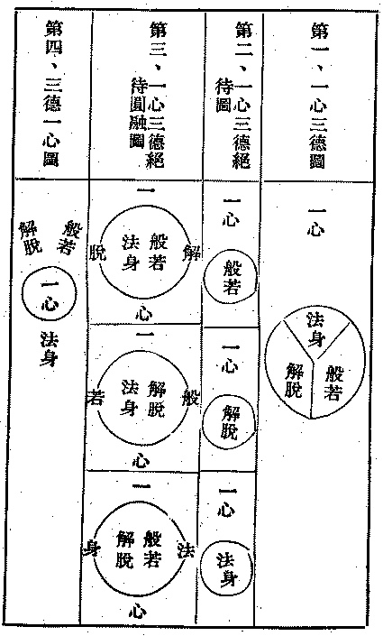

# 四　種種相之佛教觀

余初列題，本於哲學上之佛教觀後，尚有科學上之佛教觀，倫理上之佛教觀，心理上之佛教觀，政治上之佛教觀，吾人崇信佛教之必要七篇。今以時間短促，故建立人心之三德性，顯示佛法大意，演繹十種三法門以渾括說明之。


```
　　　　┌────────┬───────┬───────┬────────┐
　　　　│　　　　　　　　│　　┌文　　字│　　┌實　　智│　　┌自　　　性│
　　　　│一、人心之三性德│般若┤觀　　照│解脫┤方　　便│法身┤受　　　用│
　　　　│　　　　　　　　│　　└實　　相│　　└真　　性│　　└變　　　化│
　　　　├────────┼───────┼───────┼────────┤
　　　　│　　　　　　　　│　┌聞　　　　│　┌攝　善　法│　┌凡　　　　夫│
　　　　│二、佛教之三聖學│慧┤思　　　　│戒┤攝　眾　生│定┤聖　　　　人│
　　　　│　　　　　　　　│　└修　　　　│　└攝　律　儀│　└如　　　　來│
　　　　├────────┼───────┼───────┼────────┤
　　　　│　　　　　　　　│　　┌轉迷成悟│　　┌轉惡成善│　　┌轉苦成樂　│
　　　　│三、三轉法輪　　│初轉┤　　　　│二轉┤　　　　│三轉┤　　　　　│
　　　　│　　　　　　　　│　　└轉妄成真│　　└轉染成淨│　　└轉凡成聖　│
　　　　├────────┼───────┼───────┼────────┤
　　　　│　　　　　　　　│　　　　　　　│　　　　　　　│人佛┐　　　　　│
　　　　│四、三不二門　　│心物不二之實體│因果不二之定理│依正├不二之法界│
　　　　│　　　　　　　　│　　　　　　　│　　　　　　　│生佛┘　　　　　│
　　　　├────────┼───────┼───────┼────────┤
　　　　│　　　　　　　　│　　┌科　　學│　　┌法　　理│　　┌政　　　治│
　　　　│五、人群之要素　│學術┤　　　　│德行┤　　　　│政教┤　　　　　│
　　　　│　　　　　　　　│　　└哲　　學│　　└倫　　理│　　└宗　　　教│
　　　　├────────┼───────┼───────┼────────┤
　　　　│六、科學之三心理│知識　　　　　│感情　　　　　│意志　　　　　　│
　　　　│七、人性之三同好│真　　　　　　│善　　　　　　│美　　　　　　　│
　　　　│八、中庸之三達德│智　　　　　　│仁　　　　　　│勇　　　　　　　│
　　　　│九、學校之三育　│智　　　　　　│德　　　　　　│體　　　　　　　│
　　　　│十、國家之三權　│立法　　　　　│司法　　　　　│行政　　　　　　│
　　　　└────────┴───────┴───────┴────────┘
```


更一心三德，圖示如下：




（出東瀛采真錄）

（附註）原文無題，今依意加。

