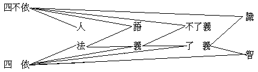

# 編閱附言五十七則

## 目錄

- 一　亞髡和尚小傳人菊作
- 二　說龍華之經營天罄
- 三　詩篇
- 四　黃金與糞土同價軼池譯自德國哲學叢報
- 五　夢世界顯勤
- 六　申唯識宗義章太炎
- 七　吶公語業陳玄嬰
- 八　支那內學院敘歐陽漸
- 九　相宗二種淺說步際桐
- 一〇法幢傳與南詢草
- 一　一意識淺說劉子通
- 一　二笠居眾生來信善因
- 一　三論釋尊應世說法之善用因明滌塵
- 一　四江西洪州無名氏來函
- 一　五心無性論大圓
- 一　六佛出家日感言佛隱
- 一　七與嚴定書了意
- 一　八唯識大旨唐大圓
- 一　九一個由耶教歸佛教之留美學生的呼籲趙慧綸
- 二〇法界學院學生上太虛法師書
- 二　一大乘種姓辨會覺
- 二　二答大定居士論性具善惡書象賢
- 二　三唯識性之研究滿智
- 二　四海潮音停刊大醒
- 二　五今日僧伽應持之態度唐大圓
- 二　六佛教與遠東民族羅珀 G. ROBERT
- 二　七勸請全國居士如律的護持三寶書藏文學院
- 二　八禪宗與密宗談玄
- 二　九暹羅留學團抵暹第一次報告悲觀等
- 三〇仁王護國般若波羅密多經頌戴季陶
- 三　一佛教之性質及其歷史惟幻譯
- 三　二業報論廣文
- 三　三我的以佛法改造自己計劃雨堃
- 三　四我怎樣信解佛法力嚴
- 三　五佛在人間力嚴
- 三　六從中國史籍中考見的緬甸佛教起源魯斯
- 三　七四依新扶擇談雨堃
- 三　八法海探珍力嚴
- 三　九王廷貴遺著
- 四〇東西物我思想之唯識批判福善
- 四　一關於護法韋馱的考証談玄、法尊、印順
- 四　三林藜光君病逝法京自強社訊
- 四　四楞伽與瑜伽系唯識學之比較研究子戇
- 四　五追懷胡五台長者楊木
- 四　六為僧伽問政而不干治進一解今覺
- 四　七對議政而不干治的我見塊然
- 四　八黃袍與袈裟佛武
- 四　九三十唯識之研究吟雪
- 五〇唯性論善因
- 五　一伍博士演講通神學
- 五　二錄日本權田雷斧大僧正函件
- 五　三致吳稚暉先生書太虛
- 五　四達磨波羅居士的死寂穎
- 五　五儒佛會勘融空
- 五　六整理僧伽制度論太虛
- 五　七從中等教育說到兒童教育寂英


## 一　亞髡和尚小傳人菊作

按：此小傳，曾揭載於客歲五月間太平洋報。一載以來，亞師主持總會事務，多所建設，眾論翕然。尚未插入此段，容俟他日補記。

編者謹識。

（見佛教月報一期）

## 二　說龍華之經營天罄

頃有署名滬濱漁隱者，以印刷物一件，曰「保存龍華寺古蹟平議」者，投寄本報。其言殆發於二年前者，於今日時勢雖不盡當，然至理名論亦多可有採者；附錄於此，以資考鏡。並乞漁隱先生以姓名住址見示焉。

太虛識。

（見佛教月報二期）

## 三　詩篇

桂林梁君自北京來函，見教之語深，佩熱心！上期詩篇，倉卒付之手民，未暇抉擇，甚以為歉！此後投稿諸君，縱有佳什而於本報宗旨不合者，概謝弗登，幸加諒原！

編者識。

（見佛教月報三期）

## 四　黃金與糞土同價軼池譯自德國哲學叢報

嗚呼！天下攘攘，皆以利往，天下熙熙，皆以利來；無古無今，無東無西，凡在人類，孰不顛倒於金錢魔王勢力之下，深中金錢萬能之迷信毒，日欲謀得多金，誇妻子、眩流俗乎！飲此一杯迷金洞之閉門羹，其亦可以返矣！

太虛附識。

（見佛教月報三期）

## 五　夢世界顯勤

予昔於太白山，長夏永晝，間尋午夢。一日欹枕片時，恍經數載，所詣至為奇異。夢中自知在夢，顧無術出夢，隨夢所趨，飄飄忽忽，不自知將何托也！久之，忽憬然寤，境界了了，自謂從夢覺矣；巳而復現糢糊狀，察知猶在夢中。如是五次，始乃真醒。雲橫青嶂，蟬噪綠楊，彼時反不敢自斷謂已從夢覺抑尤在夢。不唯彼時，迄今尚然疑之。藏鹿於隍，覆之於蕉，虛耶實耶，吾不敢必。蘧蘧則莊，栩栩則蝶，一耶二耶，吾不敢必。大三界夢鄉，眾生夢魂，能語之者眾矣，然試各反身自省，吾其參入此夢場者，抑此夢場乃從吾現者？思之，思之，則法界唯心之理，恍然自得。但尋好夢以自娛，更不必求覺也！蓋夢者夢也，非實有也，夢既非有，何有於覺哉！

（見佛教月報四期）

## 六　申唯識宗義章太炎

按：章居士此篇，所申唯識宗義，至為亮徹！故知法相法性之別，僅言教上所偏據者及建立名言方法上有其殊分，會其理極，實無二致。閱者當注意者，即「所立之義雖是，能立之語尚非」二語耳。蓋圭峰大師華嚴原人論，彼既先標華嚴為宗，就華嚴宗之自法門而說，其義自無過也。故閱原人論者，亦不以此而有障礙。至原人論破唯識宗之語，但以「夢時在自心外所取之境，絕無非有，故醒時更不能持以示人；夢時即自心中相見之識，幻有非無，故醒時非不能憶之於己」。此則原人論破唯識宗者，即可轉以成立唯識宗矣。小乘、道、儒之說，則當別論。

釋太虛識。

（見覺社叢書二期）

## 七　吶公語業陳玄嬰

慈谿陳屺懷先生，深識玄鑒，思精語妙，予識之十餘年矣。頃因君長寧波佛教孤兒院事，晤聚之日遂多。日前以吶公語業之一切有篇投我，並附以短簡云：『昧公玄覽：日間得聞法，談唯心起境之說，忽觸二十年前，初度日本，偶與一佛者強口答辯，妄有所述；少年氣盛，心執為是，遂不廢稿。今發視一過，不覺汗顏。公當痛繩其謬妄，敢奉交愛，何如，何如？（戊午十月）玄嬰合十』。予尋覽其文，則昔年嘗見於報紙而認為小乘薩婆多宗之說者也。小乘以色法及分位法為有實，遂成法執。此宗有俱舍一論，義甚優長。欲知其異於大乘唯識之義者，覈閱成唯識論前之二卷，便當了然耳。用談佛理，既可見一宗之緒論；進研唯識，亦足為餘乘之難端，亟錄之以助攻錯。

（見覺社叢書二期）

## 八　支那內學院敘歐陽漸

釋太虛曰：予方有佛教大學院之創議，忽獲讀此支那內學院敘，其聲應氣求者如是！意雖未能成就光顯於即時，大振那不久之必能有此，可預決也！邇來佛教之緇素，往往有播揚佛法以應時者，然講一經立一社，鮮有能統計其全為之規劃者。余五年前，嘗作整頓僧伽制度論，於本書一、四期曾載端緒，未窮由委，當亟刊布，為世之發意住持正法者告。覽此敘頗得概略，所不同者，此說祖宗支派、祖一宗三而支派之學開合不同。吾則上不徵五天，下不徵各地，斷於隋唐之大乘，教一宗八：教一者，釋迦文佛之教也；宗八者，天台、清涼、嘉祥、慈恩、廬山、開元、少室、南山是也，故主有八宗專學叢林也。然此雖取義有殊，而各能統計無遺則同。其更有同者，中學、大學、研究部之義同也：魔外內資，凡小佛階之義同也；在攝小乘於大乘不別立小乘之義同也；興事興學，意亦大致合一。竊冀其速得成立，故為轉載以告遐邇。

（見覺社叢書五期）

## 九　相宗二種淺說步際桐

釋太虛曰：此書余得自京師法源寺僧海蓮，有用儒言以詮發者，其語意都指歸宗門。雖間有未盡符唯識家處，儒者、禪者可由之得唯識家門徑，故略加評閱以刊之。然塗中草草，未能詳審也。

己未九月望日，識於金陵旅次。

（見覺社叢書五期）

## 一〇法幢傳與南詢草

釋太虛曰：予於京師吳璧華居士處，嘗讀法幢語錄及馬僧摩居士南詢草全文，一宿覺之後，此洵永嘉禪之白眉也！亟選錄傳一、序一、書二，以揚潛德。

（見海刊一卷五期）

## 一　一意識淺說劉子通

劉居士此篇意識淺說，其發明宣達到十分確切精審者，實是不少，而可議之點亦多。劉君先依唯識宗八個識中除去其餘七個識，專取意識；次於意識又除其細分，所劃定之範圍，至為明晰。雖劉君於意識及其餘七個識，意識粗分與意識細分，原未有何種明確分界，而所說意識之變性不變性一節，似乎已越出所劃定之粗分意識範圍外，且亦越出所說意識及所宗唯識之範圍外；而反之於粗分意識之範圍內，則所說者又嫌疏漏而不能詳盡，此欲請劉君更審思者一。其次、第六意識有不有色根為俱有依，此尚為一未易解決之大問題，此願與劉君另究論者二。以涅槃之常德，附會耶穌教所云永生之道，大謬不然！從通達佛法的人觀之，耶穌所云永生之道，不過是轉生在一種天界，其壽命較長，為庸眾知識所難測算，如蚍蜉、蟪咕之不能知人之生死，而妄念人為永生而已。又謂耶穌教禱告，與念佛有同等功效，此亦知同者之少分而未知不同者之多分也。所云同者，人之意識收集起來，專注念一物，漸漸便能凝定；而所念之物，不問其為瓦片、為兔角、為草木、為禽獸、為天帝、為佛陀也。而不同者，念佛則終引出世之果，念餘物則終不離生死流轉，若念阿彌陀佛則更有本願攝受往生之特點，此希望劉君將此種謬誤的附會刪卻者一。又如云「那相宗一心八識之說，畢竟是權宜方便之詞」，未知唯識宗各經論，原是依世俗諦說為八識的，故曰：『俗故相有別，真故相無別』。且示真如即是唯識之實性，豈非即是真心、佛性！第唯識宗書，說有次第，不如他宗言無倫次耳！何得蔑視相宗為權宜方便之詞，而別抬高他宗，疑誤後學！此希望劉君將唯識宗書再詳審研究者一。復次、唯識之理，雖皆根據證驗而立，在吾人於現在稍稍用功之時，略有證驗，殊不應即據之以判教理之是非誠妄，轉應依教理以裁斷修正吾心功驗之真偽邪正；否則、如用禱告天帝、凝聚精氣等功夫時，亦未嘗不有心身變化之功效以隨其後，豈可即因此而疑及教理之不然乎？此願劉君謹慎者一。承劉君賜教，並囑開示，余既讀茲篇卒業，乃略言其所欲言，請劉居士高裁！

（見海刊一卷八期）

## 一　二笠居眾生來信善因

吾友笠居以此書寄予廣州，因予方應廣州佛會同人講演佛學之請也。然寄到時，予已旋浙。嗣由粵中展轉寄予，蓋時機過去久矣。茲有佛化號之刊，專以整頓僧制相商榷，乃取而編入之。雖有違笠居祕密實行之意，然現之政府、國會、官廳中人，亦大多是酒肉和尚嫖賭之流，要完全想他幫著實行，也終是不能的。倒不如發表了出來，以便吾僧中有熱心的同志，自去聯合實行，反有一線希望耳！

太虛手記。

（見海刊一卷十一期）

## 一　三論釋尊應世說法之善用因明滌塵

隨俗明真，破迷使悟，頗能揭出因明之要旨。於釋尊說法之善能運用因明處，亦言之歷歷。後用陳那吼石為結以點出主題，行文亦妙！

（見海刊三卷五期）

## 一　四江西洪州無名氏來函

按：本社嘗訪聞李翊灼之為人，清季民初從楊仁山遊，於佛學研究敷講無虛日。民元，與歐陽竟無等七人，發起佛教會，倡政教並峙之說，欲設世界佛教會總會，與各國政府對抗，詬厲僧徒，意勢甚盛，儼若以佛教主自任。會袁世凱當國，專尚政權，格不得逞。逮袁氏帝圖漸隆，李以重張儒說可迎合袁意，遂捨佛教主不圖而改圖儒教奴。又以其未婚妻桂伯華之妹，以學佛守不嫁主意，使之久不能遂室家之好，由此求遂婚宦之情欲衝動於內，乃悍然一反其十餘年所學，假講佛學之名，毀佛譽儒。跡其所為，乃一急功名、恣情欲，而外假博大豁達之旨以自文飾，蓋偽君子真小人之流也！此其人誠不云也！惟其才慧亦殊可喜，竊冀其不遠而後，早發悔悟以滌前愆也！

至於歐陽竟無則不然，昔者嘗師楊仁山「教宗賢首」之說，研習華嚴疏鈔，其書往往須通唯識法相乃明者，乃轉究法相唯識諸書。久之，入唯識愈深而棄賢首益輕；又久之，則專宗法相唯識矣。然此正其探源溯本之功績，未可厚非。觀其最近出之唯識抉擇談，於楞嚴、起信、賢首、天台批評處未免過當，而對於貌似之淨土及宗門，雖有批駁，亦註云『指不到家之淨土宗門言耳，若真淨土宗門，與唯識是一貫之學』，立言未失其正。要之，歐陽不過於佛法大體中稍有小節出入，而李則已完全反佛而投降順世外道者也。予恐世人將李及歐陽二人並論，黑白混淆，乃藉洪州無名氏來函略附及之。

（見海刊三卷十二期）

## 一　五心無性論大圓

太虛曰：審觀一周，大暢二諦，參閱所記「性釋」及予舊作之荀子論，可相發明。

又曰：大開圓悟，故名大圓，應不亞於六祖夜半於五祖言下之悟！

（見海刊四卷十二期）

## 一　六佛出家日感言佛隱

依照住持僧寶之義，應以比丘、比丘尼、沙彌、室叉摩那尼、沙彌尼之五眾儀制；而住持佛化於人世者，為佛教出家眾。從消極一方面言曰出家，從積極一方面言曰為僧。故以僧言，雖佛亦可收在僧數中也；小乘某部中有此義。然釋尊當時出家與後世之為僧異，以非在儀制故。而此感言，卻能抉發其旨。大慈將出家，吾嘗為言之，惜入山苦行未滿而夭矣！

太虛閱。

（見海刊五卷四期）

## 一　七與嚴定書了意

太虛曰：爾師叔之意甚善，是真能重興湘中佛教之僧寶也。但湘事須湘僧界自行團結以振興之，余雖不能至湘，爾等分二三回湘佐之進行可也。

（見海刊五卷六期）

## 一　八唯識大旨唐大圓

唯識家言：「心意識了，名之差別」，故心與識，或言差別，或無差別，皆同性相，其理體——性——皆無為，事用——相——皆有為。故舊云：言唯心則一如泯寂，言唯識則萬法森羅，分為性相二宗，此後人之望文生解，非唯識家之典訓也。

太虛閱記。

（見海刊五卷八期）

## 一　九一個由耶教歸佛教之留美學生的呼籲趙慧綸

按：趙君子儀，本粵中富商子。先在嶺南大學，因閱海潮音，來鄂訪余，聽講圓覺經。其父召歸，令赴美留學。旋以家遭大故，傭工苦學，頗受合比扶助，力勸歸耶教不從。嶺南耶教徒，復加誣毀，憂憤頻絕。今改入蜜根斯大學，以血書誓文來，乃錄之以告有弘法西洋大願之仁人長者，儻哀其志以成之！蓋慧綸、實一篤信佛教之好青年也！

釋太虛附言。

（見海刊五卷九期）

## 二〇法界學院學生上太虛法師書

稱凡云聖，名太相濫；依律成僧，實獲我心。

太虛白。

（見海刊七卷一期）

## 二　一大乘種姓辨會覺

此論具見精心結撰，確能持之有故，言之成理！於余向所言者，能引聖教多方成立。其關要處，乃在對於「法爾」作「有勝勢用」解，對於「始起」作「現一剎那纔熏生」解。然實順於「唯熏生」義，但將久遠來熏生增長有勢用者名為法爾，現纔熏起無勝力者名新熏生；與唯識論以無始本有名法爾，諸熏習生皆名始起——有熏習生起之始期者皆名為始起——，義解有別，故無畢竟不般涅槃法性。

復次、諸難無盡：未來際皆成佛，無生可度，佛不出世，亦成無三寶謗。餘難亦可例推。

又都不許種現無始本有——猶自然有——，初無種故，誰種生現及種生種？初無現故，誰持於種及熏生種？故推理上必須種現皆無始有，如難陀言：能熏所熏皆無始有，由此種子無始成就。此無始有，乃推理法應爾，故名法爾。否則、無法可言，無假說可安立。故一切法假說自性，但是假說，執實起難，廣如中、百遮破。知不可說，為悟他故順理假說，雖說無說。故諸法相唯分別識，諸法唯識，其義如是。離言智證，無可安立。

太虛評閱。

（見海刊七卷三期）

## 二　二答大定居士論性具善惡書象賢

此中根本解決，應知仍在審定名義。以真如一名之詮義不同，以致紛爭莫了。閱予佛法總抉擇談，起信論唯識釋及釋疑諸篇，當可知矣！

太虛。

（見海刊八卷二期）

## 二　三唯識性之研究滿智

本刊第八年第三期，有滿智所撰之唯識性研究一篇，名相紕繆甚多，不惟未能稱題發揮，且往往文不對題，閱者勿遽以其言為確也。又予以忙，未遑糾正，如有諦知其所誤之處，為文指出，俾不致盲盲相引，尤企望之！

（見海刊八卷四五期合刊）

## 二　四海潮音停刊大醒

熱心諸君最好組一海潮音學社，本吾所發表對於佛法僧之宗旨，為一貫精神之繼續，則改為半月刊或半年刊均無不可。

太虛識。

（見海刊八卷十一十二期合刊）

## 二　五今日僧伽應持之態度唐大圓

唐大圓居士於第五期本刊上，有「今日僧伽應有之態度」一文，對於釋尊在此土之律儀建立，猶未善研究，致於優婆塞夷之外別言居士，攝於僧內。閱者應究覽余去年與歐陽居士論作師一篇，乃知各有應安之分宜。且若云正名，則居士一名乃居家士女通稱，尤不及優婆塞之必為信佛之徒也。

太虛附啟。

（見海刊九卷七期）

## 二　六佛教與遠東民族羅珀 G. ROBERT

八月十九日，由西貢之中法學校校董李立、教務長陳肇琪二君介紹，會羅珀先生於中法學校，出示關於佛學之著作二種。羅君在歐戰時，曾任法國軍一方面之司令，戰後深悟戰爭之非理，居南洋以校長自隱，專研佛學。其所談雖未盡大乘玄致，然能得三乘共教理之精粹，足以颺落神教，而於科學、哲學之上，建設人生最高之信仰矣！羅君深怪中國人有此精深佛學，乃棄而不顧，不能發揮以覺世人。乃取其短篇之已譯華文者，寄登海潮音以餉國人。

太虛誌。

（見海刊九卷九期）

## 二　七勸請全國居士如律的護持三寶書藏文學院

佛教非有此嚴正崇高之苾芻僧，為人天之所瞻仰尊敬以立其體不可。然適應現代及中國之環境，隨順有情，亦當更有菩薩眾以宏其用。願天下明達更詳審之！

太虛閱畢附言。

（見海刊十卷七期）

## 二　八禪宗與密宗談玄

禪宗即心成佛，雖通天台之觀行即佛乃至究竟即佛，而以觀行即及分證即為多。密宗之三種成佛，理具成佛是天台之理即、名字即而理即為多；加持成佛是天台之觀行即、相似即而相似為多；顯德成佛是天台之分證即、究竟即而分證為多。至於生佛一如，此在名字即已能悟到；握皇玉璽，亦名字即能得諸佛祕藏義也。

二二，九，三〇，太虛閱。

（見海刊十四卷十一期）

## 二　九暹羅留學團抵暹第一次報告悲觀等

按：悲觀、等慈等四苾芻，學法暹羅，太虛負有指導之責。前蒙國內外緇素諸公熱心贊助，俾獲成行。於其到達後詳細情形，必蒙垂注，乃將其來信，託佛教日報代為發表，以紓關念。而就所報告詳情，此後應策令如何力學，尚祈緇素諸公更賜教言！

太虛附識。二五，二，一九。

（見海刊十七卷三期）

## 三〇仁王護國般若波羅密多經頌戴季陶

不空居士戴季陶院長，發願於中國周孔儒化基本上以弘昌大乘佛法，與太虛曾屢言之。而此次書贈羅曜青居士之護國般若頌，即闡明斯義者也。

太虛敬閱。

（見海刊十七卷九期）

## 三　一佛教之性質及其歷史惟幻譯

譯者為一在錫蘭留學之僧學生。此所述雖為國內稍習佛學者恆知之義，然可藉以見一般歐美人所了解於佛教教義之見地，及譯者試譯之成功，故為發表於本刊。

太虛識。二七，十一，二七。

（見海刊十九卷十二期）

## 三　二業報論廣文

有功佛法，有功世道之傑作！我曾擬作成業報論，得此暫可不作。

太虛閱。二九，七，七。

（見海刊二十一卷八期）

## 三　三我的以佛法改造自己計劃雨堃

解大乘理、發菩提願，先修人乘行，即為十信位菩薩行；故此即初步菩薩行，亦即今菩薩行所重。不可拋開大乘理解，及成佛作菩薩弘願，把人乘與大乘割絕開，乃能以人乘作為進入大乘階梯。

太虛閱

（見海刊二十一卷十一期）

## 三　四我怎樣信解佛法力嚴

我昔於大乘宗地圖解，曾說佛世之教法，無大小顯密區別。佛滅後，以時代地域等環境及傳持僧團之關係，尤其是傳持僧團指導人之不同風格，乃從佛法中偏發揮其中一分，遂成大小顯密等差別。此文頗能從迦葉上以說明了佛滅後小行大隱的初五百年佛教形勢。但其刻畫迦葉處不宜過甚，取其足以提明初期先盛行小乘之一因子足矣！

太虛閱。三十，一，二十六。

（見海刊二十二卷四期）

## 三　五佛在人間力嚴

依無量世界一切眾生為出發點，不但依此世人類為出發點，為佛法一殊勝點。棄此而局小之，易同人天小教。故佛出人間，以人間為重心可，局此人間而不存餘眾生界，則失佛法特質，不可不慎！

太虛閱。

（見海刊二十二卷六期）

## 三　六從中國史籍中考見的緬甸佛教起源魯斯

太虛按：魯斯教授是仰光大學以華文史料研究歷史的專家。看這篇文字，他似乎關於雲南的史料尚涉獵不多。但由雲南經緬甸的一條古路是一個要點，若能考得清楚，則昆明所傳金馬碧雞的阿育王子故事，及阿育王派人傳教金地的傳說，與釋迦初成道時獻供的二商人為緬甸人，都可貫穿起來。還有第五世紀的巴利文文化中心，是南印度或錫蘭，也是一個要點，因為他是發展成千餘年來錫、緬、暹佛教的根據。

三十年六月二十九日，在縉雲山。

（見海刊二十二卷九期）

## 三　七四依新扶擇談雨堃

四種四依及法四依的分析，也相當詳盡了。在法四依，我曾為不同次序的新的表解，茲附於下：




禪、般若，亦祗是依實相般若智而已。

太虛閱。

（見海刊二十二卷九期）

## 三　八法海探珍力嚴

法海探珍，於「我的判攝一切佛法」，有很精巧的推演。三法印的三角形，也與我昔於「大乘的革命」中所畫者義同。但有幾點意義，要再說一說。

一、我的三期教法，開始於佛滅後的流變，而以佛世的一味為源。此文於佛世一味，似稍疏忽。二、以緣起三法印中某一法印的偏重，來推判三期教法及大乘教理的三宗，雖都可以，但緣起三法印的緣起一實相，三法印相即的一實相，尤應注重。三、無著、世親特闡藏識及真有，舉出其轉入真常論之勢，固甚有理；然印度二期大乘教理，應以馬鳴加入，其次序乃先真心論、次性空論、後唯識論者。從六七紀間到十一二紀間，包括馬鳴、龍樹、無著三系。大乘原從弘闡菩薩行佛果殊勝，進而發揮所依之教理，故馬鳴由佛本行讚而開展真有妄空的起信論，正可為興起大乘之開始。四、行與教不定同時，少數闡教者獨唱勝理，所行每仍隨眾。馬鳴至世親，皆住小乘僧團；那蘭陀玄奘前後始萌大乘僧團，故佛世時奠定依聲聞行，直逾千年，入印度第三期教法之密教，乃轉依天乘行。其教理，中國台、賢、禪、密、淨重真心，印、藏密真有而顯性空或唯識，各出批判以分別用之，故不能謂依天乘行之教理專屬真常論。五、三期教法與第二期大乘三宗，亦不一致：初期隔歷的三法印，從無常經無我以向涅槃；中期一實的三法印，雖側重一印，各成一宗，然俱重一實而融貫餘二；後期別行的三法印，各據一法印即一實，速趨行證。六、二期教法貫大乘三宗之理，乃華文系特長所在，不須強調空宗……。三宗當機各盡其妙，理皆圓故；不當機可各成其弊，解成滯故。七、行上，末期人乘趨大乘菩薩行，從佛世經歷代，雖皆有人，但從未升居主位而成集體行踐，故應創今而非仿古。教理，應在強調緣起——因緣生活——，以三法印各闡明一方面：無常是當相故，無我是通性故，寂靜是依歸故，不偏不廢。八、三依行各成幼壯老：依聲聞行，未分部派為幼，部派競興為壯，大乘理昌為老。依天乘行，印唐密淨為幼，印藏日密為壯，藏密、日淨為老；此時錫、緬、暹亦成塔像教。依人乘行，華禪、——宋明儒——、日淨、藏密、錫利他行，均孕育中，誕生期近。應以印度二期傳華教法為主，提攝錫、藏所傳精粹為輔，發揮緣起染淨相性之理，實踐善化人生，進成菩薩之行。

中國重人事，是好地方；現代重人力，是好時節；世界不爭亂，也渴望營救。應祝人乘趣大乘之菩薩佛教，早日誕生！

太虛閱。三十，五，九。

（見海刊二十二卷十一二期合刊）

## 三　九王廷貴遺著

王廷貴居士，係西康人，在漢藏教理院求學五年，刻苦耐勞，孜孜不倦！去年，畢業普通班後，進專修班，並為普通一年級助教藏文，不惟藏文為眾冠，且性行純淑，對於佛法信解尤篤，漢文亦已能說理通暢。惟體弱多病，今春竟病歿北碚中醫救濟醫院，識者莫不痛惜！檢其遺著二篇，編入本刊以誌永念！

編者誌。

（見海刊二十三卷一二期合刊）

## 四〇東西物我思想之唯識批判福善

此文的思理頗為清晰，略刪潤提前於五期發表。但「沒有不通過最後消滅的階段的」一句，非唯物論者都可承認；而「第七緣於第八的相分」，亦非唯識論者都承認，都是猶待斟酌的。

編者，三十一，三，十二。

（見海刊二十三卷五六期合刊）

## 四　一關於護法韋馱的考証談玄、法尊、印順

關於中國佛殿前所供韋馱天神，經過如上之討究，其真相已可大明矣。一、得名於曇無讖所譯之涅槃、大雲、金光明經：梁武帝時已認為護法善神之一，梵文是否「私建陀」，華文是否譯誤，為另一問題。二、傳奇於道宣律師天人感通錄：其錄係宣律師親筆，或其友道世、孫思邈輩記錄，乃至同時同事二三人異錄各行，亦無大關要。仿用中國姓名，亦猶李佳白、衛禮賢之類耳。麟德元年與乾封二年本，各為一卷，而道世法苑珠林采錄較詳，則知尚別有其較詳本。奘傳亦摭入，則知此事當時已為盛傳之奇事矣。三、充義於密跡金剛，密跡金剛，為小大乘經同曾說及之唯一護佛護僧大神，說為菩薩化身及賢劫千佛之一，均由此而出。然與護伽藍神及繪門二像，可無關係，以執金剛神別有甚多也。四、具像於北宋南宋間：據法雲翻譯名義集，不須更引萬松從容錄矣。然二十諸天傳中，則金剛密跡與韋馱天神又非一。至於道教多仿佛教，佛教鮮仿道教；王靈官之更為後起，亦是事實。盔甲斧鉞等像，關帝等神，係混地方色采通例。密教諸武裝像，亦為印度佛教及民族衰替時之振衛象徵耳！宋明來為三教混合之中國，亦無可疑，但佛教自身較為充實，不應以其帶有地方色采，便自抹煞！但當洗鍊出更本真、更適應現代中國之佛教精神而已！

太虛。三十，十一，二。

（見海刊二十三卷十期）

## 四　三林藜光君病逝法京自強社訊

太虛按：林藜光與虞愚，同在廈大念文學、哲學、心理學，並來閩南佛學院助教幾點鐘普通學科，而從我研究佛學。不過虞愚三年先武昌佛學院學過，林藜光在廈大，卻比虞愚先畢業。兩人並學績甚好，某教授云：廈門以前只有石頭，自從有一林藜光，廈門也有了學者了。其為師友所重如此。頃聞逝世，曷勝愴悼！

（見海刊二十六卷十期）

## 四　四楞伽與瑜伽系唯識學之比較研究子戇

太虛評：佛法以真常為目標（除世間善），小大空中都同的，而所以異者，在理論出發的根據。以泛常眾生心境的經驗為出發的，是二乘及空宗。深一層，以菩薩智所見持業受報的藏識為出發的，是唯識論。再深一層，以佛智所見即眾生心內的真性為出發的，是佛性論。如觀一株樹，博物學家則直觀其為一類植物，而與一切物類同為生滅變化，終歸於空而已。但生物學家，則從生命觀為一種生殖傳種而不斷的生命流上一聚一段的形相。而在理化學家，則將看為原素、分子、原子、電子，乃至一種莫可名狀的物如的現象。前一種是常識哲學的，較易說的；後兩種是科學的哲學，哲學的哲學，較難說的。但對有科學哲學基本的，則說科學的、哲學的哲學反易。故應機不執一門，三皆哲學故皆達真常。

（見海刊二十七卷一期）

## 四　五追懷胡五台長者楊木

胡妙觀長者逝世後，久思為一文以誌余感，未能著筆。今得楊木居士此篇，識言重刊海潮音，藉表吾意。

三十五年三月，渝寓，太虛。

（見海刊二十七卷六期）

## 四　六為僧伽問政而不干治進一解今覺

本文略加刪節，仍存原意。對於不干治之一治字，乃取孫先生政權治權分開而說之治字，故不干治即不作官。僧為一傳揚佛教之職業團體，官為另一種執行國治職團，非謂在僧團中的人不能離僧返俗而作官作律師等等，乃謂在僧則以僧職為範圍，猶之在律師則執行律師職務，不得同時作官。此「作僧則不作官」，乃職業之當然也。問政則除官以外，任何職業之民均所當問，故云「僧伽問政而不干治」。

太虛閱誌。

（見覺群十期）

## 四　七對議政而不干治的我見塊然

惠琳、法獻、法暢，究不如劉秉忠、姚廣孝為宜，然亦與惠超略同議政員耳。今乃為多數的僧伽定制，非可據一二高僧事為例。然細按「議政不干治」一詞，語義有不晰處。以今之代表人民參議政權者謂之參政，參預政府五種治權者謂之參治，則曰僧伽參政不參治可也。

太虛閱注。

（見覺群十期）

## 四　八黃袍與袈裟佛武

太虛按：整善僧伽自身，是三十年來不知耗了多少言行的，但今日誰能「勒」、「給」，還是問題。

（見覺群十期）

## 四　九三十唯識之研究吟雪

編者曰：吟雪此篇之作，蓋於我國歷來研究成唯識論的著作，都是很有根據的。至於分析之詳審，編次之明白，於日本近代研究此論者的學說，尤能盡量採取，充分發揮。得茲為研究此論的開導，其裨益實非淺鮮！第於此編說唯識三十頌於佛學中的資格之第四章，稍有辨正。所有「天台智者大師等意見，一大佛教分做藏、通、別圓四大段，這論是屬第二通教，不及那別教和圓教的高尚幽深」云云，其說不然。智者大師時尚未有成唯識論，故智者大師初未嘗於此論有所評判。而據後代的天台宗學者——若蕅益等，則大概判華嚴為圓兼別，唯識為別兼圓，實為不共大乘，而通教則正指三乘之共般若耳——參觀本刊第五期悲華的「讀梁漱溟的唯識學與佛教」。至於賢首等五教之判為相始教。日本弘教、見真等承之，皆判唯識為權大乘，實非公允之說。余他日當作「唯識新料簡」，對於華嚴宗的真宗的、密宗的評判，再徹底的一評判之。余對於唯識宗的見解，蓋須將玄奘後支那、日本之餘宗所下評判，皆為之一翻案也，茲不評述。又按此一部三十頌論之組織，分析為唯識相、唯識性、唯識位，自是極符順的。而余則常按照佛教各宗共通的境——教理——行果三種次第，以判攝此論之三十頌本，茲表舉如下：


```
　　　　　　　　　┌─唯識相…………前二十四頌
　　　　唯識境──┤
　　　　　　　　　└─唯識性…………第二十五頌
　　　　唯識行┬─────────第二十六二十七頌
　　　　　　　└────────┐
　　　　　　　　　　　　　　　　├第二十八二十九頌
　　　　　　　┌────────┘
　　　　唯識果┴─────────第三十頌
```


余所以必舉出唯識果者，使知華嚴、法華、真言、淨土皆不越乎此，而成唯識論之一論實能總持大乘無遺義也。

（見海刊一卷八期）

## 五〇唯性論善因

釋太虛曰：一切法自在平等之本體，以真如為主，故曰唯性。一切法緣起差別之事實，以心意識為主，故曰唯心。一切法常樂我淨之妙德，以般若為主，故亦應曰唯智。此一切法三唯之勝義，雖各有所主，而亦互攝無餘。為例於左：


```
　　　　　　　　　　　┌迷……染……苦……凡……生……──唯心│
　　　　（心）唯性論─┤　（無二平等）　　　　　　　　　　　　│三
　　　　　　　　　　　└悟……淨……樂……聖……佛……──唯智│
　　　　　　　　　　　　　　　　　　　　　　　　　　　　　　　│
　　　　　　　　　　　┌體────────────────唯性│無
　　　　（眾生）唯心論┤　　　　　　　　　　　　　　　　　　　│
　　　　　　　　　　　└用────────────────唯智│
　　　　　　　　　　　　　　　　　　　　　　　　　　　　　　　│差
　　　　　　　　　　　┌性────────────────唯性│
　　　　（佛）唯智論─┤（中邊圓融）　　　　　　　　　　　　　│別
　　　　　　　　　　　└相────────────────唯心│
```


此一切法三唯之勝義，雖互攝無餘，而方便各有殊勝之處。若夫頓剿情識，真發佛智，則唯性之論為功宏矣。余與善因法師相慕之久矣，今相見於鄂渚，首出茲論，求為印證，乃書此以宏其傳。

釋尊應世二九四七年十月二十一日晚記於武昌講經處

（見海刊二卷二期）

## 五　一伍博士演講通神學

按：伍博士所講道德通神會之學說，其能用人物證明「有情眾生」死而不滅，使人知果慎因，亦為善言。若以論佛教解脫之法，殊未殊未！即談「眾生世界業果相續輪迴流轉」之理，亦不能圓到，且不離謬妄之執。故望閱此者，既信死而不死，當從佛法追求死而不死者是何？以何因緣而起？如何輪迴流轉？如何酬業受報？如何解脫？庶幾不虛聞此耳。

（見海刊二卷三期）

## 五　二錄日本權田雷斧大僧正函件

言論公開，是非善惡不妨盡量發露，以除覆藏而顯真實，前者悲華等所登函件，本無成見，不過演華再三說之，而外觀彼方通俗之況，內悲此土律儀之弛，深懼住持佛法之僧寶，益由是而墮，乃請倡者審言察行，不致重受類同演華之欺罔而已。今得雷斧大僧正之答辨，幸使人略能想見松原山頭一碗苦茗一盞甘果之清高風度，皎然皭然，顯出於彼方通俗之上，真有蓮花挺淤泥之概，彌使人欽仰矣！但千聞不如一見，恨未能親承德教耳。乃由演華之蜚語流布，反使雷斧僧正清超拔俗之真行實德，得以顯明於華國緇素之心目間，發生其肫切之敬慕，則演華亦逆行善知識之流，想雷斧僧正必能擴其廣大心量，不為介介；且能應世界佛教會之請，惠臨廬山大林寺，俾佛教人士獲瞻德儀，隨緣請受諸印明也。雷斧僧正既為一律行精嚴之高齡大德，應不須有何隱諱之處，而答辨內所引父子為隱，及餘大乘經論，殆由大悲為彼方之通俗僧覆護耳。然不說僧過，為護俗信；檢整僧過，為策僧善，同一方便，應不偏拘。而此乃應慎重申明者，則帶妻妾學佛者，決只可謂之菩薩優婆塞，而不得謂之菩薩比丘僧。其為密教之傳法阿闍黎者，決只可菩薩比丘僧為之，而餘眾不得竊據其位。使違此義，則仍當本其大悲，用其方便，以力為檢舉繩正，不稍寬假也。

（見海刊五卷五期）

## 五　三致吳稚暉先生書太虛

按：吳稚暉先生之思想，大約由赫凱爾萬物有生論及孔德、斯賓塞之社會學而成，注重器藝是一特點，加以理論則又一特點。其理論之一特點，如論物理世界之不可思議云：『宗教妄言造物，說誑無疑，誑造之說，豈可讓其存立！或有人謂然則攻宗教者，每言宗教之上帝為無，豈非即言造物為無？曰：此乃否定宗教家之所有而已；無之云者，即言彼之所有實為誑也，與斷言不可思議中若無「有」「無」之無自別。曰：如此，明知不可思議之中，不能斷言為「無」，即無異認之為「有」？曰：不然，止認之為不可思議，認之為有，認之為無，皆為說誑，惟遇宗教家妄造為有，可隨即斥之為無。此等無字，因有而起，乃為妄造之有之取消物耳』。又如新信仰中的宇宙觀云：『照論理是但有萬有世界及沒有世界，更無一個存在，必要有到絕對，無所謂萬有，更以外無「無」，止有一個不大不小不長不短不硬不軟不黑不白的東西』——按：也可找足幾句曰：不質不力不……等東西——。又曰：『萬有皆活，有質——根身、器界——、有力、——一切種——、并無亦活、——阿賴耶識——有質有力』。又在人生觀中曰：『既不曾有天，何來天理？亦不曾有地，何來地位——空觀——？不過無量數假設，假設成理，謂出自然，名曰天理，亦名詞而已，本無乎不可。假設有我，謂靈萬物，靈之而已，相對亦足容許——假觀——。本來無有，如何有空？本來無空，如何非有——中觀——？文明文明，演進別名，何產可破』——眾緣所生即空假中——？又說：『宇宙是個大生命，他的質——異熟識及根身器界——、同時含有力——一切種及意意識等——。在適用別的名詞時，亦可稱其力曰權力；由於權力，乃生意志——末那識——、其意是欲永遠流動，而為人分得機械之生命；本乎生命之權力，進造意志：從而接觸外物，則造感覺；迎拒感覺，則造感情；恐怕感情有誤，乃造思想而為理智——比量理智——；經理智再三審查，便有特種情感，恰像自然的常如適當——真如正覺——；或更反糾正理智之弊，是造直覺——現量直覺——；有些因其適於心體，而且無需審檢，故留遺而為本能，本能到不適當時，要審檢改造』。凡此皆打開中論、成唯識論等來一看，即可得到的理論；雖不能謂吳先生的理論，是從佛書中竊取來的，然謂之古今東西人思想的偶合，卻是確實而非附會的。

然吳先生對於佛學誤會的緣故，一、因執定近代西洋人的進化思想，謂古人不及今人，東方人不及西洋人。此以全民族通計，原為定論；然欲以全民族通計，必其全民族曾教育普及政權或經濟平等過乃可。而古代或東方的民族，是教育從未普及而政權從未平等過的，一般處在特殊地位的——若孔家所云士君子——與庶民殆全然處另一世界的；故雖至今日，儘可以有能知無量恆河沙數的恆星系及三千年後的無政府主義之少數吳先生，亦儘可以有虔誠送灶君、上天奏玉皇的多數庶民。故他國或他日的人，謂統觀中國人是迷信送灶君、上天奏玉皇的，故斷沒有若吳稚暉等的思想者，實為違事理而不可通！由此可知胡適之等一流考古者，不承認中國古代可以有堯、舜、禹等，甚至如先生的斷然不信釋迦、孔、老等思想，可等今人或更有超過今人處——不及今人處自然也多，若今人於三千年後的無政府思想，可超過二千年後實行的一般人類思想：然其思想的疏略地方，必仍有許多不及後人——，亦同一違反事實而不衷於理！若吳先生謂我們都從西洋學來，然今之送灶君的人同在這一塊地上何以不去學來？可知士君子周遊大地上下古今的知識與齊民不等，今既如此，古亦如是。然即使大學皆已普及，亦必仍有少數富天才而勤理智的，其思想出於齊民萬萬倍上，此實導齊民而趨進化的導師，若無此則宇宙之進步停頓而一成不變矣。以後例前，則古之曾有超過當時齊民萬萬倍的思想者，乃至今人猶有不及，亦何不可？

二、因以上來一種之誤會，對於中國古書既投毛廁，自然對佛書也不肯一觀，祗取小說上流行的「四大皆空」等，或一二偏見學者若梁漱溟輩所說之寂滅等，當為佛學，拿來批評。此無異初見孫汶兩個字，當為一個紅眉綠眼睛的強盜，誤會得一樣可笑！殊不知佛說的五蘊——四大亦在內——皆空等，一、在可思議的物理世界內解說，以只是「無量數變動及無數假設，假設成理，謂出自然」。若必若宗教家等固執實有個天帝或靈魂等，則否定之曰空或無耳。二、以超物理的不可思議，沒有可說的，說有說無種種都是打誑話，否定之曰空耳。除否定外，絕沒有別的肯定意思，這是佛學上用這空的一名的本意。故曰「但空迷執之有，莫認除執之空」？宋儒等也用「清淨寂滅」來論斷佛學，至今胡適之等亦謂佛學不是人生的，不知從積極方面肯定「真美善」，曰清淨，亦曰真如、正覺；從消極方面否定「偽醜惡」，曰寂滅，亦曰真如、涅槃。換言之，不過「純善無惡」的四個字而已。

我今與吳先生嚕囌這許多話，並非要拉吳先生或一班科學的哲學先生來做佛的主義信徒，不過介紹那佛學先生與吳先生等會個面，也如中山先生訪吳先生於倫敦，讓吳先生認識孫文卻是孫文，並不是紅眉綠眼睛的孫汶而已。佛學是依理智情志不依非量情志的，吳先生如有更高明的賜教，不但我可承認，也可代表我的好朋友釋迦牟尼承認的，我相信吳先生不是專逞非量情志謾罵的，故不妨盡理而談。若對送灶君奏玉皇的朋友，是不敢談的，請吳先生恕我罷！

（見海刊九卷一期）

## 五　四達磨波羅居士的死寂穎

達磨波羅居士於清季曾致書楊仁山居士，請派青年佛徒赴印度共同復興策源地之佛教，楊居士因之乃設祇洹精舍；彼時余曾與通信。至民國元年，居士來滬，曾有講演，載於佛學叢報。比年來，以余遊歐、美及贊助初轉法輪寺，居士曾屢與余通訊；余亦數函互致欽勉。方冀一二年內赴印度共策五天佛教之復興，不圖居士已於今夏遽示無常。且余以播遷道途，席不暇暖，今閱此文，始聞其噩耗，吁可悲矣！因亟附數行，以申感愴！

民國二十二年九月十一日，在武昌佛學院之世苑圖書館，太虛。

（海刊十四卷十期）

## 五　五儒佛會勘融空

性源不二，心契或殊，等覺妙覺，亦不無淺深之異。僅言大量者用之則同，則以佛用之，雖梵、老、耶、回乃至禽蟲草石亦無不同佛，豈獨于儒？

你一念未起處，還有老佛或回佛或蟲佛否？

性戒、遮戒之性遮兩字，原義不如是，此中可改理戒、事戒，免相混淆。

用天台圓位，而立、不惑、知命，可如所說；耳順及從心所欲不踰矩，言未通徹。圓通意生，初住應得，豈待後位？不如云前重自覺，耳順則覺他；前重工夫，從心所欲不踰矩則任運。

用天台圓教位說，初住亦已成佛，故初住以上已無可示，故不如謂孔子為登住菩薩較當。

「用一則話頭起大疑情」的是甚麼？猶謂不用意識，恰是被意識用。

梵、老、耶、回皆曰若能真崇佛便是崇梵乃至崇回，又何如？或曰：若能真崇佛，便無所崇。

塵隱居士悟融禪密，前在本刊發表禪密問答，以禪融密，執密之人雖或不為然，而在此禪宗沉寂時能一揭揚，實稱希有！比來尊孔崇儒成一時風尚，此文以禪攝儒，實應機妙品。然恐諸自封於孔、於老、於耶等者，將謂未悟禪宗亦得有是自在，故於筋節處隨閱隨點數語。

太虛在武昌世館。二四，二，一一。

（見海刊十六卷二號）

## 五　六整理僧伽制度論太虛

按：此論予於民國四年，管理寺廟條例初公布，袁氏帝制問題將發生之際，依據時勢斟酌情形而作。內有須注意之兩特點：祗限就中國舊部之十八省而立論，一也。須得精察強毅之國力為援助，二也。嗣因變故紛乘，遂未發表。由今觀之：既不能不聯合蒙藏佛教以為整頓，且精察強毅之國力亦無可希賴，固多未盡符洽之處。然前歲嘗游攷日本佛教現行制度，與吾四年前理想之僧伽制度，若各宗分立之統屬，住持僧與正信徒之判別，教徒籍證之有數量可稽，初入僧者須受若干年之強迫教育等類，往往冥合。第日本於宗派分離太甚，有將佛教裂為十數宗教之弊。今此總別兼顧，較為有利無弊。使中國佛教尚有昌明之一日，則中國之僧伽制度必將有整理之一期，而吾此論亦未嘗非參攷之資料也。尤願為之嚆矢，引起一般人對於整理僧制之注意而研究之，加以商榷討論，漸得多數人之諒解，俾他日得機會以實行焉。乃就言論為發表之。論凡四品：第一僧依品，曾發表有覺社叢書第一期；第二宗依品，曾發表於覺社叢書第四期。依指原來所有之可為依據者，僧者人也，宗者法也，佛教不外三寶，三寶不出人法。有人法以為之依據，則僧伽制度乃可得而整理焉。然制度之整理，非能一蹴而幾，故更須豫之以籌備進行，於是有整理制度品，與籌備進行品，此書本在討論何為整理僧伽制度，如何整理僧伽制度，故尤集中於整理制度之一品。今特陸續發表於海潮音月刊，並望閱者參觀一期、四期覺社叢書，而有所評訂焉！

己未冬月十日著者識。

（見海刊一卷一期）

編者曰：此論係民國四年冬，應時勢而作。論凡四品，曰僧依品，曰宗依品，已次第發表於覺社叢書。曰整理制度品，於第一期海潮音上，僅發表「教所」一節，尚有教團、教籍、教產、教規四節。曰籌備進行品，按察現勢，不能適符，遂置未發表。而於第三期徵求海內留心佛化者發抒其意，於十一期發行一佛化專號。無如醉夢沉沉之佛教徒眾，毫無一點意思發表前來。除二三友人尋常通信偶有可為討論佛化之資料者外，其應聲而發者，乃纔得青年初發心之二尼耳。余以是知現存之僧眾，於佛教中，不惟不逮居士，其不逮苾芻尼遠甚。則吾此數年前以骨董，猶是為有志於一新佛教而應時適化者之喤引也；乃發表以實佛化號。施之實行，是在上士！

（見海刊一卷十一期）

## 五　七從中等教育說到兒童教育寂英

按：作者此中所云一般學生或教員的散漫疏懶，的確說破了教育破產的病癥一部分。而余以十五年來辦僧教育的經過，到今對於先後受學過學僧，亦深感其有大多數中了斯病。昔洪覺範禪師已有「懶惰自放似了達，始於二浙」之嘆；今上者懈怠放逸鳴高，中下改業謀生，甚至反教徇慾。而對於師友缺誠敬和協，對所信行乏忍辱精進，亦何莫非坐斯病，因轉錄以自警警人！

太虛誌。

