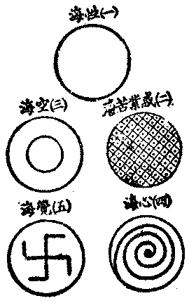
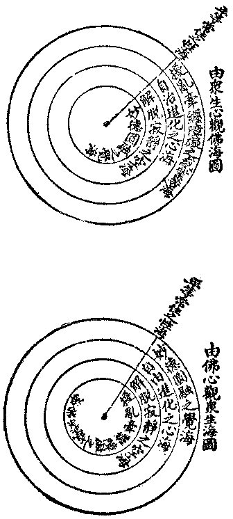

# 釋海潮音

海潮音第一年第一期出版，我便要作一篇釋海潮音，因沒有工夫，擱到今日，而第二年第一期又要催著付印矣。但依舊沒有工夫能詳詳細細解釋，故祗可籠統將大概意思略為表示，求閱者為我原諒。

一、釋海豁通無住之謂海，深廣無際之謂海，含容無量之謂海，出生無盡之謂海，圖示名相如下：

二、釋潮從緣起息之謂潮：因水、因地、因月、因風、因空等眾緣而興起而平息故。應時往還之謂潮：按年、按月、按次、按日、按時皆適應而流往而漩還故。有大勢力之謂潮：金石、土木、人獸、魚鳥等皆莫能抵逆、莫能禁禦、莫能停止故。能為變化之謂潮：桑田、沙渚、堤岸、洲島等每可被吞於東而吐之西，朝運南而夕移北故。

三、釋音聲能感心者之謂音：若各種人造之音樂，及天地時物外激內發，自然流露之種種音聲，能感通有血氣知覺之類，使之欣、使之哀、使之慕、使之憤、使之下涕、使之忘形者是也。聲能詮義者之謂音：若各種人類民族講話之語音，及一切依音義而形之名句文書詩歌等是也。聲能表情者之謂音：若人類或其餘有知覺之類之種種歎聲、種種呼聲是也。聲能顯性者之謂音；若臨濟之喝、雲門之咦、網明之彈指、雲巖之擊竹等是也。

四、釋海潮海有不潮者，如二乘之空海。潮有非海者，如三界之有漏。海無永斷潮者，潮無不通海者。是直接從海流出旋流歸海之潮，謂之海潮，依主釋也。是海中所有之潮，謂之海潮，有財釋也。有潮之海，然即是潮，謂之海潮，持業釋也。

五、釋潮音本無成見，從緣而發之音謂潮音，隨順當機，應時而施之音謂潮音，衝破現前環境，突開時下趨勢之言論謂潮音，獨造適宜環境，自成優先趨勢之言論謂潮音。是潮之音，或音之潮，皆依士釋。有此潮義之音，或有此音用之潮，皆有財釋。有潮之音故音即潮，有音之潮，故潮即音，皆持業釋。

六、釋海潮音

一、依主釋：甲、海之潮音：是從惑業苦海而轉向性海、空海、心海、覺海所發生之潮音。是從覺海、心海、空海、性海而攝化惑業苦海所發生之潮音。乙、海潮之音：是契實性、應時機、所宣流之有力用、能破立的言論，非玄遠迂闊篤時拘墟之說。

二、持業釋：甲、海即潮音：海是潮音之體，潮音是海之用，用依於體，體持於用，海不二故潮音亦不二，不二故謂之一音，海即潮音。乙、海潮即音：海潮是音之質，音是海潮之力，力依於質，質持於力，海潮周遍故音亦周遍，周遍故謂之圓音，海潮即音。

三、有財釋：甲、海所有之潮音：任何現勢實用理想言論，總是性海、業海、空海、心海、覺海之所有故。乙、海潮所有之音：是法界海會人生潮流中所有之覺生音，救世音。

四、相違釋：甲、海非潮，乙、海非音，丙、海非潮音，丁、潮非音，戊、潮非海，己、潮非音海，庚、音非海，辛、音非潮，壬、音非海潮。海唯是海，潮唯是潮，音唯是音故，字字不相到故，義義不相涉故，一一圓成實故，一一絕對待故，「是法住法位，世間相常住」。

（見海刊二卷一期）

